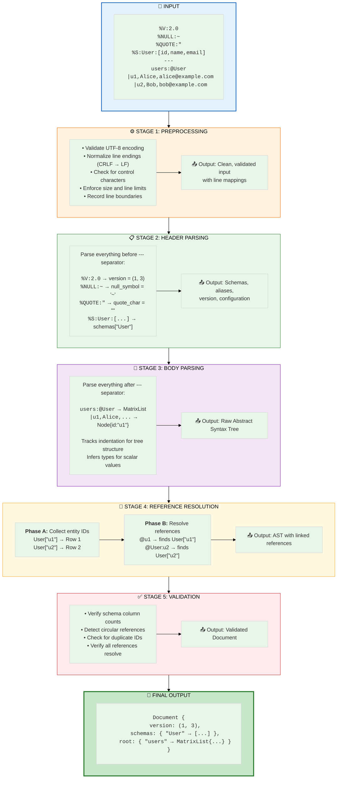
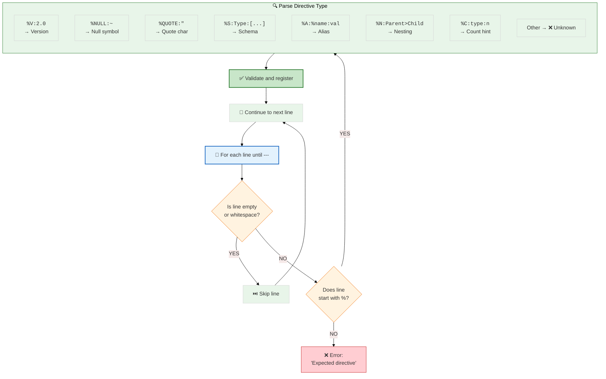
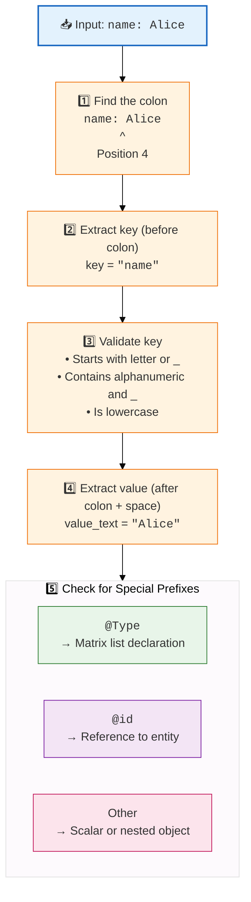
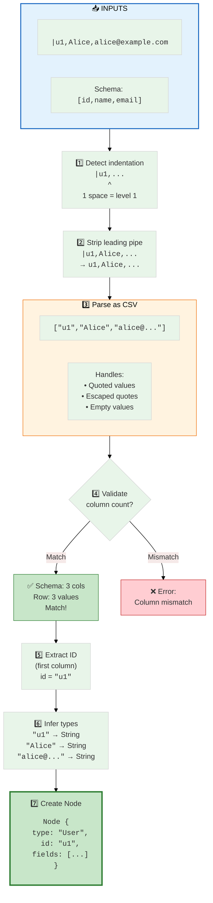

# HEDL Internals

You're about to see how a parser really works.

Not the simplified version from textbooks. Not a toy implementation that handles happy paths. The real thing: a production-grade parser that processes millions of documents, handles every edge case, and does it all faster than you'd think possible.

This document takes you inside `hedl-core`. You'll see how raw text becomes structured data. You'll understand why certain design decisions were made. You'll learn the algorithms that make HEDL fast.

By the end, you won't just use HEDL. You'll understand it.

---

## The Big Picture

When you call `hedl::parse()`, your text goes through five transformations:


```mermaid
%%{init: {'theme': 'base', 'themeVariables': { 'primaryColor': '#e8f5e9'}}}%%
flowchart TB
    subgraph input["📄 INPUT"]
        IN["<pre>%V:2.0
%NULL:~
%QUOTE:&quot;
%S:User:[id,name,email]
---
users:@User
 |u1,Alice,alice@example.com
 |u2,Bob,bob@example.com</pre>"]
    end

    subgraph stage1["⚙️ STAGE 1: PREPROCESSING"]
        S1_DESC["• Validate UTF-8 encoding<br/>• Normalize line endings (CRLF → LF)<br/>• Check for control characters<br/>• Enforce size and line limits<br/>• Record line boundaries"]
        S1_OUT["📤 Output: Clean, validated input<br/>with line mappings"]
        S1_DESC --> S1_OUT
    end

    subgraph stage2["📋 STAGE 2: HEADER PARSING"]
        S2_DESC["Parse everything before --- separator:<br/><br/><code>%V:2.0</code> → version = (1, 3)<br/><code>%NULL:~</code> → null_symbol = '~'<br/><code>%QUOTE:&quot;</code> → quote_char = '&quot;'<br/><code>%S:User:[...]</code> → schemas[&quot;User&quot;]"]
        S2_OUT["📤 Output: Schemas, aliases,<br/>version, configuration"]
        S2_DESC --> S2_OUT
    end

    subgraph stage3["🌲 STAGE 3: BODY PARSING"]
        S3_DESC["Parse everything after --- separator:<br/><br/><code>users:@User</code> → MatrixList<br/><code> |u1,Alice,...</code> → Node{id:&quot;u1&quot;}<br/><br/>Tracks indentation for tree structure<br/>Infers types for scalar values"]
        S3_OUT["📤 Output: Raw Abstract Syntax Tree"]
        S3_DESC --> S3_OUT
    end

    subgraph stage4["🔗 STAGE 4: REFERENCE RESOLUTION"]
        S4A["<b>Phase A:</b> Collect entity IDs<br/>User[&quot;u1&quot;] → Row 1<br/>User[&quot;u2&quot;] → Row 2"]
        S4B["<b>Phase B:</b> Resolve references<br/>@u1 → finds User[&quot;u1&quot;]<br/>@User:u2 → finds User[&quot;u2&quot;]"]
        S4_OUT["📤 Output: AST with linked references"]
        S4A --> S4B --> S4_OUT
    end

    subgraph stage5["✅ STAGE 5: VALIDATION"]
        S5_DESC["• Verify schema column counts<br/>• Detect circular references<br/>• Check for duplicate IDs<br/>• Verify all references resolve"]
        S5_OUT["📤 Output: Validated Document"]
        S5_DESC --> S5_OUT
    end

    subgraph output["🎯 FINAL OUTPUT"]
        OUT["<pre>Document {
    version: (1, 3),
    schemas: { &quot;User&quot; → [...] },
    root: { &quot;users&quot; → MatrixList{...} }
}</pre>"]
    end

    input --> stage1 --> stage2 --> stage3 --> stage4 --> stage5 --> output

    style input fill:#e3f2fd,stroke:#1565c0,stroke-width:2px
    style stage1 fill:#fff3e0,stroke:#ef6c00
    style stage2 fill:#e8f5e9,stroke:#2e7d32
    style stage3 fill:#f3e5f5,stroke:#7b1fa2
    style stage4 fill:#fff8e1,stroke:#f9a825
    style stage5 fill:#ffebee,stroke:#c62828
    style output fill:#c8e6c9,stroke:#2e7d32,stroke-width:3px
```

Each stage has a single responsibility. Each stage produces a well-defined output for the next. This separation makes the code easier to understand, test, and optimize.

Let's dive into each stage.

---

## Stage 1: Preprocessing

Before we can parse, we need to ensure the input is valid and normalized.

### What Preprocessing Does

```rust
use hedl_core::{preprocess, Limits};

// Preprocessing takes raw bytes and returns cleaned input
let preprocessed = preprocess(input.as_bytes(), &Limits::default())?;

// The result includes:
// - Validated UTF-8 text
// - Normalized line endings
// - Line offset mappings for error reporting
```

### The Preprocessing Steps

**Step 1: UTF-8 Validation**

HEDL documents must be valid UTF-8. The preprocessor validates this immediately, producing a clear error if the input contains invalid byte sequences.

```
Input:   [0x48, 0x45, 0x44, 0x4C, 0xFF, 0xFE]
         H     E     D     L     ???   ???

Error: Invalid UTF-8 sequence at byte offset 4
```

**Step 2: BOM Handling**

If the input starts with a UTF-8 BOM (Byte Order Mark), it's stripped:

```
Input:   [0xEF, 0xBB, 0xBF, 0x25, 0x56, ...]
         BOM            %     V     ...

Output:  "%V:2.0..."  (BOM removed)
```

**Step 3: Line Ending Normalization**

Different systems use different line endings. HEDL normalizes everything to Unix-style LF:

```
Windows: "line1\r\nline2\r\n"  →  "line1\nline2\n"
Mac:     "line1\rline2\r"      →  Error (bare CR not allowed)
Unix:    "line1\nline2\n"      →  "line1\nline2\n" (unchanged)
```

Bare carriage returns (CR without following LF) produce an error. This prevents ambiguity.

**Step 4: Control Character Validation**

ASCII control characters (except tab, newline, carriage return) are rejected:

```
Input:   "name: Alice\x00Bob"
                      ^ NUL character

Error: Invalid control character (NUL) at line 1, column 12
```

**Step 5: Limit Enforcement**

Security limits are checked early:

```rust
pub struct Limits {
    pub max_file_size: usize,      // Default: 1 GB
    pub max_line_length: usize,    // Default: 1 MB
    pub max_depth: usize,          // Default: 100 levels
    pub max_entities: usize,       // Default: 10 million
}
```

If the file exceeds any limit, preprocessing fails with a clear error before we spend time parsing.

**Step 6: Line Boundary Recording**

For accurate error reporting, we record where each line starts:

```
Input:   "%V:2.0\n%NULL:~\n---\nusers:@User\n"
Offsets: [0, 7, 15, 19, 31]
         ^  ^  ^   ^   ^
         |  |  |   |   |
         |  |  |   |   End of input
         |  |  |   Line 4 starts at offset 19
         |  |  Line 3 starts at offset 15
         |  Line 2 starts at offset 7
         Line 1 starts at offset 0
```

When an error occurs at byte offset 25, we can quickly determine it's on line 4, column 7.

---

## Stage 2: Header Parsing

The header contains directives that configure how the body is parsed. Headers must come before the body separator (`---`).

### Required Directives

Every HEDL document must begin with three required directives:

```hedl
%V:2.0
%NULL:~
%QUOTE:"
```

| Directive | Purpose | Example |
|-----------|---------|---------|
| `%V:` | Document version | `%V:2.0` |
| `%NULL:` | Symbol for null values | `%NULL:~` |
| `%QUOTE:` | Character for quoting strings | `%QUOTE:"` |

These are required because they affect how the parser interprets the body. The null symbol tells the parser what character sequence represents null. The quote character tells the parser how to recognize quoted strings.

### Schema Directives

Schemas define the structure of matrix lists:

```hedl
%S:User:[id,name,email,age]
%S:Product:[sku,name,price,quantity]
```

The parser stores these in a schema registry:

```rust
struct SchemaRegistry {
    schemas: HashMap<String, Schema>,
}

struct Schema {
    name: String,           // "User"
    columns: Vec<String>,   // ["id", "name", "email", "age"]
}
```

When the body parser encounters `users:@User`, it looks up "User" in the registry to know what columns to expect.

### Alias Directives

Aliases define constant values that can be substituted:

```hedl
%A:%pi:3.14159
%A:%company:"Acme Corp"
```

The parser stores these in an alias registry:

```rust
struct AliasRegistry {
    aliases: HashMap<String, String>,
}
```

When the body parser encounters `%pi` in a value position, it substitutes `3.14159`.

### Nesting Directives

Nesting directives define parent-child relationships between types:

```hedl
%N:User>Order
%N:Order>LineItem
```

This tells the parser that `Order` entities can appear as children of `User` entities, and `LineItem` entities can appear as children of `Order` entities.

### Header Parsing Algorithm


```mermaid
%%{init: {'theme': 'base', 'themeVariables': { 'primaryColor': '#e8f5e9'}}}%%
flowchart TD
    START["📄 For each line until ---"]

    CHECK_EMPTY{"Is line empty<br/>or whitespace?"}
    CHECK_PERCENT{"Does line<br/>start with %?"}

    SKIP["⏭️ Skip line"]
    ERROR_NOT_DIRECTIVE["❌ Error:<br/>'Expected directive'"]

    subgraph parse["🔍 Parse Directive Type"]
        direction TB
        V["<code>%V:2.0</code><br/>→ Version"]
        NULL["<code>%NULL:~</code><br/>→ Null symbol"]
        QUOTE["<code>%QUOTE:&quot;</code><br/>→ Quote char"]
        SCHEMA["<code>%S:Type:[...]</code><br/>→ Schema"]
        ALIAS["<code>%A:%name:val</code><br/>→ Alias"]
        NEST["<code>%N:Parent>Child</code><br/>→ Nesting"]
        COUNT["<code>%C:type:n</code><br/>→ Count hint"]
        OTHER["Other → ❌ Unknown"]
    end

    VALIDATE["✅ Validate and register"]
    LOOP["🔁 Continue to next line"]

    START --> CHECK_EMPTY
    CHECK_EMPTY -->|YES| SKIP
    CHECK_EMPTY -->|NO| CHECK_PERCENT
    SKIP --> LOOP
    CHECK_PERCENT -->|NO| ERROR_NOT_DIRECTIVE
    CHECK_PERCENT -->|YES| parse
    parse --> VALIDATE
    VALIDATE --> LOOP
    LOOP --> START

    style START fill:#e3f2fd,stroke:#1565c0,stroke-width:2px
    style CHECK_EMPTY fill:#fff3e0,stroke:#ef6c00
    style CHECK_PERCENT fill:#fff3e0,stroke:#ef6c00
    style parse fill:#e8f5e9,stroke:#2e7d32
    style VALIDATE fill:#c8e6c9,stroke:#2e7d32,stroke-width:2px
    style ERROR_NOT_DIRECTIVE fill:#ffcdd2,stroke:#c62828
```

### Validation During Header Parsing

The header parser validates as it goes:

- **Duplicate schemas**: Error if a type is defined twice
- **Invalid schema columns**: Error if columns aren't valid identifiers
- **Invalid aliases**: Error if alias names aren't valid
- **Circular nesting**: Error if nesting creates cycles
- **Missing required directives**: Error after header parsing completes

---

## Stage 3: Body Parsing

The body contains the actual data. Body parsing is where HEDL's indentation-based structure comes to life.

### The Body Structure

```hedl
---
users:@User
 |u1,Alice,alice@example.com
 |u2,Bob,bob@example.com
config:
 server: localhost
 port: 8080
```

The body has two kinds of content:

1. **Matrix lists**: Typed, tabular data with inline children (`|` rows)
2. **Objects**: Key-value pairs, possibly nested

### Indentation Rules

HEDL uses exactly one space per indentation level. This is strict and consistent.

```
Column:  0123456789...
         |
Level 0: key: value
Level 1:  |row,data
Level 2:   nested_key: nested_value
```

The parser tracks indentation to determine hierarchy:

```rust
fn calculate_indent(line: &str) -> IndentInfo {
    let spaces = line.chars().take_while(|c| *c == ' ').count();
    IndentInfo {
        level: spaces,  // Each space is one level
        spaces,
    }
}
```

### Parsing Key-Value Pairs

Key-value pairs follow the format `key: value` (note the space after the colon):


```mermaid
%%{init: {'theme': 'base', 'themeVariables': { 'primaryColor': '#e8f5e9'}}}%%
flowchart TB
    INPUT["📥 Input: <code>name: Alice</code>"]

    STEP1["1️⃣ Find the colon<br/><code>name: Alice</code><br/>     ^<br/>Position 4"]

    STEP2["2️⃣ Extract key (before colon)<br/>key = <code>&quot;name&quot;</code>"]

    STEP3["3️⃣ Validate key<br/>• Starts with letter or _<br/>• Contains alphanumeric and _<br/>• Is lowercase"]

    STEP4["4️⃣ Extract value (after colon + space)<br/>value_text = <code>&quot;Alice&quot;</code>"]

    subgraph check["5️⃣ Check for Special Prefixes"]
        MATRIX["<code>@Type</code><br/>→ Matrix list declaration"]
        REF["<code>@id</code><br/>→ Reference to entity"]
        SCALAR["Other<br/>→ Scalar or nested object"]
    end

    INPUT --> STEP1 --> STEP2 --> STEP3 --> STEP4 --> check

    style INPUT fill:#e3f2fd,stroke:#1565c0,stroke-width:2px
    style STEP1 fill:#fff3e0,stroke:#ef6c00
    style STEP2 fill:#fff3e0,stroke:#ef6c00
    style STEP3 fill:#fff3e0,stroke:#ef6c00
    style STEP4 fill:#fff3e0,stroke:#ef6c00
    style MATRIX fill:#e8f5e9,stroke:#2e7d32
    style REF fill:#f3e5f5,stroke:#7b1fa2
    style SCALAR fill:#fce4ec,stroke:#c2185b
```

### Parsing Matrix Lists

When the value starts with `@TypeName`, it's a matrix list declaration:

```hedl
users:@User
 |u1,Alice,alice@example.com
 |u2,Bob,bob@example.com
```

The parser:

1. Recognizes `@User` as a type reference
2. Looks up "User" in the schema registry
3. Parses subsequent `|` rows as typed rows

### Parsing Inline Children

Matrix rows start with `|` and contain comma-separated values:


```mermaid
%%{init: {'theme': 'base', 'themeVariables': { 'primaryColor': '#e8f5e9'}}}%%
flowchart TB
    subgraph inputs["📥 INPUTS"]
        INPUT["<code> |u1,Alice,alice@example.com</code>"]
        SCHEMA["Schema: <code>[id,name,email]</code>"]
    end

    STEP1["1️⃣ Detect indentation<br/><code> |u1,...</code><br/>^<br/>1 space = level 1"]

    STEP2["2️⃣ Strip leading pipe<br/><code>|u1,Alice,...</code><br/>→ <code>u1,Alice,...</code>"]

    subgraph csv["3️⃣ Parse as CSV"]
        RESULT["<code>[&quot;u1&quot;,&quot;Alice&quot;,&quot;alice@...&quot;]</code>"]
        HANDLES["Handles:<br/>• Quoted values<br/>• Escaped quotes<br/>• Empty values"]
    end

    STEP4{"4️⃣ Validate<br/>column count?"}
    MATCH["✅ Schema: 3 cols<br/>Row: 3 values<br/>Match!"]
    MISMATCH["❌ Error:<br/>Column mismatch"]

    STEP5["5️⃣ Extract ID<br/>(first column)<br/>id = <code>&quot;u1&quot;</code>"]

    STEP6["6️⃣ Infer types<br/><code>&quot;u1&quot;</code> → String<br/><code>&quot;Alice&quot;</code> → String<br/><code>&quot;alice@...&quot;</code> → String"]

    OUTPUT["7️⃣ Create Node<br/><pre>Node {
  type: &quot;User&quot;,
  id: &quot;u1&quot;,
  fields: [...]
}</pre>"]

    inputs --> STEP1 --> STEP2 --> csv --> STEP4
    STEP4 -->|Match| MATCH --> STEP5 --> STEP6 --> OUTPUT
    STEP4 -->|Mismatch| MISMATCH

    style inputs fill:#e3f2fd,stroke:#1565c0,stroke-width:2px
    style csv fill:#fff3e0,stroke:#ef6c00
    style MATCH fill:#c8e6c9,stroke:#2e7d32
    style MISMATCH fill:#ffcdd2,stroke:#c62828
    style OUTPUT fill:#c8e6c9,stroke:#2e7d32,stroke-width:3px
```

### Type Inference

When parsing scalar values, HEDL automatically infers types:

```rust
fn infer_value(text: &str) -> Value {
    let trimmed = text.trim();

    // 1. Check for null (using configured null symbol)
    if trimmed == "~" {
        return Value::Null;
    }

    // 2. Check for boolean
    match trimmed {
        "true" => return Value::Bool(true),
        "false" => return Value::Bool(false),
        _ => {}
    }

    // 3. Check for integer
    if let Ok(i) = trimmed.parse::<i64>() {
        return Value::Int(i);
    }

    // 4. Check for float
    if let Ok(f) = trimmed.parse::<f64>() {
        return Value::Float(f);
    }

    // 5. Check for reference
    if trimmed.starts_with('@') {
        if let Ok(r) = parse_reference(trimmed) {
            return Value::Reference(r);
        }
    }

    // 6. Check for tensor
    if trimmed.starts_with('[') && trimmed.ends_with(']') {
        if let Ok(t) = parse_tensor(trimmed) {
            return Value::Tensor(Box::new(t));
        }
    }

    // 7. Default: string
    Value::String(trimmed.into())
}
```

The inference order matters. We check more specific patterns first (null, boolean, integer) before falling back to string.

---

## Stage 4: Reference Resolution

References create connections between entities. The reference resolver turns `@id` strings into actual pointers.

### The Two-Phase Algorithm

Reference resolution happens in two phases:

**Phase 1: Collect IDs**

Walk the entire document, building a registry of all entity IDs:

```rust
struct TypeRegistry {
    // Type name → (ID → Node reference)
    types: HashMap<String, HashMap<String, NodeRef>>,
}

fn collect_ids(doc: &Document) -> TypeRegistry {
    let mut registry = TypeRegistry::new();

    for (key, item) in &doc.root {
        if let Item::List(matrix) = item {
            for node in &matrix.rows {
                registry.register(
                    &matrix.type_name,
                    &node.id,
                    node
                );
            }
        }
    }

    registry
}
```

After this phase, the registry knows about every entity and where to find it.

**Phase 2: Resolve References**

Walk the document again, resolving each reference:

```rust
fn resolve_references(
    doc: &Document,
    registry: &TypeRegistry,
    mode: ReferenceMode,
) -> Result<(), HedlError> {
    for item in doc.root.values() {
        resolve_in_item(item, registry, mode)?;
    }
    Ok(())
}

fn resolve_in_item(
    item: &Item,
    registry: &TypeRegistry,
    mode: ReferenceMode,
) -> Result<(), HedlError> {
    match item {
        Item::Scalar(Value::Reference(r)) => {
            resolve_reference(r, registry, mode)?;
        }
        Item::Object(obj) => {
            for value in obj.values() {
                resolve_in_item(value, registry, mode)?;
            }
        }
        Item::List(matrix) => {
            for node in &matrix.rows {
                for field in &node.fields {
                    if let Value::Reference(r) = field {
                        resolve_reference(r, registry, mode)?;
                    }
                }
            }
        }
        _ => {}
    }
    Ok(())
}
```

### Qualified vs Unqualified References

HEDL supports two reference formats:

**Qualified:** `@Type:id` specifies both type and ID

```
@User:alice    →  Look up "alice" in User type only
```

**Unqualified:** `@id` specifies only the ID

```
@alice         →  Search all types for "alice"
```

Unqualified references are convenient but can be ambiguous if the same ID exists in multiple types. When ambiguity occurs, the parser returns an error:

```
Error: Ambiguous reference '@alice'
  Found in: User, Customer
  Hint: Use qualified reference @User:alice or @Customer:alice
```

### Reference Modes

You can configure how unresolved references are handled:

```rust
pub enum ReferenceMode {
    Strict,   // Error on unresolved references
    Lenient,  // Convert unresolved references to null
}
```

Strict mode is the default. Lenient mode is useful when working with partial documents or when references might be resolved later.

### Circular Reference Detection

HEDL detects circular references during resolution:

```hedl
users:@User
 |u1,Alice,@u2
 |u2,Bob,@u1
```

This creates a cycle: u1 → u2 → u1. The resolver tracks the path during resolution and reports cycles:

```
Error: Circular reference detected
  Path: u1 → u2 → u1
  Hint: Break the cycle by removing one of the references
```

---

## Stage 5: Validation

After parsing and reference resolution, the validator ensures semantic correctness.

### What Validation Checks

**1. Schema Column Counts**

Each row must have exactly as many values as the schema defines:

```hedl
%S:User:[id,name,email]
---
users:@User
 |u1,Alice,alice@example.com     # OK: 3 columns, 3 values
 |u2,Bob                         # Error: 3 columns, 2 values
```

**2. Duplicate ID Detection**

Within a type, each ID must be unique:

```hedl
users:@User
 |u1,Alice,alice@example.com
 |u1,Bob,bob@example.com         # Error: duplicate ID 'u1'
```

**3. Orphan Row Detection**

Child rows must have a valid nesting rule:

```hedl
%S:User:[id,name]
%S:Order:[id,total]
# Note: No %N:User>Order directive
---
users:@User
 |u1,Alice
  |o1,99.99                      # Error: orphan row (no nesting rule)
```

**4. Reference Validity**

All references must point to existing entities (in strict mode):

```hedl
users:@User
 |u1,Alice,@u99                  # Error: reference @u99 not found
```

### The Validation Framework

HEDL has an extensible validation framework for custom rules:

```rust
pub trait Rule: Send + Sync {
    /// Unique identifier for this rule
    fn id(&self) -> &str;

    /// Category for filtering and grouping
    fn category(&self) -> Category;

    /// Default severity level
    fn default_severity(&self) -> Severity;

    /// Run validation and return diagnostics
    fn validate(
        &self,
        doc: &Document,
        ctx: &mut ValidationContext,
    ) -> Vec<Diagnostic>;
}
```

Built-in rules include:

| Rule | Category | Description |
|------|----------|-------------|
| `IdNamingRule` | Style | Validates ID naming conventions |
| `UnusedSchemaRule` | Semantic | Warns about defined but unused schemas |
| `EmptyListRule` | Style | Warns about empty matrix lists |
| `UnqualifiedKvReferenceRule` | Style | Suggests qualified references in key-value contexts |

---

## The Abstract Syntax Tree

The AST represents a parsed HEDL document in memory. Understanding the AST is key to understanding HEDL's internals.

### Core Data Structures

```rust
/// The top-level document
pub struct Document {
    pub version: (u32, u32),                      // Version tuple
    pub aliases: BTreeMap<String, String>,        // Alias definitions
    pub structs: BTreeMap<String, Vec<String>>,   // Schema definitions
    pub nests: BTreeMap<String, String>,          // Nesting rules
    pub root: BTreeMap<String, Item>,             // Body content
}
```

Why `BTreeMap` instead of `HashMap`? Deterministic iteration order. When we serialize a document back to HEDL (canonical form), the keys always appear in the same order. This makes output reproducible and diffable.

```rust
/// An item in the document body
pub enum Item {
    Scalar(Value),                    // A single value
    Object(BTreeMap<String, Item>),   // Nested key-value pairs
    List(MatrixList),                 // Typed matrix list
}
```

```rust
/// A typed matrix list
pub struct MatrixList {
    pub type_name: String,            // "User"
    pub schema: Vec<String>,          // ["id", "name", "email"]
    pub rows: Vec<Node>,              // The actual entities
    pub count_hint: Option<usize>,    // Optional pre-declared count
}
```

```rust
/// A single entity in a matrix list
pub struct Node {
    pub type_name: String,                                    // "User"
    pub id: String,                                           // "u1"
    pub fields: SmallVec<[Value; 4]>,                         // Field values
    pub children: Option<Box<BTreeMap<String, Vec<Node>>>>,   // Nested children
    pub child_count: u16,                                     // Count hint
}
```

Note the `SmallVec<[Value; 4]>`. This is an optimization. Most entities have 4 or fewer fields. By storing up to 4 values inline (on the stack), we avoid heap allocation for the common case. Only when there are more than 4 fields does SmallVec allocate on the heap.

### Value Types

```rust
pub enum Value {
    Null,                             // ~
    Bool(bool),                       // true, false
    Int(i64),                         // 42, -17
    Float(f64),                       // 3.14, 1e-10
    String(Box<str>),                 // "Alice", hello
    Tensor(Box<Tensor>),              // [1,2,3], [[1,2],[3,4]]
    Reference(Reference),             // @u1, @User:alice
    Expression(Box<Expression>),      // $(calc + 1)
}
```

Note the `Box<str>` for strings and boxed types for complex variants. This keeps the `Value` enum small (important because we have millions of them) while still supporting unbounded data.

### AST Invariants

After successful parsing, the AST guarantees:

1. **Unique IDs within type**: No two nodes of the same type have the same ID
2. **Valid references**: All references point to existing entities (in strict mode)
3. **Schema conformance**: All rows match their schema's column count
4. **Correct hierarchy**: Indentation correctly represents parent-child relationships
5. **No cycles**: No circular reference chains (configurable)

These invariants are enforced by the parser. Code that consumes a `Document` can rely on them.

---

## Lexical Analysis Details

The lexer validates text before the parser sees it. Understanding the lexer helps you understand what HEDL accepts.

### Token Validation

Rather than producing a stream of tokens, HEDL's lexer provides validation functions that are called during parsing:

```rust
use hedl_core::lex::{
    is_valid_key_token,
    is_valid_type_name,
    is_valid_id_token,
    parse_reference,
};
```

**Key Tokens** (field names):

```rust
fn is_valid_key_token(s: &str) -> bool {
    if s.is_empty() {
        return false;
    }

    let mut chars = s.chars();

    // First char: letter or underscore
    match chars.next() {
        Some(c) if c.is_ascii_lowercase() || c == '_' => {}
        _ => return false,
    }

    // Rest: alphanumeric or underscore
    chars.all(|c| c.is_ascii_alphanumeric() || c == '_')
}

// Valid: user_name, _internal, count2
// Invalid: UserName (uppercase), 2count (leading digit), user-name (hyphen)
```

**Type Names** (schema names):

```rust
fn is_valid_type_name(s: &str) -> bool {
    if s.is_empty() {
        return false;
    }

    let mut chars = s.chars();

    // First char: uppercase letter
    match chars.next() {
        Some(c) if c.is_ascii_uppercase() => {}
        _ => return false,
    }

    // Rest: alphanumeric
    chars.all(|c| c.is_ascii_alphanumeric())
}

// Valid: User, OrderLineItem, Product2
// Invalid: user (lowercase), _User (underscore), User_Name (underscore)
```

**ID Tokens** (entity identifiers):

```rust
fn is_valid_id_token(s: &str) -> bool {
    if s.is_empty() {
        return false;
    }

    let mut chars = s.chars();

    // First char: letter or underscore
    match chars.next() {
        Some(c) if c.is_ascii_alphabetic() || c == '_' => {}
        _ => return false,
    }

    // Rest: alphanumeric, underscore, or hyphen
    chars.all(|c| c.is_ascii_alphanumeric() || c == '_' || c == '-')
}

// Valid: user1, SKU-4020, _temp
// Invalid: 123 (leading digit), @ref (at sign)
```

### Reference Parsing

References have their own parsing logic:

```rust
fn parse_reference(s: &str) -> Result<Reference, LexError> {
    // Strip leading @
    let s = s.strip_prefix('@')
        .ok_or(LexError::MissingAtSign)?;

    // Check for qualified reference: @Type:id
    if let Some((type_part, id_part)) = s.split_once(':') {
        if !is_valid_type_name(type_part) {
            return Err(LexError::InvalidTypeName);
        }
        if !is_valid_id_token(id_part) {
            return Err(LexError::InvalidId);
        }

        return Ok(Reference {
            type_name: Some(type_part.to_string()),
            id: id_part.to_string(),
        });
    }

    // Unqualified reference: @id
    if !is_valid_id_token(s) {
        return Err(LexError::InvalidId);
    }

    Ok(Reference {
        type_name: None,
        id: s.to_string(),
    })
}
```

### CSV Row Parsing

Matrix list rows use a CSV-like syntax:

```rust
fn parse_csv_row(line: &str) -> Result<Vec<CsvField>, LexError> {
    let content = line.strip_prefix('|')
        .ok_or(LexError::MissingPipe)?;

    let mut fields = Vec::new();
    let mut current = String::new();
    let mut in_quotes = false;
    let mut chars = content.chars().peekable();

    while let Some(c) = chars.next() {
        match c {
            '"' if !in_quotes => {
                in_quotes = true;
            }
            '"' if in_quotes => {
                // Check for escaped quote
                if chars.peek() == Some(&'"') {
                    chars.next();
                    current.push('"');
                } else {
                    in_quotes = false;
                }
            }
            ',' if !in_quotes => {
                fields.push(CsvField {
                    value: current.trim().to_string(),
                    is_quoted: false,
                });
                current = String::new();
            }
            _ => {
                current.push(c);
            }
        }
    }

    // Don't forget the last field
    fields.push(CsvField {
        value: current.trim().to_string(),
        is_quoted: false,
    });

    Ok(fields)
}
```

This handles:
- Quoted values: `"Alice, CEO"` becomes `Alice, CEO`
- Escaped quotes: `"He said ""hi"""` becomes `He said "hi"`
- Empty values: `a,,c` becomes `["a", "", "c"]`

---

## The Visitor Pattern

The visitor pattern lets you traverse documents without writing recursive descent code.

### DocumentVisitor Trait

```rust
pub trait DocumentVisitor {
    type Error;

    fn begin_document(&mut self, doc: &Document, ctx: &VisitorContext) -> Result<(), Self::Error> {
        Ok(())
    }

    fn end_document(&mut self, doc: &Document, ctx: &VisitorContext) -> Result<(), Self::Error> {
        Ok(())
    }

    fn visit_scalar(&mut self, key: &str, value: &Value, ctx: &VisitorContext) -> Result<(), Self::Error>;

    fn begin_object(&mut self, key: &str, ctx: &VisitorContext) -> Result<(), Self::Error> {
        Ok(())
    }

    fn end_object(&mut self, key: &str, ctx: &VisitorContext) -> Result<(), Self::Error> {
        Ok(())
    }

    fn begin_list(&mut self, key: &str, list: &MatrixList, ctx: &VisitorContext) -> Result<(), Self::Error> {
        Ok(())
    }

    fn end_list(&mut self, key: &str, list: &MatrixList, ctx: &VisitorContext) -> Result<(), Self::Error> {
        Ok(())
    }

    fn visit_node(&mut self, node: &Node, schema: &[String], ctx: &VisitorContext) -> Result<(), Self::Error>;

    fn begin_node_children(&mut self, node: &Node, ctx: &VisitorContext) -> Result<(), Self::Error> {
        Ok(())
    }

    fn end_node_children(&mut self, node: &Node, ctx: &VisitorContext) -> Result<(), Self::Error> {
        Ok(())
    }
}
```

The required methods are `visit_scalar` and `visit_node`. Everything else has default no-op implementations.

### Using the Traverse Function

```rust
use hedl_core::traverse::{traverse, DocumentVisitor, VisitorContext};

let mut visitor = MyVisitor::new();
traverse(&doc, &mut visitor)?;
```

The `traverse` function handles the recursive walking. Your visitor just implements the callbacks.

### Visitor Context

The context tells you where you are in the document:

```rust
pub struct VisitorContext<'a> {
    pub depth: usize,                           // Nesting level (0 = root)
    pub path: Vec<&'a str>,                     // Path from root
    pub document: &'a Document,                 // The full document
    pub current_schema: Option<&'a [String]>,   // Schema if in a list
}
```

### Example: Collecting All References

```rust
struct ReferenceCollector {
    references: Vec<String>,
}

impl DocumentVisitor for ReferenceCollector {
    type Error = std::convert::Infallible;

    fn visit_scalar(
        &mut self,
        _key: &str,
        value: &Value,
        _ctx: &VisitorContext,
    ) -> Result<(), Self::Error> {
        if let Value::Reference(r) = value {
            self.references.push(format!("@{}", r.id));
        }
        Ok(())
    }

    fn visit_node(
        &mut self,
        node: &Node,
        _schema: &[String],
        _ctx: &VisitorContext,
    ) -> Result<(), Self::Error> {
        for value in &node.fields {
            if let Value::Reference(r) = value {
                self.references.push(format!("@{}", r.id));
            }
        }
        Ok(())
    }
}

// Usage
let mut collector = ReferenceCollector { references: Vec::new() };
traverse(&doc, &mut collector)?;
println!("Found {} references", collector.references.len());
```

---

## Memory Management

HEDL is designed for efficiency. Here's how we manage memory.

### String Handling

The AST uses owned strings (`String` and `Box<str>`) rather than borrowed references. This has tradeoffs:

**Advantages:**
- Simpler lifetime management
- Safe to pass documents between threads
- No need to keep source text alive

**Disadvantages:**
- More allocations than zero-copy parsing
- Slightly more memory usage

For most use cases, the simplicity wins. The alternative (lifetime-parameterized AST) would make the API much harder to use.

### SmallVec for Node Fields

Most entities have few fields. We use `SmallVec` to avoid heap allocation:

```rust
pub fields: SmallVec<[Value; 4]>
```

- 0-4 fields: stored inline, no heap allocation
- 5+ fields: spills to heap

This optimization helps because field access is a hot path.

### Boxed Variants

In the `Value` enum, complex variants are boxed:

```rust
pub enum Value {
    // Small variants (inline)
    Null,
    Bool(bool),
    Int(i64),
    Float(f64),

    // Large variants (boxed)
    String(Box<str>),
    Tensor(Box<Tensor>),
    Expression(Box<Expression>),

    // Medium variant (inline)
    Reference(Reference),
}
```

Why box some variants? To keep the enum size small. Without boxing, `Value` would be as large as its largest variant. By boxing large variants, we keep `Value` to a reasonable size (probably 24 or 32 bytes on 64-bit systems).

### Pre-allocation

When we know sizes in advance, we pre-allocate:

```rust
// Pre-allocate node fields with exact schema size
let mut fields = Vec::with_capacity(schema.len());

// Pre-allocate rows when count hint is present
let mut rows = if let Some(count) = count_hint {
    Vec::with_capacity(count)
} else {
    Vec::new()
};
```

### BTreeMap for Determinism

We use `BTreeMap` instead of `HashMap` throughout:

```rust
pub root: BTreeMap<String, Item>
pub aliases: BTreeMap<String, String>
```

`BTreeMap` iterates in sorted key order. This means:
- Canonical output is deterministic
- Documents serialize the same way every time
- Diffs are meaningful

The performance cost (O(log n) vs O(1) for lookups) is negligible for typical document sizes.

---

## Error Handling

Good error messages make debugging easier. HEDL puts significant effort into error quality.

### Error Structure

```rust
pub struct HedlError {
    pub kind: HedlErrorKind,           // What category of error
    pub message: String,               // Human-readable message
    pub line: usize,                   // Line number (1-indexed)
    pub column: Option<usize>,         // Column if available
    pub context: Option<String>,       // Additional context
}
```

### Error Categories

```rust
pub enum HedlErrorKind {
    Syntax,       // Lexical or structural violation
    Version,      // Unsupported document version
    Schema,       // Schema violation (wrong columns, etc.)
    Alias,        // Duplicate or invalid alias
    Shape,        // Wrong number of cells in row
    Semantic,     // Logical error
    OrphanRow,    // Child row without nesting rule
    Collision,    // Duplicate ID within type
    Reference,    // Unresolved reference
    Security,     // Resource limit exceeded
    Conversion,   // Format conversion error
    IO,           // File I/O error
}
```

### Example Error Messages

```
Error: Schema column mismatch
  File: data.hedl
  Line: 15

  Schema 'User' defines 3 columns: [id, name, email]
  Row has 2 values: [u1, Alice]

  Hint: Add the missing value or use ~ for null

---

Error: Unresolved reference
  File: data.hedl
  Line: 23

  Reference '@manager' not found in any type

  Available IDs:
    User: [alice, bob, charlie]
    Product: [prod1, prod2]

  Hint: Check spelling, or define the referenced entity first

---

Error: Circular reference detected
  File: data.hedl

  Reference chain: alice → bob → charlie → alice

  Hint: Break the cycle by removing or redirecting one reference
```

### Error Recovery

The parser uses strategic recovery points. When an error is detected:

1. Record the error with full context
2. Skip to the next safe point (usually next line at same indentation)
3. Continue parsing to find more errors
4. Report all errors at once

This "find all errors" approach is more helpful than failing on the first issue.

---

## Performance Optimizations

HEDL processes documents faster than most alternatives. Here's how.

### SIMD Acceleration

We use the `memchr` crate for SIMD-optimized byte searching:

```rust
use memchr::memchr;

// 4-20x faster than byte-by-byte scanning
fn find_newlines(data: &[u8]) -> Vec<usize> {
    memchr::memchr_iter(b'\n', data).collect()
}
```

This accelerates:
- Line boundary detection (preprocessing)
- Comment scanning
- Delimiter finding
- Reference prefix detection

### Arena Allocation

Expression parsing uses arena allocation for reduced overhead:

```rust
use bumpalo::Bump;

fn parse_expression<'a>(input: &str, arena: &'a Bump) -> &'a Expression<'a> {
    // All temporary allocations happen in the arena
    // Everything freed in bulk when arena drops
}
```

Benefits:
- 30-50% faster expression parsing
- Reduced memory fragmentation
- Better cache locality
- Bulk deallocation

### Parallel Processing

For batch operations, `rayon` enables parallel processing:

```rust
use rayon::prelude::*;

let documents: Vec<Document> = inputs
    .par_iter()
    .map(|input| parse(input))
    .collect::<Result<_, _>>()?;
```

On an 8-core machine, this provides 4-6x throughput improvement for batch parsing.

### Caching

Format converters use caching:

- **Schema inference caching** in `hedl-json`: Inferred schemas are cached and reused
- **XSD schema caching** in `hedl-xml`: Compiled schemas cached with LRU eviction
- **Reference registry**: Built once, queried many times

---

## Security and Resource Limits

HEDL is designed to handle untrusted input safely.

### Default Limits

```rust
pub struct Limits {
    pub max_file_size: usize,      // 1 GB
    pub max_line_length: usize,    // 1 MB
    pub max_depth: usize,          // 100 levels
    pub max_entities: usize,       // 10 million
}
```

These limits prevent:
- **Memory exhaustion**: Files can't allocate unbounded memory
- **Stack overflow**: Nesting can't exceed safe depth
- **Denial of service**: Pathological inputs are rejected early

### Why Limits Matter

Consider an attacker crafting input:

```
# A file that's 99% whitespace with deeply nested structures
# Could exhaust memory or stack without limits
```

With limits, the parser quickly rejects such input before doing real work.

### Customizing Limits

For trusted input, limits can be relaxed:

```rust
let limits = Limits {
    max_file_size: 10 * 1024 * 1024 * 1024,  // 10 GB
    max_depth: 200,
    ..Default::default()
};

let doc = parse_with_limits(input, &limits)?;
```

For untrusted input, keep defaults or make them stricter.

---

## What's Next

You've seen the internals. Now put that knowledge to work:

**Apply this knowledge:**
- [Testing](testing.md): Write tests that exercise the parser
- [Benchmarking](benchmarking.md): Measure and optimize performance
- [Adding Format Support](tutorials/03-adding-format-support.md): Build on the AST

**Dive deeper:**
- [AST Design](concepts/ast-design.md): More on the data structures
- [Parser Architecture](concepts/parser-architecture.md): Lexer and parser patterns
- [Zero-Copy Optimizations](concepts/zero-copy-optimizations.md): Advanced performance techniques

You now understand HEDL from the inside. Use that understanding to make it better.
