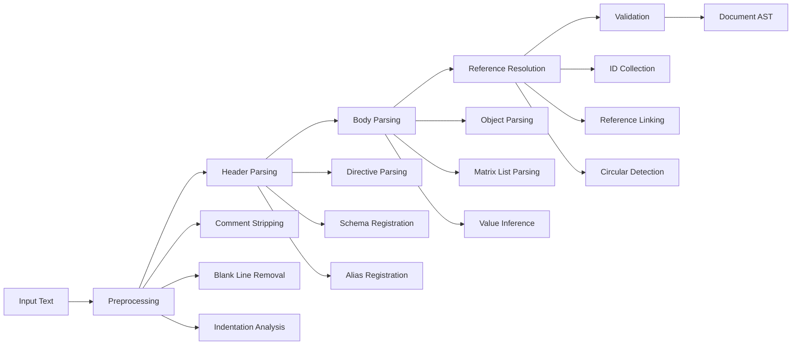
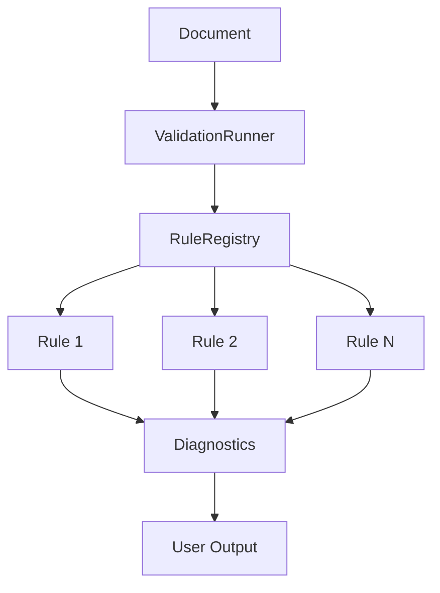

# HEDL Internals

Deep dive into the core concepts, algorithms, and implementation details of HEDL.

## Table of Contents

1. [Parsing Pipeline](#parsing-pipeline)
2. [Abstract Syntax Tree (AST)](#abstract-syntax-tree-ast)
3. [Lexical Analysis](#lexical-analysis)
4. [Type Inference](#type-inference)
5. [Reference Resolution](#reference-resolution)
6. [Schema System](#schema-system)
7. [Validation Framework](#validation-framework)
8. [Visitor Pattern](#visitor-pattern)
9. [Memory Management](#memory-management)
10. [Error Handling](#error-handling)
11. [Security & Resource Limits](#security--resource-limits)
12. [Performance Optimizations](#performance-optimizations)

---

## Parsing Pipeline

HEDL parsing follows a multi-stage pipeline:


```mermaid
graph LR
    A[Input Text] --> B[Preprocessing]
    B --> C[Header Parsing]
    C --> D[Body Parsing]
    D --> E[Reference Resolution]
    E --> F[Validation]
    F --> G[Document AST]

    B --> B1[Comment Stripping]
    B --> B2[Blank Line Removal]
    B --> B3[Indentation Analysis]

    C --> C1[Directive Parsing]
    C --> C2[Schema Registration]
    C --> C3[Alias Registration]

    D --> D1[Object Parsing]
    D --> D2[Matrix List Parsing]
    D --> D3[Value Inference]

    E --> E1[ID Collection]
    E --> E2[Reference Linking]
    E --> E3[Circular Detection]
```

### Stage 1: Preprocessing

**Purpose**: Normalize input and prepare for parsing

```rust
use hedl_core::{preprocess, Limits};

// Actual signature - takes bytes and limits, returns PreprocessedInput
let preprocessed = preprocess(input.as_bytes(), &Limits::default())?;

// PreprocessedInput contains processed text and line offset mappings
// for accurate error reporting with original line numbers
```

**Operations**:
1. UTF-8 validation and BOM removal
2. Line ending normalization (CRLF to LF, reject bare CR)
3. Control character validation
4. Line length and file size limit enforcement
5. Line boundary identification (used later for error reporting)

### Stage 2: Header Parsing

**Purpose**: Process directives and build registries

```rust
struct HeaderParser {
    schemas: HashMap<String, Schema>,      // Type definitions
    aliases: HashMap<String, String>,      // Constant substitutions
    version: Option<String>,               // Document version
    metadata: HashMap<String, String>,     // Custom metadata
}
```

**Directives**:
- `%VERSION: 1.0` - Document version
- `%STRUCT: Type: [col1, col2, ...]` - Schema definition
- `%ALIAS: %name: "value"` - Constant definition
- `%NEST: Parent > Child` - Hierarchy definition

### Stage 3: Body Parsing

**Purpose**: Parse hierarchical data structures

```rust
fn parse_body(
    lines: &[(usize, &str)],
    header: &Header,
    limits: &Limits,
) -> HedlResult<BTreeMap<String, Item>> {
    // Parse root items
    let mut root = BTreeMap::new();

    // Parse recursively based on indentation
    parse_items(&mut root, lines, 0, header, limits)?;

    Ok(root)
}
```

**Parsing Logic**:
1. Track current indentation level
2. Detect object vs. matrix list entries
3. Parse key-value pairs
4. Recursively parse children at deeper indentation
5. Build AST nodes

### Stage 4: Reference Resolution

**Purpose**: Link references to their target nodes

```rust
fn resolve_references(doc: &Document, mode: ReferenceMode) -> HedlResult<()> {
    // Phase 1: Collect all IDs from matrix lists
    let registry = collect_ids(&doc)?;

    // Phase 2: Validate references based on mode
    for item in doc.root.values() {
        validate_references_in_item(item, &registry, mode)?;
    }

    Ok(())
}

pub enum ReferenceMode {
    Strict,   // Error on unresolved references
    Lenient,  // Convert unresolved references to null
}
```

**Algorithm**:
1. **ID Collection**: Walk AST, collect all IDs with their type names
2. **Reference Parsing**: Parse `@id` or `@Type:id` references
3. **Lookup**: Find target node in registry
4. **Linking**: Store reference to target node
5. **Validation**: Detect circular references, dangling references

### Stage 5: Validation

**Purpose**: Enforce schema and semantic rules

```rust
fn validate(doc: &Document, options: &ParseOptions) -> HedlResult<()> {
    // Reference validation
    resolve_references(doc, options.reference_mode)?;

    // Limit validation happens during parsing
    // Additional semantic validation via ValidationRunner

    Ok(())
}
```

---

## Abstract Syntax Tree (AST)

The AST represents a parsed HEDL document in memory.

### Core Data Structures

```rust
/// Top-level document
pub struct Document {
    pub version: (u32, u32),
    pub aliases: BTreeMap<String, String>,
    pub structs: BTreeMap<String, Vec<String>>,
    pub nests: BTreeMap<String, String>,
    pub root: BTreeMap<String, Item>,
}

/// An item in the document body
pub enum Item {
    Scalar(Value),
    Object(BTreeMap<String, Item>),
    List(MatrixList),
}

/// Typed matrix list
pub struct MatrixList {
    pub type_name: String,
    pub schema: Vec<String>,
    pub rows: Vec<Node>,
    pub count_hint: Option<usize>,
}

/// A row/entity in a matrix list
pub struct Node {
    pub type_name: String,
    pub id: String,
    pub fields: SmallVec<[Value; 4]>,  // Stack-allocated for ≤4 fields
    pub children: Option<Box<BTreeMap<String, Vec<Node>>>>,  // Lazy allocation
    pub child_count: u16,  // Compact hint
}
```

### Value Types

```rust
pub enum Value {
    Null,
    Bool(bool),
    Int(i64),
    Float(f64),
    String(Box<str>),           // Box<str> reduces enum size
    Tensor(Box<Tensor>),        // Boxed to reduce enum size
    Reference(Reference),
    Expression(Box<Expression>), // Boxed to reduce enum size
}
```

### AST Invariants

**Guaranteed Properties**:
1. All IDs are unique within their type namespace
2. All references point to existing nodes
3. Matrix lists conform to their schema
4. Indentation correctly represents hierarchy
5. No circular references (configurable)

---

## Lexical Analysis

Lexical analysis converts text into tokens and validates syntax.

### Token Validation Functions

HEDL uses validation functions rather than a Token enum. Tokens are validated during parsing:

```rust
use hedl_core::lex::{
    is_valid_key_token,
    is_valid_type_name,
    is_valid_id_token,
    parse_reference,
};

// Key tokens: lowercase snake_case identifiers
assert!(is_valid_key_token("user_name"));
assert!(!is_valid_key_token("UserName")); // no uppercase

// Type names: PascalCase identifiers
assert!(is_valid_type_name("User"));
assert!(!is_valid_type_name("user")); // must start uppercase

// ID tokens: alphanumeric with hyphens/underscores
assert!(is_valid_id_token("SKU-4020"));
assert!(!is_valid_id_token("123item")); // no leading digit

// Reference parsing
let r = parse_reference("@User:alice")?;
assert_eq!(r.type_name.as_deref(), Some("User"));  // type_name is Option<String>
assert_eq!(&r.id, "alice");  // id is String
```

### Validation Rules

**Key Tokens**:
```rust
fn is_valid_key_token(s: &str) -> bool {
    if s.is_empty() {
        return false;
    }

    // First char: letter or underscore
    let first = s.chars().next().unwrap();
    if !first.is_alphabetic() && first != '_' {
        return false;
    }

    // Remaining: alphanumeric or underscore
    s.chars().skip(1).all(|c| c.is_alphanumeric() || c == '_')
}
```

**Type Names**:
```rust
fn is_valid_type_name(s: &str) -> bool {
    if s.is_empty() {
        return false;
    }

    // Must start with uppercase letter
    let first = s.chars().next().unwrap();
    if !first.is_uppercase() {
        return false;
    }

    // PascalCase: alphanumeric only
    s.chars().all(|c| c.is_alphanumeric())
}
```

**References**:
```rust
// parse_reference returns a lexer Reference (with String fields)
// During AST construction, this is converted to a value::Reference (with Box<str> fields)
fn parse_reference(s: &str) -> Result<Reference, LexError> {
    let s = s.strip_prefix('@').unwrap_or(s);

    // Check for @Type:id format
    if let Some((type_part, id_part)) = s.split_once(':') {
        if !is_valid_type_name(type_part) {
            return Err(LexError::InvalidTypeName);
        }
        if !is_valid_id_token(id_part) {
            return Err(LexError::InvalidId);
        }

        Ok(Reference {
            type_name: Some(type_part.to_string()),
            id: id_part.to_string(),
        })
    } else {
        // Unqualified reference @id
        if !is_valid_id_token(s) {
            return Err(LexError::InvalidId);
        }
        Ok(Reference {
            type_name: None,
            id: s.to_string(),
        })
    }
}
```

### Indentation Handling

HEDL uses strict 2-space indentation:

```rust
use hedl_core::lex::{calculate_indent, validate_indent, IndentInfo};

// calculate_indent returns Option<IndentInfo> for non-empty lines
let info = calculate_indent("  key: value", 1)?.unwrap();
assert_eq!(info.level, 1);  // indentation level
assert_eq!(info.spaces, 2); // actual space count

// validate_indent checks against max depth
validate_indent(info, max_depth, line_num)?;

// IndentInfo struct
pub struct IndentInfo {
    pub level: usize,   // Indentation level (spaces / 2)
    pub spaces: usize,  // Raw space count
}
```

### CSV Row Parsing

Matrix list rows use CSV-like syntax:

```rust
use hedl_core::lex::{parse_csv_row, CsvField};

// CsvField uses owned strings (no lifetime)
pub struct CsvField {
    pub value: String,    // Unquoted field content
    pub is_quoted: bool,  // Whether field was quoted
}

// Parse a matrix row
let fields = parse_csv_row("| alice, \"Alice Smith\", 30")?;
assert_eq!(fields.len(), 3);
assert_eq!(fields[0].value, "alice");
assert!(!fields[0].is_quoted);
assert_eq!(fields[1].value, "Alice Smith");
assert!(fields[1].is_quoted);
```

---

## Type Inference

HEDL automatically infers types for scalar values.

### Inference Ladder

Values are inferred in this order:

```rust
fn infer_value(s: &str) -> Value {
    let trimmed = s.trim();

    // 1. Null
    if trimmed == "null" || trimmed.is_empty() {
        return Value::Null;
    }

    // 2. Boolean
    if trimmed == "true" {
        return Value::Bool(true);
    }
    if trimmed == "false" {
        return Value::Bool(false);
    }

    // 3. Integer
    if let Ok(i) = trimmed.parse::<i64>() {
        return Value::Int(i);
    }

    // 4. Float
    if let Ok(f) = trimmed.parse::<f64>() {
        return Value::Float(f);
    }

    // 5. Reference
    if trimmed.starts_with('@') {
        if let Ok(r) = parse_reference(trimmed) {
            return Value::Reference(r);
        }
    }

    // 6. Tensor
    if trimmed.starts_with('[') && trimmed.ends_with(']') {
        if let Ok(t) = parse_tensor(trimmed) {
            return Value::Tensor(Box::new(t));
        }
    }

    // 7. Expression
    if trimmed.starts_with("$(") && trimmed.ends_with(')') {
        if let Ok(expr) = parse_expression_token(trimmed) {
            return Value::Expression(Box::new(expr));
        }
    }

    // 8. String (fallback)
    Value::String(trimmed.into())
}
```

### Quoted Values

Quoted values are always strings:

```rust
fn infer_quoted_value(s: &str) -> Value {
    // Strip quotes
    if s.starts_with('"') && s.ends_with('"') {
        let content = &s[1..s.len() - 1];
        return Value::String(unescape(content).into());
    }

    // Not quoted, use normal inference
    infer_value(s)
}

fn unescape(s: &str) -> String {
    s.replace("\\\"", "\"")
     .replace("\\n", "\n")
     .replace("\\t", "\t")
     .replace("\\\\", "\\")
}
```

---

## Reference Resolution

References create a graph structure.

### Two-Phase Algorithm

**Phase 1: Collect IDs**

```rust
struct TypeRegistry {
    // Type name -> (ID -> Node)
    types: HashMap<String, HashMap<String, NodeRef>>,
}

fn collect_ids(node: &Node, registry: &mut TypeRegistry) {
    registry.register(node.type_name.clone(), node.id.clone(), node);

    if let Some(children_map) = node.children() {
        for children in children_map.values() {
            for child in children {
                collect_ids(child, registry);
            }
        }
    }
}
```

**Phase 2: Resolve References**

```rust
fn resolve_references(
    node: &mut Node,
    registry: &TypeRegistry
) -> Result<()> {
    for value in &mut node.fields {
        if let Value::Reference(ref mut r) = value {
            // Resolve reference using registry
            if let Some(target) = registry.lookup(&r.id) {
                // Reference is valid
            }
        }
    }

    if let Some(children_map) = node.children_mut() {
        for children in children_map.values_mut() {
            for child in children {
                resolve_references(child, registry)?;
            }
        }
    }

    Ok(())
}
```

### Reference Lookup

```rust
impl TypeRegistry {
    fn lookup(&self, reference: &Reference) -> Result<&Node> {
        match &reference.type_name {
            // Qualified: @Type:id
            Some(type_name) => {
                let type_map = self.types.get(type_name)
                    .ok_or(ReferenceError::UnknownType)?;

                type_map.get(&reference.id)
                    .ok_or(ReferenceError::UnknownId)
            }

            // Unqualified: @id
            None => {
                // Search all types for matching ID
                let mut matches = Vec::new();

                for type_map in self.types.values() {
                    if let Some(node) = type_map.get(&reference.id) {
                        matches.push(node);
                    }
                }

                match matches.len() {
                    0 => Err(ReferenceError::UnknownId),
                    1 => Ok(matches[0]),
                    _ => Err(ReferenceError::AmbiguousReference),
                }
            }
        }
    }
}
```

### Circular Reference Detection

```rust
fn detect_cycles(
    doc: &Document,
    visited: &mut HashSet<String>,
) -> HedlResult<()> {
    // Walk all matrix lists
    for item in doc.root.values() {
        if let Item::List(list) = item {
            for node in &list.rows {
                check_reference_cycle(node, &node.id, visited)?;
            }
        }
    }
    Ok(())
}
```

---

## Schema System

Schemas define structure for matrix lists.

### Schema Definition

```rust
pub struct Schema {
    /// Type name
    pub name: String,

    /// Ordered column names
    pub columns: Vec<String>,

    /// Optional column types (for validation)
    pub column_types: Option<Vec<Type>>,
}
```

### Schema Registration

```hedl
%VERSION: 1.0
%STRUCT: User: [id, name, email, age]
---
```

Parsed as:
```rust
Schema {
    name: "User".to_string(),
    columns: vec![
        "id".to_string(),
        "name".to_string(),
        "email".to_string(),
        "age".to_string(),
    ],
    column_types: None,
}
```

### Schema Validation

```rust
fn validate_matrix_row(
    row: &[Value],
    schema: &Schema
) -> Result<()> {
    // Check column count
    if row.len() != schema.columns.len() {
        return Err(SchemaError::ColumnMismatch {
            expected: schema.columns.len(),
            found: row.len(),
        });
    }

    // Check column types (if specified)
    if let Some(types) = &schema.column_types {
        for (i, (value, expected_type)) in row.iter().zip(types).enumerate() {
            let actual_type = value.type_of();
            if actual_type != *expected_type {
                return Err(SchemaError::TypeMismatch {
                    column: schema.columns[i].clone(),
                    expected: expected_type.clone(),
                    actual: actual_type,
                });
            }
        }
    }

    Ok(())
}
```

---

## Validation Framework

The validation framework provides extensible semantic validation for HEDL documents.

### Architecture Overview


```mermaid
graph TB
    A[Document] --> B[ValidationRunner]
    B --> C[RuleRegistry]
    C --> D[Rule 1]
    C --> E[Rule 2]
    C --> F[Rule N]
    D --> G[Diagnostics]
    E --> G
    F --> G
    G --> H[User Output]
```

### Core Components

```rust
/// Trait for implementing validation rules
pub trait Rule: Send + Sync {
    /// Unique identifier for this rule (e.g., "duplicate-key")
    fn id(&self) -> &str;

    /// Rule category for filtering/grouping
    fn category(&self) -> Category;

    /// Default severity level
    fn default_severity(&self) -> Severity;

    /// Run validation and return diagnostics
    fn validate(&self, doc: &Document, ctx: &mut ValidationContext) -> Vec<Diagnostic>;
}

/// Categories for organizing rules
pub enum Category {
    Syntax,        // Lexical/structural issues
    Semantic,      // Logic/meaning issues
    Style,         // Code style issues
    Performance,   // Performance-related issues
    Security,      // Security vulnerabilities
    BusinessLogic, // Domain-specific rules
}

/// Severity levels for diagnostics
pub enum Severity {
    Error,    // Must be fixed
    Warning,  // Should be fixed
    Info,     // Informational
    Hint,     // Suggestion
}
```

### Diagnostic Structure

```rust
/// Rich error/warning with source location and fix suggestions
pub struct Diagnostic {
    rule_id: String,
    severity: Severity,
    message: String,
    span: Span,           // Source location
    fix: Option<Fix>,     // Auto-fix suggestion
    related: Vec<Span>,   // Related locations
}

/// Source location
pub struct Span {
    pub start: Position,
    pub end: Position,
}

/// Auto-fix suggestion
pub struct Fix {
    description: String,
    edits: Vec<TextEdit>,
}
```

### Built-in Rules

| Rule | Category | Description |
|------|----------|-------------|
| `IdNamingRule` | Style | Validates ID naming conventions (snake_case, kebab-case) |
| `UnusedSchemaRule` | Semantic | Warns about unused struct definitions |
| `EmptyListRule` | Style | Warns about empty matrix lists |
| `UnqualifiedKvReferenceRule` | Style | Suggests qualified references in key-value contexts |

### Validation Context

```rust
/// Shared state during validation
pub struct ValidationContext {
    /// All IDs seen in document (for duplicate detection)
    seen_ids: HashSet<String>,

    /// All references in document
    references: Vec<Reference>,

    /// Current path in document (for error messages)
    path: Vec<String>,

    /// Accumulated statistics
    stats: ValidationStats,
}
```

### Usage Pattern

```rust
use hedl_lint::{lint, lint_with_config, LintConfig};

// Simple linting with default rules
let diagnostics = lint(&doc);

// Or with custom configuration
let config = LintConfig {
    enabled_rules: vec![
        "id-naming".to_string(),
        "unused-schema".to_string(),
        "empty-list".to_string(),
    ],
    ..Default::default()
};
let diagnostics = lint_with_config(&doc, config);
```

---

## Visitor Pattern

The visitor pattern provides flexible traversal of HEDL documents for format conversion and analysis.

### DocumentVisitor Trait

```rust
use hedl_core::traverse::{DocumentVisitor, VisitorContext, traverse};

/// Trait for visiting elements of a HEDL document.
/// All methods except visit_scalar and visit_node have default no-op implementations.
pub trait DocumentVisitor {
    /// Error type returned by visitor methods.
    type Error;

    /// Called at the start of document traversal.
    fn begin_document(&mut self, doc: &Document, ctx: &VisitorContext) -> Result<(), Self::Error> {
        Ok(())
    }

    /// Called at the end of document traversal.
    fn end_document(&mut self, doc: &Document, ctx: &VisitorContext) -> Result<(), Self::Error> {
        Ok(())
    }

    /// Called when visiting a scalar value (required).
    fn visit_scalar(&mut self, key: &str, value: &Value, ctx: &VisitorContext) -> Result<(), Self::Error>;

    /// Called at the start of an object.
    fn begin_object(&mut self, key: &str, ctx: &VisitorContext) -> Result<(), Self::Error> {
        Ok(())
    }

    /// Called at the end of an object.
    fn end_object(&mut self, key: &str, ctx: &VisitorContext) -> Result<(), Self::Error> {
        Ok(())
    }

    /// Called at the start of a matrix list.
    fn begin_list(&mut self, key: &str, list: &MatrixList, ctx: &VisitorContext) -> Result<(), Self::Error> {
        Ok(())
    }

    /// Called at the end of a matrix list.
    fn end_list(&mut self, key: &str, list: &MatrixList, ctx: &VisitorContext) -> Result<(), Self::Error> {
        Ok(())
    }

    /// Called when visiting a node in a matrix list (required).
    fn visit_node(&mut self, node: &Node, schema: &[String], ctx: &VisitorContext) -> Result<(), Self::Error>;

    /// Called at the start of a node's children.
    fn begin_node_children(&mut self, node: &Node, ctx: &VisitorContext) -> Result<(), Self::Error> {
        Ok(())
    }

    /// Called at the end of a node's children.
    fn end_node_children(&mut self, node: &Node, ctx: &VisitorContext) -> Result<(), Self::Error> {
        Ok(())
    }
}
```

### Traversal Function

The `traverse` function handles recursive document traversal:

```rust
use hedl_core::traverse::{traverse, DocumentVisitor, VisitorContext};

/// Traverse a HEDL document, calling visitor methods for each element.
pub fn traverse<V: DocumentVisitor>(doc: &Document, visitor: &mut V) -> Result<(), V::Error>;

// Usage
let mut my_visitor = MyVisitor::new();
traverse(&doc, &mut my_visitor)?;
```

Traversal is pre-order depth-first: parents are visited before their children.

### Visitor Context

```rust
/// Context provided to visitors during traversal.
pub struct VisitorContext<'a> {
    /// Current nesting depth (0 = root level).
    pub depth: usize,

    /// Path from root to current element (key names).
    pub path: Vec<&'a str>,

    /// Reference to the document being traversed.
    pub document: &'a Document,

    /// Schema for the current list (if within a list context).
    pub current_schema: Option<&'a [String]>,
}

impl<'a> VisitorContext<'a> {
    /// Create a new context for the root level.
    pub fn new(document: &'a Document) -> Self;

    /// Create a child context with incremented depth.
    pub fn child(&self, key: &'a str) -> Self;

    /// Create a child context with a list schema.
    pub fn with_schema(&self, schema: &'a [String]) -> Self;

    /// Get the current path as a string (for error messages).
    pub fn path_string(&self) -> String;
}
```

### Built-in StatsCollector

The only built-in visitor is `StatsCollector` for testing and analysis:

```rust
use hedl_core::traverse::{StatsCollector, traverse};

/// Statistics collector visitor.
#[derive(Debug, Default)]
pub struct StatsCollector {
    pub scalar_count: usize,   // Number of scalars visited
    pub object_count: usize,   // Number of objects visited
    pub list_count: usize,     // Number of lists visited
    pub node_count: usize,     // Number of matrix list nodes visited
    pub max_depth: usize,      // Maximum depth reached
}

// Usage
let mut stats = StatsCollector::default();
traverse(&doc, &mut stats).unwrap();
println!("Total nodes: {}", stats.node_count);
println!("Max depth: {}", stats.max_depth);
```

### Usage Examples

**Custom Reference Collector**:
```rust
use hedl_core::traverse::{DocumentVisitor, VisitorContext, traverse};
use hedl_core::{Document, Node, Value, MatrixList};

struct ReferenceCollector {
    references: Vec<String>,
}

impl DocumentVisitor for ReferenceCollector {
    type Error = std::convert::Infallible;

    fn visit_scalar(&mut self, _key: &str, value: &Value, _ctx: &VisitorContext) -> Result<(), Self::Error> {
        if let Value::Reference(r) = value {
            self.references.push(r.to_string());
        }
        Ok(())
    }

    fn visit_node(&mut self, node: &Node, _schema: &[String], _ctx: &VisitorContext) -> Result<(), Self::Error> {
        // Check node fields for references
        for value in &node.fields {
            if let Value::Reference(r) = value {
                self.references.push(r.to_string());
            }
        }
        Ok(())
    }
}

let mut collector = ReferenceCollector { references: Vec::new() };
traverse(&doc, &mut collector).unwrap();
println!("Found {} references", collector.references.len());
```

**Custom Path Collector**:
```rust
struct PathCollector {
    paths: Vec<String>,
}

impl DocumentVisitor for PathCollector {
    type Error = std::convert::Infallible;

    fn visit_scalar(&mut self, _key: &str, _value: &Value, ctx: &VisitorContext) -> Result<(), Self::Error> {
        self.paths.push(ctx.path_string());
        Ok(())
    }

    fn visit_node(&mut self, _node: &Node, _schema: &[String], ctx: &VisitorContext) -> Result<(), Self::Error> {
        self.paths.push(ctx.path_string());
        Ok(())
    }
}

let mut collector = PathCollector { paths: Vec::new() };
traverse(&doc, &mut collector).unwrap();
```

---

## Memory Management

HEDL uses various strategies to minimize memory usage and optimize allocation patterns.

### Efficient String Handling

The AST currently uses owned `String` types for simplicity and safety across thread boundaries and format conversions. 

### Pre-allocation

HEDL optimizes collection growth by pre-allocating capacity where possible:

```rust
// Pre-allocate fields vector with exact schema size
let mut fields = Vec::with_capacity(schema.len());
```

### Efficient Data Structures

- `BTreeMap` for sorted keys (ensures deterministic output for canonicalization)
- `Vec` for children and rows (contiguous memory for efficient iteration)

---

## Error Handling

Comprehensive error types with source locations.

### Error Types

```rust
/// Main error type for all HEDL operations.
pub struct HedlError {
    pub kind: HedlErrorKind,
    pub message: String,
    pub line: usize,
    pub column: Option<usize>,
    pub context: Option<String>,
}

/// Error category enumeration.
pub enum HedlErrorKind {
    Syntax,       // Lexical or structural violation
    Version,      // Unsupported version
    Schema,       // Schema violation or mismatch
    Alias,        // Duplicate or invalid alias
    Shape,        // Wrong number of cells in row
    Semantic,     // Logical error
    OrphanRow,    // Child row without NEST rule
    Collision,    // Duplicate ID within type
    Reference,    // Unresolved reference
    Security,     // Security limit exceeded
    Conversion,   // Format conversion error
    IO,           // I/O error
}
```

---

## Performance Optimizations

### Arena Allocation

Expression parsing uses arena allocation via `bumpalo` for reduced allocation overhead:

```rust
use bumpalo::Bump;

fn parse_expression_arena<'a>(input: &str, arena: &'a Bump) -> &'a Expression<'a> {
    // All allocations happen in the arena
    // Freed in bulk when arena is dropped
}
```

**Benefits**:
- 30-50% faster expression parsing
- Reduced fragmentation
- Better cache locality
- Bulk deallocation

### SIMD Acceleration

HEDL utilizes the `memchr` crate for SIMD-optimized byte searching:

```rust
use memchr::memchr;

// 4-20x faster than byte-by-byte scanning
fn find_newlines(data: &[u8]) -> Vec<usize> {
    memchr::memchr_iter(b'\n', data).collect()
}
```

**Optimized Operations**:
- Newline scanning (4-20x faster preprocessing)
- Comment detection
- Delimiter finding
- Reference prefix matching (`@`)

### Parallel Parsing

Opt-in parallel parsing via `rayon` for multi-core throughput:

```rust
use rayon::prelude::*;

// Process multiple documents in parallel
let docs: Vec<Document> = inputs
    .par_iter()
    .map(|input| parse(input))
    .collect::<Result<_, _>>()?;
```

**Performance**:
- 2-4x throughput on multi-core systems
- Automatic work-stealing
- Configurable thread pool

### Caching

Format converters use caching strategies:
- Schema inference caching in `hedl-json`
- XSD schema caching in `hedl-xml` (LRU cache)
- Reference registry caching during parsing

---

**Next**: Apply this knowledge in [Testing](testing.md) and [Benchmarking](benchmarking.md)
