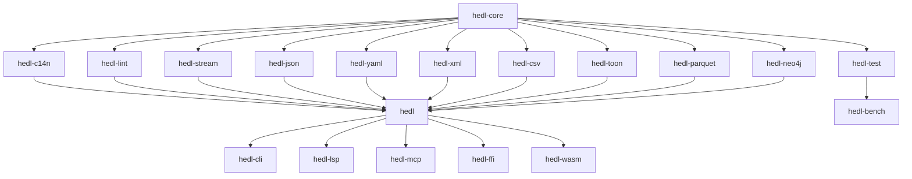

# HEDL Module Guide

Comprehensive guide to all 19 crates in the HEDL workspace. Each crate has a focused, single responsibility.

## Table of Contents

1. [Core Crates](#core-crates)
   - [hedl](#hedl) - Unified API
   - [hedl-core](#hedl-core) - Parser & AST
2. [Processing Crates](#processing-crates)
   - [hedl-c14n](#hedl-c14n) - Canonicalization
   - [hedl-lint](#hedl-lint) - Validation
   - [hedl-stream](#hedl-stream) - Streaming Parser
3. [Format Conversion Crates](#format-conversion-crates)
   - [hedl-json](#hedl-json) - JSON
   - [hedl-yaml](#hedl-yaml) - YAML
   - [hedl-xml](#hedl-xml) - XML
   - [hedl-csv](#hedl-csv) - CSV
   - [hedl-toon](#hedl-toon) - TOON
   - [hedl-parquet](#hedl-parquet) - Parquet
   - [hedl-neo4j](#hedl-neo4j) - Neo4j Cypher
4. [User Interface Crates](#user-interface-crates)
   - [hedl-cli](#hedl-cli) - CLI Tool
   - [hedl-lsp](#hedl-lsp) - Language Server
   - [hedl-mcp](#hedl-mcp) - Model Context Protocol
5. [Binding Crates](#binding-crates)
   - [hedl-ffi](#hedl-ffi) - C FFI
   - [hedl-wasm](#hedl-wasm) - WebAssembly
6. [Support Crates](#support-crates)
   - [hedl-test](#hedl-test) - Test Utilities
   - [hedl-bench](#hedl-bench) - Benchmarks

---

## Core Crates

### hedl

**Path**: `crates/hedl/`
**Purpose**: Unified API facade providing single entry point
**Dependencies**: All other crates (feature-gated)

#### Overview

The main library crate that re-exports functionality from all other crates. Users typically depend only on this crate.

#### Key Features

- **Unified API**: Single import for all functionality
- **Feature gates**: Optional functionality via Cargo features
- **API stability**: Stable public API across versions
- **Documentation hub**: Central documentation point

#### API Structure

```rust
// Core parsing
use hedl::{parse, parse_with_limits};

// Canonicalization
use hedl::c14n::{canonicalize, canonicalize_with_config};

// Format conversion
use hedl::json::{to_json, from_json};
use hedl::yaml::{to_yaml, from_yaml};  // feature = "yaml"
use hedl::xml::{to_xml, from_xml};     // feature = "xml"

// Utilities
use hedl::lex::{is_valid_key_token, parse_reference};
use hedl::lint::{lint, lint_with_config};
```

#### Cargo Features

```toml
[dependencies]
hedl = { version = "1.0", features = ["yaml", "xml", "csv"] }
```

Available features:
- `yaml` - YAML conversion
- `xml` - XML conversion
- `csv` - CSV conversion
- `parquet` - Parquet conversion
- `neo4j` - Neo4j Cypher generation
- `toon` - TOON format support
- `all` - All features

---

### hedl-core

**Path**: `crates/hedl-core/`
**Purpose**: Core parser, AST, and data model
**Dependencies**: thiserror, memchr, bumpalo (arena), serde (optional)

#### Overview

The foundational crate containing the parser, abstract syntax tree, and core data structures. All other crates depend on this.

#### Key Components

**1. Lexical Analysis** (`lex` module)
```rust
// Token validation
pub fn is_valid_key_token(s: &str) -> bool;
pub fn is_valid_type_name(s: &str) -> bool;
pub fn is_valid_id_token(s: &str) -> bool;

// Reference parsing
pub fn parse_reference(s: &str) -> Result<Reference, LexError>;

// CSV row parsing
pub fn parse_csv_row(s: &str) -> Result<Vec<CsvField>, LexError>;

// Tensor parsing
pub fn parse_tensor(s: &str) -> Result<Tensor, LexError>;
```

**2. Parsing** (`parser` module)
```rust
// Main parsing function (bytes input)
pub fn parse(input: &[u8]) -> HedlResult<Document>;

// With configuration
pub fn parse_with_limits(
    input: &[u8],
    options: ParseOptions
) -> HedlResult<Document>;

// Builder pattern
let options = ParseOptions::builder()
    .max_depth(50)
    .strict(true)
    .build();
```

**3. Data Model**
```rust
// Document structure
pub struct Document {
    pub version: (u32, u32),
    pub aliases: BTreeMap<String, String>,
    pub structs: BTreeMap<String, Vec<String>>,
    pub nests: BTreeMap<String, String>,
    pub root: BTreeMap<String, Item>,
}

pub enum Item {
    Scalar(Value),
    Object(BTreeMap<String, Item>),
    List(MatrixList),
}

pub struct MatrixList {
    pub type_name: String,
    pub schema: Vec<String>,
    pub rows: Vec<Node>,
}

pub struct Node {
    pub type_name: String,
    pub id: String,
    pub fields: Vec<Value>,
    pub children: BTreeMap<String, Vec<Node>>,
}

pub enum Value {
    Null,
    Bool(bool),
    Int(i64),
    Float(f64),
    String(String),
    Tensor(Tensor),
    Reference(Reference),
    Expression(Expression),
}
```

**4. Traversal** (`traverse` module)
```rust
pub trait DocumentVisitor {
    type Error;

    fn visit_scalar(&mut self, key: &str, value: &Value, ctx: &VisitorContext) -> Result<(), Self::Error>;
    fn begin_object(&mut self, key: &str, ctx: &VisitorContext) -> Result<(), Self::Error>;
    fn end_object(&mut self, key: &str, ctx: &VisitorContext) -> Result<(), Self::Error>;
    fn begin_list(&mut self, key: &str, list: &MatrixList, ctx: &VisitorContext) -> Result<(), Self::Error>;
    fn end_list(&mut self, key: &str, list: &MatrixList, ctx: &VisitorContext) -> Result<(), Self::Error>;
    fn visit_node(&mut self, node: &Node, ctx: &VisitorContext) -> Result<(), Self::Error>;
}

// Traverse document
pub fn traverse<V: DocumentVisitor>(
    doc: &Document,
    visitor: &mut V
) -> Result<(), V::Error>;
```

**5. Error Handling**
```rust
pub struct HedlError {
    pub kind: HedlErrorKind,
    pub message: String,
    pub line: usize,
    pub column: Option<usize>,
    pub context: Option<String>,
}

pub enum HedlErrorKind {
    Syntax, Version, Schema, Alias, Shape, Semantic,
    OrphanRow, Collision, Reference, Security, Conversion, IO,
}
```

#### Resource Limits

```rust
pub struct Limits {
    pub max_file_size: usize,         // Default: 1 GB
    pub max_line_length: usize,       // Default: 1 MB
    pub max_indent_depth: usize,      // Default: 50
    pub max_nodes: usize,             // Default: 10 million
    pub max_aliases: usize,           // Default: 10,000
    pub max_columns: usize,           // Default: 100
    pub max_nest_depth: usize,        // Default: 100
    pub max_block_string_size: usize, // Default: 10 MB
    pub max_object_keys: usize,       // Default: 10,000
    pub max_total_keys: usize,        // Default: 10 million
}
```

#### Key Algorithms

1. **Indentation-based Parsing**: Whitespace-significant parsing
2. **Reference Resolution**: Two-pass parsing (collect IDs, resolve references)
3. **Type Inference**: Automatic type detection for values
4. **Schema Validation**: Runtime schema checking for matrix lists

---

## Processing Crates

### hedl-c14n

**Path**: `crates/hedl-c14n/`
**Purpose**: Canonicalization (AST to HEDL text)
**Dependencies**: hedl-core

#### Overview

Converts AST back to canonical HEDL text with consistent formatting and minimal quoting.

#### API

```rust
// Simple canonicalization
pub fn canonicalize(doc: &Document) -> Result<String, HedlError>;

// With configuration
pub fn canonicalize_with_config(
    doc: &Document,
    config: &CanonicalConfig
) -> Result<String, HedlError>;

// Configuration
let config = CanonicalConfig::builder()
    .with_quoting(QuotingStrategy::Minimal)
    .with_ditto_enabled(true)
    .build();
```

#### Features

- **Deterministic output**: Same AST always produces same text
- **Minimal quoting**: Only quote when necessary
- **Configurable formatting**: Indentation, line endings, spacing
- **Preserves semantics**: Round-trip stability

#### Quoting Strategy

```rust
pub enum QuotingStrategy {
    Minimal,    // Quote only when needed
    Always,     // Always quote strings
    Consistent, // Quote all or none in a context
}
```

---

### hedl-lint

**Path**: `crates/hedl-lint/`
**Purpose**: Validation and linting
**Dependencies**: hedl-core

#### Overview

Validates HEDL documents and provides actionable suggestions for improvements.

#### API

```rust
// Lint document
pub fn lint(doc: &Document) -> Vec<Diagnostic>;

// With configuration
pub fn lint_with_config(
    doc: &Document,
    config: LintConfig
) -> Vec<Diagnostic>;

// Diagnostic structure - access via methods
pub struct Diagnostic {
    // Methods:
    // - severity() -> Severity
    // - kind() -> &DiagnosticKind
    // - message() -> &str
    // - line() -> Option<usize>
    // - rule_id() -> &str
    // - suggestion() -> Option<&str>
}

pub enum Severity {
    Error,
    Warning,
    Hint,
}
```

#### Lint Rules

**Schema Rules**:
- `unused-schema` - Schema defined but never used
- `schema-missing-column` - Matrix entry missing columns
- `schema-extra-column` - Matrix entry has extra columns

**Naming Rules**:
- `inconsistent-naming` - Mixed naming conventions
- `reserved-keyword` - Using reserved keywords
- `invalid-identifier` - Invalid ID or key format

**Reference Rules**:
- `dangling-reference` - Reference to non-existent ID
- `ambiguous-reference` - Unqualified reference matches multiple types
- `circular-reference` - Circular reference chain

**Best Practice Rules**:
- `missing-type` - Object without type annotation
- `duplicate-key` - Duplicate key in object
- `empty-object` - Empty object definition
- `deeply-nested` - Nesting depth exceeds threshold

#### Configuration

```rust
let mut config = LintConfig::default();
config.enable_rule("unused-schema");
config.set_rule_error("inconsistent-naming");
config.min_severity = Severity::Warning;
```

---

### hedl-stream

**Path**: `crates/hedl-stream/`
**Purpose**: Streaming parser for large files
**Dependencies**: hedl-core, tokio (optional)

#### Overview

Event-based streaming parser that processes HEDL documents without loading the entire file into memory.

#### API

```rust
// Synchronous streaming
pub struct StreamingParser {
    // ...
}

impl StreamingParser {
    pub fn new(reader: impl BufRead) -> Self;
}

// Asynchronous streaming
pub struct AsyncStreamingParser {
    // ...
}

impl AsyncStreamingParser {
    pub fn new(reader: impl AsyncBufRead) -> Self;
    pub async fn next_event(&mut self) -> Result<Option<Event>, StreamError>;
}

// Events
pub enum Event {
    StartDocument,
    EndDocument,
    StartObject { id: Option<String>, type_name: Option<String> },
    EndObject,
    Attribute { key: String, value: Value },
    MatrixRow { values: Vec<Value> },
}
```

#### Use Cases

- Processing multi-GB files
- Real-time data streaming
- Memory-constrained environments
- Parallel processing pipelines

#### Example

```rust
use hedl_stream::StreamingParser;

let file = File::open("large.hedl")?;
let mut parser = StreamingParser::new(BufReader::new(file));

while let Some(event) = parser.next_event()? {
    match event {
        Event::StartObject { id, type_name } => {
            println!("Object: {:?} ({})", id, type_name);
        }
        Event::Attribute { key, value } => {
            println!("  {}: {:?}", key, value);
        }
        _ => {}
    }
}
```

---

## Format Conversion Crates

All format converters follow a consistent API pattern:

```rust
// To HEDL
pub fn from_format(input: &str) -> Result<Document, FormatError>;
pub fn from_format_with_config(
    input: &str,
    config: &FromConfig
) -> Result<Document, FormatError>;

// From HEDL
pub fn to_format(doc: &Document) -> Result<String, FormatError>;
pub fn to_format_with_config(
    doc: &Document,
    config: &ToConfig
) -> Result<String, FormatError>;
```

### hedl-json

**Path**: `crates/hedl-json/`
**Purpose**: JSON ↔ HEDL conversion
**Dependencies**: hedl-core, serde_json

#### Mapping Strategy

**JSON → HEDL**:
```json
{
  "users": [
    {"id": "alice", "name": "Alice", "age": 30},
    {"id": "bob", "name": "Bob", "age": 25}
  ]
}
```

```hedl
%VERSION: 1.0
%STRUCT: User: [id, name, age]
---
users: @User
  | alice, Alice, 30
  | bob, Bob, 25
```

**HEDL → JSON**:
- Objects → JSON objects
- Matrix lists → JSON arrays of objects
- Scalars → JSON primitives
- References → String IDs or expanded objects

#### Configuration

```rust
let config = ToJsonConfig {
    include_metadata: true,
    flatten_lists: false,
    include_children: true,
};
```

---

### hedl-yaml

**Path**: `crates/hedl-yaml/`
**Purpose**: YAML ↔ HEDL conversion
**Dependencies**: hedl-core, serde_yaml

#### Special Features

- YAML anchors → HEDL aliases
- YAML tags → HEDL type annotations
- Merge keys → Flattened attributes
- Multi-document YAML → Multiple root objects

#### Example

```yaml
# YAML
users:
  - &alice
    id: alice
    name: Alice
  - id: bob
    name: Bob
    friend: *alice
```

```hedl
# HEDL
%VERSION: 1.0
%STRUCT: User: [id, name]
%ALIAS: %alice: "@User:alice"
---
users: @User
  | alice, Alice
  | bob, Bob
```

---

### hedl-xml

**Path**: `crates/hedl-xml/`
**Purpose**: XML ↔ HEDL conversion
**Dependencies**: hedl-core, quick-xml

#### Mapping Strategy

```xml
<user id="alice" role="admin">
  <name>Alice</name>
  <email>alice@example.com</email>
</user>
```

```hedl
%VERSION: 1.0
---
user:
  id: alice
  role: admin
  name: Alice
  email: alice@example.com
```

#### Features

- **Attributes**: XML attributes → HEDL attributes with `@` prefix
- **Text content**: Mapped to `_text` attribute
- **Namespaces**: Preserved in attribute names
- **CDATA**: Preserved as string values

---

### hedl-csv

**Path**: `crates/hedl-csv/`
**Purpose**: CSV ↔ HEDL conversion
**Dependencies**: hedl-core, csv

#### Features

- Header row → Schema inference
- Type detection (string, int, float, bool)
- Configurable delimiters
- Quote handling

#### Example

```csv
id,name,age,active
alice,Alice,30,true
bob,Bob,25,false
```

```hedl
%VERSION: 1.0
%STRUCT: Data: [id, name, age, active]
---
data: @Data
  | alice, Alice, 30, true
  | bob, Bob, 25, false
```

---

### hedl-toon

**Path**: `crates/hedl-toon/`
**Purpose**: TOON format
**Dependencies**: hedl-core

#### Overview

TOON (Token-Oriented Object Notation) is a format optimized for LLM consumption.

#### API

```rust
// HEDL to TOON
pub fn hedl_to_toon(doc: &Document) -> Result<String, ToonError>;

// With configuration
pub fn to_toon(
    doc: &Document,
    config: &ToToonConfig
) -> Result<String, ToonError>;

let config = ToToonConfig::builder()
    .delimiter(Delimiter::Tab)
    .indent(4)
    .build();
```

#### Differences from HEDL

- **Compact**: Optimized for LLM token efficiency
- **Type-Optional**: Less strict typing
- **Line-Oriented**: Simplified parsing structure

#### Example

```toon
users[2]{id,name}:
  u1,Alice
  u2,Bob
```

---

### hedl-parquet

**Path**: `crates/hedl-parquet/`
**Purpose**: Parquet ↔ HEDL conversion
**Dependencies**: hedl-core, parquet, arrow

#### Features

- **Schema mapping**: HEDL schemas → Parquet schemas
- **Columnar storage**: Matrix lists → Parquet tables
- **Type preservation**: Full type fidelity
- **Nested structures**: Support for nested objects
- **Compression**: Configurable compression (Snappy, GZIP, LZ4)

#### Use Cases

- Large-scale data analytics
- Data warehouse integration
- Efficient storage of tabular data
- Interop with Spark, Pandas, DuckDB

---

### hedl-neo4j

**Path**: `crates/hedl-neo4j/`
**Purpose**: Neo4j Cypher query generation
**Dependencies**: hedl-core

#### Features

Generate Cypher queries to import HEDL data into Neo4j:

```hedl
%VERSION: 1.0
%STRUCT: Person: [id, name]
%STRUCT: Friendship: [id, person1, person2]
---
people: @Person
  | alice, Alice
  | bob, Bob

friendships: @Friendship
  | f1, @Person:alice, @Person:bob
```

Generated Cypher:
```cypher
CREATE (alice:Person {id: 'alice', name: 'Alice'});
CREATE (bob:Person {id: 'bob', name: 'Bob'});
MATCH (a:Person {id: 'alice'}), (b:Person {id: 'bob'})
CREATE (a)-[:FRIENDSHIP {id: 'f1'}]->(b);
```

#### API

```rust
pub fn to_cypher(doc: &Document) -> Result<String, Neo4jError>;

pub fn to_cypher_with_config(
    doc: &Document,
    config: &CypherConfig
) -> Result<String, Neo4jError>;

let config = CypherConfig::builder()
    .batch_size(1000)
    .relationship_inference(true)
    .build();
```

---

## User Interface Crates

### hedl-cli

**Path**: `crates/hedl-cli/`
**Purpose**: Command-line interface
**Dependencies**: hedl, clap, colored

#### Commands

```bash
# Parse and validate
hedl validate <file>

# Convert formats
hedl from-json input.json -o output.hedl
hedl to-yaml input.hedl -o output.yaml

# Lint
hedl lint <file>

# Format (Canonicalize)
hedl format <file>

# Statistics
hedl stats <file>

# Schema validation
hedl validate --schema schema.hedl data.hedl
```

#### Features

- Colored output
- Progress bars for large files
- Batch processing
- Shell completion (bash, zsh, fish)
- JSON/YAML output for scripting

---

### hedl-lsp

**Path**: `crates/hedl-lsp/`
**Purpose**: Language Server Protocol implementation
**Dependencies**: hedl, tower-lsp

#### LSP Features

- **Diagnostics**: Real-time error checking
- **Auto-completion**: Keys, types, IDs, references
- **Hover**: Show type information and documentation
- **Go-to-definition**: Jump to ID definitions
- **Find references**: Find all uses of an ID
- **Rename**: Rename IDs across document
- **Formatting**: Auto-format document
- **Code actions**: Quick fixes for common issues

#### Integration

Supports all LSP-compatible editors:
- VS Code (via extension)
- Vim/Neovim (via coc.nvim or native LSP)
- Emacs (via lsp-mode)
- IntelliJ (via LSP plugin)

---

### hedl-mcp

**Path**: `crates/hedl-mcp/`
**Purpose**: Model Context Protocol server
**Dependencies**: hedl, mcp-server

#### Overview

MCP server for AI/LLM integration, optimizing HEDL for use in AI contexts.

#### Features

- Format conversion (HEDL ↔ JSON/YAML)
- Schema validation
- Document linting
- Format detection
- Streaming support for large contexts
- Token efficiency analysis

#### MCP Tools

```typescript
// Convert HEDL to JSON
{
  "tool": "hedl_to_json",
  "arguments": {
    "hedl": "...",
    "expand_references": true
  }
}

// Validate HEDL
{
  "tool": "hedl_validate",
  "arguments": {
    "hedl": "...",
    "schema": "..."
  }
}

// Analyze token efficiency
{
  "tool": "hedl_analyze",
  "arguments": {
    "hedl": "..."
  }
}
```

---

## Binding Crates

### hedl-ffi

**Path**: `crates/hedl-ffi/`
**Purpose**: C FFI bindings
**Dependencies**: hedl

#### API Design

```c
// Parse HEDL
// input_len: -1 for null-terminated, strict: non-zero for reference validation
int hedl_parse(const char* input, int input_len, int strict, HedlDocument** out_doc);

// Convert to JSON
// include_metadata: non-zero to include __type__, __schema__ fields
int hedl_to_json(const HedlDocument* doc, int include_metadata, char** out_str);

// Free resources
void hedl_free_document(HedlDocument* doc);
void hedl_free_string(char* str);

// Error handling (thread-local storage)
const char* hedl_get_last_error(void);
```

#### Safety Guarantees

- No panics across FFI boundary
- Clear ownership semantics
- NULL-safe API
- Thread-safe where applicable

---

### hedl-wasm

**Path**: `crates/hedl-wasm/`
**Purpose**: WebAssembly bindings
**Dependencies**: hedl, wasm-bindgen

#### JavaScript API

```javascript
import init, { parse } from './hedl_wasm.js';

await init();

// Parse HEDL
const doc = parse(hedlText);

// Convert using methods on the document
const json = doc.toJsonString();
const hedl = doc.toHedl();
```

#### TypeScript Types

Full TypeScript definitions provided:

```typescript
export function parse(input: string): HedlDocument;
export class HedlDocument {
  toJson(): any;           // Returns parsed JSON object
  toJsonString(): string;  // Returns JSON string
  toHedl(): string;        // Returns HEDL string
}
```

---

## Support Crates

### hedl-test

**Path**: `crates/hedl-test/`
**Purpose**: Test utilities and fixtures
**Dependencies**: hedl-core

#### Utilities

```rust
// Test data generators
pub fn generate_document(config: &GenConfig) -> Document;
pub fn generate_random_value() -> Value;

// Assertion helpers
pub fn assert_parse_eq(input: &str, expected: &Document);
pub fn assert_round_trip(doc: &Document);

// Fixture management
pub fn load_fixture(name: &str) -> String;
pub fn all_fixtures() -> Vec<(String, String)>;
```

#### Property-Based Testing

```rust
use hedl_test::proptest::*;

proptest! {
    #[test]
    fn test_parse_roundtrip(doc in arb_document()) {
        let hedl = canonicalize(&doc).unwrap();
        let parsed = parse(&hedl).unwrap();
        assert_eq!(doc, parsed);
    }
}
```

---

### hedl-bench

**Path**: `crates/hedl-bench/`
**Purpose**: Performance benchmarks
**Dependencies**: hedl, criterion

#### Benchmark Categories

**Core Benchmarks**:
- Lexer performance
- Parser performance
- Full document parsing

**Format Benchmarks**:
- JSON conversion
- YAML conversion
- XML conversion
- CSV conversion

**Feature Benchmarks**:
- Canonicalization
- Streaming
- Reference resolution
- Traversal

**Scalability Benchmarks**:
- Small documents (< 1 KB)
- Medium documents (1-100 KB)
- Large documents (> 100 KB)

#### Running Benchmarks

```bash
# All benchmarks
cargo bench -p hedl-bench

# Specific benchmark
cargo bench -p hedl-bench --bench parsing

# Generate reports
cargo bench -p hedl-bench -- --save-baseline master
# Make changes...
cargo bench -p hedl-bench -- --baseline master
```

---

## Dependency Graph



## Summary

| Crate | Purpose | Key Dependencies |
|-------|---------|------------------|
| hedl | Unified API | All crates |
| hedl-core | Parser & AST | serde, thiserror |
| hedl-c14n | Canonicalization | hedl-core |
| hedl-lint | Validation | hedl-core |
| hedl-stream | Streaming | hedl-core, tokio |
| hedl-json | JSON conversion | hedl-core, serde_json |
| hedl-yaml | YAML conversion | hedl-core, serde_yaml |
| hedl-xml | XML conversion | hedl-core, quick-xml |
| hedl-csv | CSV conversion | hedl-core, csv |
| hedl-toon | TOON format | hedl-core |
| hedl-parquet | Parquet conversion | hedl-core, parquet |
| hedl-neo4j | Neo4j Cypher | hedl-core |
| hedl-cli | CLI tool | hedl, clap |
| hedl-lsp | Language server | hedl, tower-lsp |
| hedl-mcp | MCP server | hedl, mcp-server |
| hedl-ffi | C bindings | hedl |
| hedl-wasm | WASM bindings | hedl, wasm-bindgen |
| hedl-test | Test utilities | hedl-core, proptest |
| hedl-bench | Benchmarks | hedl, criterion |

---

**Next**: Dive deeper into [Internals](internals.md) or start [Contributing](contributing.md)
