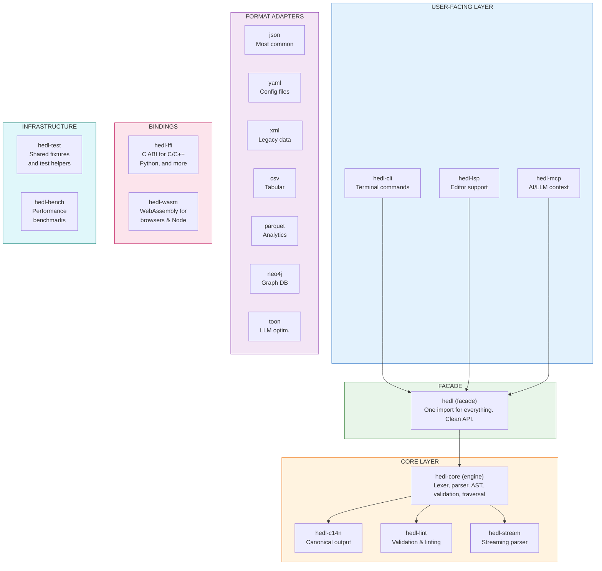
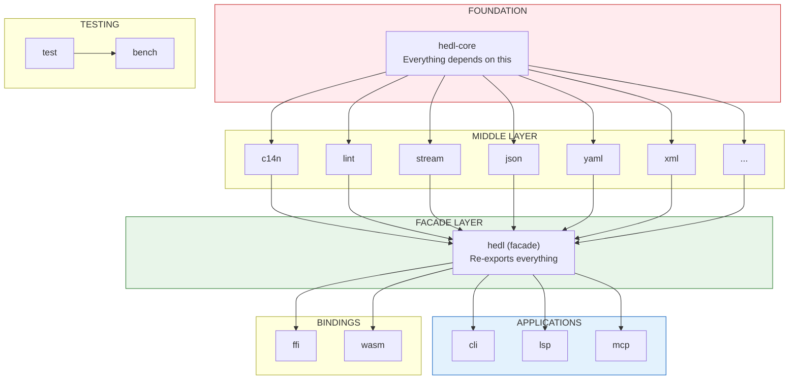

# HEDL Module Guide

Nineteen crates. One purpose.

Each crate in the HEDL workspace has exactly one job. The lexer lexes. The parser parses. The JSON converter converts to JSON. Nothing more, nothing less.

This radical modularity is intentional. When you fix a bug in `hedl-json`, you don't touch `hedl-yaml`. When you optimize the lexer, you don't break the CLI. When you add a feature to one crate, you know exactly where to put it.

This guide takes you through all nineteen crates. You'll learn what each one does, how it fits with the others, and when you might need to modify it.

---

## The Architecture at a Glance

Before diving into individual crates, understand how they fit together:


```mermaid
flowchart TB
    subgraph UserFacing["USER-FACING LAYER"]
        CLI["hedl-cli<br/>Terminal commands"]
        LSP["hedl-lsp<br/>Editor support"]
        MCP["hedl-mcp<br/>AI/LLM context"]
    end

    subgraph Facade["FACADE"]
        HEDL["hedl (facade)<br/>One import for everything. Clean API."]
    end

    subgraph CoreLayer["CORE LAYER"]
        CORE["hedl-core (engine)<br/>Lexer, parser, AST, validation, traversal"]
        C14N["hedl-c14n<br/>Canonical output"]
        LINT["hedl-lint<br/>Validation & linting"]
        STREAM["hedl-stream<br/>Streaming parser"]
    end

    subgraph Adapters["FORMAT ADAPTERS"]
        JSON["json<br/>Most common"]
        YAML["yaml<br/>Config files"]
        XML["xml<br/>Legacy data"]
        CSV["csv<br/>Tabular"]
        PARQUET["parquet<br/>Analytics"]
        NEO4J["neo4j<br/>Graph DB"]
        TOON["toon<br/>LLM optim."]
    end

    subgraph Bindings["BINDINGS"]
        FFI["hedl-ffi<br/>C ABI for C/C++<br/>Python, and more"]
        WASM["hedl-wasm<br/>WebAssembly for<br/>browsers & Node"]
    end

    subgraph Infra["INFRASTRUCTURE"]
        TEST["hedl-test<br/>Shared fixtures<br/>and test helpers"]
        BENCH["hedl-bench<br/>Performance<br/>benchmarks"]
    end

    CLI --> HEDL
    LSP --> HEDL
    MCP --> HEDL
    HEDL --> CORE
    CORE --> C14N
    CORE --> LINT
    CORE --> STREAM

    style UserFacing fill:#e3f2fd,stroke:#1565c0
    style Facade fill:#e8f5e9,stroke:#2e7d32
    style CoreLayer fill:#fff3e0,stroke:#ef6c00
    style Adapters fill:#f3e5f5,stroke:#7b1fa2
    style Bindings fill:#fce4ec,stroke:#c2185b
    style Infra fill:#e0f7fa,stroke:#00796b
```

Data flows down through this stack. A CLI command uses `hedl`, which uses `hedl-core`, which uses the format adapters as needed. Each layer depends only on the layers below it.

---

## Core Crates

These crates form the foundation. Everything else builds on them.

### hedl (The Facade)

**Path:** `crates/hedl/`

Think of this crate as the front door. Users of HEDL typically depend only on this crate. It re-exports everything they need from the other crates, providing a single, stable API.

**What It Does:**

```rust
// One import gives you everything
use hedl::{parse, canonicalize, to_json, from_json};

// Parse a document
let doc = parse(input)?;

// Convert to JSON
let json = to_json(&doc)?;

// Convert back
let doc2 = from_json(&json)?;

// Canonicalize
let canonical = canonicalize(&doc)?;
```

**Feature Flags:**

Not everyone needs every format. Cargo features let users include only what they need:

```toml
[dependencies]
hedl = { version = "2.0", features = ["yaml", "xml"] }
```

| Feature | What It Enables |
|---------|-----------------|
| `yaml` | YAML conversion |
| `xml` | XML conversion |
| `csv` | CSV conversion |
| `parquet` | Parquet conversion |
| `neo4j` | Neo4j Cypher generation |
| `toon` | TOON format |
| `all-formats` | Everything above |

**When You'd Modify It:**

- Adding a new re-export
- Adding a new feature flag
- Updating the public API

---

### hedl-core (The Engine)

**Path:** `crates/hedl-core/`

This is where the magic happens. The lexer, parser, AST, validation, and traversal all live here. Every other crate depends on this one.

**The Lexer** (`lex` module):

```rust
use hedl_core::lex::{
    is_valid_key_token,
    is_valid_type_name,
    is_valid_id_token,
    parse_reference,
    parse_csv_row,
    parse_tensor,
};

// Validate tokens
assert!(is_valid_key_token("user_name"));    // snake_case for keys
assert!(is_valid_type_name("User"));          // PascalCase for types
assert!(is_valid_id_token("alice-123"));      // IDs allow hyphens

// Parse complex tokens
let reference = parse_reference("@User:alice")?;
let row = parse_csv_row("|alice,Alice,alice@example.com")?;
let tensor = parse_tensor("[1,2,3]")?;
```

**The Parser:**

```rust
use hedl_core::{parse, parse_with_options, ParseOptions};

// Simple parsing
let doc = parse(input)?;

// With options
let options = ParseOptions::builder()
    .max_depth(50)
    .reference_mode(ReferenceMode::Strict)
    .build();

let doc = parse_with_options(input, &options)?;
```

**The Data Model:**

```rust
// The document structure
pub struct Document {
    pub version: (u32, u32),                      // Version tuple
    pub aliases: BTreeMap<String, String>,        // %A: directives
    pub structs: BTreeMap<String, Vec<String>>,   // %S: schemas
    pub nests: BTreeMap<String, String>,          // %N: nesting rules
    pub root: BTreeMap<String, Item>,             // Body content
}

// Items in the body
pub enum Item {
    Scalar(Value),                    // Single value
    Object(BTreeMap<String, Item>),   // Nested key-values
    List(MatrixList),                 // Typed entity list
}

// Matrix lists hold typed entities
pub struct MatrixList {
    pub type_name: String,            // "User"
    pub schema: Vec<String>,          // ["id", "name", "email"]
    pub rows: Vec<Node>,              // The entities
    pub count_hint: Option<usize>,    // Optional %C hint
}

// Entities in matrix lists
pub struct Node {
    pub type_name: String,
    pub id: String,
    pub fields: SmallVec<[Value; 4]>,  // Stack-allocated for common case
    pub children: Option<Box<BTreeMap<String, Vec<Node>>>>,
    pub child_count: u16,
}

// All value types
pub enum Value {
    Null,
    Bool(bool),
    Int(i64),
    Float(f64),
    String(Box<str>),
    Tensor(Box<Tensor>),
    Reference(Reference),
    Expression(Box<Expression>),
}
```

**The Visitor Pattern:**

```rust
use hedl_core::traverse::{DocumentVisitor, VisitorContext, traverse};

struct MyVisitor { /* state */ }

impl DocumentVisitor for MyVisitor {
    type Error = MyError;

    fn visit_scalar(
        &mut self,
        key: &str,
        value: &Value,
        ctx: &VisitorContext,
    ) -> Result<(), Self::Error> {
        // Process scalar values
        Ok(())
    }

    fn visit_node(
        &mut self,
        node: &Node,
        schema: &[String],
        ctx: &VisitorContext,
    ) -> Result<(), Self::Error> {
        // Process matrix list nodes
        Ok(())
    }
}

// Traverse the document
let mut visitor = MyVisitor::new();
traverse(&doc, &mut visitor)?;
```

**Resource Limits:**

Security limits prevent denial-of-service attacks:

```rust
pub struct Limits {
    pub max_file_size: usize,         // Default: 1 GB
    pub max_line_length: usize,       // Default: 1 MB
    pub max_indent_depth: usize,      // Default: 50
    pub max_nodes: usize,             // Default: 10 million
    pub max_aliases: usize,           // Default: 10,000
    pub max_columns: usize,           // Default: 100
    pub timeout: Option<Duration>,    // Default: 30 seconds
}
```

**When You'd Modify It:**

- Fixing parser bugs
- Adding new value types
- Optimizing performance
- Adding validation rules

---

## Processing Crates

These crates transform or analyze parsed documents.

### hedl-c14n (Canonical Output)

**Path:** `crates/hedl-c14n/`

"C14N" is short for "canonicalization." This crate converts a `Document` back to HEDL text in a deterministic, consistent format.

**Why Canonicalization Matters:**

Two HEDL documents can be semantically identical but textually different:

```hedl
# Document A
name: Alice
age: 30

# Document B (same meaning, different formatting)
age:30
name:Alice
```

Canonicalization produces a single, consistent representation:

```hedl
%V:2.0
%NULL:~
%QUOTE:"
---
age: 30
name: Alice
```

Keys are sorted. Formatting is consistent. The same input always produces the same output.

**Usage:**

```rust
use hedl_c14n::{canonicalize, canonicalize_with_config, CanonicalConfig, QuotingStrategy};

// Simple canonicalization
let hedl_text = canonicalize(&doc)?;

// With configuration
let config = CanonicalConfig::builder()
    .with_quoting(QuotingStrategy::Minimal)  // Quote only when necessary
    .build();

let hedl_text = canonicalize_with_config(&doc, &config)?;
```

**When You'd Modify It:**

- Changing output formatting
- Adding configuration options
- Fixing edge cases in quoting

---

### hedl-lint (Validation and Style)

**Path:** `crates/hedl-lint/`

The linter catches problems and suggests improvements. It goes beyond parsing errors to find logical issues and style problems.

**Usage:**

```rust
use hedl_lint::{lint, lint_with_config, LintConfig, Severity};

// Simple linting
let diagnostics = lint(&doc);

// With configuration
let config = LintConfig {
    min_severity: Severity::Warning,
    enabled_rules: vec!["unused-schema".to_string(), "id-naming".to_string()],
    ..Default::default()
};

let diagnostics = lint_with_config(&doc, config);

// Process results
for diagnostic in diagnostics {
    println!("{}: {}", diagnostic.rule_id(), diagnostic.message());
}
```

**Built-in Rules:**

| Rule | Category | What It Catches |
|------|----------|-----------------|
| `unused-schema` | Semantic | Schema defined but never used |
| `empty-list` | Style | Matrix list with no entities |
| `id-naming` | Style | IDs that don't follow conventions |
| `duplicate-key` | Semantic | Same key appears twice in object |
| `dangling-reference` | Semantic | Reference to nonexistent entity |
| `ambiguous-reference` | Style | Unqualified reference matches multiple types |
| `circular-reference` | Semantic | Reference cycle detected |
| `deeply-nested` | Style | Nesting exceeds threshold |

**When You'd Modify It:**

- Adding new lint rules
- Improving error messages
- Adding fix suggestions

---

### hedl-stream (Streaming Parser)

**Path:** `crates/hedl-stream/`

For large files that don't fit in memory, the streaming parser processes documents as a series of events without loading everything at once.

**Synchronous Usage:**

```rust
use hedl_stream::{StreamingParser, NodeEvent};
use std::io::BufReader;
use std::fs::File;

let file = File::open("large.hedl")?;
let parser = StreamingParser::new(BufReader::new(file))?;

for event in parser {
    match event? {
        NodeEvent::ListStart { key, type_name, schema, .. } => {
            println!("Starting list '{}' of type {}", key, type_name);
        }
        NodeEvent::Node(info) => {
            println!("  Entity: {} ({})", info.id, info.type_name);
        }
        NodeEvent::ListEnd { key, count, .. } => {
            println!("Finished list '{}' with {} entities", key, count);
        }
        NodeEvent::Scalar { key, value, .. } => {
            println!("Scalar: {} = {:?}", key, value);
        }
        _ => {}
    }
}
```

**Asynchronous Usage:**

```rust
use hedl_stream::{AsyncStreamingParser, NodeEvent};
use tokio::fs::File;
use tokio::io::BufReader;

let file = File::open("large.hedl").await?;
let mut parser = AsyncStreamingParser::new(BufReader::new(file)).await?;

while let Some(event) = parser.next_event().await? {
    // Process event
}

// Or process in batches
let batch = parser.next_batch(1000).await?;
```

**Event Types:**

```rust
pub enum NodeEvent {
    Header(HeaderInfo),
    ListStart { key: String, type_name: String, schema: Vec<String>, line: usize },
    Node(NodeInfo),
    ListEnd { key: String, type_name: String, count: usize },
    Scalar { key: String, value: Value, line: usize },
    ObjectStart { key: String, line: usize },
    ObjectEnd { key: String },
    EndOfDocument,
}
```

**When You'd Modify It:**

- Adding new event types
- Optimizing memory usage
- Improving async performance

---

## Format Adapters

Each format adapter handles bidirectional conversion between HEDL and another format.

### hedl-json (JSON Conversion)

**Path:** `crates/hedl-json/`

The most commonly used adapter. JSON and HEDL map naturally to each other.

**HEDL to JSON:**

```rust
use hedl_json::{hedl_to_json, to_json_with_config, ToJsonConfig};

// Simple conversion
let json = hedl_to_json(&doc)?;

// With configuration
let config = ToJsonConfig {
    include_metadata: true,   // Include __type__, __schema__
    expand_references: false, // Keep references as strings
    include_children: true,   // Include nested children
};

let json = to_json_with_config(&doc, &config)?;
```

**JSON to HEDL:**

```rust
use hedl_json::{json_to_hedl, from_json_with_config, FromJsonConfig};

// Simple conversion
let doc = json_to_hedl(&json_string)?;

// With configuration
let config = FromJsonConfig {
    infer_schemas: true,  // Auto-detect schemas from arrays
};

let doc = from_json_with_config(&json_string, &config)?;
```

**Mapping:**

```
JSON                              HEDL
────                              ────

{                                 %V:2.0
  "users": [                      %NULL:~
    {                             %QUOTE:"
      "id": "alice",              %S:User:[id,name,email]
      "name": "Alice",            ---
      "email": "alice@ex.com"     users:@User
    },                             |alice,Alice,alice@ex.com
    {                              |bob,Bob,bob@ex.com
      "id": "bob",
      "name": "Bob",
      "email": "bob@ex.com"
    }
  ]
}
```

---

### hedl-yaml (YAML Conversion)

**Path:** `crates/hedl-yaml/`

YAML is popular for configuration files. This adapter preserves YAML's features where possible.

**Special Handling:**

- YAML anchors become HEDL aliases
- YAML tags become type annotations
- Multi-document YAML becomes multiple root objects

**Example:**

```yaml
# YAML input
users:
  - &alice
    id: alice
    name: Alice
  - id: bob
    name: Bob
    friend: *alice
```

```hedl
# HEDL output
%V:2.0
%NULL:~
%QUOTE:"
%S:User:[id,name]
---
users:@User
 |alice,Alice
 |bob,Bob
```

---

### hedl-xml (XML Conversion)

**Path:** `crates/hedl-xml/`

XML has a different data model (attributes vs. elements), so this adapter makes smart choices about mapping.

**Mapping Strategy:**

```xml
<!-- XML input -->
<user id="alice" role="admin">
  <name>Alice</name>
  <email>alice@example.com</email>
</user>
```

```hedl
# HEDL output
%V:2.0
%NULL:~
%QUOTE:"
---
user:
 id: alice
 role: admin
 name: Alice
 email: alice@example.com
```

XML attributes and child elements both become HEDL key-value pairs. Text content becomes a `_text` field if there are also attributes or child elements.

---

### hedl-csv (CSV Conversion)

**Path:** `crates/hedl-csv/`

CSV is inherently tabular, making it a natural fit for HEDL's matrix lists.

**Example:**

```csv
id,name,email,active
alice,Alice,alice@example.com,true
bob,Bob,bob@example.com,false
```

```hedl
%V:2.0
%NULL:~
%QUOTE:"
%S:Data:[id,name,email,active]
---
data:@Data
 |alice,Alice,alice@example.com,true
 |bob,Bob,bob@example.com,false
```

The adapter infers types from the data (strings, integers, floats, booleans) and creates an appropriate schema.

---

### hedl-parquet (Apache Parquet)

**Path:** `crates/hedl-parquet/`

Parquet is a columnar format optimized for analytics. This adapter enables HEDL integration with data warehouses.

**Features:**

- Schema mapping: HEDL schemas become Parquet schemas
- Columnar storage: Matrix lists become Parquet tables
- Compression: Configurable (Snappy, GZIP, LZ4)
- Type preservation: Full fidelity for all HEDL types

**Use Cases:**

- Loading HEDL data into Spark/Pandas/DuckDB
- Storing HEDL data in data lakes
- Efficient analytics on large datasets

---

### hedl-neo4j (Neo4j Cypher)

**Path:** `crates/hedl-neo4j/`

Generates Cypher queries to import HEDL data into Neo4j graph databases.

**Example:**

```hedl
%V:2.0
%NULL:~
%QUOTE:"
%S:Person:[id,name]
%S:Knows:[id,person1,person2]
---
people:@Person
 |alice,Alice
 |bob,Bob

relationships:@Knows
 |k1,@alice,@bob
```

Generated Cypher:

```cypher
CREATE (alice:Person {id: 'alice', name: 'Alice'});
CREATE (bob:Person {id: 'bob', name: 'Bob'});
MATCH (a:Person {id: 'alice'}), (b:Person {id: 'bob'})
CREATE (a)-[:KNOWS {id: 'k1'}]->(b);
```

---

### hedl-toon (TOON Format)

**Path:** `crates/hedl-toon/`

TOON (Token-Oriented Object Notation) is optimized for LLM consumption. It's even more compact than HEDL.

**Example:**

```toon
users[2]{id,name}:
  u1,Alice
  u2,Bob
```

This adapter converts between HEDL and TOON, enabling efficient LLM context usage.

---

## User Interface Crates

These crates provide ways for users to interact with HEDL.

### hedl-cli (Command Line)

**Path:** `crates/hedl-cli/`

The command-line interface for all HEDL operations.

**Commands:**

```bash
# Validate a document
hedl validate data.hedl

# Convert formats
hedl to-json data.hedl -o data.json
hedl from-yaml config.yaml -o config.hedl

# Format (canonicalize)
hedl format data.hedl

# Lint
hedl lint data.hedl

# Show statistics
hedl stats data.hedl

# Batch operations
hedl batch-validate *.hedl --parallel
```

**Features:**

- Colored output for readability
- Progress bars for large files
- JSON output mode for scripting
- Shell completion (bash, zsh, fish)
- Parallel processing for batch operations

---

### hedl-lsp (Language Server)

**Path:** `crates/hedl-lsp/`

Language Server Protocol implementation for editor integration.

**Features:**

| Feature | What It Does |
|---------|--------------|
| Diagnostics | Real-time error and warning highlighting |
| Completion | Autocomplete for keys, types, IDs, references |
| Hover | Show type information on hover |
| Go to Definition | Jump to where an ID is defined |
| Find References | Find all uses of an ID |
| Rename | Rename IDs across the document |
| Formatting | Auto-format on save |
| Code Actions | Quick fixes for common issues |

**Supported Editors:**

- VS Code (via extension)
- Vim/Neovim (via coc.nvim or native LSP)
- Emacs (via lsp-mode)
- IntelliJ (via LSP plugin)
- Any LSP-compatible editor

---

### hedl-mcp (Model Context Protocol)

**Path:** `crates/hedl-mcp/`

MCP server for AI and LLM integration.

**Available Tools:**

```typescript
// Convert HEDL to JSON
{
  "tool": "hedl_to_json",
  "arguments": { "hedl": "...", "expand_references": true }
}

// Convert JSON to HEDL
{
  "tool": "json_to_hedl",
  "arguments": { "json": "..." }
}

// Validate HEDL
{
  "tool": "hedl_validate",
  "arguments": { "hedl": "...", "run_lint": true }
}

// Analyze token efficiency
{
  "tool": "hedl_analyze",
  "arguments": { "hedl": "...", "compare_to_json": true }
}
```

This enables AI assistants to work with HEDL documents efficiently, leveraging HEDL's token efficiency for larger context windows.

---

## Binding Crates

These crates expose HEDL to other languages.

### hedl-ffi (C Bindings)

**Path:** `crates/hedl-ffi/`

C-compatible API for integration with C, C++, Python, and other languages that can call C functions.

**C API:**

```c
// Parse HEDL
int hedl_parse(const char* input, int input_len, int strict, HedlDocument** out_doc);

// Convert to JSON
int hedl_to_json(const HedlDocument* doc, int include_metadata, char** out_str);

// Free resources
void hedl_free_document(HedlDocument* doc);
void hedl_free_string(char* str);

// Error handling
const char* hedl_get_last_error(void);
```

**Safety Guarantees:**

- No panics across FFI boundary
- Clear ownership semantics (caller or callee frees)
- NULL-safe API
- Thread-local error storage

---

### hedl-wasm (WebAssembly)

**Path:** `crates/hedl-wasm/`

WebAssembly bindings for browsers and Node.js.

**JavaScript API:**

```javascript
import init, { parse, toJson, fromJson, validate } from './hedl_wasm.js';

await init();

// Parse HEDL
const doc = parse(hedlText);

// Convert to JSON
const json = doc.toJsonString(true);  // pretty printed

// Get as JavaScript object
const obj = doc.toJson();

// Back to HEDL
const hedl = doc.toHedl();

// Validate
const result = validate(hedlText, true);  // run lint
if (!result.valid) {
  console.error(result.errors);
}
```

**TypeScript Support:**

Full type definitions are provided:

```typescript
export function parse(input: string): HedlDocument;
export function toJson(input: string, pretty?: boolean): string;
export function fromJson(json: string): string;
export function format(input: string): string;
export function validate(input: string, runLint?: boolean): ValidationResult;

export class HedlDocument {
  toJson(): any;
  toJsonString(pretty?: boolean): string;
  toHedl(): string;
  readonly rootItemCount: number;
}
```

---

## Infrastructure Crates

These crates support development and testing.

### hedl-test (Test Utilities)

**Path:** `crates/hedl-test/`

Shared fixtures and helpers for testing across all crates.

**Fixtures:**

```rust
use hedl_test::fixtures;

// Pre-built documents for testing
let doc = fixtures::scalars();           // All scalar types
let doc = fixtures::user_list();         // Matrix list with users
let doc = fixtures::with_nest();         // Nested relationships
let doc = fixtures::with_references();   // Cross-entity references
let doc = fixtures::comprehensive();     // Everything together

// Iterate all fixtures
for (name, fixture_fn) in fixtures::all() {
    let doc = fixture_fn();
    // Test with this fixture
}
```

**Utilities:**

```rust
use hedl_test::{count_nodes, count_references, expr, expr_value};

// Count things in documents
let node_count = count_nodes(&doc);
let ref_count = count_references(&doc);

// Create expression values for testing
let e = expr("now()");
let v = expr_value("count + 1");
```

---

### hedl-bench (Benchmarks)

**Path:** `crates/hedl-bench/`

Performance benchmarks using Criterion.

**Benchmark Categories:**

| Category | What It Measures |
|----------|-----------------|
| Parsing | Lexer and parser performance |
| Canonicalization | AST to HEDL text |
| JSON | JSON conversion both ways |
| YAML | YAML conversion both ways |
| Streaming | Large file processing |
| Reference Resolution | ID lookup performance |
| Traversal | Visitor pattern overhead |

**Running Benchmarks:**

```bash
# All benchmarks
cargo bench -p hedl-bench

# Specific benchmark
cargo bench -p hedl-bench --bench parsing

# Compare to baseline
cargo bench -p hedl-bench -- --baseline main

# Save new baseline
cargo bench -p hedl-bench -- --save-baseline feature-branch
```

---

## Dependency Graph

Understanding how crates depend on each other helps you know what might be affected by changes:


```mermaid
flowchart TB
    subgraph Core["FOUNDATION"]
        CORE["hedl-core<br/>Everything depends on this"]
    end

    subgraph Mid["MIDDLE LAYER"]
        C14N["c14n"]
        LINT["lint"]
        STREAM["stream"]
        JSON["json"]
        YAML["yaml"]
        XML["xml"]
        OTHER["..."]
    end

    subgraph FacadeLayer["FACADE LAYER"]
        HEDL["hedl (facade)<br/>Re-exports everything"]
    end

    subgraph Apps["APPLICATIONS"]
        CLI["cli"]
        LSP["lsp"]
        MCP["mcp"]
    end

    subgraph BindingsLayer["BINDINGS"]
        FFI["ffi"]
        WASM["wasm"]
    end

    subgraph Testing["TESTING"]
        TEST["test"]
        BENCH["bench"]
    end

    CORE --> C14N
    CORE --> LINT
    CORE --> STREAM
    CORE --> JSON
    CORE --> YAML
    CORE --> XML
    CORE --> OTHER

    C14N --> HEDL
    LINT --> HEDL
    STREAM --> HEDL
    JSON --> HEDL
    YAML --> HEDL
    XML --> HEDL
    OTHER --> HEDL

    HEDL --> CLI
    HEDL --> LSP
    HEDL --> MCP
    HEDL --> FFI
    HEDL --> WASM
    TEST --> BENCH

    style Core fill:#ffebee,stroke:#c62828
    style FacadeLayer fill:#e8f5e9,stroke:#2e7d32
    style Apps fill:#e3f2fd,stroke:#1565c0
```

The arrows show dependency direction. A change to `hedl-core` potentially affects everything. A change to `hedl-json` only affects crates that depend on JSON functionality.

---

## Quick Reference

| Crate | Purpose | Key Dependencies |
|-------|---------|------------------|
| **hedl** | Unified API facade | All other crates |
| **hedl-core** | Parser, AST, validation | serde, thiserror, memchr |
| **hedl-c14n** | Canonical output | hedl-core |
| **hedl-lint** | Validation and linting | hedl-core |
| **hedl-stream** | Streaming parser | hedl-core, tokio |
| **hedl-json** | JSON conversion | hedl-core, serde_json |
| **hedl-yaml** | YAML conversion | hedl-core, serde_yaml |
| **hedl-xml** | XML conversion | hedl-core, quick-xml |
| **hedl-csv** | CSV conversion | hedl-core, csv |
| **hedl-parquet** | Parquet conversion | hedl-core, parquet, arrow |
| **hedl-neo4j** | Neo4j Cypher | hedl-core |
| **hedl-toon** | TOON format | hedl-core |
| **hedl-cli** | Command line | hedl, clap, rayon |
| **hedl-lsp** | Language server | hedl, tower-lsp |
| **hedl-mcp** | MCP server | hedl, tokio |
| **hedl-ffi** | C bindings | hedl |
| **hedl-wasm** | WebAssembly | hedl, wasm-bindgen |
| **hedl-test** | Test utilities | hedl-core |
| **hedl-bench** | Benchmarks | hedl, criterion |

---

## Navigating the Codebase

When you need to make a change, use this guide:

**"I need to fix a parsing bug"**
→ Look in `hedl-core/src/parser/` or `hedl-core/src/lex/`

**"I need to change error messages"**
→ Look in `hedl-core/src/error.rs`

**"I need to fix JSON conversion"**
→ Look in `hedl-json/src/`

**"I need to add a lint rule"**
→ Look in `hedl-lint/src/rules/`

**"I need to add a CLI command"**
→ Look in `hedl-cli/src/`

**"I need to add test fixtures"**
→ Look in `hedl-test/src/fixtures.rs`

**"I need to add a benchmark"**
→ Look in `hedl-bench/benches/`

---

## What's Next

You now understand how the crates fit together. Pick your next step:

**Dive deeper into the parser:**
→ [Internals](internals.md)

**Start contributing:**
→ [Contributing Guide](contributing.md)

**Understand the specification:**
→ [SPEC.md](../../SPEC.md) in the repository root

Nineteen crates. One purpose. Now you know where everything lives.
