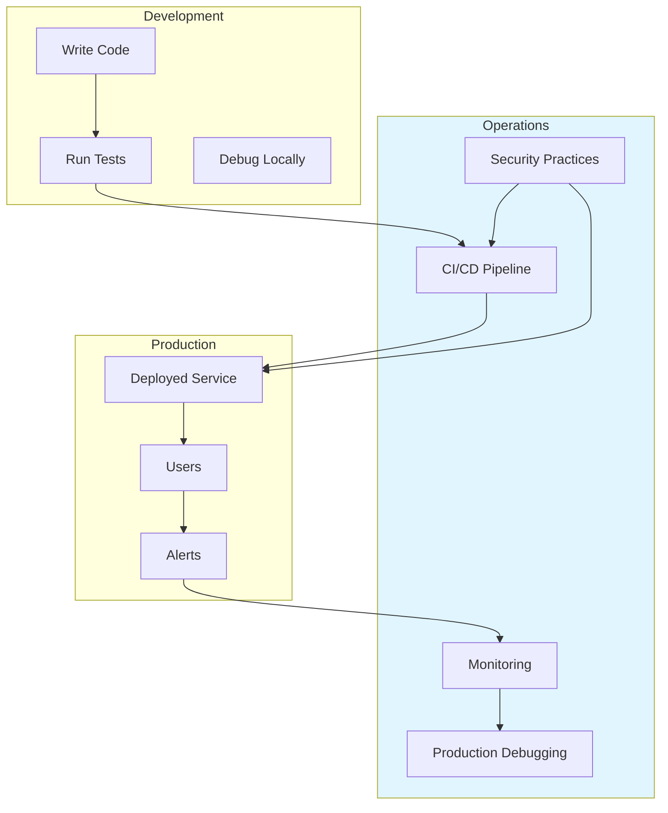
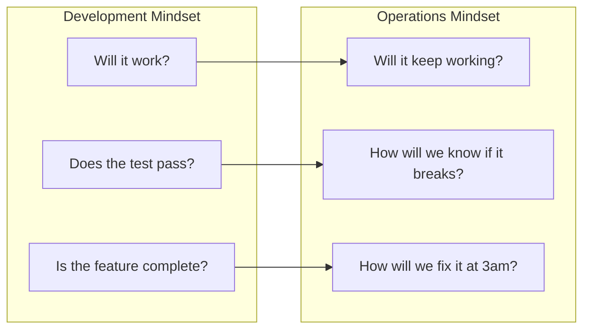
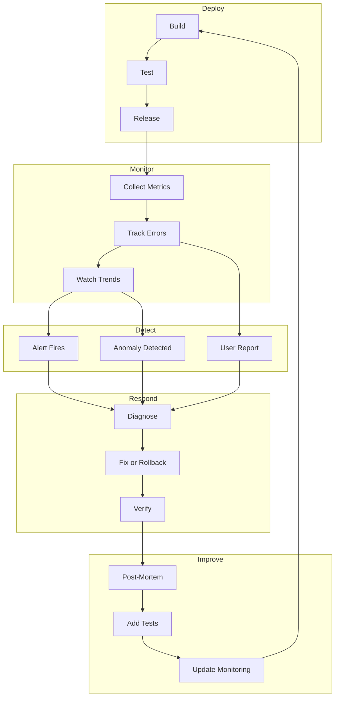

# Operations Documentation: Running HEDL in the Real World

Development is one thing. Production is another.

In development, you can restart when things break. You can attach a debugger. You can watch logs scroll by in real time. Production offers none of these luxuries. Users depend on your code working. When it fails, you need to diagnose from logs and metrics collected while you were sleeping. When it slows down, you need to find the cause without access to the running process.

Operations documentation bridges this gap. It teaches you how to run HEDL reliably: how to build and test automatically, how to monitor for problems, how to debug when things go wrong, and how to keep everything secure. These guides prepare you for the 3am page that something broke.

---

## Available Guides

### Continuous Integration and Deployment

**[CI/CD Pipeline](ci-cd.md)**

Your code must build reliably, test thoroughly, and deploy safely. This guide covers:

- GitHub Actions workflows for HEDL
- Automated testing on every push
- Benchmark tracking and regression detection
- Release automation
- Platform-specific considerations

Continuous integration catches problems before they reach users. Set it up once, and every change goes through the same quality gates.

### Monitoring and Observability

**[Monitoring and Metrics](monitoring.md)**

You cannot fix what you cannot see. This guide explains:

- What metrics to track for HEDL applications
- Performance monitoring (latency, throughput)
- Error rate tracking and alerting
- Benchmark regression detection
- Dashboards and visualization

Monitoring turns invisible problems into visible data. When users report slowness, monitoring shows whether the problem is real and where it lives.

### Production Debugging

**[Production Debugging](debugging-production.md)**

Something broke in production. You have logs, maybe a core dump, definitely angry users. This guide helps you:

- Obtain debug symbols for release builds
- Analyze crash dumps and stack traces
- Profile performance in production
- Correlate logs with user reports
- Fix issues without causing more problems

Production debugging requires different techniques than local debugging. You work with limited information, under time pressure, with high stakes.

### Security Practices

**[Security Practices](security.md)**

Security is not optional. This guide covers:

- Dependency auditing with `cargo audit`
- Vulnerability scanning and remediation
- Security disclosure process
- Secure coding practices for HEDL
- Attack surface analysis

One vulnerability can undo years of good work. Security practices catch problems before attackers do.

---

## Quick Reference

| Topic | Purpose | Guide |
|-------|---------|-------|
| Automated builds and tests | Catch problems before release | [CI/CD Pipeline](ci-cd.md) |
| Track metrics over time | Detect problems early | [Monitoring](monitoring.md) |
| Debug production issues | Fix problems fast | [Production Debugging](debugging-production.md) |
| Keep the project secure | Prevent vulnerabilities | [Security](security.md) |

---

## The Operations Mindset

Operations thinking differs from development thinking:

Operations asks different questions:

- **Reliability**: Will this work next week? Next month? Under load?
- **Observability**: Can we see what is happening? Will we know when it fails?
- **Recoverability**: When it breaks, can we fix it quickly? Can we roll back?
- **Security**: What could an attacker do? How do we prevent it?

These guides help you answer those questions.

---

## Operations Lifecycle

Operations follows a cycle: deploy, monitor, detect, respond, improve.

Each guide addresses a different part of this cycle:

- **CI/CD**: The Deploy phase
- **Monitoring**: The Monitor and Detect phases
- **Production Debugging**: The Respond phase
- **Security**: Cross-cutting concern across all phases

---

## Getting Started with Operations

If you are new to operations, start here:

1. **Set up CI/CD first**: Automated builds and tests prevent many problems from ever reaching production. Read [CI/CD Pipeline](ci-cd.md).

2. **Add basic monitoring**: Before you deploy widely, ensure you can see what is happening. Read [Monitoring](monitoring.md).

3. **Prepare for incidents**: Have a plan before things break. Read [Production Debugging](debugging-production.md).

4. **Audit security**: Check for known vulnerabilities. Read [Security](security.md).

---

## Related Documentation

Operations builds on development knowledge:

- **[Testing Guide](../testing.md)**: Tests that CI runs
- **[Benchmarking Guide](../benchmarking.md)**: Performance tests for regression detection
- **[How-To Guides](../how-to/README.md)**: Specific debugging and profiling tasks
- **[Contributing Guide](../contributing.md)**: How to contribute operational improvements

---

## Contributing to Operations Docs

Running HEDL in production? Learned something the hard way? Share your knowledge:

1. **Document incidents**: When something breaks, write up what happened and how you fixed it.
2. **Share monitoring dashboards**: Effective dashboards help everyone.
3. **Improve runbooks**: Add to the debugging guides with new techniques.
4. **Report security issues**: Follow the disclosure process in [Security](security.md).

Good operations documentation comes from real experience. Your production pain becomes everyone's gain.
