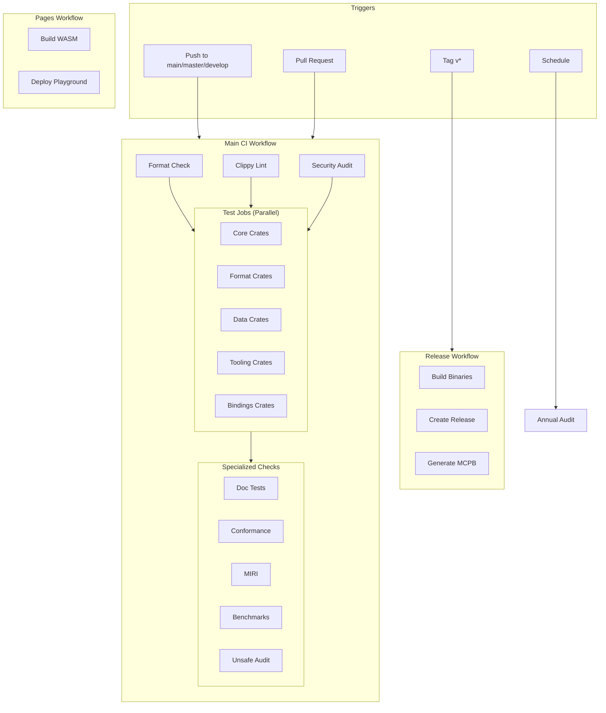
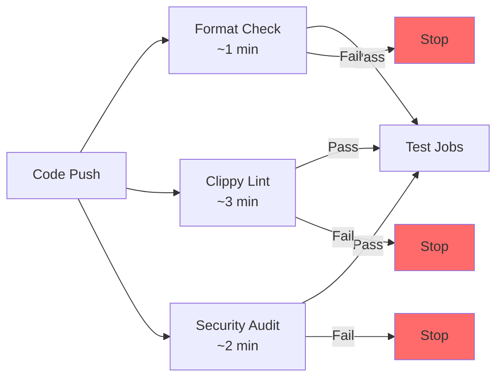
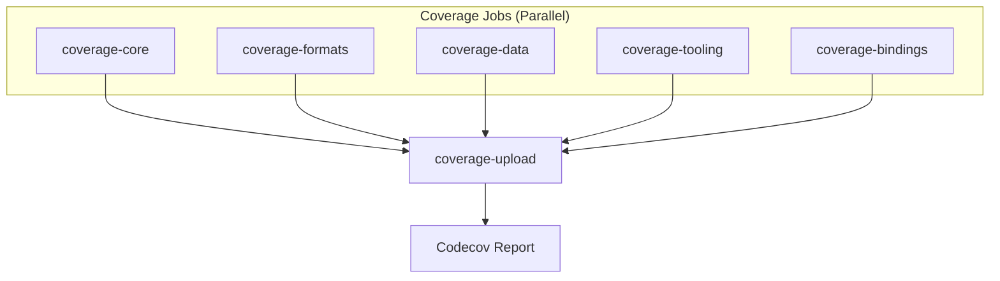
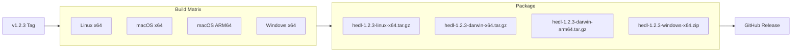
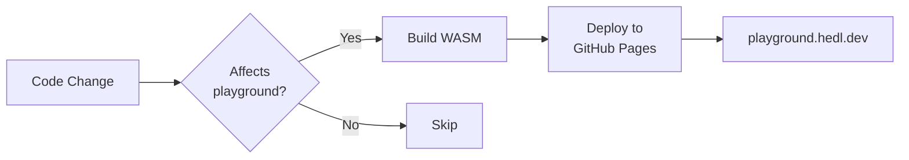

# CI/CD Pipeline: Automated Quality at Every Commit

You push code. Within minutes, you know whether it works. Not "probably works." Not "worked on my machine." You know with certainty because automated systems have compiled it, tested it, linted it, and audited it for security vulnerabilities.

This is the promise of continuous integration: every change runs through the same gauntlet. Problems surface immediately, when the context is fresh and fixes are cheap. By the time code reaches users, it has passed dozens of automated checks that would take hours to run manually.

This guide documents HEDL's CI/CD infrastructure. You will learn what runs when, why each check exists, and how to simulate the pipeline locally. When a build fails, you will know exactly what went wrong and how to fix it.

---

## The Pipeline at a Glance

HEDL uses GitHub Actions with multiple workflows:



---

## Main CI Workflow

**File:** `.github/workflows/ci.yml`

**Triggers:** Push to `master`, `main`, `develop`, all pull requests

This workflow runs on every change, serving as the quality gate.

### Quick Checks: Fail Fast

These run first, catching obvious problems in seconds:



**Format Check (rustfmt)**

```yaml
- name: Check formatting
  run: cargo fmt --all -- --check
```

Enforces consistent style. If this fails, run `cargo fmt --all` locally.

**Clippy (Linting)**

```yaml
- name: Clippy
  run: cargo clippy --all-features --workspace --lib -- -D warnings
```

Catches common mistakes, style issues, and potential bugs. Warnings are errors (`-D warnings`).

**Security Audit**

```yaml
- name: Security audit
  run: |
    cargo install cargo-audit
    cargo audit
```

Checks dependencies against the RustSec advisory database. Fails if any known vulnerabilities exist.

### Test Jobs: Parallel Execution

Tests run in parallel, grouped by crate type to avoid disk exhaustion:

| Job | Crates | Services |
|-----|--------|----------|
| test-core | hedl-core, hedl-c14n, hedl-test, hedl | None |
| test-formats | hedl-json, hedl-yaml, hedl-xml, hedl-csv | None |
| test-data | hedl-parquet, hedl-neo4j, hedl-stream | Neo4j 5.15 |
| test-tooling | hedl-lint, hedl-lsp, hedl-cli, hedl-mcp | None |
| test-bindings | hedl-ffi, hedl-wasm, hedl-toon | None |

Each job:

1. Checks out code
2. Installs Rust toolchain
3. Restores cache
4. Runs tests with all features: `cargo test -p <crate> --all-features`

The Neo4j test job spins up a database service:

```yaml
services:
  neo4j:
    image: neo4j:5.15
    env:
      NEO4J_AUTH: neo4j/testpassword
    ports:
      - 7687:7687
```

### Coverage Collection

Coverage runs after tests, uploading to Codecov:



Each coverage job:

```yaml
- name: Generate coverage
  run: |
    cargo install cargo-llvm-cov
    cargo llvm-cov --all-features -p $CRATES --lcov --output-path lcov.info
```

Coverage is informational: it does not block merges (`continue-on-error: true`).

### Specialized Checks

After tests pass, additional checks run:

**Doc Tests**

```yaml
- name: Doc tests
  run: cargo test --doc --workspace
```

Verifies examples in documentation comments actually work.

**Conformance Tests**

```yaml
- name: HEDL conformance
  run: cargo test --package hedl-core conformance --all-features
```

Validates compliance with the HEDL specification.

**MIRI (Undefined Behavior Detection)**

```yaml
- name: MIRI
  run: cargo +nightly miri test -p hedl-core --lib
  continue-on-error: true
```

Runs tests under MIRI, detecting undefined behavior in unsafe code. Informational only.

**Benchmark Tests**

```yaml
- name: Benchmark tests
  run: cargo test --benches -p hedl-bench
```

Ensures benchmark code compiles and runs (does not measure performance in CI).

**Unsafe Code Audit**

On pull requests, checks for new unsafe code:

```yaml
- name: Check for new unsafe
  if: github.event_name == 'pull_request'
  run: |
    UNSAFE_LINES=$(git diff origin/main... -- 'crates/hedl-core/src/*.rs' | grep '+.*unsafe' || true)
    if [ -n "$UNSAFE_LINES" ]; then
      echo "New unsafe code detected:"
      echo "$UNSAFE_LINES"
      exit 1
    fi
```

---

## Release Workflow

**File:** `.github/workflows/release.yml`

**Triggers:** Tags matching `v*` (e.g., `v1.2.3`)

When you tag a release, this workflow builds binaries for all platforms.

### Build Matrix



Each platform builds:

- `hedl-cli`: Command-line interface
- `hedl-mcp`: Model Context Protocol server

### Release Creation

After builds complete:

1. Downloads all artifacts
2. Generates SHA256 checksums
3. Creates GitHub Release with auto-generated notes
4. Attaches all binaries and checksums

### MCPB Bundles

Creates Model Context Protocol packages for LLM integration:

```yaml
- name: Create MCPB
  run: |
    # Create manifest.json
    cat > manifest.json << EOF
    {
      "name": "hedl-mcp",
      "version": "$VERSION",
      "tools": ["hedl_read", "hedl_query", "hedl_validate", ...]
    }
    EOF

    # Package as .mcpb
    zip hedl-mcp-$OS-$ARCH.mcpb manifest.json hedl-mcp
```

---

## Pages Workflow

**File:** `.github/workflows/pages.yml`

**Triggers:** Push to `master` affecting playground or WASM code

Builds and deploys the interactive WASM playground:



Build steps:

```yaml
- name: Build WASM
  run: |
    wasm-pack build crates/hedl-wasm \
      --target web \
      --out-dir ../../playground/pkg \
      --features all-formats
```

---

## Scheduled Maintenance

**File:** `.github/workflows/scheduled.yml`

**Trigger:** January 1st at 10:00 UTC

Annual audit of unsafe code and dependencies:

```yaml
- name: Annual unsafe audit
  run: |
    UNSAFE_COUNT=$(rg "unsafe" crates/hedl-core/src --type rust -c || echo 0)
    if [ "$UNSAFE_COUNT" -gt "0" ]; then
      echo "::warning::Found $UNSAFE_COUNT unsafe blocks in hedl-core"
    fi

- name: Dependency audit
  run: cargo audit --deny warnings
```

---

## Dependabot Configuration

**File:** `.github/dependabot.yml`

Automates dependency updates:

```yaml
version: 2
updates:
  - package-ecosystem: cargo
    directory: "/"
    schedule:
      interval: weekly
      day: monday
    groups:
      all-deps:
        patterns: ["*"]

  - package-ecosystem: github-actions
    directory: "/"
    schedule:
      interval: weekly
```

Creates pull requests for outdated dependencies every Monday.

---

## Quality Gates Summary

All checks must pass before merging:

| Check | Required? | Failure Action |
|-------|-----------|----------------|
| Format | Yes | Run `cargo fmt --all` |
| Clippy | Yes | Fix all warnings |
| Security | Yes | Update vulnerable deps |
| Tests | Yes | Fix failing tests |
| Doc Tests | Yes | Fix doc examples |
| Conformance | Yes | Fix spec violations |
| Coverage | No | Informational only |
| MIRI | No | Informational only |
| Unsafe Audit | Yes (PRs) | Justify or remove unsafe |

---

## Running CI Locally

Simulate the CI pipeline before pushing:

```bash
# Quick checks (run these first)
cargo fmt --all -- --check
cargo clippy --all-features --workspace --lib -- -D warnings
cargo audit

# Core tests
cargo test -p hedl-core --all-features
cargo test -p hedl-c14n --all-features
cargo test -p hedl-test --all-features
cargo test -p hedl --all-features

# Format tests
cargo test -p hedl-json --all-features
cargo test -p hedl-yaml --all-features
cargo test -p hedl-xml --all-features
cargo test -p hedl-csv --all-features

# Tooling tests
cargo test -p hedl-lint --all-features
cargo test -p hedl-lsp --all-features
cargo test -p hedl-cli --all-features

# Documentation
cargo test --doc --workspace
cargo test --package hedl-core conformance --all-features

# Benchmarks (optional)
cargo test --benches -p hedl-bench
```

Or use the validation script from CLAUDE.md:

```bash
ulimit -v 8000000 && cargo fmt --all --check
ulimit -v 8000000 && cargo clippy --workspace --all-targets --all-features -- -D warnings
ulimit -v 8000000 && cargo test --workspace --all-targets --all-features
```

---

## Troubleshooting CI Failures

### Format Check Failed

```
error: You have code formatting issues
```

**Fix:** Run `cargo fmt --all` and commit the changes.

### Clippy Warning

```
error: this could be rewritten as...
```

**Fix:** Address the specific warning. If it is a false positive, add `#[allow(clippy::...)]` with justification.

### Security Audit Failed

```
Crate: vulnerable-crate
Version: 1.0.0
Advisory: RUSTSEC-2023-0001
```

**Fix:** Update the dependency: `cargo update -p vulnerable-crate`

### Test Failure

```
test parser::tests::test_parse_simple ... FAILED
```

**Fix:** Debug locally with `cargo test -p hedl-core test_parse_simple -- --nocapture`

### Doc Test Failure

```
error[E0433]: failed to resolve: use of undeclared crate
```

**Fix:** Ensure doc examples have correct imports and compile.

---

## Performance Considerations

### Caching

All jobs use Rust caching:

```yaml
- uses: Swatinem/rust-cache@v2
  with:
    key: ${{ matrix.group }}
```

This saves 5-15 minutes per build.

### Timeouts

Jobs have appropriate timeouts to prevent runaway builds:

| Job Type | Timeout |
|----------|---------|
| Quick checks | 10-20 min |
| Test jobs | 30 min |
| Coverage | 30 min |
| Release builds | 60 min |

### Parallelization

Tests run in parallel by crate group, maximizing throughput while avoiding resource exhaustion.

---

## Related Documentation

- **[Testing Guide](../testing.md)**: What tests run and how to write them
- **[Benchmarking Guide](../benchmarking.md)**: Performance testing
- **[Security Practices](./security.md)**: Security-related CI checks
- **[Release Process](../guides/release-process.md)**: How releases are prepared
