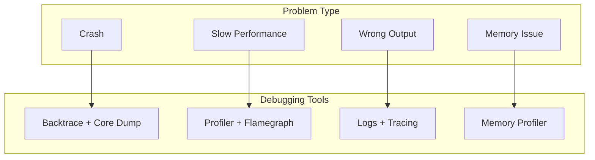
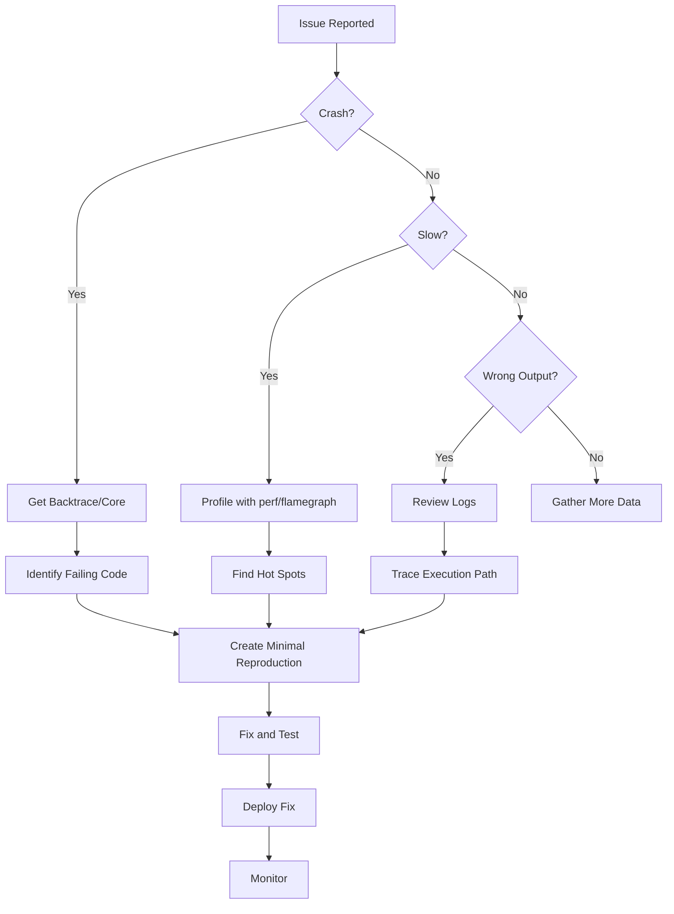

# Production Debugging: Finding Answers When You Cannot Reproduce

The alert fires at 3 AM. Users report crashes. Your dashboards show errors spiking. But when you try the same input locally, it works perfectly. The bug exists only in production, in conditions you cannot recreate in your development environment.

Production debugging is different from local debugging. You cannot attach a debugger to a live server. You cannot add print statements and rebuild. You work with whatever information was captured before the problem occurred: logs, crash dumps, metrics. Your task is detective work: reconstruct what happened from the evidence left behind.

This guide teaches you to debug HEDL in production. You will learn to build with symbols, analyze crashes, profile live systems, and extract meaning from logs. When the next incident occurs, you will be ready.

---

## The Production Debugging Toolkit

Different problems require different tools:



---

## Building for Debuggability

Production binaries need symbols for useful stack traces.

### Release Builds with Debug Symbols

```toml
# Cargo.toml
[profile.release]
debug = 1  # Include debug symbols
```

Or build with:

```bash
RUSTFLAGS="-C debuginfo=1" cargo build --release
```

This adds ~15% to binary size but enables meaningful backtraces.

### Separate Debug Symbols

For minimal binary size with full debugging capability:

```bash
# Build release
cargo build --release

# Extract symbols
objcopy --only-keep-debug target/release/hedl hedl.debug

# Strip binary
strip target/release/hedl

# Link debug file
objcopy --add-gnu-debuglink=hedl.debug target/release/hedl
```

Now the 3MB binary ships to production, but the 50MB debug file stays for analysis.

---

## Crash Analysis

When HEDL crashes, you need to know where and why.

### Enable Backtraces

Set environment variables for maximum information:

```bash
# Full backtrace on panic
RUST_BACKTRACE=full ./hedl parse document.hedl

# Or just basic backtrace
RUST_BACKTRACE=1 ./hedl parse document.hedl
```

Output shows the call stack:

```
thread 'main' panicked at 'index out of bounds', src/parser/:145:23
stack backtrace:
   0: std::panicking::begin_panic
   1: hedl_core::parser::parse_node
             at ./crates/hedl-core/src/parser/:145
   2: hedl_core::parser::parse_body
             at ./crates/hedl-core/src/parser/:89
   3: hedl_core::parse
             at ./crates/hedl-core/src/lib.rs:42
   4: hedl_cli::main
             at ./crates/hedl-cli/src/main.rs:15
```

### Core Dumps

Enable core dumps for post-mortem analysis:

```bash
# Enable unlimited core dumps
ulimit -c unlimited

# Run program (will create core file on crash)
./target/release/hedl parse problem.hedl

# Analyze with GDB
gdb ./target/release/hedl core

# In GDB
(gdb) bt        # Show backtrace
(gdb) frame 3   # Select stack frame
(gdb) info locals  # Show local variables
(gdb) print input  # Examine specific variable
```

### Analyzing Panic Messages

HEDL panics contain useful information:

```
thread 'main' panicked at 'assertion failed: col < line.len()'
```

This tells you:
- **What failed**: An assertion (`assertion failed`)
- **The condition**: `col < line.len()` was false
- **Implication**: Column index exceeded line length

Search the codebase for this assertion:

```bash
grep -rn "col < line.len()" crates/
```

---

## Performance Profiling in Production

Performance problems often only appear under production load.

### Linux: perf

```bash
# Record CPU samples
perf record -g ./target/release/hedl parse large.hedl

# Generate report
perf report

# Generate flamegraph
perf script | stackcollapse-perf.pl | flamegraph.pl > flame.svg
```

### Attaching to Running Process

If the process is already running:

```bash
# Find process ID
pgrep hedl

# Attach perf
perf record -g -p <PID> -- sleep 30

# Analyze
perf report
```

### macOS: Instruments

```bash
# Profile CPU time
instruments -t "Time Profiler" ./target/release/hedl parse large.hedl

# Profile memory
instruments -t "Allocations" ./target/release/hedl parse large.hedl
```

### Flamegraph from Running System

For ongoing performance analysis:

```bash
# Install flamegraph
cargo install flamegraph

# Profile
flamegraph -o flame.svg -- ./target/release/hedl parse large.hedl

# View
firefox flame.svg
```

---

## Logging and Tracing

Logs capture what happened before problems occurred.

### Structured Logging with Tracing

```rust
use tracing::{info, warn, error, instrument, Level};

#[instrument(skip(input), fields(input_len = input.len()))]
pub fn parse(input: &[u8]) -> Result<Document, HedlError> {
    info!("Starting parse");

    let result = parse_internal(input);

    match &result {
        Ok(doc) => info!(keys = doc.root.len(), "Parse completed"),
        Err(e) => error!(line = e.line, kind = ?e.kind, "Parse failed"),
    }

    result
}
```

### Configuring Log Levels

```bash
# All debug logs
RUST_LOG=debug ./hedl parse document.hedl

# Specific modules at trace level
RUST_LOG=hedl_core::parser=trace,hedl_core::lexer=debug ./hedl parse document.hedl

# Errors and warnings only
RUST_LOG=warn ./hedl parse document.hedl
```

### Log Aggregation Patterns

For production, output structured logs:

```rust
use tracing_subscriber::fmt::format::FmtSpan;

fn init_logging() {
    tracing_subscriber::fmt()
        .json()  // Structured JSON output
        .with_span_events(FmtSpan::CLOSE)  // Include span timing
        .with_max_level(Level::INFO)
        .init();
}
```

Output:

```json
{"timestamp":"2024-01-15T10:30:45Z","level":"INFO","target":"hedl_core::parser","message":"Parse completed","span":{"name":"parse","input_len":1234},"keys":5}
```

### Analyzing Logs

Search for patterns:

```bash
# Find all errors
grep '"level":"ERROR"' logs.jsonl | jq '.'

# Count errors by type
grep '"level":"ERROR"' logs.jsonl | jq '.kind' | sort | uniq -c

# Find slow operations
grep '"elapsed_ms"' logs.jsonl | jq 'select(.elapsed_ms > 100)'
```

---

## Memory Debugging

Memory issues manifest as crashes, slowdowns, or OOM kills.

### Detecting Memory Leaks

```bash
# Install valgrind (Linux)
sudo apt install valgrind

# Run with leak check
valgrind --leak-check=full ./target/release/hedl parse document.hedl
```

Output shows leaks:

```
==12345== LEAK SUMMARY:
==12345==    definitely lost: 0 bytes in 0 blocks
==12345==    indirectly lost: 0 bytes in 0 blocks
==12345==      possibly lost: 0 bytes in 0 blocks
==12345==    still reachable: 1,024 bytes in 10 blocks
==12345==         suppressed: 0 bytes in 0 blocks
```

### Memory Usage Over Time

```bash
# Profile heap usage
valgrind --tool=massif ./target/release/hedl parse large.hedl

# View results
ms_print massif.out.*
```

### AddressSanitizer

Build with sanitizers for comprehensive checking:

```bash
RUSTFLAGS="-Z sanitizer=address" cargo +nightly build --release
./target/release/hedl parse document.hedl
```

Reports issues like:

```
==12345==ERROR: AddressSanitizer: heap-buffer-overflow on address 0x...
```

---

## Debugging Workflow

When a production issue occurs, follow this process:



### Step 1: Gather Evidence

```bash
# Collect logs around incident time
journalctl -u hedl-service --since "1 hour ago" > incident_logs.txt

# Get process state if still running
ps aux | grep hedl
cat /proc/<PID>/status

# Collect any core dumps
ls -la /var/crash/
```

### Step 2: Analyze Evidence

```bash
# Review logs for errors
grep -i error incident_logs.txt

# Check for resource exhaustion
grep -E "(out of memory|too many|limit)" incident_logs.txt

# Look for patterns before crash
tail -100 incident_logs.txt
```

### Step 3: Reproduce

Create minimal reproduction:

```rust
#[test]
fn reproduce_production_crash() {
    // Input that triggered the issue
    let input = include_bytes!("../fixtures/production_crash.hedl");

    // This should reproduce the crash
    let result = parse(input);

    // Verify we get the expected error
    assert!(result.is_err());
}
```

### Step 4: Fix and Verify

```bash
# Fix the code
# ...

# Run reproduction test
cargo test reproduce_production_crash

# Run full test suite
cargo test --all

# Build and deploy
cargo build --release
```

---

## Emergency Procedures

### When You Cannot Reproduce

1. **Add more logging**: Deploy version with verbose logging
2. **Capture traffic**: Log all inputs for later replay
3. **Enable core dumps**: Catch the next crash
4. **Monitor closely**: Watch for patterns

### When Fix Cannot Wait

```bash
# Rollback to previous version
git checkout v1.2.3
cargo build --release
# Deploy previous version

# Then investigate at leisure
git checkout main
# Debug...
```

### When Memory is Exhausted

```bash
# Check current limits
ulimit -a

# Temporarily increase (if allowed)
ulimit -v 16000000  # 16 GB virtual memory

# Monitor usage
watch -n 1 'ps -o pid,rss,vsz,comm -p $(pgrep hedl)'
```

---

## Related Documentation

- **[Debug Parser Issues](../how-to/debug-parser.md)**: Local debugging techniques
- **[Profile Performance](../how-to/profile-performance.md)**: Performance analysis
- **[Monitoring](./monitoring.md)**: Collecting metrics for debugging
- **[CI/CD Pipeline](./ci-cd.md)**: Building debuggable releases
