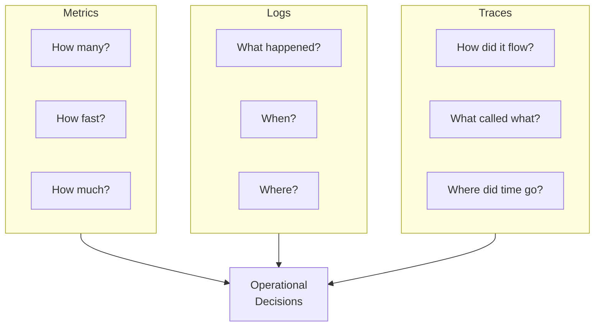
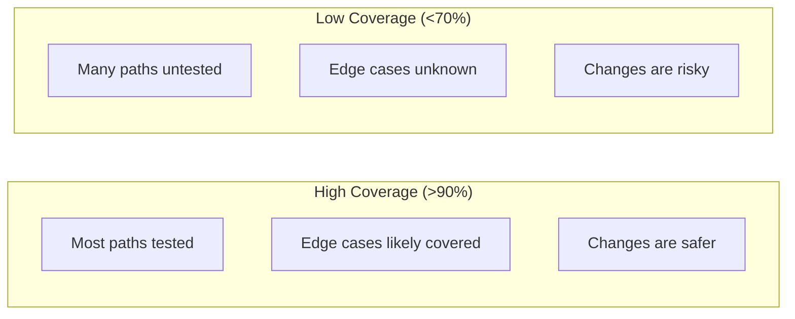
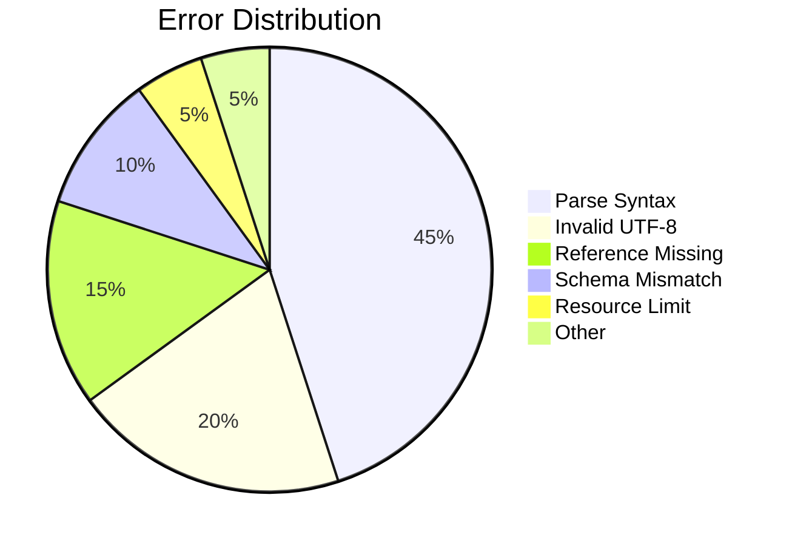

# Monitoring and Metrics: Seeing What Your Code Does

You deployed your application. Users are using it. But is it working? Is it fast? Are errors piling up while you sleep?

Without monitoring, you are flying blind. Users discover problems before you do. Performance degrades gradually, unnoticed until it becomes unbearable. Bugs lurk in edge cases that your tests never hit.

Monitoring shines light into these dark corners. It shows you what happens in production, in real time. When something goes wrong, monitoring tells you before users complain. When performance degrades, monitoring catches the regression. When patterns emerge in error logs, monitoring surfaces them.

This guide teaches you to instrument HEDL code for observability. You will learn what metrics matter, how to collect them, and how to use them to improve your software.

---

## The Observability Pyramid

Observability has three pillars, each answering different questions:



- **Metrics**: Numerical measurements over time (latency, throughput, error rate)
- **Logs**: Discrete events with context (parse failed, request handled)
- **Traces**: Request flows through the system (what called what, how long each step took)

---

## Key Metrics for HEDL

### Performance Metrics

These numbers tell you how fast your code runs:

| Metric | What It Measures | Target |
|--------|------------------|--------|
| **Parse Throughput** | MB/s processed | >100 MB/s |
| **Parse Latency (p50)** | Median parse time | <10ms for typical docs |
| **Parse Latency (p99)** | Worst-case parse time | <100ms |
| **Memory per Document** | Peak allocation | <10x document size |
| **Conversion Rate** | Documents/second | >1000 docs/s |

### Quality Metrics

These numbers tell you how well your code works:

| Metric | What It Measures | Target |
|--------|------------------|--------|
| **Error Rate** | Parse failures / total | <0.1% on valid input |
| **Test Coverage** | Lines exercised by tests | >90% |
| **Clippy Warnings** | Static analysis findings | 0 |
| **Conformance Score** | Spec compliance tests | 100% |

### Operational Metrics

These numbers tell you how your system behaves:

| Metric | What It Measures | Target |
|--------|------------------|--------|
| **Availability** | Uptime percentage | >99.9% |
| **Response Time** | End-to-end latency | <100ms |
| **Throughput** | Requests/second | Scales with load |
| **Error Budget** | Acceptable failure rate | Depends on SLO |

---

## Collecting Metrics with Criterion

Criterion benchmarks provide the most accurate performance measurements.

### Save Baselines

```bash
# Create baseline from current main branch
git checkout main
cargo bench --all -- --save-baseline main

# Switch to your branch
git checkout feature-branch
```

### Compare Against Baseline

```bash
# Run benchmarks and compare
cargo bench --all -- --baseline main
```

Output shows changes:

```
parse_simple           time:   [12.5 µs 12.7 µs 12.9 µs]
                       change: [-5.2% -3.8% -2.4%] (p < 0.001)
                       Performance improved.

json_conversion        time:   [45.2 µs 46.1 µs 47.0 µs]
                       change: [+2.1% +3.5% +4.9%] (p < 0.001)
                       Performance regressed.
```

### Track Over Time

Benchmark results live in `target/criterion/`. Archive them for historical tracking:

```bash
# After benchmarking on main
cp -r target/criterion results/$(git rev-parse --short HEAD)/
```

---

## Code Coverage

Coverage shows which code paths tests exercise.

### Generate Coverage Report

```bash
# Install coverage tool
cargo install cargo-tarpaulin

# Generate HTML report
cargo tarpaulin --all --out Html --output-dir coverage

# Open report
open coverage/tarpaulin-report.html
```

### Coverage Targets

| Component | Target | Notes |
|-----------|--------|-------|
| hedl-core | >95% | Parser must be thoroughly tested |
| hedl-json | >90% | All conversion paths |
| hedl-cli | >85% | Integration tests cover workflows |
| hedl-lsp | >85% | Handler coverage |

### Interpreting Coverage

High coverage does not guarantee correctness, but low coverage guarantees gaps:



Focus on:
- Uncovered error handling paths
- Uncovered branch conditions
- Functions with 0% coverage

---

## Error Tracking

Errors tell stories. Track them systematically.

### Error Categories



### Logging Errors

Use structured logging for analysis:

```rust
use tracing::{error, info, warn, instrument};

#[instrument(skip(input), fields(input_len = input.len()))]
pub fn parse(input: &[u8]) -> Result<Document, HedlError> {
    match parse_internal(input) {
        Ok(doc) => {
            info!(keys = doc.root.len(), "Parse succeeded");
            Ok(doc)
        }
        Err(e) => {
            error!(
                kind = ?e.kind,
                line = e.line,
                message = %e.message,
                "Parse failed"
            );
            Err(e)
        }
    }
}
```

### Analyzing Error Patterns

Aggregate errors to find patterns:

```bash
# Count errors by kind
grep "Parse failed" logs.jsonl | jq '.kind' | sort | uniq -c | sort -rn

# Find most common error locations
grep "Parse failed" logs.jsonl | jq '.line' | sort | uniq -c | sort -rn | head
```

---

## Regression Detection

Performance regressions sneak in gradually. Catch them automatically.

### Benchmark in CI

Run benchmarks on every PR:

```yaml
# .github/workflows/benchmark.yml
name: Benchmarks

on: pull_request

jobs:
  benchmark:
    runs-on: ubuntu-latest
    steps:
      - uses: actions/checkout@v4
        with:
          fetch-depth: 0

      - name: Benchmark PR
        run: cargo bench --all -- --save-baseline pr

      - name: Checkout main
        run: git checkout origin/main

      - name: Compare to main
        run: |
          cargo bench --all -- --baseline pr --noplot 2>&1 | tee results.txt

      - name: Check for regressions
        run: |
          if grep -q "Performance has regressed" results.txt; then
            echo "::error::Performance regression detected!"
            exit 1
          fi
```

### Performance Budgets

Define acceptable performance in code:

```rust
#[test]
fn performance_budget_parsing() {
    let input = include_bytes!("fixtures/large_document.hedl");

    let start = std::time::Instant::now();
    let _ = parse(input).unwrap();
    let duration = start.elapsed();

    // Budget: 100ms for this document
    assert!(
        duration < std::time::Duration::from_millis(100),
        "Parse exceeded budget: {:?}",
        duration
    );
}
```

---

## Dashboards and Visualization

### HTML Reports from Criterion

Criterion generates detailed HTML reports:

```bash
cargo bench --all

# Open the report
open target/criterion/report/index.html
```

Reports include:
- Time distributions (violin plots)
- Comparison to baseline
- Historical trends (if baselines archived)

### Custom Metrics Dashboard

For production monitoring, export metrics to your observability platform:

```rust
use prometheus::{register_histogram_vec, HistogramVec};

lazy_static! {
    static ref PARSE_DURATION: HistogramVec = register_histogram_vec!(
        "hedl_parse_duration_seconds",
        "Time to parse HEDL documents",
        &["result"],
        vec![0.001, 0.005, 0.01, 0.05, 0.1, 0.5, 1.0]
    ).unwrap();
}

pub fn parse_with_metrics(input: &[u8]) -> Result<Document, HedlError> {
    let timer = PARSE_DURATION.with_label_values(&["pending"]).start_timer();

    let result = parse(input);

    let label = if result.is_ok() { "success" } else { "error" };
    timer.observe_duration();
    PARSE_DURATION.with_label_values(&[label]).observe(timer.stop_and_record());

    result
}
```

---

## Alerting

Define alerts for critical conditions:

### Example Alert Rules

```yaml
# Prometheus alerting rules
groups:
  - name: hedl
    rules:
      - alert: HighParseErrorRate
        expr: rate(hedl_parse_errors_total[5m]) > 0.01
        for: 5m
        labels:
          severity: warning
        annotations:
          summary: "High HEDL parse error rate"
          description: "Parse errors exceeding 1% for 5 minutes"

      - alert: SlowParsing
        expr: histogram_quantile(0.99, hedl_parse_duration_seconds) > 0.5
        for: 10m
        labels:
          severity: warning
        annotations:
          summary: "HEDL parsing is slow"
          description: "99th percentile parse time exceeds 500ms"
```

---

## Monitoring Checklist

When deploying HEDL-based applications:

- [ ] **Parse throughput** tracked and baselined
- [ ] **Error rates** monitored with alerting
- [ ] **Memory usage** observed under load
- [ ] **Latency percentiles** measured (p50, p95, p99)
- [ ] **Test coverage** measured and reported
- [ ] **Benchmarks** run in CI with regression detection
- [ ] **Logs** structured for aggregation
- [ ] **Alerts** configured for critical thresholds

---

## Related Documentation

- **[Benchmarking Guide](../benchmarking.md)**: How to write effective benchmarks
- **[Testing Guide](../testing.md)**: Test coverage strategies
- **[Profile Performance](../how-to/profile-performance.md)**: Find bottlenecks
- **[CI/CD Pipeline](./ci-cd.md)**: Automated quality checks
