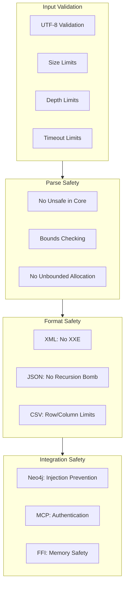

# Security Practices: Defending Against the Unknown

You build software. Attackers break it.

This is not paranoia; it is reality. Every parser is a target for malformed input. Every network endpoint is a potential entry point. Every dependency you trust might be compromised. The question is not whether attacks will come, but whether your defenses will hold.

Security is not a feature you add at the end. It is a practice woven into every decision: how you validate input, how you manage resources, how you handle errors. One vulnerability can undo years of careful development. One breach can destroy trust that took decades to build.

This guide documents HEDL's security practices. You will learn what protections exist, how to audit code for vulnerabilities, and how to respond when issues are discovered. Security is everyone's responsibility; this guide helps you fulfill it.

---

## Security Architecture

HEDL defends in depth. Multiple layers protect against different attack vectors:



---

## Resource Limits

Unbounded resource consumption enables denial-of-service attacks. HEDL enforces 12 security limits:

```rust
pub struct Limits {
    /// Maximum input file size (default: 1 GB)
    pub max_file_size: usize,

    /// Maximum line length (default: 1 MB)
    pub max_line_length: usize,

    /// Maximum nesting depth (default: 50)
    pub max_indent_depth: usize,

    /// Maximum total nodes (default: 10 million)
    pub max_nodes: usize,

    /// Maximum alias definitions (default: 10,000)
    pub max_aliases: usize,

    /// Maximum schema columns (default: 100)
    pub max_columns: usize,

    /// Maximum nesting depth for %NEST (default: 100)
    pub max_nest_depth: usize,

    /// Maximum block string size (default: 10 MB)
    pub max_block_string_size: usize,

    /// Maximum keys per object (default: 10,000)
    pub max_object_keys: usize,

    /// Maximum total keys (default: 10 million)
    pub max_total_keys: usize,

    /// Maximum total IDs (default: 10 million)
    pub max_total_ids: usize,

    /// Parse timeout (default: 30 seconds)
    pub timeout: Option<Duration>,
}
```

### Customizing Limits

```rust
use hedl_core::{parse_with_limits, Limits};

// Strict limits for untrusted input
let limits = Limits {
    max_file_size: 1024 * 1024,  // 1 MB
    max_indent_depth: 10,
    max_nodes: 10_000,
    timeout: Some(Duration::from_secs(5)),
    ..Limits::default()
};

let result = parse_with_limits(untrusted_input, limits);
```

### Why Each Limit Exists

| Limit | Attack It Prevents |
|-------|-------------------|
| max_file_size | Memory exhaustion from huge files |
| max_line_length | Memory exhaustion from long lines |
| max_indent_depth | Stack overflow from deep nesting |
| max_nodes | Memory/CPU exhaustion from complex docs |
| max_aliases | Alias expansion bombs |
| max_columns | Memory exhaustion from wide schemas |
| max_nest_depth | Deep hierarchy attacks |
| max_block_string_size | Memory exhaustion from huge strings |
| max_object_keys | Hash collision attacks |
| max_total_keys | Total complexity limits |
| max_total_ids | Reference graph explosion |
| timeout | CPU exhaustion attacks |

---

## Crate-Specific Security

Each HEDL crate addresses specific security concerns:

### hedl-core

The parser is the primary attack surface.

| Protection | Implementation |
|------------|----------------|
| No unsafe code | Zero `unsafe` blocks in parser |
| Bounds checking | All array access verified |
| UTF-8 validation | Input validated before parsing |
| Resource limits | All 12 limits enforced |

### hedl-xml

XML has notorious security issues.

| Protection | Implementation |
|------------|----------------|
| No XXE | External entities disabled |
| No entity expansion | Internal entities limited |
| No DTD processing | DTD parsing disabled |

```rust
// XML output is safe by default
let xml = hedl_xml::to_xml(&doc, &XmlOptions::default())?;
```

### hedl-neo4j

Database queries must prevent injection.

| Protection | Implementation |
|------------|----------------|
| Parameterized queries | All values passed as parameters |
| ID sanitization | Reference IDs validated before use |
| Max nodes enforced | Query limits respected |

```rust
// Safe: parameterized query
let query = "MATCH (n:$type) WHERE n.id = $id RETURN n";
let params = [("type", type_name), ("id", id)];

// NOT safe: string interpolation
let query = format!("MATCH (n:{}) WHERE n.id = '{}' RETURN n", type_name, id);
```

### hedl-mcp

Network services need authentication.

| Protection | Implementation |
|------------|----------------|
| OAuth2 support | Full OAuth2 flow |
| API key auth | For internal services |
| Path traversal prevention | `resources/read` secured |

### hedl-ffi

FFI boundaries require careful handling.

| Protection | Implementation |
|------------|----------------|
| Null pointer validation | All pointers checked |
| Thread-local errors | No shared error state |
| Panic catch | No panics across FFI |
| Memory ownership | Clear ownership semantics |

### hedl-csv

CSV processing needs size limits.

| Protection | Implementation |
|------------|----------------|
| Row count limits | Maximum rows enforced |
| Column count limits | Maximum columns enforced |
| Field size limits | Maximum field length enforced |

### hedl-stream

Streaming parsers face unique challenges.

| Protection | Implementation |
|------------|----------------|
| Line length limits | Maximum line length enforced |
| Buffer limits | Maximum buffer size enforced |

---

## Dependency Auditing

Dependencies can introduce vulnerabilities.

### Regular Audits

```bash
# Install audit tool
cargo install cargo-audit

# Run audit
cargo audit

# Fix by updating
cargo update

# Check specific advisory
cargo audit --ignore RUSTSEC-2024-0001
```

### CI Integration

The CI pipeline runs audits automatically:

```yaml
- name: Security audit
  run: |
    cargo install cargo-audit
    cargo audit --deny warnings
```

### Responding to CVEs

When a CVE affects a dependency:

1. **Check impact**: Does HEDL use the vulnerable code path?
2. **Update if possible**: `cargo update -p vulnerable-crate`
3. **If no fix available**: Evaluate workarounds or alternative crates
4. **Document**: Record the decision in CHANGELOG

---

## Fuzz Testing

Fuzzers find bugs that humans miss.

### Available Fuzz Targets

HEDL has 15 fuzz targets across 4 crates:

| Crate | Targets | Focus |
|-------|---------|-------|
| hedl-core | fuzz_parse, fuzz_roundtrip | Parser robustness |
| hedl-cli | fuzz_cli_input | CLI argument handling |
| hedl-stream | fuzz_streaming | Streaming parser |
| hedl-csv | fuzz_csv_roundtrip | CSV conversion |

### Running Fuzz Tests

```bash
# Install nightly and cargo-fuzz
rustup install nightly
cargo install cargo-fuzz

# Run a fuzz target
cd crates/hedl-core
cargo +nightly fuzz run fuzz_parse -- -max_total_time=300

# Run with specific corpus
cargo +nightly fuzz run fuzz_parse corpus/
```

### Fuzz Campaign Schedule

Run fuzzing regularly:

| Frequency | Duration | Purpose |
|-----------|----------|---------|
| Per PR | 5 minutes | Quick regression check |
| Weekly | 1 hour | Regular coverage |
| Monthly | 24 hours | Deep exploration |
| Release | 72 hours | Pre-release validation |

### Handling Crashes

When a fuzzer finds a crash:

1. **Save the input**: `cp crash-* crashes/`
2. **Minimize**: `cargo +nightly fuzz tmin fuzz_parse crashes/crash-xxx`
3. **Analyze**: Debug with minimized input
4. **Fix**: Implement fix with test
5. **Add to corpus**: Ensure it does not regress

---

## Unsafe Code Policy

Unsafe code is minimized and audited.

### hedl-core: Zero Unsafe

The parser contains no `unsafe` blocks. All pointer operations use safe Rust abstractions.

Verified by CI:

```yaml
- name: Unsafe audit
  run: |
    if grep -rn "unsafe" crates/hedl-core/src --include="*.rs"; then
      echo "Unsafe code found in hedl-core"
      exit 1
    fi
```

### When Unsafe is Necessary

Other crates (FFI, SIMD) require `unsafe`. Follow these rules:

1. **Minimize scope**: Wrap unsafe in safe abstractions
2. **Document invariants**: Explain what must be true
3. **Test boundaries**: Test all safe wrappers
4. **Review thoroughly**: Require 2+ reviewers for unsafe changes

Example of properly documented unsafe:

```rust
/// # Safety
///
/// - `ptr` must be valid for reads of `len` bytes
/// - `ptr` must be aligned to `u8`
/// - The memory must not be modified during this call
unsafe fn process_raw_bytes(ptr: *const u8, len: usize) -> Vec<u8> {
    // SAFETY: Caller guarantees ptr validity and alignment
    std::slice::from_raw_parts(ptr, len).to_vec()
}
```

---

## Security Disclosure Process

**Report vulnerabilities privately.**

### How to Report

- **Email**: security@dweve.com
- **Do NOT**: Create public GitHub issues for security issues

### What to Include

1. Description of the vulnerability
2. Steps to reproduce
3. Potential impact
4. Suggested fix (if any)

### Response Timeline

| Phase | Target |
|-------|--------|
| Initial acknowledgment | 24 hours |
| Assessment complete | 72 hours |
| Fix development | 1-2 weeks |
| Disclosure (coordinated) | 90 days max |

### After a Fix

1. **Release patch version**: e.g., 1.2.4
2. **CVE assignment**: If warranted
3. **Advisory publication**: GitHub Security Advisory
4. **User notification**: CHANGELOG and announcement

---

## Security Checklist

Before releasing code:

- [ ] `cargo audit` passes with no vulnerabilities
- [ ] Fuzz tests run without new crashes
- [ ] Resource limits are appropriate for use case
- [ ] No new `unsafe` in hedl-core
- [ ] Any new `unsafe` elsewhere is documented and reviewed
- [ ] Authentication/authorization for network services
- [ ] Input validation for all external data
- [ ] Error messages do not leak sensitive information

---

## Conformance Testing

SPEC § 14 defines security requirements. Conformance tests verify compliance:

```bash
cargo test --package hedl-core conformance --all-features
```

Tests verify:
- Resource limits are enforced
- Malformed input is rejected safely
- Error conditions do not panic
- Memory usage stays bounded

---

## Security Metrics

Track these metrics over time:

```bash
# Count unsafe blocks (target: 0 in hedl-core)
grep -rln "unsafe" crates/hedl-core/src --include="*.rs" | wc -l

# Check for CVEs
cargo audit

# Run conformance tests
cargo test --package hedl-core conformance --all-features

# Fuzz coverage
cargo +nightly fuzz coverage fuzz_parse
```

---

## Related Documentation

- **[Testing Guide](../testing.md)**: Including fuzz testing
- **[Error Handling](../concepts/error-handling.md)**: Safe error practices
- **[Conformance Testing](../testing-conformance.md)**: SPEC compliance
- **[CI/CD Pipeline](./ci-cd.md)**: Automated security checks
