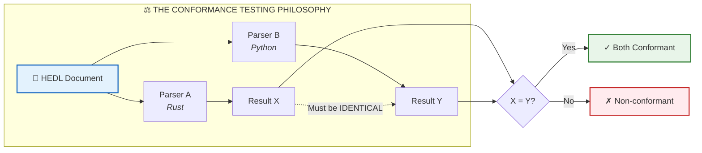
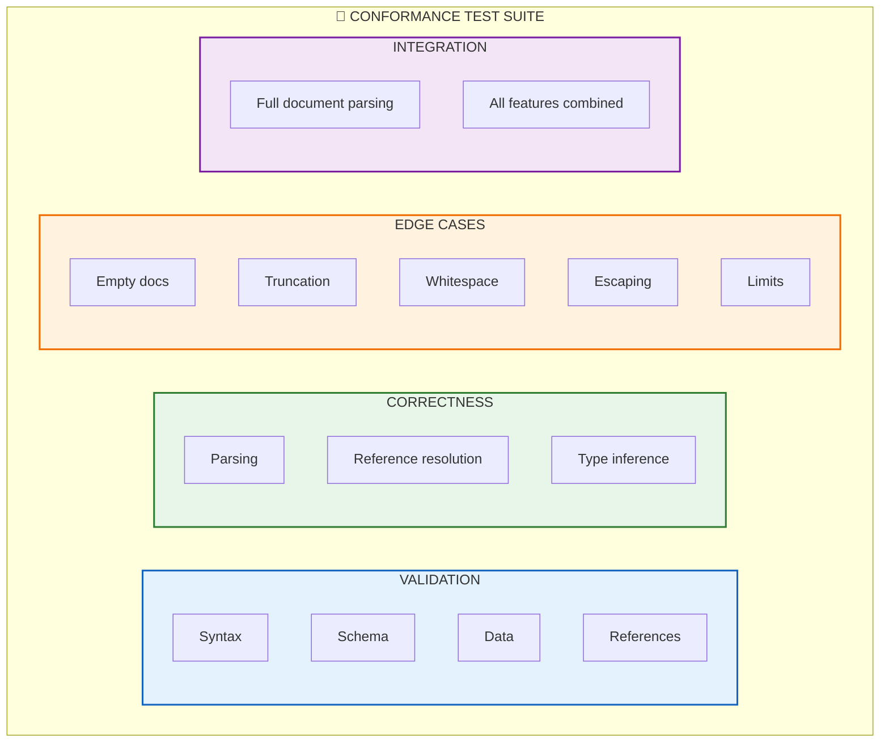
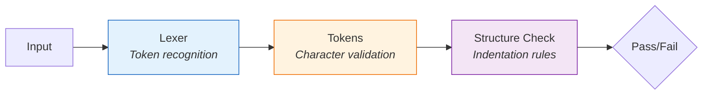
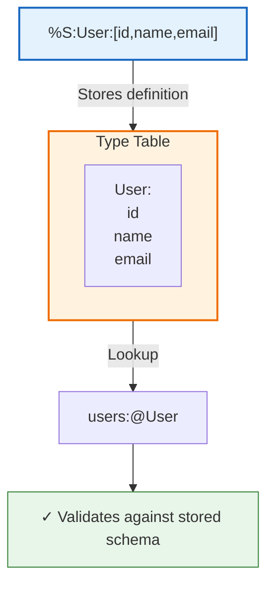
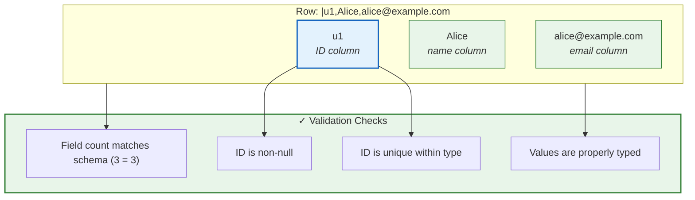
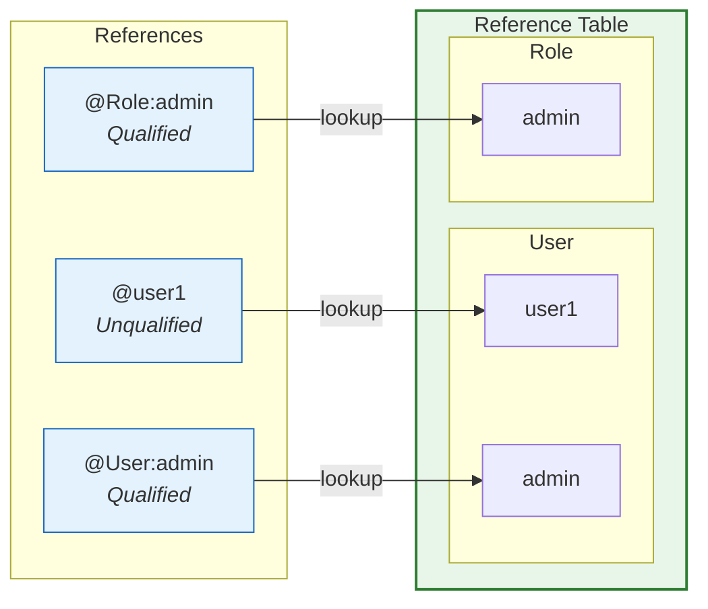
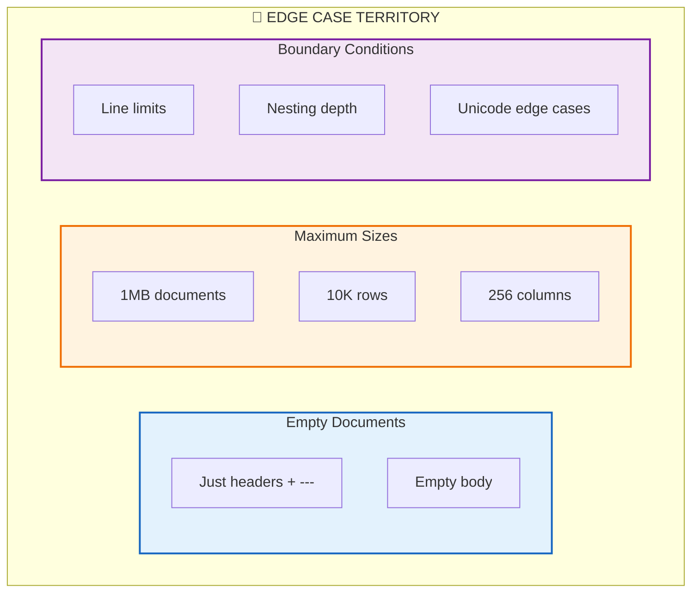
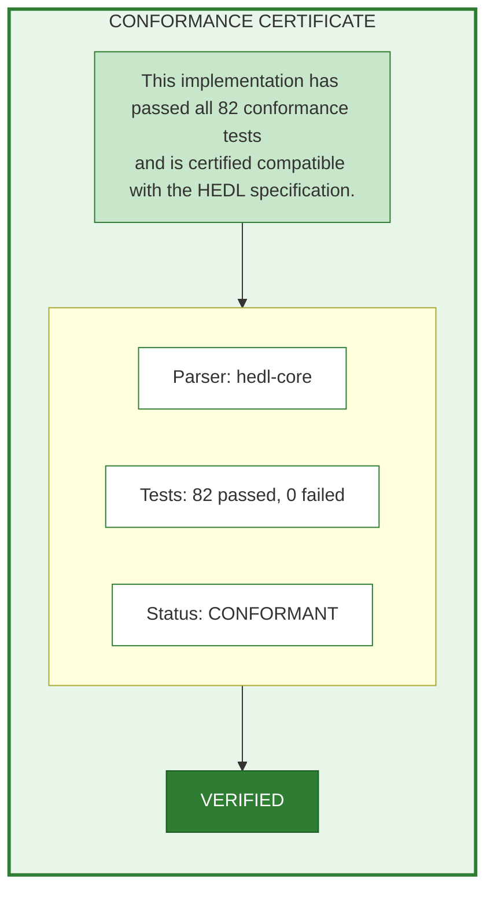

# The Guardian of Truth: HEDL Conformance Testing

Picture this: You've spent weeks building a HEDL parser in your favorite language. It handles basic documents beautifully. Your unit tests pass. You're feeling confident. Then someone feeds it a document from another implementation and everything breaks. Different parsers, different interpretations, chaos.

This is why conformance testing exists. It's not just testing. It's a contract. A promise that every HEDL parser, regardless of who wrote it or what language it's in, will behave identically when given the same input.



---

## Why Conformance Testing Matters

When JSON was young, different parsers interpreted edge cases differently. Some accepted trailing commas. Some didn't. Some allowed comments. Some choked on them. The result? Subtle bugs that only appeared when switching libraries or deploying to different environments.

HEDL learns from this history. The conformance test suite serves as the canonical arbiter of correctness. Every behavior is tested. Every edge case is documented. Every ambiguity is resolved.

### The Four Pillars of Conformance



**Validation Tests** catch malformed input early. They verify that invalid documents produce appropriate errors with helpful messages.

**Correctness Tests** ensure that valid documents parse to the exact data structures the specification requires. No approximations. No "close enough."

**Edge Case Tests** probe the boundaries. Empty documents. Maximum sizes. Strange but legal combinations. The weird inputs that only appear in production.

**Integration Tests** verify that all features work together harmoniously. A complex document using schemas, references, nesting, and tensors should parse just as reliably as a simple key-value pair.

---

## Running the Conformance Suite

The moment of truth. Running conformance tests tells you whether your parser truly speaks HEDL or just a dialect that resembles it.

### The Basic Commands

```bash
# Run the complete conformance suite
cargo test --package hedl-core conformance

# Run a specific category
cargo test --package hedl-core conformance::syntax
cargo test --package hedl-core conformance::schema
cargo test --package hedl-core conformance::data
cargo test --package hedl-core conformance::reference

# Get detailed output showing each test
cargo test --package hedl-core conformance -- --nocapture

# Run a single specific test for debugging
cargo test --package hedl-core test_odd_indentation_error
```

### Understanding the Output

When all tests pass, you'll see something like this:

```
running 82 tests
test conformance_tests::syntax::test_tab_indentation_error ... ok
test conformance_tests::syntax::test_missing_separator_error ... ok
test conformance_tests::schema::test_unknown_type_error ... ok
test conformance_tests::data::test_shape_mismatch_error ... ok
...
test result: ok. 82 passed; 0 failed; 0 ignored
```

That "82 passed" is your certification. Your parser conforms to the HEDL specification.

### Generating a Conformance Report

For formal verification or CI integration:

```bash
# Generate JSON report
cargo test --package hedl-core conformance -- --format json > conformance-report.json

# Quick pass/fail summary
cargo test --package hedl-core conformance 2>&1 | grep -E "test result:"
```

---

## The Test Categories Explained

The conformance suite is organized into seven sections, each targeting a specific aspect of the specification. Let's walk through each one and understand what it's verifying.

### B.1: Syntax Validation (18 Tests)

Syntax tests are the first line of defense. They verify that the lexer correctly identifies tokens and that the structural rules are enforced.



**Tab Indentation Detection**

HEDL uses single-space indentation. Tabs are forbidden because they render differently across editors, causing alignment nightmares:

```rust
/// Tabs are not allowed for indentation
#[test]
fn test_tab_indentation_error() {
    let doc = "%V:2.0\n%NULL:~\n%QUOTE:\"\n---\na:\n\tb: 1\n";  // Tab character
    let result = parse(doc.as_bytes());
    assert!(result.is_err());
    assert!(matches!(result.unwrap_err().kind, HedlErrorKind::Syntax));
}
```

**Missing Separator Detection**

The `---` separator is mandatory. It clearly delineates headers from data:

```rust
/// Missing separator produces syntax error
#[test]
fn test_missing_separator_error() {
    let doc = "%V:2.0\n%NULL:~\n%QUOTE:\"\na: 1\n";  // No ---
    let result = parse(doc.as_bytes());
    assert!(result.is_err());
}
```

**Space After Colon Requirement**

Key-value pairs need breathing room. The space after the colon isn't optional:

```rust
/// Space required after colon in key-value pairs
#[test]
fn test_missing_space_after_colon_error() {
    let doc = "%V:2.0\n%NULL:~\n%QUOTE:\"\n---\na:1\n";  // No space
    let result = parse(doc.as_bytes());
    assert!(result.is_err());
}
```

**Valid ID Format**

IDs can contain letters, numbers, hyphens, and underscores. They can include uppercase letters, making product codes like `SKU-4020` perfectly valid:

```rust
/// IDs may contain uppercase letters
#[test]
fn test_valid_id_uppercase_ok() {
    let doc = r#"%V:2.0
%NULL:~
%QUOTE:"
%S:Product:[id,name]
---
products:@Product
 |SKU-4020,Widget
"#;
    let result = parse(doc.as_bytes());
    assert!(result.is_ok());
}
```

**Control Character Rejection**

Binary noise doesn't belong in structured data. Control characters (except tab within strings) are rejected:

```rust
/// Control characters produce syntax error
#[test]
fn test_control_character_error() {
    let doc = "%V:2.0\n%NULL:~\n%QUOTE:\"\n---\na: test\x01value\n";
    let result = parse(doc.as_bytes());
    assert!(result.is_err());
}
```

---

### B.2: Schema Validation (5 Tests)

Schema tests verify that the type system works correctly. Types must be defined before use, definitions must be consistent, and references to types must resolve.



**Unknown Type Detection**

You can't use a type that doesn't exist:

```rust
/// References to undefined types produce schema error
#[test]
fn test_unknown_type_error() {
    let doc = r#"%V:2.0
%NULL:~
%QUOTE:"
---
data:@UnknownType
 |x1,test
"#;
    let result = parse(doc.as_bytes());
    assert!(result.is_err());
    assert!(matches!(result.unwrap_err().kind, HedlErrorKind::Schema));
}
```

**Schema Consistency**

If you define a schema, your data must match it exactly:

```rust
/// Row must match schema column count
#[test]
fn test_schema_mismatch_error() {
    let doc = r#"%V:2.0
%NULL:~
%QUOTE:"
%S:User:[id,name,email]
---
users:@User
 |u1,Alice
"#;  // Missing email column
    let result = parse(doc.as_bytes());
    assert!(result.is_err());
}
```

**Idempotent Definitions**

Defining the same schema twice with identical columns is allowed. This supports modular document composition:

```rust
/// Identical schema definitions are allowed (idempotent)
#[test]
fn test_duplicate_struct_identical_columns_ok() {
    let doc = r#"%V:2.0
%NULL:~
%QUOTE:"
%S:User:[id,name]
%S:User:[id,name]
---
users:@User
 |u1,Alice
"#;
    let result = parse(doc.as_bytes());
    assert!(result.is_ok());
}
```

**Conflicting Definitions**

But defining the same type with different schemas? That's an error. How would the parser know which one to use?

```rust
/// Conflicting schema definitions produce error
#[test]
fn test_duplicate_struct_different_columns_error() {
    let doc = r#"%V:2.0
%NULL:~
%QUOTE:"
%S:User:[id,name]
%S:User:[id,email]
---
"#;  // Which definition wins?
    let result = parse(doc.as_bytes());
    assert!(result.is_err());
}
```

---

### B.3: Data Validation (12 Tests)

Data tests verify that the actual content of documents is parsed and validated correctly. Field counts must match schemas. IDs must be unique. Nulls must appear only where allowed.



**Shape Mismatch Detection**

Every row must have exactly as many fields as the schema defines:

```rust
/// Row field count must match schema
#[test]
fn test_shape_mismatch_error() {
    let doc = r#"%V:2.0
%NULL:~
%QUOTE:"
%S:User:[id,name,email]
---
users:@User
 |u1,Alice
"#;  // Only 2 fields, schema requires 3
    let result = parse(doc.as_bytes());
    assert!(result.is_err());
    assert!(matches!(result.unwrap_err().kind, HedlErrorKind::Shape));
}
```

**Duplicate ID Detection**

Within a single type, every ID must be unique. Two users can't both be "u1":

```rust
/// Duplicate IDs within same type produce collision error
#[test]
fn test_duplicate_id_collision_error() {
    let doc = r#"%V:2.0
%NULL:~
%QUOTE:"
%S:User:[id,name]
---
users:@User
 |u1,Alice
 |u1,Bob
"#;  // Two u1 IDs
    let result = parse(doc.as_bytes());
    assert!(result.is_err());
    assert!(matches!(result.unwrap_err().kind, HedlErrorKind::Collision));
}
```

**Cross-Type ID Sharing**

But different types can share IDs. A User named "admin" and a Role named "admin" are completely separate entities:

```rust
/// Same ID allowed in different types
#[test]
fn test_different_id_across_types_ok() {
    let doc = r#"%V:2.0
%NULL:~
%QUOTE:"
%S:User:[id,name]
%S:Role:[id,permissions]
---
users:@User
 |admin,Administrator

roles:@Role
 |admin,all
"#;
    let result = parse(doc.as_bytes());
    assert!(result.is_ok());
}
```

**Null ID Rejection**

IDs are how you reference things. A null ID is useless and therefore forbidden:

```rust
/// IDs cannot be null
#[test]
fn test_null_in_id_column_error() {
    let doc = r#"%V:2.0
%NULL:~
%QUOTE:"
%S:User:[id,name]
---
users:@User
 |~,Alice
"#;  // Null ID
    let result = parse(doc.as_bytes());
    assert!(result.is_err());
}
```

---

### B.4: Reference Validation (7 Tests)

Reference tests verify that the `@` reference system works correctly. References must resolve. Qualified references must find the right type. Ambiguous references must be detected.



**Forward References**

You can reference something before it's defined. The parser resolves all references after parsing:

```rust
/// Forward references are allowed
#[test]
fn test_forward_reference_ok() {
    let doc = r#"%V:2.0
%NULL:~
%QUOTE:"
%S:Node:[id,next]
---
nodes:@Node
 |n1,@n2
 |n2,~
"#;  // n1 references n2 before n2 is defined
    let result = parse(doc.as_bytes());
    assert!(result.is_ok());
}
```

**Missing Reference Detection**

But you can't reference something that doesn't exist at all:

```rust
/// References to non-existent IDs produce error
#[test]
fn test_missing_reference_error() {
    let doc = r#"%V:2.0
%NULL:~
%QUOTE:"
%S:Node:[id,next]
---
nodes:@Node
 |n1,@missing
"#;
    let result = parse(doc.as_bytes());
    assert!(result.is_err());
    assert!(matches!(result.unwrap_err().kind, HedlErrorKind::Reference));
}
```

**Self References**

A node can reference itself. This is valid and useful for representing root nodes in trees:

```rust
/// Self-references are allowed
#[test]
fn test_self_reference_ok() {
    let doc = r#"%V:2.0
%NULL:~
%QUOTE:"
%S:Node:[id,parent]
---
nodes:@Node
 |root,@root
"#;  // Root is its own parent
    let result = parse(doc.as_bytes());
    assert!(result.is_ok());
}
```

**Circular References**

Circular references are also valid. Two nodes can reference each other:

```rust
/// Circular references are allowed
#[test]
fn test_circular_reference_ok() {
    let doc = r#"%V:2.0
%NULL:~
%QUOTE:"
%S:Node:[id,partner]
---
nodes:@Node
 |a,@b
 |b,@a
"#;  // a → b → a → ...
    let result = parse(doc.as_bytes());
    assert!(result.is_ok());
}
```

**Qualified References**

When the same ID exists in multiple types, use qualified references to be explicit:

```rust
/// Qualified references resolve to specific type
#[test]
fn test_qualified_reference_ok() {
    let doc = r#"%V:2.0
%NULL:~
%QUOTE:"
%S:User:[id,name]
%S:Post:[id,author]
---
users:@User
 |alice,Alice

posts:@Post
 |p1,@User:alice
"#;  // Explicitly reference User:alice
    let result = parse(doc.as_bytes());
    assert!(result.is_ok());
}
```

**Ambiguous Reference Detection**

In key-value context, if an unqualified reference could match multiple types, that's an error:

```rust
/// Ambiguous unqualified references produce error
#[test]
fn test_ambiguous_unqualified_reference_error() {
    let doc = r#"%V:2.0
%NULL:~
%QUOTE:"
%S:User:[id,name]
%S:Role:[id,level]
---
users:@User
 |admin,Administrator

roles:@Role
 |admin,1

config:
 target: @admin
"#;  // Which admin? User:admin or Role:admin?
    let result = parse(doc.as_bytes());
    assert!(result.is_err());
}
```

---

### B.5: Parsing Correctness (10 Tests)

Parsing correctness tests verify that the parser produces the right data structures. It's not enough to accept valid input; the parsed result must be exactly what the specification requires.

```mermaid
graph LR
    subgraph Input["Input"]
        RAW["|u1,\"Hello, World\",42,true,[1,2,3]"]
    end

    PARSE["Parser"]

    subgraph Result["Parsed Result"]
        direction TB
        ID["id: \"u1\""]
        F1["String(\"Hello, World\")<br/><i>Quotes removed</i>"]
        F2["Integer(42)<br/><i>Typed as number</i>"]
        F3["Boolean(true)<br/><i>Typed as bool</i>"]
        F4["Tensor([1, 2, 3])<br/><i>Parsed as tensor</i>"]
    end

    Input --> PARSE --> Result

    style Input fill:#fff3e0,stroke:#ef6c00,stroke-width:2px
    style Result fill:#e8f5e9,stroke:#2e7d32,stroke-width:2px
    style PARSE fill:#e3f2fd,stroke:#1565c0,stroke-width:2px
```

**Alias Expansion**

Aliases defined in headers must expand to their values in the body:

```rust
/// Aliases expand to their defined values
#[test]
fn test_alias_expansion() {
    let doc = r#"%V:2.0
%NULL:~
%QUOTE:"
%A:active=true
---
config:
 enabled: $active
"#;
    let result = parse(doc.as_bytes()).unwrap();
    let enabled = get_value(&result, "config.enabled");
    assert_eq!(enabled, Value::Boolean(true));
}
```

**Hash in Quoted Strings**

A `#` inside quotes is data, not a comment:

```rust
/// Hash within quotes is data, not comment
#[test]
fn test_hash_in_quoted_field() {
    let doc = r#"%V:2.0
%NULL:~
%QUOTE:"
%S:Channel:[id,name]
---
channels:@Channel
 |c1,"#general"
"#;
    let result = parse(doc.as_bytes()).unwrap();
    let name = get_field(&result, "channels", "c1", "name");
    assert_eq!(name, Value::String("#general".into()));
}
```

**Comment Stripping**

Comments at the end of matrix rows are removed before parsing:

```rust
/// Comments stripped from matrix rows
#[test]
fn test_matrix_row_comment_stripped() {
    let doc = r#"%V:2.0
%NULL:~
%QUOTE:"
%S:User:[id,name]
---
users:@User
 |u1,Alice  # This is a comment
"#;
    let result = parse(doc.as_bytes()).unwrap();
    let name = get_field(&result, "users", "u1", "name");
    assert_eq!(name, Value::String("Alice".into()));  // No comment text
}
```

**Quote Escaping**

Doubled quotes inside strings become single quotes:

```rust
/// Doubled quotes escape to single quote
#[test]
fn test_quoted_string_escaping() {
    let doc = r#"%V:2.0
%NULL:~
%QUOTE:"
---
message: "She said ""hello"""
"#;
    let result = parse(doc.as_bytes()).unwrap();
    let msg = get_value(&result, "message");
    assert_eq!(msg, Value::String("She said \"hello\"".into()));
}
```

**Type Inference**

Numbers are parsed to their appropriate types:

```rust
/// Numbers infer to correct types
#[test]
fn test_number_inference() {
    let doc = r#"%V:2.0
%NULL:~
%QUOTE:"
---
integer: 42
float: 3.14
negative: -17
scientific: 1.5e10
"#;
    let result = parse(doc.as_bytes()).unwrap();
    assert!(matches!(get_value(&result, "integer"), Value::Integer(42)));
    assert!(matches!(get_value(&result, "float"), Value::Float(_)));
}
```

**Tensor Parsing**

Tensor literals are parsed into proper tensor structures:

```rust
/// Tensors parse to tensor values
#[test]
fn test_tensor_literal() {
    let doc = r#"%V:2.0
%NULL:~
%QUOTE:"
---
vector: [1,2,3]
matrix: [[1,2],[3,4]]
"#;
    let result = parse(doc.as_bytes()).unwrap();
    let vector = get_value(&result, "vector");
    assert!(matches!(vector, Value::Tensor(_)));
}
```

---

### B.6: Edge Cases and Boundaries (11 Tests)

Edge case tests probe the unusual corners of the specification. These are the inputs that developers forget to handle, the cases that only appear in production after midnight.



**Empty Documents**

A document with just headers and separator is valid:

```rust
/// Empty body is allowed
#[test]
fn test_empty_document_ok() {
    let doc = "%V:2.0\n%NULL:~\n%QUOTE:\"\n---\n";
    let result = parse(doc.as_bytes());
    assert!(result.is_ok());
}
```

**Empty Matrix Lists**

A matrix with no rows is valid:

```rust
/// Matrix with zero rows is allowed
#[test]
fn test_empty_matrix_list_ok() {
    let doc = r#"%V:2.0
%NULL:~
%QUOTE:"
%S:User:[id,name]
---
users:@User
"#;
    let result = parse(doc.as_bytes());
    assert!(result.is_ok());
}
```

**Boolean Case Sensitivity**

Booleans are lowercase only. `True` and `TRUE` are strings, not booleans:

```rust
/// Booleans are lowercase only
#[test]
fn test_boolean_case_sensitivity() {
    let doc = r#"%V:2.0
%NULL:~
%QUOTE:"
---
valid: true
also_valid: false
string_not_bool: True
"#;
    let result = parse(doc.as_bytes()).unwrap();
    assert!(matches!(get_value(&result, "valid"), Value::Boolean(true)));
    assert!(matches!(get_value(&result, "string_not_bool"), Value::String(_)));
}
```

**Tab in Quoted Strings**

While tabs are forbidden for indentation, they're allowed inside quoted strings:

```rust
/// Tab characters allowed within quoted strings
#[test]
fn test_tab_in_quoted_string_ok() {
    let doc = "%V:2.0\n%NULL:~\n%QUOTE:\"\n---\ntext: \"column1\tcolumn2\"\n";
    let result = parse(doc.as_bytes());
    assert!(result.is_ok());
}
```

**CRLF Line Endings**

Windows-style line endings work correctly:

```rust
/// CRLF line endings are handled
#[test]
fn test_crlf_line_endings_ok() {
    let doc = "%V:2.0\r\n%NULL:~\r\n%QUOTE:\"\r\n---\r\na: 1\r\n";
    let result = parse(doc.as_bytes());
    assert!(result.is_ok());
}
```

**Truncation Detection**

If a document is truncated mid-structure, the parser detects it:

```rust
/// Truncated documents are detected
#[test]
fn test_truncated_object_detected() {
    let doc = "%V:2.0\n%NULL:~\n%QUOTE:\"\n---\nobject:\n child:";  // Missing value
    let result = parse(doc.as_bytes());
    assert!(result.is_err());
}
```

---

### B.7: Full Integration Test (1 Test)

The crown jewel of conformance testing: a single document that exercises every feature. If this test passes, the parser handles the full complexity of HEDL.

```rust
/// Complete integration test using all HEDL features
#[test]
fn test_conformance_document() {
    let doc = r#"%V:2.0
%NULL:~
%QUOTE:"
%A:active=true
%S:TestRow:[id,name,ref,tensor]
%N:TestRow>TestRow
---
tests:@TestRow
 |t1,First,$active,[1,2,3]
  |t1a,Child of First,@t1,[4,5,6]
 |t2,Second,@t1,[[1,2],[3,4]]
  |t2a,Child of Second,@t2,[7,8,9]
 |t3,"Contains ""quotes""",~,[10,11,12]
 |t4,References t3,@t3,[13,14,15]
"#;

    let result = parse(doc.as_bytes()).unwrap();

    // Verify row count
    let tests = get_matrix(&result, "tests");
    assert_eq!(tests.len(), 6);  // 4 parents + 2 children

    // Verify alias expansion
    let t1_ref = get_field(&result, "tests", "t1", "ref");
    assert_eq!(t1_ref, Value::Boolean(true));  // $active expanded

    // Verify references
    let t2_ref = get_field(&result, "tests", "t2", "ref");
    assert!(matches!(t2_ref, Value::Reference(_)));

    // Verify nesting
    let t1a = get_row(&result, "tests", "t1a");
    assert_eq!(t1a.parent_id(), Some("t1"));

    // Verify tensor
    let t1_tensor = get_field(&result, "tests", "t1", "tensor");
    assert!(matches!(t1_tensor, Value::Tensor(_)));

    // Verify escaped quotes
    let t3_name = get_field(&result, "tests", "t3", "name");
    assert_eq!(t3_name, Value::String("Contains \"quotes\"".into()));
}
```

---

## Test Organization

The conformance tests live in a single, well-organized file that mirrors the specification structure.

```
crates/hedl-core/tests/
└── conformance_tests.rs
    │
    ├── mod syntax {           // B.1: 18 tests
    │   ├── test_tab_indentation_error
    │   ├── test_missing_separator_error
    │   ├── test_missing_space_after_colon_error
    │   └── ...
    │
    ├── mod schema {           // B.2: 5 tests
    │   ├── test_unknown_type_error
    │   ├── test_schema_mismatch_error
    │   └── ...
    │
    ├── mod data {             // B.3: 12 tests
    │   ├── test_shape_mismatch_error
    │   ├── test_duplicate_id_collision_error
    │   └── ...
    │
    ├── mod reference {        // B.4: 7 tests
    │   ├── test_forward_reference_ok
    │   ├── test_missing_reference_error
    │   └── ...
    │
    ├── mod parsing {          // B.5: 10 tests
    │   ├── test_alias_expansion
    │   ├── test_tensor_literal
    │   └── ...
    │
    ├── mod edge_cases {       // B.6: 11 tests
    │   ├── test_empty_document_ok
    │   ├── test_truncation_detection
    │   └── ...
    │
    └── mod integration {      // B.7: 1 test
        └── test_conformance_document
```

Each test is named descriptively and includes a documentation comment referencing the specification section it validates.

---

## Writing New Conformance Tests

When the specification evolves or a new edge case is discovered, new conformance tests ensure the behavior is locked in.

### The Anatomy of a Conformance Test

```rust
/// B.X.Y: Brief description (SPEC section reference)
///
/// Requirement: What the spec says
/// Input: What we're testing
/// Expected: What should happen
#[test]
fn test_descriptive_name() {
    // 1. Create minimal input that demonstrates the behavior
    let doc = r#"%V:2.0
%NULL:~
%QUOTE:"
---
minimal: input
"#;

    // 2. Parse the input
    let result = parse(doc.as_bytes());

    // 3. Verify the expected outcome
    // For success cases:
    assert!(result.is_ok());
    let parsed = result.unwrap();
    // Verify specific values...

    // For failure cases:
    assert!(result.is_err());
    let err = result.unwrap_err();
    assert!(matches!(err.kind, HedlErrorKind::Expected));
}
```

### Guidelines for New Tests

**Minimal Input**: Use the smallest document that demonstrates the behavior. Extra content obscures what's being tested.

**Clear Names**: Test names should describe what's being tested and the expected outcome. `test_tab_indentation_error` is better than `test_case_17`.

**Specification Reference**: Always document which specification section the test validates. This creates traceability.

**Both Paths**: For any rule, test both the success case (valid input accepted) and the failure case (invalid input rejected).

**Isolation**: Each test should verify one thing. Don't combine multiple behaviors in a single test.

---

## CI Integration

Conformance tests run on every commit, every pull request, every release. They're the automated guardians of specification compliance.

### GitHub Actions Configuration

```yaml
name: HEDL Conformance

on:
  push:
    branches: [main, master]
  pull_request:
    branches: [main, master]

jobs:
  conformance:
    name: Specification Conformance
    runs-on: ubuntu-latest

    steps:
      - name: Checkout
        uses: actions/checkout@v4

      - name: Install Rust
        uses: dtolnay/rust-toolchain@stable

      - name: Run Conformance Tests
        run: |
          cargo test --package hedl-core conformance \
            --no-fail-fast \
            -- --test-threads=1

      - name: Generate Report
        if: always()
        run: |
          cargo test --package hedl-core conformance \
            -- --format json 2>/dev/null \
            > conformance-report.json || true

      - name: Upload Report
        if: always()
        uses: actions/upload-artifact@v4
        with:
          name: conformance-report
          path: conformance-report.json
          retention-days: 30
```

### Status Badge

Add a conformance badge to your README:

```markdown

```

---

## Third-Party Implementation Certification

If you've built a HEDL parser in another language, running the conformance suite validates your implementation.

### Certification Process

```mermaid
flowchart TD
    subgraph Certification["CERTIFICATION WORKFLOW"]
        S1["1. Implement Parser"]
        D1["Follow SPEC.md exactly"]

        S2["2. Port Test Cases"]
        D2["Translate conformance_tests.rs<br/>to your language"]

        S3["3. Run Tests"]
        D3["Execute all 82<br/>conformance tests"]

        S4["4. Document Results"]
        D4["Generate JSON report<br/>with pass/fail status"]

        S5["5. Submit for Review"]
        D5["Open issue with implementation<br/>details and results"]

        S1 --> D1 --> S2 --> D2 --> S3 --> D3 --> S4 --> D4 --> S5 --> D5
    end

    style S1 fill:#e3f2fd,stroke:#1565c0
    style S2 fill:#e3f2fd,stroke:#1565c0
    style S3 fill:#e3f2fd,stroke:#1565c0
    style S4 fill:#e3f2fd,stroke:#1565c0
    style S5 fill:#e3f2fd,stroke:#1565c0
    style D1 fill:#f5f5f5,stroke:#757575
    style D2 fill:#f5f5f5,stroke:#757575
    style D3 fill:#f5f5f5,stroke:#757575
    style D4 fill:#f5f5f5,stroke:#757575
    style D5 fill:#f5f5f5,stroke:#757575
```



### Conformance Report Format

```json
{
  "implementation": {
    "name": "hedl-py",
    "version": "1.0.0",
    "language": "Python",
    "repository": "https://github.com/example/hedl-py"
  },
  "spec_version": "2.0",
  "test_date": "2024-01-15",
  "results": {
    "total": 82,
    "passed": 82,
    "failed": 0,
    "skipped": 0
  },
  "categories": {
    "syntax": {"passed": 18, "failed": 0},
    "schema": {"passed": 5, "failed": 0},
    "data": {"passed": 12, "failed": 0},
    "reference": {"passed": 7, "failed": 0},
    "parsing": {"passed": 10, "failed": 0},
    "edge_cases": {"passed": 11, "failed": 0},
    "integration": {"passed": 1, "failed": 0}
  },
  "known_limitations": []
}
```

---

## Troubleshooting Failed Tests

When a conformance test fails, don't panic. The fix is usually straightforward once you understand what's being tested.

### Debugging Workflow

```mermaid
flowchart TD
    subgraph Debug["DEBUGGING FAILED TESTS"]
        S1["1. Read the Error"]
        D1["What error kind?<br/>What message?"]

        S2["2. Check the SPEC"]
        D2["What does the<br/>specification say?"]

        S3["3. Create Minimal Reproduction"]
        D3["Smallest input that<br/>shows the bug"]

        S4["4. Add Logging"]
        D4["Trace through parser<br/>with debug output"]

        S5["5. Fix and Verify"]
        D5["Fix bug, run full suite,<br/>ensure no regressions"]

        S1 --> D1 --> S2 --> D2 --> S3 --> D3 --> S4 --> D4 --> S5 --> D5
    end

    style S1 fill:#ffebee,stroke:#c62828
    style S2 fill:#fff3e0,stroke:#ef6c00
    style S3 fill:#e3f2fd,stroke:#1565c0
    style S4 fill:#e8f5e9,stroke:#2e7d32
    style S5 fill:#e8f5e9,stroke:#2e7d32
    style D1 fill:#f5f5f5,stroke:#757575
    style D2 fill:#f5f5f5,stroke:#757575
    style D3 fill:#f5f5f5,stroke:#757575
    style D4 fill:#f5f5f5,stroke:#757575
    style D5 fill:#f5f5f5,stroke:#757575
```



### Common Issues

**Wrong Error Kind**: The test expects `SyntaxError` but you're returning `ParseError`. Check the specification for the correct error category.

**Off-By-One**: Common in indentation handling. Remember that HEDL uses 1 space per nesting level, and the first body line has zero indentation.

**Unicode Handling**: String comparisons fail because of normalization. HEDL doesn't normalize Unicode; compare bytes, not code points.

**Reference Timing**: References must resolve after the entire document is parsed, not during. Forward references require two-pass resolution.

---

## The Promise of Conformance

When all 82 tests pass, you know something powerful: your parser speaks HEDL the same way every other conformant parser does. Documents created by your implementation will parse identically by any other. Data flows seamlessly between systems, languages, and teams.

That's not just testing. That's interoperability. That's trust.



---

## Next Steps

Now that you understand conformance testing, you might want to:

1. **Run the tests yourself**: `cargo test --package hedl-core conformance`
2. **Read the specification**: Understand the rules these tests verify
3. **Explore the test code**: See how tests are structured
4. **Add missing tests**: If you find an untested edge case, contribute it

The conformance suite grows with the specification. Every new feature, every clarified edge case, every discovered ambiguity becomes a new test. The suite is never complete, only ever more comprehensive.

That's how we maintain the contract. That's how we keep the promise.
