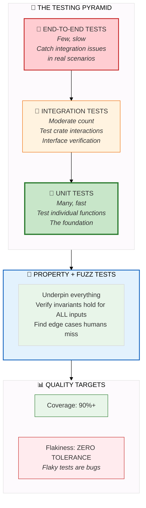

# Testing Guide

Every bug you catch in tests is a bug users never see.

Think about that. The test you write today might prevent a production incident tomorrow. The edge case you cover might save someone hours of debugging. The property test you add might catch a regression before it ships.

HEDL has 10,000+ tests. Not because we love writing tests (though some of us do), but because parsers have infinite edge cases. Unicode characters. Deeply nested structures. Malformed input. Race conditions. Memory limits. Every dark corner where bugs hide.

This guide shows you how to write tests that catch bugs before they bite.

---

## The Testing Philosophy

Before diving into commands and code, let's talk about why we test the way we do.

### Tests are Documentation

The best way to understand how a function works is to read its tests. Tests show:

- What inputs are valid
- What outputs to expect
- What errors can occur
- What edge cases matter

When comments lie, tests tell the truth.

### Tests are Safety Nets

When you refactor code, tests tell you immediately if you broke something. No manual testing. No "it worked on my machine." Just run `cargo test` and know.

### Tests are Design Tools

Writing tests first (TDD) forces you to think about the API before implementing it. What does the function take? What does it return? How do errors propagate? Tests answer these questions before you write a line of implementation.

---

## The Testing Pyramid

Not all tests are equal. Different test types serve different purposes.



### Unit Tests: The Foundation

- Test individual functions in isolation
- Fast to run (milliseconds)
- Easy to write and debug
- Located in `src/` files via `#[cfg(test)]` or in `tests/` directories

### Integration Tests: The Connections

- Test how modules work together
- Moderate speed (seconds)
- Catch interface mismatches
- Located in `tests/` directories

### Property Tests: The Invariants

- Generate random inputs
- Verify properties hold for all inputs
- Find edge cases humans miss
- Use `proptest` or `quickcheck` crates

### Fuzz Tests: The Chaos

- Throw arbitrary bytes at code
- Find security issues and crashes
- Run for extended periods
- Use `cargo-fuzz` with `libfuzzer`

### End-to-End Tests: The Reality

- Test complete workflows
- Exercise the CLI and full stack
- Slowest but most realistic
- Located in workspace-level `tests/`

---

## Running Tests

Here's your complete guide to running tests.

### The Basics

```bash
# Run all tests
cargo test --all-features

# Run tests for a specific crate
cargo test -p hedl-core

# Run a specific test by name
cargo test test_parse_simple_document

# Run tests matching a pattern
cargo test parse

# See test output (normally hidden on success)
cargo test -- --nocapture

# Run with backtrace on failure
RUST_BACKTRACE=1 cargo test
```

### Filtering Tests

```bash
# Only unit tests (in src/ files)
cargo test --lib

# Only integration tests (in tests/ directories)
cargo test --test '*'

# Only documentation tests
cargo test --doc

# Run ignored (slow) tests
cargo test -- --ignored

# Run everything including ignored
cargo test -- --include-ignored
```

### Controlling Parallelism

```bash
# Run tests single-threaded (useful for debugging)
cargo test -- --test-threads=1

# Run with specific thread count
cargo test -- --test-threads=4
```

### Measuring Coverage

```bash
# Install tarpaulin
cargo install cargo-tarpaulin

# Generate coverage report
cargo tarpaulin --all --out Html

# Open the report
open tarpaulin-report.html

# Coverage with specific targets
cargo tarpaulin -p hedl-core --out Html
```

### Continuous Testing

For rapid feedback during development:

```bash
# Install cargo-watch
cargo install cargo-watch

# Auto-run tests on file changes
cargo watch -x test

# Clear screen between runs
cargo watch -c -x test

# Run specific tests on change
cargo watch -x 'test -p hedl-core'
```

---

## Writing Unit Tests

Unit tests verify that individual functions work correctly.

### The Structure

```rust
#[cfg(test)]
mod tests {
    use super::*;

    #[test]
    fn test_function_does_expected_thing() {
        // Arrange: Set up test data
        let input = "test data";

        // Act: Call the function under test
        let result = function_under_test(input);

        // Assert: Verify the result
        assert_eq!(result, expected_value);
    }
}
```

### Testing Success Cases

```rust
#[cfg(test)]
mod tests {
    use super::*;

    #[test]
    fn test_is_valid_key_token_accepts_valid_keys() {
        // Simple keys
        assert!(is_valid_key_token("name"));
        assert!(is_valid_key_token("user_id"));
        assert!(is_valid_key_token("_private"));
        assert!(is_valid_key_token("count2"));

        // Edge cases that should still be valid
        assert!(is_valid_key_token("a"));  // Single character
        assert!(is_valid_key_token("_"));  // Just underscore
    }

    #[test]
    fn test_is_valid_key_token_rejects_invalid_keys() {
        // Empty
        assert!(!is_valid_key_token(""));

        // Starts with number
        assert!(!is_valid_key_token("123"));
        assert!(!is_valid_key_token("2fast"));

        // Contains invalid characters
        assert!(!is_valid_key_token("with-dash"));
        assert!(!is_valid_key_token("with space"));
        assert!(!is_valid_key_token("with.dot"));

        // Uppercase (keys must be lowercase)
        assert!(!is_valid_key_token("UserName"));
        assert!(!is_valid_key_token("NAME"));
    }
}
```

### Testing Error Cases

```rust
#[test]
fn test_parse_reference_returns_error_for_invalid_input() {
    // Missing @ prefix
    let result = parse_reference("alice");
    assert!(result.is_err());

    // Empty after @
    let result = parse_reference("@");
    assert!(result.is_err());

    // Invalid characters
    let result = parse_reference("@user name");
    assert!(result.is_err());
}

#[test]
fn test_parse_reference_error_type() {
    let result = parse_reference("invalid");

    match result {
        Err(LexError::InvalidReference { .. }) => {
            // This is the expected error type
        }
        Err(other) => {
            panic!("Expected InvalidReference, got {:?}", other);
        }
        Ok(_) => {
            panic!("Expected error, got success");
        }
    }
}
```

### Parameterized Tests

When you have many similar test cases, parameterize them:

```rust
#[test]
fn test_value_inference_for_all_types() {
    let test_cases = vec![
        // (input, expected output)
        ("42", Value::Int(42)),
        ("-17", Value::Int(-17)),
        ("0", Value::Int(0)),
        ("3.14", Value::Float(3.14)),
        ("1e-10", Value::Float(1e-10)),
        ("true", Value::Bool(true)),
        ("false", Value::Bool(false)),
        ("~", Value::Null),
        ("hello", Value::String("hello".into())),
        ("hello world", Value::String("hello world".into())),
    ];

    for (input, expected) in test_cases {
        let result = infer_value(input);
        assert_eq!(
            result, expected,
            "Failed for input: {:?}",
            input
        );
    }
}
```

Or use the `rstest` crate for more ergonomic parameterization:

```rust
use rstest::rstest;

#[rstest]
#[case("42", Value::Int(42))]
#[case("3.14", Value::Float(3.14))]
#[case("true", Value::Bool(true))]
#[case("~", Value::Null)]
#[case("hello", Value::String("hello".into()))]
fn test_infer_value(#[case] input: &str, #[case] expected: Value) {
    assert_eq!(infer_value(input), expected);
}
```

### Test Fixtures

Create reusable test data:

```rust
// In tests/common/mod.rs or as helper functions

/// Creates a minimal valid document for testing
fn minimal_document() -> Document {
    Document {
        version: (1, 3),
        aliases: BTreeMap::new(),
        structs: BTreeMap::new(),
        nests: BTreeMap::new(),
        root: BTreeMap::new(),
    }
}

/// Creates a document with sample user data
fn sample_users_document() -> Document {
    let mut structs = BTreeMap::new();
    structs.insert(
        "User".to_string(),
        vec!["id".to_string(), "name".to_string(), "email".to_string()],
    );

    let mut root = BTreeMap::new();
    // ... add sample data ...

    Document {
        version: (1, 3),
        aliases: BTreeMap::new(),
        structs,
        nests: BTreeMap::new(),
        root,
    }
}

#[test]
fn test_with_fixture() {
    let doc = sample_users_document();
    // ... test using the fixture ...
}
```

---

## Writing Integration Tests

Integration tests verify that modules work together correctly.

### Cross-Module Testing

```rust
// tests/integration_tests.rs
use hedl_core::parse;
use hedl_json::hedl_to_json;

#[test]
fn test_parse_and_convert_to_json() {
    let input = br#"
%V:2.0
%NULL:~
%QUOTE:"
%S:User:[id,name,email]
---
users:@User
 |u1,Alice,alice@example.com
 |u2,Bob,bob@example.com
"#;

    // Parse the HEDL document
    let doc = parse(input).expect("Failed to parse HEDL");

    // Convert to JSON
    let json = hedl_to_json(&doc).expect("Failed to convert to JSON");

    // Parse the JSON to verify structure
    let json_value: serde_json::Value = serde_json::from_str(&json)
        .expect("Failed to parse JSON output");

    // Verify the data
    let users = json_value["users"].as_array().expect("users should be array");
    assert_eq!(users.len(), 2);
    assert_eq!(users[0]["name"], "Alice");
    assert_eq!(users[1]["name"], "Bob");
}
```

### Roundtrip Testing

Roundtrip tests verify that data survives conversion to another format and back:

```rust
use hedl_core::parse;
use hedl_json::{hedl_to_json, json_to_hedl};
use hedl_c14n::canonicalize;

#[test]
fn test_json_roundtrip_preserves_data() {
    let original_hedl = br#"
%V:2.0
%NULL:~
%QUOTE:"
%S:Product:[sku,name,price]
---
products:@Product
 |SKU-001,Widget,9.99
 |SKU-002,Gadget,19.99
"#;

    // Parse original
    let doc1 = parse(original_hedl).expect("Failed to parse original");

    // Convert to JSON
    let json = hedl_to_json(&doc1).expect("Failed to convert to JSON");

    // Convert back to HEDL document
    let doc2 = json_to_hedl(&json).expect("Failed to convert from JSON");

    // Canonicalize both documents
    let hedl1 = canonicalize(&doc1).expect("Failed to canonicalize doc1");
    let hedl2 = canonicalize(&doc2).expect("Failed to canonicalize doc2");

    // They should be identical
    assert_eq!(hedl1, hedl2, "Roundtrip changed the document");
}
```

### Error Propagation Testing

```rust
use hedl_core::{parse, HedlErrorKind};

#[test]
fn test_error_contains_useful_information() {
    let input = br#"
%V:2.0
%NULL:~
%QUOTE:"
---
manager:@User:nonexistent
"#;

    let result = parse(input);
    assert!(result.is_err(), "Expected parse to fail");

    let err = result.unwrap_err();

    // Error should indicate it's a reference error
    assert_eq!(err.kind, HedlErrorKind::Reference);

    // Error message should mention what went wrong
    let message = err.to_string();
    assert!(
        message.contains("nonexistent") || message.contains("not found"),
        "Error should mention the missing reference: {}",
        message
    );

    // Error should include location
    assert!(err.line > 0, "Error should include line number");
}
```

---

## Property-Based Testing

Property tests generate random inputs and verify that properties (invariants) hold for all of them.

### Why Property Tests

Manual tests check specific cases. Property tests check thousands of random cases, finding edge cases you'd never think of.

```rust
use proptest::prelude::*;

proptest! {
    // This test runs 256 times with random strings
    #[test]
    fn test_parsing_never_panics(input in ".*") {
        // No matter what garbage we feed it, parse() should not panic
        // It might return an error, but it should not crash
        let _ = hedl_core::parse(input.as_bytes());
    }
}
```

### Common Properties

**1. Roundtrip Property**: Converting and converting back gives the same result

```rust
proptest! {
    #[test]
    fn test_canonicalize_is_stable(doc in arb_valid_document()) {
        let hedl1 = canonicalize(&doc).expect("First canonicalize failed");
        let parsed = parse(hedl1.as_bytes()).expect("Parse failed");
        let hedl2 = canonicalize(&parsed).expect("Second canonicalize failed");

        // Canonical form should be stable
        prop_assert_eq!(hedl1, hedl2);
    }
}
```

**2. Never Panic Property**: Functions should return errors, not crash

```rust
proptest! {
    #[test]
    fn test_lexer_never_panics(input in ".*") {
        // Lexer should handle any input without panicking
        let _ = lex(input);
    }
}
```

**3. Determinism Property**: Same input always gives same output

```rust
proptest! {
    #[test]
    fn test_parsing_is_deterministic(input in arb_valid_hedl()) {
        let result1 = parse(input.as_bytes());
        let result2 = parse(input.as_bytes());

        // Results should be identical
        prop_assert_eq!(result1.is_ok(), result2.is_ok());

        if let (Ok(doc1), Ok(doc2)) = (result1, result2) {
            let hedl1 = canonicalize(&doc1).unwrap();
            let hedl2 = canonicalize(&doc2).unwrap();
            prop_assert_eq!(hedl1, hedl2);
        }
    }
}
```

### Custom Generators

Build generators for valid HEDL documents:

```rust
use proptest::prelude::*;

// Generate valid key names
fn arb_key() -> impl Strategy<Value = String> {
    "[a-z_][a-z0-9_]{0,30}"
}

// Generate valid type names
fn arb_type_name() -> impl Strategy<Value = String> {
    "[A-Z][a-zA-Z0-9]{0,30}"
}

// Generate simple scalar values
fn arb_scalar_value() -> impl Strategy<Value = Value> {
    prop_oneof![
        Just(Value::Null),
        any::<bool>().prop_map(Value::Bool),
        any::<i64>().prop_map(Value::Int),
        // Avoid NaN/Inf which have special serialization
        (-1e10..1e10).prop_map(Value::Float),
        "[a-zA-Z0-9 ]{0,100}".prop_map(|s| Value::String(s.into())),
    ]
}

// Generate valid documents
fn arb_valid_document() -> impl Strategy<Value = Document> {
    // Build a document with random but valid content
    prop::collection::btree_map(arb_key(), arb_scalar_value().prop_map(Item::Scalar), 0..10)
        .prop_map(|root| Document {
            version: (1, 3),
            aliases: BTreeMap::new(),
            structs: BTreeMap::new(),
            nests: BTreeMap::new(),
            root,
        })
}
```

---

## Fuzz Testing

Fuzz testing throws arbitrary bytes at your code to find crashes and security issues.

### Setting Up

```bash
# Install cargo-fuzz
cargo install cargo-fuzz

# Initialize fuzz directory (first time)
cargo fuzz init

# List available targets
cargo fuzz list
```

### Writing a Fuzz Target

```rust
// fuzz/fuzz_targets/fuzz_parse.rs
#![no_main]

use libfuzzer_sys::fuzz_target;
use hedl_core::parse;

fuzz_target!(|data: &[u8]| {
    // Feed arbitrary bytes to the parser
    // It should never panic, even on garbage input
    let _ = parse(data);
});
```

### Running the Fuzzer

```bash
# Run the parser fuzzer
cargo fuzz run fuzz_parse

# Run with timeout (stop after 60 seconds)
cargo fuzz run fuzz_parse -- -max_total_time=60

# Run with memory limit
cargo fuzz run fuzz_parse -- -rss_limit_mb=2048

# Run with multiple jobs in parallel
cargo fuzz run fuzz_parse -- -jobs=4
```

### Structured Fuzzing

Generate structured random input instead of pure bytes:

```rust
// fuzz/fuzz_targets/fuzz_structured.rs
#![no_main]

use libfuzzer_sys::fuzz_target;
use arbitrary::Arbitrary;

#[derive(Arbitrary, Debug)]
struct FuzzInput {
    keys: Vec<String>,
    values: Vec<String>,
    depth: u8,
}

fuzz_target!(|input: FuzzInput| {
    let hedl = generate_hedl_from_input(&input);
    let _ = hedl_core::parse(hedl.as_bytes());
});

fn generate_hedl_from_input(input: &FuzzInput) -> String {
    let mut hedl = String::from("%V:2.0\n%NULL:~\n%QUOTE:\"\n---\n");

    for (key, value) in input.keys.iter().zip(input.values.iter()) {
        // Sanitize to create valid-ish HEDL
        let key = key.chars()
            .filter(|c| c.is_ascii_lowercase() || *c == '_')
            .take(20)
            .collect::<String>();

        if !key.is_empty() {
            hedl.push_str(&format!("{}: {}\n", key, value));
        }
    }

    hedl
}
```

### Regression Testing

The fuzzer saves inputs that cause crashes. Use them as regression tests:

```rust
#[test]
fn test_fuzz_regressions() {
    // Read all crash inputs from the corpus
    let corpus_dir = "fuzz/corpus/fuzz_parse";

    if let Ok(entries) = std::fs::read_dir(corpus_dir) {
        for entry in entries.flatten() {
            let data = std::fs::read(entry.path()).unwrap();

            // This should not panic (anymore, after fixing)
            let _ = hedl_core::parse(&data);
        }
    }
}
```

---

## Conformance Testing

Conformance tests verify that the implementation matches the HEDL specification.

### Specification Tests

Each section of SPEC.md has corresponding tests:

```rust
// B.1: Indentation Rules

/// B.1.1: Only single spaces for indentation
#[test]
fn test_odd_indentation_is_error() {
    // Three spaces instead of one or two
    let input = b"%V:2.0\n%NULL:~\n%QUOTE:\"\n---\na:\n   b: 1\n";

    let result = parse(input);
    assert!(result.is_err(), "Odd indentation should be rejected");

    let err = result.unwrap_err();
    assert_eq!(err.kind, HedlErrorKind::Syntax);
}

/// B.1.2: Tabs are not allowed for indentation
#[test]
fn test_tab_indentation_is_error() {
    let input = b"%V:2.0\n%NULL:~\n%QUOTE:\"\n---\na:\n\tb: 1\n";

    let result = parse(input);
    assert!(result.is_err(), "Tab indentation should be rejected");
}

/// B.1.3: Mixed spaces and tabs are not allowed
#[test]
fn test_mixed_indentation_is_error() {
    let input = b"%V:2.0\n%NULL:~\n%QUOTE:\"\n---\na:\n \tb: 1\n";

    let result = parse(input);
    assert!(result.is_err(), "Mixed indentation should be rejected");
}
```

### Unicode Conformance

```rust
/// Unicode identifiers should work
#[test]
fn test_unicode_in_string_values() {
    let input = "%V:2.0\n%NULL:~\n%QUOTE:\"\n---\ngreeting: こんにちは\n".as_bytes();

    let result = parse(input);
    assert!(result.is_ok(), "Unicode strings should be allowed");

    let doc = result.unwrap();
    if let Some(Item::Scalar(Value::String(s))) = doc.root.get("greeting") {
        assert_eq!(s.as_ref(), "こんにちは");
    } else {
        panic!("Expected string value");
    }
}

/// Emoji in strings
#[test]
fn test_emoji_in_string_values() {
    let input = "%V:2.0\n%NULL:~\n%QUOTE:\"\n---\nmood: 😀👍🎉\n".as_bytes();

    let result = parse(input);
    assert!(result.is_ok(), "Emoji should be allowed in strings");
}
```

---

## Error Path Testing

Every error condition needs a test. This ensures error handling works and error messages are helpful.

### Testing All Error Types

```rust
use hedl_core::{parse, HedlErrorKind};

#[test]
fn test_all_error_kinds_are_reachable() {
    let error_cases: Vec<(&[u8], HedlErrorKind, &str)> = vec![
        // Syntax errors
        (b"not valid hedl at all", HedlErrorKind::Syntax, "garbage input"),

        // Missing required directives
        (b"---\nname: Alice\n", HedlErrorKind::Version, "missing version"),

        // Invalid reference
        (b"%V:2.0\n%NULL:~\n%QUOTE:\"\n---\nref:@missing\n", HedlErrorKind::Reference, "unresolved reference"),

        // Column count mismatch
        (b"%V:2.0\n%NULL:~\n%QUOTE:\"\n%S:User:[id,name]\n---\nusers:@User\n |a,b,c\n", HedlErrorKind::Shape, "too many columns"),

        // Duplicate ID
        (b"%V:2.0\n%NULL:~\n%QUOTE:\"\n%S:User:[id]\n---\nusers:@User\n |dup\n |dup\n", HedlErrorKind::Collision, "duplicate id"),
    ];

    for (input, expected_kind, description) in error_cases {
        let result = parse(input);

        assert!(
            result.is_err(),
            "Expected error for: {}",
            description
        );

        let err = result.unwrap_err();
        assert_eq!(
            err.kind, expected_kind,
            "Wrong error kind for {}. Expected {:?}, got {:?}",
            description, expected_kind, err.kind
        );
    }
}
```

### Testing Error Messages

```rust
#[test]
fn test_error_messages_are_helpful() {
    let input = b"%V:2.0\n%NULL:~\n%QUOTE:\"\n%S:User:[id,name]\n---\nusers:@User\n |u1,Alice,extra\n";

    let result = parse(input);
    let err = result.unwrap_err();
    let message = err.to_string();

    // Error should mention column count
    assert!(
        message.contains("column") || message.contains("field"),
        "Error should mention column/field count issue: {}",
        message
    );

    // Error should mention expected vs actual
    assert!(
        message.contains("2") && message.contains("3"),
        "Error should mention expected (2) and actual (3) counts: {}",
        message
    );
}
```

### Testing Resource Limits

```rust
use hedl_core::{parse_with_options, ParseOptions, Limits};

#[test]
fn test_max_depth_limit_is_enforced() {
    // Build deeply nested input
    let mut input = String::from("%V:2.0\n%NULL:~\n%QUOTE:\"\n---\n");
    for i in 0..150 {
        input.push_str(&format!("{}level{}:\n", " ".repeat(i), i));
    }
    input.push_str(&format!("{}value: deep\n", " ".repeat(150)));

    let options = ParseOptions {
        limits: Limits {
            max_depth: 100,
            ..Default::default()
        },
        ..Default::default()
    };

    let result = parse_with_options(input.as_bytes(), &options);

    assert!(result.is_err(), "Should reject document exceeding max depth");
    assert_eq!(result.unwrap_err().kind, HedlErrorKind::Security);
}

#[test]
fn test_max_entities_limit_is_enforced() {
    // Build input with too many entities
    let mut input = String::from("%V:2.0\n%NULL:~\n%QUOTE:\"\n%S:Item:[id]\n---\nitems:@Item\n");
    for i in 0..1001 {
        input.push_str(&format!(" |item{}\n", i));
    }

    let options = ParseOptions {
        limits: Limits {
            max_entities: 1000,
            ..Default::default()
        },
        ..Default::default()
    };

    let result = parse_with_options(input.as_bytes(), &options);

    assert!(result.is_err(), "Should reject document exceeding max entities");
}
```

---

## Test Utilities

The `hedl-test` crate provides utilities for writing tests.

### Pre-Built Fixtures

```rust
use hedl_test::fixtures;

#[test]
fn test_with_scalar_fixtures() {
    // Document with all scalar types
    let doc = fixtures::scalars();

    assert!(doc.root.contains_key("integer"));
    assert!(doc.root.contains_key("float"));
    assert!(doc.root.contains_key("boolean"));
    assert!(doc.root.contains_key("string"));
    assert!(doc.root.contains_key("null_value"));
}

#[test]
fn test_with_user_list_fixture() {
    // Document with a User matrix list
    let doc = fixtures::user_list();

    let users = doc.root.get("users").expect("users key should exist");
    // ... test with the fixture ...
}

#[test]
fn test_with_comprehensive_fixture() {
    // Document with all features
    let doc = fixtures::comprehensive();

    // Use for integration testing
    // ... test conversions, validation, etc. ...
}
```

### Counting Utilities

```rust
use hedl_test::{count_nodes, count_references};

#[test]
fn test_node_counting() {
    let doc = fixtures::user_list();

    let node_count = count_nodes(&doc);
    assert_eq!(node_count, 3, "user_list fixture should have 3 users");
}

#[test]
fn test_reference_counting() {
    let doc = fixtures::with_references();

    let ref_count = count_references(&doc);
    assert!(ref_count > 0, "with_references fixture should have references");
}
```

### Iterating All Fixtures

```rust
use hedl_test::fixtures;

#[test]
fn test_all_fixtures_are_valid() {
    for (name, fixture_fn) in fixtures::all() {
        let doc = fixture_fn();

        // Every fixture should produce a valid document
        // that can be canonicalized
        let result = hedl_c14n::canonicalize(&doc);

        assert!(
            result.is_ok(),
            "Fixture '{}' should produce valid document: {:?}",
            name,
            result.err()
        );
    }
}
```

---

## Best Practices

### Test Naming

Name tests to describe what they verify:

```rust
// Good: Describes the behavior
#[test]
fn test_parse_rejects_document_with_missing_version_directive() { }

#[test]
fn test_reference_resolution_finds_entity_in_different_matrix_list() { }

// Bad: Vague or generic
#[test]
fn test1() { }

#[test]
fn test_parse() { }
```

### Test Organization

Group related tests with modules:

```rust
#[cfg(test)]
mod tests {
    use super::*;

    mod parsing {
        use super::*;

        mod headers {
            use super::*;

            #[test]
            fn test_version_directive() { }

            #[test]
            fn test_schema_directive() { }
        }

        mod body {
            use super::*;

            #[test]
            fn test_key_value_pairs() { }

            #[test]
            fn test_matrix_lists() { }
        }
    }

    mod validation {
        use super::*;

        #[test]
        fn test_schema_column_count() { }

        #[test]
        fn test_reference_resolution() { }
    }
}
```

### Test Documentation

Document complex tests:

```rust
/// Tests that circular references are detected and reported.
///
/// This test creates a document where:
/// - User A references User B
/// - User B references User C
/// - User C references User A (creating a cycle)
///
/// The parser should detect this cycle and return a Reference error
/// with a helpful message indicating the cycle path.
#[test]
fn test_circular_reference_detection() {
    let input = br#"
%V:2.0
%NULL:~
%QUOTE:"
%S:User:[id,manager]
---
users:@User
 |alice,@bob
 |bob,@charlie
 |charlie,@alice
"#;

    let result = parse(input);
    assert!(result.is_err());

    let err = result.unwrap_err();
    assert_eq!(err.kind, HedlErrorKind::Reference);

    let message = err.to_string();
    assert!(
        message.contains("circular") || message.contains("cycle"),
        "Error should mention circular reference"
    );
}
```

### The AAA Pattern

Structure tests with Arrange, Act, Assert:

```rust
#[test]
fn test_json_conversion_preserves_integers() {
    // Arrange: Set up test data
    let input = br#"
%V:2.0
%NULL:~
%QUOTE:"
---
count: 42
negative: -17
zero: 0
"#;

    // Act: Perform the operations
    let doc = parse(input).expect("Parse failed");
    let json = hedl_to_json(&doc).expect("JSON conversion failed");
    let json_value: serde_json::Value = serde_json::from_str(&json)
        .expect("JSON parse failed");

    // Assert: Verify results
    assert_eq!(json_value["count"], 42);
    assert_eq!(json_value["negative"], -17);
    assert_eq!(json_value["zero"], 0);
}
```

---

## When Tests Fail

Debugging test failures is part of development. Here's how to do it efficiently.

### Getting More Information

```bash
# See test output
cargo test test_name -- --nocapture

# See backtrace
RUST_BACKTRACE=1 cargo test test_name

# Full backtrace
RUST_BACKTRACE=full cargo test test_name

# Run single-threaded for easier debugging
cargo test test_name -- --test-threads=1
```

### Using dbg!

```rust
#[test]
fn test_something() {
    let input = "test data";
    let result = function_under_test(input);

    dbg!(&result);  // Prints result with file:line

    // Also useful for intermediate values
    let intermediate = dbg!(step_one(input));
    let final_result = step_two(dbg!(intermediate));

    assert!(final_result.is_ok());
}
```

### Conditional Breakpoints

Use a debugger for complex failures:

```bash
# Build with debug symbols
cargo build

# Run with rust-lldb
rust-lldb target/debug/deps/hedl_core-*

# In lldb:
(lldb) breakpoint set --name test_something
(lldb) run --nocapture
```

---

## Summary

Testing is not overhead. It's investment.

Every test you write is a bug prevented. Every edge case covered is a production incident avoided. Every property verified is confidence gained.

HEDL's 10,000+ tests aren't there because we have too much time. They're there because we care about reliability. When you contribute to HEDL, you contribute to that reliability.

Write tests. Run tests. Trust tests.

---

**Next:** Learn about [Benchmarking](benchmarking.md) to measure and optimize performance.
