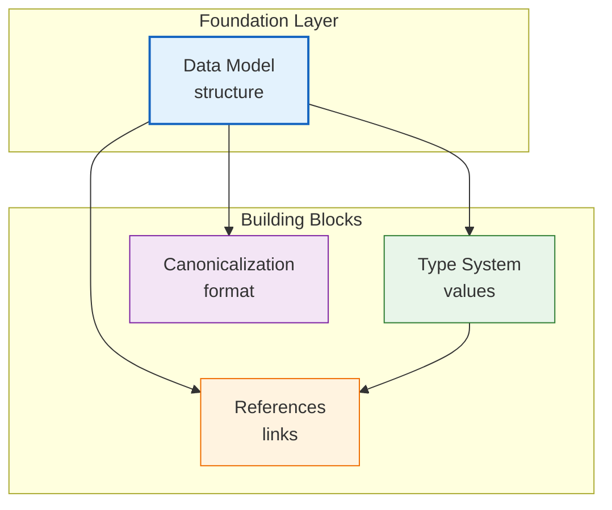

# Understanding HEDL: The Core Concepts

You can use HEDL without understanding how it works. The CLI commands are simple. The syntax takes five minutes to learn. Most people stop there, and that's fine.

But if you want to get the most out of HEDL, if you want to understand *why* it makes certain choices, if you want to design your data models well, if you want to debug subtle issues, you need to understand the concepts underneath.

This section goes deep. By the end, you'll understand HEDL better than most people who use it.

---

## The Central Insight

Here's the core idea that makes HEDL work:

**In structured data, the shape repeats far more often than the values.**

Think about a JSON file with 10,000 user records. Each record has `{"id": ..., "name": ..., "email": ...}`. The values are different for each user, but the shape is identical. You're writing `"id":`, `"name":`, `"email":` ten thousand times.

That's not data. That's metadata repeated as if it were data.

HEDL separates structure from values. You declare the structure once:

```hedl
%S:User:[id,name,email]
```

Then you write only values:

```hedl
|u001,Alice,alice@example.com
|u002,Bob,bob@example.com
```

This single insight drives everything else in HEDL's design.

---

## The Four Concepts

HEDL has four core concepts you need to understand:

### 1. The Data Model

How does HEDL organize information? What are entities, what are values, what are collections? How does nesting work?

The data model is the foundation. Everything else builds on it.

**[Read about the Data Model →](data-model.md)**

You'll learn:
- How HEDL documents are structured (headers vs. body)
- What "entities" and "collections" mean in HEDL
- How matrix lists achieve their efficiency
- When to use nesting vs. flat structures
- How HEDL maps to JSON concepts

### 2. The Type System

HEDL has types. Integers, floats, strings, booleans, nulls, references, tensors, lists. Some are inferred automatically. Some require explicit annotation.

Understanding types helps you write cleaner HEDL and avoid subtle conversion issues.

**[Read about the Type System →](type-system.md)**

You'll learn:
- How HEDL infers types from values (42 → integer, "42" → string)
- When you need quotes and when you don't
- The difference between tensors `[...]` and lists `(...)`
- How types convert when you export to JSON, YAML, CSV
- What happens when types are ambiguous

### 3. References

HEDL has first-class references: `@alice`. These aren't strings. They're validated links to entities defined elsewhere.

References are what make HEDL useful for relational data and knowledge graphs. They're also what enable validation that catches broken links before runtime.

**[Read about References →](references.md)**

You'll learn:
- The syntax of references (`@id`)
- How references get validated
- Building graph structures with references
- What happens to references when you convert to JSON
- Handling circular references

### 4. Canonicalization

Run `hedl format` twice on the same data. You get the same output. Byte for byte identical.

This matters for version control (diffs are meaningful), for caching (you can hash documents), and for reproducibility (the same data always looks the same).

**[Read about Canonicalization →](canonicalization.md)**

You'll learn:
- What "canonical form" means
- The exact formatting rules HEDL applies
- Why 1-space indentation (not 2, not 4)
- How to use canonical form for caching and hashing
- Comparing documents for equality

---

## How They Fit Together

These concepts aren't isolated. They interact:



**The Data Model** defines how things are organized. Entities, collections, nesting.

**The Type System** defines what values can be. It operates within the data model.

**References** create connections between entities. They depend on the data model to know what entities exist.

**Canonicalization** takes a data model instance and produces a standard text representation.

When you parse a HEDL document:
1. The parser recognizes the **data model** structure
2. It infers or validates **types** for each value
3. It resolves **references** to check they point to real entities
4. When you serialize, **canonicalization** ensures consistent output

---

## A Worked Example

Let's trace a document through all four concepts:

```hedl
%V:2.0
%NULL:~
%QUOTE:"
%S:Author:[id,name]
%S:Book:[isbn,title,author,price]
---
authors:@Author
 |twain,Mark Twain
 |hemingway,Ernest Hemingway

books:@Book
 |978-0-14-028329-7,The Adventures of Tom Sawyer,@twain,12.99
 |978-0-7432-9737-9,The Old Man and the Sea,@hemingway,14.99
 |978-0-14-118776-1,A Farewell to Arms,@hemingway,13.99
```

**Data Model perspective:**
- This document has two entities at the root: `authors` and `books`
- `authors` is a matrix list following the `Author` schema
- `books` is a matrix list following the `Book` schema
- Each row in a matrix list becomes an entity with the columns as fields

**Type System perspective:**
- `twain` and `hemingway` are strings (inferred, no quotes needed)
- `Mark Twain` is a string
- `12.99` is a float (has decimal point)
- `978-0-14-028329-7` is a string (contains hyphens, not a number)
- `@twain` is a reference (has the `@` prefix)

**References perspective:**
- `@twain` references the entity with id `twain`
- The parser checks: does an entity with id `twain` exist?
- Yes: the first row of `authors` defines `twain`
- If we wrote `@faulkner`, the parser would error (no such entity)

**Canonicalization perspective:**
- If we run `hedl format`, we get this exact output
- The order of entities is preserved (authors before books)
- Indentation is exactly 1 space per level
- No trailing whitespace, consistent line endings

---

## Why These Concepts Matter

You could use HEDL without understanding any of this. But understanding helps you:

**Design better data models.** When you understand how matrix lists work, you'll structure data to maximize their efficiency.

**Debug problems faster.** When a reference fails to validate, you'll know exactly what the parser is checking.

**Choose the right format.** When you understand type conversion, you'll know when HEDL → JSON is lossless and when it's not.

**Optimize for your use case.** When you understand canonicalization, you'll know when to use `hedl format` and when not to.

---

## Where to Go Next

Read the concepts in order if you're learning HEDL deeply:

1. **[Data Model](data-model.md)** first (the foundation)
2. **[Type System](type-system.md)** second (builds on data model)
3. **[References](references.md)** third (uses types and data model)
4. **[Canonicalization](canonicalization.md)** last (applies to everything)

Or jump to whichever concept you need right now:

| I want to understand... | Read this |
|-------------------------|-----------|
| How HEDL organizes data | [Data Model](data-model.md) |
| How types work in HEDL | [Type System](type-system.md) |
| How to link entities together | [References](references.md) |
| How formatting works | [Canonicalization](canonicalization.md) |

---

Ready to go deep? Start with the [Data Model](data-model.md).
