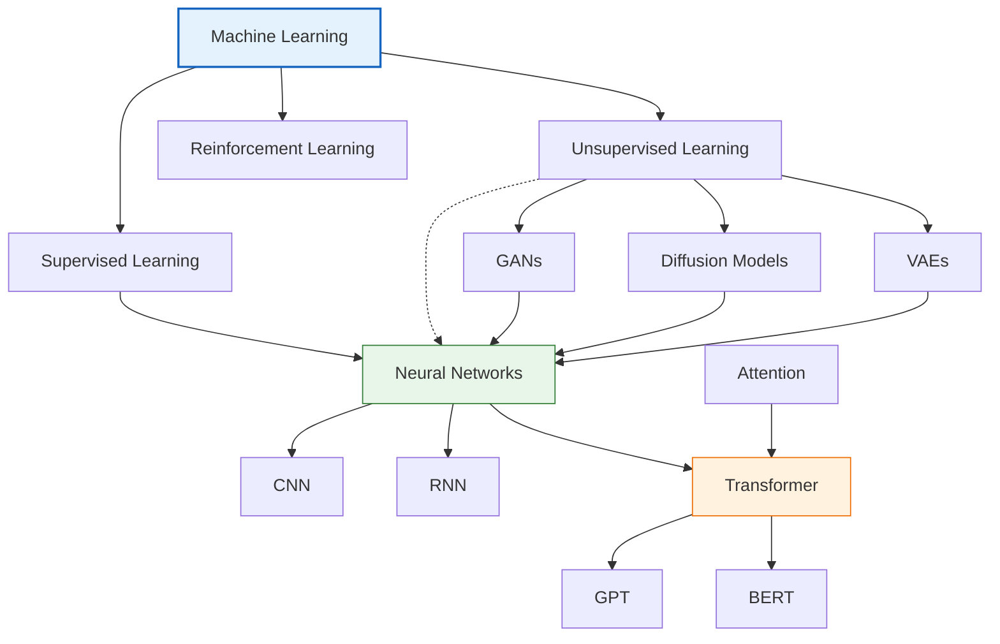

# HEDL Examples: Stories from the Trenches

These aren't textbook examples. They're battle scars.

Every pattern here emerged from a real team facing a real problem. The startup drowning in LLM API costs. The e-commerce company whose JSON files had become unreadable. The DevOps team who deployed staging credentials to production because they couldn't track configuration changes.

Their pain became these patterns. Learn from their experience.

---

## The Startup That Cut Their AI Costs in Half

Meet Sarah. She runs data analytics at a 50-person startup. Every morning, they feed their entire user database to Claude for churn prediction. Their JSON file is 12MB. At current pricing, that's roughly $9 per analysis. They run it twice daily. That's $540 per month for one recurring task.

Sarah opens the JSON file to understand the costs:

```json
{
  "users": [
    {"id": "u00001", "email": "alice@example.com", "plan": "pro", "mrr": 49.00, "signup_date": "2023-01-15", "last_active": "2024-01-14", "country": "US"},
    {"id": "u00002", "email": "bob@example.com", "plan": "free", "mrr": 0.00, "signup_date": "2023-03-20", "last_active": "2024-01-10", "country": "UK"},
    {"id": "u00003", "email": "carol@example.com", "plan": "enterprise", "mrr": 199.00, "signup_date": "2023-06-01", "last_active": "2024-01-14", "country": "DE"},
    ...
  ]
}
```

She counts: seven field names repeated 50,000 times. `"id"`, `"email"`, `"plan"`, `"mrr"`, `"signup_date"`, `"last_active"`, `"country"`. The actual field names consume 40% of the file. She's paying to send the word `"email"` fifty thousand times.

Sarah converts to HEDL:

```hedl
%V:2.0
%NULL:~
%QUOTE:"
%S:User:[id,email,plan,mrr,signup_date,last_active,country]
%C:User.total=50000
%C:User.plan:pro=12500,free=35000,enterprise=2500
---
users:@User
 |u00001,alice@example.com,pro,49.00,2023-01-15,2024-01-14,US
 |u00002,bob@example.com,free,0.00,2023-03-20,2024-01-10,UK
 |u00003,carol@example.com,enterprise,199.00,2023-06-01,2024-01-14,DE
 |u00004,david@example.com,pro,49.00,2023-02-10,2024-01-13,US
 |u00005,emma@example.com,free,0.00,2023-04-15,2024-01-12,CA
```

**What changed:**


The `%S:User:[...]` line defines the schema once. Every row follows that structure implicitly. No repetition.

The `%C:User.total=50000` line tells the LLM exactly how many users exist. The `%C:User.plan:pro=12500,...` line provides distribution metadata. The model knows the breakdown without scanning all rows.

**Sarah's takeaway:** "We were paying to send the same seven words fifty thousand times. Now we send them once."

---

## The E-Commerce Company's Single Source of Truth

Three systems. One catalog. Zero coordination.

That was the reality at a mid-sized e-commerce company. Their website needed JSON. Their data warehouse needed Parquet. Their search engine needed a different JSON format. Three teams maintained three copies of the product catalog. They drifted apart. Prices disagreed. Categories vanished from one system but not others.

The breakthrough came when they designated HEDL as the canonical source:

```hedl
%V:2.0
%NULL:~
%QUOTE:"
%S:Category:[id,name,parent]
%S:Product:[sku,name,category,price,stock,tags]
%C:Product.total=2847
---
# Category hierarchy (self-referential)
categories:@Category
 |electronics,Electronics,~
 |phones,Phones,@electronics
 |laptops,Laptops,@electronics
 |accessories,Accessories,@electronics
 |audio,Audio Equipment,@electronics
 |home,Home & Garden,~
 |kitchen,Kitchen,@home
 |outdoor,Outdoor,@home

# Product catalog with category references
products:@Product
 |SKU-001,iPhone 15 Pro,@phones,999.00,234,(smartphone,apple,flagship)
 |SKU-002,MacBook Pro 14,@laptops,1999.00,89,(laptop,apple,m3)
 |SKU-003,AirPods Pro,@audio,249.00,567,(earbuds,apple,wireless)
 |SKU-004,USB-C Cable,@accessories,19.99,2341,(cable,usb-c,charging)
 |SKU-005,Samsung Galaxy S24,@phones,899.00,178,(smartphone,samsung,android)
 |SKU-006,ThinkPad X1 Carbon,@laptops,1799.00,45,(laptop,lenovo,business)
 |SKU-007,Sony WH-1000XM5,@audio,349.00,123,(headphones,sony,noise-canceling)
 |SKU-008,Kitchen Timer,@kitchen,12.99,890,(timer,kitchen,digital)
```

**Notice the relationships:**

```mermaid
graph TB
    subgraph Hierarchy["Category Hierarchy"]
        ROOT["~ (root)"]
        ROOT --> electronics
        ROOT --> home

        electronics --> phones
        electronics --> laptops
        electronics --> audio

        home --> kitchen
        home --> outdoor
    end

    subgraph Products["Products Reference Categories"]
        SKU001["SKU-001 (iPhone)"] -.->|@phones| phones
        SKU008["SKU-008 (Timer)"] -.->|@kitchen| kitchen
    end

    style electronics fill:#e3f2fd,stroke:#1565c0
    style home fill:#fff3e0,stroke:#ef6c00
```

Categories reference their parents with `@electronics`, `@home`, etc. The `~` (null) marks root categories. Products reference their categories. HEDL validates every reference. If someone types `@phonez` instead of `@phones`, validation catches it immediately.

**The synchronization script:**

```bash
#!/bin/bash
# sync_catalog.sh - runs nightly at 2 AM

set -e  # Exit on any error

CATALOG="/data/catalog.hedl"
TIMESTAMP=$(date +%Y%m%d_%H%M%S)

echo "[$TIMESTAMP] Starting catalog sync..."

# Validate before anything else
echo "Validating catalog..."
hedl validate "$CATALOG" || {
    echo "ERROR: Catalog validation failed. Aborting sync."
    exit 1
}

# For the website: Pretty JSON for frontend consumption
echo "Generating website JSON..."
hedl to-json "$CATALOG" --pretty -o /var/www/api/catalog.json

# For the data warehouse: Parquet for efficient analytics
echo "Generating warehouse Parquet..."
hedl to-parquet "$CATALOG" -o /data/warehouse/catalog.parquet

# For the search engine: Extract just products as flat JSON
echo "Generating search index..."
hedl to-json "$CATALOG" | jq '.products' > /var/search/products.json

echo "[$TIMESTAMP] Sync complete. All systems updated."
```

**The results:**

- **Before:** Three engineers spending 4 hours/week reconciling catalogs
- **After:** Zero reconciliation. One source of truth. Automated sync.
- **Bonus:** Git history shows exactly what changed and when

---

## The RAG Pipeline That Stopped Bleeding Money

Every LLM call in their RAG pipeline included context documents. The context came from an internal API as JSON. By the time it reached the model, they were spending $0.15 per query just on context tokens.

At 100,000 queries per day, that's $15,000 daily. Just for context.

They added a simple proxy between the API and the LLM. It converts JSON to HEDL before sending:

**Original API response (2,847 tokens):**

```json
{
  "documents": [
    {
      "id": "doc-001",
      "title": "Getting Started with Kubernetes",
      "content": "Kubernetes is a container orchestration platform that automates deployment, scaling, and management of containerized applications...",
      "author": "Jane Smith",
      "created": "2024-01-10",
      "tags": ["kubernetes", "devops", "containers", "orchestration"]
    },
    {
      "id": "doc-002",
      "title": "Docker Basics for Beginners",
      "content": "Docker allows you to package applications with their dependencies into standardized units called containers...",
      "author": "John Doe",
      "created": "2024-01-08",
      "tags": ["docker", "containers", "devops", "virtualization"]
    },
    {
      "id": "doc-003",
      "title": "CI/CD Pipeline Design",
      "content": "Continuous Integration and Continuous Deployment pipelines automate the software delivery process...",
      "author": "Alice Johnson",
      "created": "2024-01-05",
      "tags": ["cicd", "devops", "automation", "jenkins"]
    }
  ],
  "total": 25,
  "query": "container orchestration best practices"
}
```

**After HEDL conversion (1,253 tokens):**

```hedl
%V:2.0
%NULL:~
%QUOTE:"
%S:Doc:[id,title,content,author,created,tags]
%C:Doc.total=25
---
query:container orchestration best practices
documents:@Doc
 |doc-001,Getting Started with Kubernetes,"Kubernetes is a container orchestration platform that automates deployment, scaling, and management of containerized applications...",Jane Smith,2024-01-10,(kubernetes,devops,containers,orchestration)
 |doc-002,Docker Basics for Beginners,"Docker allows you to package applications with their dependencies into standardized units called containers...",John Doe,2024-01-08,(docker,containers,devops,virtualization)
 |doc-003,CI/CD Pipeline Design,"Continuous Integration and Continuous Deployment pipelines automate the software delivery process...",Alice Johnson,2024-01-05,(cicd,devops,automation,jenkins)
```

**The transformation:**

```mermaid
graph LR
    subgraph JSON["JSON API Response"]
        direction TB
        J1["&quot;id&quot;: repeated 25x"]
        J2["&quot;title&quot;: repeated 25x"]
        J3["&quot;content&quot;: repeated"]
        J4["&quot;author&quot;: repeated"]
        J5["Lots of punctuation"]
        J6["2,847 tokens"]
        J7["$0.15 per query"]
    end

    subgraph HEDL["HEDL Proxy Output"]
        direction TB
        H1["%S:Doc:[...] once"]
        H2["All field names once"]
        H3["Pure data rows"]
        H4["Minimal punctuation"]
        H5["1,253 tokens"]
        H6["$0.065 per query"]
    end

    JSON -->|Transform| HEDL

    style JSON fill:#ffebee,stroke:#c62828
    style HEDL fill:#e8f5e9,stroke:#2e7d32
```



**Daily savings: $8,500 | Monthly savings: $255,000**

The proxy is remarkably simple:

```rust
use hedl::from_json;

async fn compress_context(json_response: String) -> String {
    // Try to convert to HEDL
    match from_json(&json_response) {
        Ok(hedl) => hedl,
        // If conversion fails for any reason, use original JSON
        // The system degrades gracefully
        Err(_) => json_response
    }
}
```

**Side benefit:** LLM comprehension benchmarks actually improved slightly with HEDL. The explicit schema definition helps models understand structure.

---

## The Configuration That Stopped Breaking Production

The incident report was brutal: "Staging database URL deployed to production. 47 minutes of downtime. Customer data at risk."

The cause? Copy-paste between YAML files. A developer grabbed the database section from staging config to update production config. They forgot to change the host.

The DevOps team's solution: HEDL with references and validation.

**shared-databases.hedl (centralized database definitions):**

```hedl
%V:2.0
%NULL:~
%QUOTE:"
%S:Database:[name,host,port,pool_size,ssl,timeout_seconds]
---
# Production databases - NEVER reference these in staging configs
production:@Database
 |primary,db-primary.prod.internal,5432,50,true,30
 |replica,db-replica.prod.internal,5432,25,true,30
 |analytics,db-analytics.prod.internal,5432,10,true,60

# Staging databases - safe for testing
staging:@Database
 |primary,db.staging.internal,5432,10,false,30
 |replica,db.staging.internal,5432,5,false,30
 |analytics,db.staging.internal,5432,3,false,60

# Local development
local:@Database
 |primary,localhost,5432,5,false,5
 |replica,localhost,5432,5,false,5
 |analytics,localhost,5432,2,false,5
```

**production-user-service.hedl:**

```hedl
%V:2.0
%NULL:~
%QUOTE:"
---
service:
 name:user-service
 environment:production
 port:8001

# Reference the production primary database
# If someone tries @staging-primary, validation FAILS
database:@primary

cache:
 type:redis
 host:redis.prod.internal
 port:6379
 pool_size:20

features:
 rate_limiting:true
 max_requests_per_minute:1000
 audit_logging:true

monitoring:
 enabled:true
 endpoint:http://prometheus.prod.internal:9090
 scrape_interval_seconds:15
```

**staging-user-service.hedl:**

```hedl
%V:2.0
%NULL:~
%QUOTE:"
---
service:
 name:user-service
 environment:staging
 port:8001

# Reference staging database
database:@staging-primary

cache:
 type:redis
 host:redis.staging.internal
 port:6379
 pool_size:5

features:
 rate_limiting:false
 max_requests_per_minute:10000
 audit_logging:false

monitoring:
 enabled:true
 endpoint:http://prometheus.staging.internal:9090
 scrape_interval_seconds:60
```

**The deployment pipeline:**

```bash
#!/bin/bash
# deploy.sh SERVICE ENVIRONMENT

SERVICE=$1
ENV=$2
CONFIG_DIR="/etc/configs"

echo "Deploying $SERVICE to $ENV..."

# Step 1: Validate the config file exists and is valid HEDL
CONFIG_FILE="$CONFIG_DIR/${ENV}-${SERVICE}.hedl"
if ! hedl validate "$CONFIG_FILE"; then
    echo "ERROR: Invalid configuration file"
    exit 1
fi

# Step 2: Merge with shared databases
SHARED="$CONFIG_DIR/shared-databases.hedl"
hedl to-json "$SHARED" > /tmp/databases.json
hedl to-json "$CONFIG_FILE" > /tmp/service.json
jq -s '.[0] * .[1]' /tmp/databases.json /tmp/service.json > /tmp/merged.json

# Step 3: Validate references resolve correctly
if ! hedl from-json /tmp/merged.json -o /tmp/final.hedl; then
    echo "ERROR: Reference resolution failed"
    echo "Check that all @references point to defined entities"
    exit 1
fi
hedl validate /tmp/final.hedl || exit 1

# Step 4: Convert to format the application expects
hedl to-json /tmp/final.hedl --pretty -o "/var/app/${SERVICE}/config.json"

echo "Deployment complete: $SERVICE in $ENV"
```

**The protection:**

```
Developer writes: database:@staging-primary
In production config

Validation step:
  1. Load shared-databases.hedl
  2. Load production-user-service.hedl
  3. Resolve references
  4. @staging-primary exists in staging section
  5. But production config should only reference production entities

Custom validation rule catches this:
  "ERROR: Production config references non-production entity @staging-primary"
```

**Incidents since implementing this pattern:** Zero.

---

## The Knowledge Graph That Thinks

A research team needed to:

1. Build a knowledge base of machine learning concepts
2. Track relationships between concepts
3. Use it as LLM context for explanations
4. Export to Neo4j for graph queries
5. Keep everything in version control

HEDL handles all five requirements:

```hedl
%V:2.0
%NULL:~
%QUOTE:"
%S:Concept:[id,name,category,description]
%S:Relation:[id,source,target,type,strength]
%C:Concept.total=15
%C:Relation.total=18
---
# Core concepts in machine learning
concepts:@Concept
 |ml,Machine Learning,field,"A subset of artificial intelligence focused on learning patterns from data"
 |dl,Deep Learning,subfield,"Machine learning using neural networks with multiple layers"
 |sl,Supervised Learning,paradigm,"Learning from labeled examples with known correct answers"
 |ul,Unsupervised Learning,paradigm,"Finding patterns in data without labeled examples"
 |rl,Reinforcement Learning,paradigm,"Learning optimal actions through reward and punishment signals"
 |nn,Neural Networks,technique,"Computing systems inspired by biological neural networks"
 |cnn,Convolutional Networks,architecture,"Neural networks specialized for grid-like data such as images"
 |rnn,Recurrent Networks,architecture,"Neural networks with connections forming directed cycles for sequences"
 |transformer,Transformer,architecture,"Attention-based architecture that processes sequences in parallel"
 |attention,Attention Mechanism,component,"Mechanism for weighing the importance of different input elements"
 |gpt,GPT,model,"Generative Pre-trained Transformer for text generation"
 |bert,BERT,model,"Bidirectional Encoder Representations from Transformers"
 |diffusion,Diffusion Models,technique,"Generative models that learn to reverse a noise process"
 |gan,GANs,technique,"Generative models using adversarial training between generator and discriminator"
 |vae,VAEs,technique,"Generative models learning latent representations through variational inference"

# Relationships form the knowledge graph edges
relations:@Relation
 |r01,@dl,@ml,is_subfield_of,1.0
 |r02,@sl,@ml,is_paradigm_of,1.0
 |r03,@ul,@ml,is_paradigm_of,1.0
 |r04,@rl,@ml,is_paradigm_of,1.0
 |r05,@nn,@dl,is_foundation_of,1.0
 |r06,@cnn,@nn,is_type_of,1.0
 |r07,@rnn,@nn,is_type_of,1.0
 |r08,@transformer,@nn,is_type_of,0.9
 |r09,@attention,@transformer,is_component_of,1.0
 |r10,@gpt,@transformer,is_based_on,1.0
 |r11,@bert,@transformer,is_based_on,1.0
 |r12,@cnn,@sl,commonly_uses,0.9
 |r13,@transformer,@sl,commonly_uses,0.95
 |r14,@diffusion,@ul,commonly_uses,0.7
 |r15,@gan,@ul,commonly_uses,0.8
 |r16,@vae,@ul,commonly_uses,0.85
 |r17,@diffusion,@nn,builds_on,0.9
 |r18,@gan,@nn,builds_on,1.0
```

**The graph structure visualized:**



**Every reference is validated.** If someone writes `@tranformer` (typo), HEDL catches it before the data propagates anywhere.

**Using it as LLM context:**

```python
# Load the knowledge graph
with open('ml_concepts.hedl') as f:
    knowledge = f.read()

# Include in prompt
response = llm.complete(f"""
Given this knowledge graph of ML concepts:

{knowledge}

Question: How does GPT relate to supervised learning?
""")
```

**Exporting to Neo4j:**

```rust
use hedl::parse;
use hedl_neo4j::to_cypher;

let doc = parse(hedl_content.as_bytes())?;
let cypher = to_cypher(&doc)?;

// Execute against Neo4j
// Creates nodes for concepts, edges for relations
```

**Querying the graph:**

```cypher
// Find all techniques that build on neural networks
MATCH (concept)-[:BUILDS_ON|IS_TYPE_OF*]->(nn:Concept {id: 'nn'})
RETURN concept.name, concept.category

// Find the path from GPT to Machine Learning
MATCH path = shortestPath(
  (gpt:Concept {id: 'gpt'})-[*]-(ml:Concept {id: 'ml'})
)
RETURN path
```

---

## The Time Series Pipeline

A monitoring system collects metrics every second from 100 servers. That's 8.64 million data points per day. Per server. The team needed:

1. Human-readable format for debugging
2. Efficient storage for long-term archival
3. Fast queries for dashboards

HEDL as the intermediate format, Parquet for storage:

```hedl
%V:2.0
%NULL:~
%QUOTE:"
%S:Metric:[timestamp,server,cpu_percent,memory_mb,disk_io_kbps,network_io_kbps]
%C:Metric.total=86400
---
collection:
 date:2024-01-15
 server_id:srv-001
 collection_interval_seconds:1

metrics:@Metric
 |2024-01-15T00:00:00Z,srv-001,23.5,4096,1250,8500
 |2024-01-15T00:00:01Z,srv-001,24.1,4098,1245,8490
 |2024-01-15T00:00:02Z,srv-001,23.8,4095,1260,8520
 |2024-01-15T00:00:03Z,srv-001,25.2,4099,1255,8510
 |2024-01-15T00:00:04Z,srv-001,24.7,4097,1248,8495
 |2024-01-15T00:00:05Z,srv-001,23.9,4094,1262,8530
```

**Size comparison for one day, one server:**

```
Format          Size        Query Speed     Human Readable
----------------------------------------------------------
JSON            45 MB       Slow            Yes (verbose)
CSV             12 MB       Medium          Yes (simple)
HEDL            8 MB        Medium          Yes (typed)
Parquet         2 MB        Very Fast       No
```

**The pipeline:**

```bash
#!/bin/bash
# process_metrics.sh - runs every hour

HOUR=$(date +%Y%m%d_%H)

for server in srv-{001..100}; do
    INPUT="/metrics/raw/${server}_${HOUR}.hedl"

    # Validate incoming data
    if ! hedl validate "$INPUT" 2>/dev/null; then
        echo "WARNING: Invalid data from $server, skipping"
        continue
    fi

    # Convert to Parquet for storage
    hedl to-parquet "$INPUT" -o "/archive/${server}/${HOUR}.parquet"

    # Keep recent HEDL for debugging (last 24 hours)
    find "/metrics/raw/${server}_*.hedl" -mtime +1 -delete
done

# Aggregate for dashboards
echo "Creating dashboard aggregates..."
hedl batch-validate /archive/*/$(date +%Y%m%d)_*.parquet --parallel
```

**When debugging:**

```bash
# What happened at 2:30 AM on server 47?
hedl to-json /metrics/raw/srv-047_20240115_02.hedl | \
    jq '[.metrics[] | select(.timestamp | startswith("2024-01-15T02:3"))]'
```

---

## The Multi-Language Training Dataset

A company fine-tuning a multilingual customer support model needs:

1. Training data from tickets in five languages
2. Track which agent handled each ticket
3. Quality metrics per agent per language
4. Clean separation for evaluation

```hedl
%V:2.0
%NULL:~
%QUOTE:"
%S:Agent:[id,name,languages]
%S:Ticket:[id,language,agent,customer_message,agent_response,rating,resolution_time_minutes]
%C:Agent.total=5
%C:Ticket.total=5000
%C:Ticket.language:en=2000,es=1200,de=800,fr=600,ja=400
---
agents:@Agent
 |a1,Sarah Chen,(en,es,zh)
 |a2,Klaus Mueller,(de,en)
 |a3,Marie Dubois,(fr,en)
 |a4,Yuki Tanaka,(ja,en)
 |a5,Carlos Garcia,(es,en,pt)

tickets:@Ticket
 |t0001,en,@a1,"How do I reset my password?","You can reset your password by clicking the Forgot Password link on the login page. You will receive an email with reset instructions within 5 minutes.",5,3
 |t0002,es,@a5,"No puedo iniciar sesión en mi cuenta","Para recuperar el acceso a su cuenta, por favor visite nuestra página de recuperación de contraseña. Si el problema persiste, podemos verificar su identidad por teléfono.",5,4
 |t0003,de,@a2,"Meine Bestellung ist nicht angekommen","Es tut uns leid für die Unannehmlichkeiten. Ich habe Ihre Bestellung überprüft und sehe, dass sie am Zoll festgehalten wird. Sie sollten sie innerhalb von 2-3 Werktagen erhalten.",4,7
 |t0004,fr,@a3,"Je voudrais annuler ma commande","Bien sûr, je peux annuler votre commande immédiatement. Le remboursement sera crédité sur votre carte dans un délai de 5-7 jours ouvrables.",5,2
 |t0005,ja,@a4,"返品の方法を教えてください","返品については、マイアカウントページから返品ラベルを印刷できます。商品を元の梱包で発送してください。返金は商品受領後3-5営業日で処理されます。",5,5
 |t0006,en,@a1,"My subscription was charged twice","I apologize for the duplicate charge. I have processed a refund for the extra charge. You should see it reflected in your account within 3-5 business days.",5,4
 |t0007,de,@a2,"Wie kann ich mein Abonnement kündigen?","Sie können Ihr Abonnement jederzeit in Ihren Kontoeinstellungen kündigen. Gehen Sie zu Einstellungen > Abonnement > Kündigen. Ihr Zugang bleibt bis zum Ende des aktuellen Abrechnungszeitraums aktiv.",4,3
```

**Analyzing agent performance:**

```bash
# Extract English tickets only
hedl to-json tickets.hedl | \
    jq '[.tickets[] | select(.language == "en")]' > english_eval.json

# Calculate average rating per agent
hedl to-json tickets.hedl | \
    jq 'group_by(.agent) | map({agent: .[0].agent, avg_rating: (map(.rating) | add / length)})'

# Find tickets with low ratings for review
hedl to-json tickets.hedl | \
    jq '[.tickets[] | select(.rating < 4)]' > needs_review.json
```

**Distribution visualization:**

```
Language Distribution (5000 tickets)
======================================
English (en):  ████████████████████ 2000 (40%)
Spanish (es):  ████████████ 1200 (24%)
German (de):   ████████ 800 (16%)
French (fr):   ██████ 600 (12%)
Japanese (ja): ████ 400 (8%)

Agent Language Coverage:
Sarah:   en, es, zh
Klaus:   de, en
Marie:   fr, en
Yuki:    ja, en
Carlos:  es, en, pt
```

---

## Quick Reference: Pattern Selection Guide

**When you see this problem, reach for this pattern:**

| Problem | HEDL Pattern |
|---------|--------------|
| Repeated JSON field names burning tokens | `%S:Schema:[fields]` - Define once, use everywhere |
| Need collection size without scanning all records | `%C:Type.total=N` - Metadata in header |
| Related entities (foreign keys) with silent failures | `@reference` syntax - Validated at parse time |
| Multiple output formats needed (JSON, YAML, Parquet, CSV) | HEDL as canonical source with `hedl to-*` conversions |
| Shared config values across environments | Separate files + references - Validation catches mismatches |
| Graph/relational structure | Two schemas: Entity + Relation - Relations reference entities |
| Large batch of files | `hedl batch-validate --parallel` and `hedl batch-format --output-dir` |
| Version control noise with formatting diffs | `hedl format` for canonical output - Deterministic formatting |

---

## What You've Learned

You've seen HEDL solve real problems:

- **Token costs** cut in half with schema declarations
- **Data integrity** protected with validated references
- **Multi-format needs** served from a single source
- **Configuration errors** caught before deployment
- **Knowledge structures** made explicit and queryable
- **Time series data** made readable and efficient

These patterns emerged from pain. They represent scars from production incidents, unexpected bills, and 2 AM debugging sessions.

Now they're yours. Use them.

---

## Next Steps

Ready to go deeper?

- **[CLI Guide](cli-guide.md)**: Master every command
- **[Formats Guide](formats.md)**: Deep dive on conversions
- **[Concepts](concepts/README.md)**: Understand the theory
- **[Troubleshooting](troubleshooting.md)**: When things go sideways

Or just start building. You have the patterns. Apply them to your problems.
