# Frequently Asked Questions

You have questions. Real questions, born from real struggles with data formats that promise everything and deliver frustration. Maybe you've been burned before. Maybe you're skeptical. That's healthy.

This FAQ exists because someone else asked the same question you're about to ask. Their confusion became our clarity. Their frustration became our documentation. Every answer here represents a real moment when someone paused and thought, "Wait, how does this actually work?"

Let's explore together.

---

## Understanding HEDL

### What is HEDL, really?

Picture yourself at 2am, scrolling through a JSON file with 847 lines of curly braces. You're searching for one misconfigured setting, but every object looks identical because JSON screams every field name at you seventeen times. Your eyes hurt. Your coffee went cold two hours ago.

HEDL is the alternative to that nightmare.

HEDL stands for Hierarchical Entity Data Language. It's a data format designed for humans who have to read data, not just machines that consume it. It's for developers who notice that their LLM API bills are climbing because half their tokens are wasted on repeated field names. It's for teams who want to version control their data without drowning in diff noise.

At its core, HEDL does three things brilliantly:

1. **Compresses repetition**: Define a structure once, use it everywhere
2. **Makes relationships explicit**: References are first-class citizens, not ID-matching puzzles
3. **Stays readable**: Humans can read it, edit it, review it in PRs

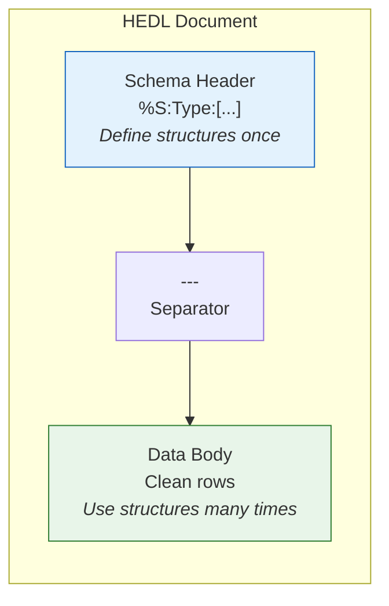

---

### Why not just use JSON? Everyone uses JSON.

Everyone uses JSON. That's true. And for APIs talking to APIs, JSON is fine. But ask yourself: who is reading your data?

Consider this common scenario. You have a list of products. In JSON:

```json
{
  "products": [
    {"id": "p1", "name": "Widget", "price": 19.99, "category": "tools"},
    {"id": "p2", "name": "Gadget", "price": 29.99, "category": "tools"},
    {"id": "p3", "name": "Doohickey", "price": 9.99, "category": "misc"},
    {"id": "p4", "name": "Thingamabob", "price": 39.99, "category": "tools"},
    {"id": "p5", "name": "Whatsit", "price": 14.99, "category": "misc"}
  ]
}
```

Every single line screams `"id"`, `"name"`, `"price"`, `"category"` at you. The actual data is drowning in structure. Now in HEDL:

```hedl
%V:2.0
%NULL:~
%QUOTE:"
%S:Product:[id,name,price,category]
---
products:@Product
 |p1,Widget,19.99,tools
 |p2,Gadget,29.99,tools
 |p3,Doohickey,9.99,misc
 |p4,Thingamabob,39.99,tools
 |p5,Whatsit,14.99,misc
```

The structure is defined once. The data speaks for itself. You can actually see your products.

**The numbers tell the story:**

```
JSON: 367 characters, ~92 tokens
HEDL: 198 characters, ~41 tokens

Token reduction: 55%
```

When you're paying per token for LLM API calls, that 55% reduction hits your bill directly. Process a million requests, and you've saved hundreds of thousands of tokens. Real money. Real savings.

---

### How confident can I be in HEDL?

Skepticism is wise. You've probably seen tools that promise the world and crash on edge cases.

Here's what stands behind HEDL:

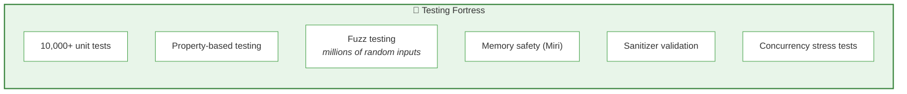

**Security hardening**: HEDL resists DoS attacks. Malicious inputs designed to exhaust memory or CPU are caught and rejected. You can use it on untrusted input.

**Multiple bindings**: Native Rust, Python via FFI, JavaScript via WASM. Use it wherever you need it.

**Production CLI**: The command-line tool handles batch operations, parallelizes automatically, and processes gigabytes without breaking a sweat.

This isn't someone's weekend project. It's a battle-tested tool.

---

## The Syntax

### Show me the simplest possible HEDL document

Here it is:

```hedl
%V:2.0
%NULL:~
%QUOTE:"
---
message:Hello, World
```

That's valid HEDL. Let's break it down:

```
%V:2.0      <-- "I speak HEDL"
%NULL:~     <-- "Null values look like ~"
%QUOTE:"    <-- "Strings are quoted with double quotes"
---         <-- "Headers done, data starts here"
message:... <-- The actual data
```

The three header directives are required. They tell parsers exactly how to interpret the document. No ambiguity. No "well, usually null is written as..."

After the `---` separator, you write your data. Keys and values separated by colons. No quotes needed for simple strings.

---

### How do I represent a list of similar things?

This is where HEDL transforms from "nice" to "why didn't I know about this sooner?"

Define a schema. Use it for rows.

```hedl
%V:2.0
%NULL:~
%QUOTE:"
%S:User:[id,name,email,role]
---
users:@User
 |u1,Alice Chen,alice@company.com,admin
 |u2,Bob Martinez,bob@company.com,developer
 |u3,Carol Williams,carol@company.com,developer
 |u4,David Kim,david@company.com,analyst
```

The `%S:User:[id,name,email,role]` line says "A User has these four fields, in this order."

The `users:@User` line says "Here come some Users."

Each `|` line is one user. Fields are comma-separated. The position tells you the meaning.

**Visualized:**

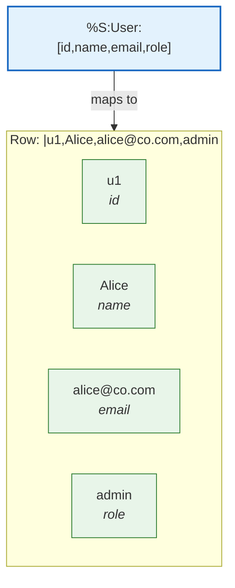

Every row has the same structure. No repetition. Pure data.

---

### What if my text contains commas or special characters?

Quote it.

```hedl
%V:2.0
%NULL:~
%QUOTE:"
%S:Message:[id,content,author]
---
messages:@Message
 |m1,"Hello, World!",Alice
 |m2,"Line one
Line two",Bob
 |m3,"She said ""hello"" quietly",Carol
```

**Rules for quoted strings:**

- Commas inside quotes are safe
- Newlines inside quotes are preserved
- To include a literal quote character, double it: `""`

Anything that might confuse the parser goes in quotes. When in doubt, quote it.

---

### What data types does HEDL support?

HEDL understands the types you actually use:

```hedl
%V:2.0
%NULL:~
%QUOTE:"
---
# Numbers (integers and floats)
count:42
negative:-17
precise:3.14159
scientific:6.022e23

# Booleans
active:true
deleted:false

# Strings
name:Alice
quoted:"Hello, World!"
multiline:"First line
Second line"

# Null (absence of value)
optional:~

# Arrays
tags:[rust,fast,efficient]
numbers:[1,2,3,4,5]
mixed:[1,"two",true,~]

# Nested objects
server:
 host:localhost
 port:8080
```

**Type inference flow:**

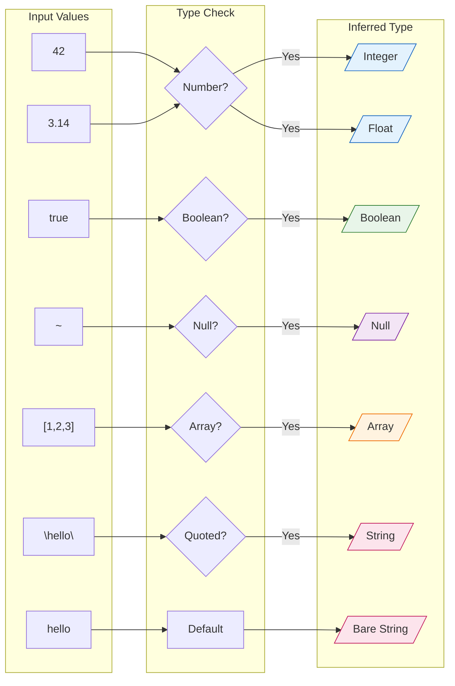

---

### How do references work?

References are HEDL's secret weapon for relational data. Instead of duplicating IDs and hoping you match them correctly, you make the relationship explicit.

```hedl
%V:2.0
%NULL:~
%QUOTE:"
%S:Author:[id,name]
%S:Book:[id,title,author]
---
authors:@Author
 |a1,George Orwell
 |a2,Jane Austen
 |a3,Ernest Hemingway

books:@Book
 |b1,1984,@a1
 |b2,Animal Farm,@a1
 |b3,Pride and Prejudice,@a2
 |b4,The Old Man and the Sea,@a3
```

See `@a1` in the books? That's a reference to George Orwell. HEDL validates that the reference exists. If you typo `@a99`, validation catches it.

**The relationship graph:**

```mermaid
graph LR
    subgraph Authors["authors"]
        A1["a1: Orwell"]
        A2["a2: Austen"]
        A3["a3: Hemingway"]
    end

    subgraph Books["books"]
        B1["b1: 1984"]
        B2["b2: Animal Farm"]
        B3["b3: Pride & Prejudice"]
        B4["b4: Old Man & Sea"]
    end

    B1 -->|@a1| A1
    B2 -->|@a1| A1
    B3 -->|@a2| A2
    B4 -->|@a3| A3

    style A1 fill:#e3f2fd,stroke:#1565c0,stroke-width:2px
    style A2 fill:#e3f2fd,stroke:#1565c0,stroke-width:2px
    style A3 fill:#e3f2fd,stroke:#1565c0,stroke-width:2px
    style B1 fill:#e8f5e9,stroke:#2e7d32
    style B2 fill:#e8f5e9,stroke:#2e7d32
    style B3 fill:#e8f5e9,stroke:#2e7d32
    style B4 fill:#e8f5e9,stroke:#2e7d32
```

References make your data model visible and verifiable.

---

### Can I nest data inside other data?

Yes. HEDL supports hierarchical data using the NEST directive.

```hedl
%V:2.0
%NULL:~
%QUOTE:"
%S:Department:[id,name]
%S:Team:[id,name]
%S:Employee:[id,name,role]
%N:Department>Team
%N:Team>Employee
---
departments:@Department
 |eng,Engineering
  teams:@Team
   |backend,Backend Infrastructure
    employees:@Employee
     |e1,Alice,Senior Engineer
     |e2,Bob,Engineer
   |frontend,Frontend Experience
    employees:@Employee
     |e3,Carol,Tech Lead
 |sales,Sales
  teams:@Team
   |enterprise,Enterprise Sales
    employees:@Employee
     |e4,David,Account Executive
```

The `%N:Department>Team` directive says "Teams nest inside Departments." The `%N:Team>Employee` says "Employees nest inside Teams."

**Visualized hierarchy:**

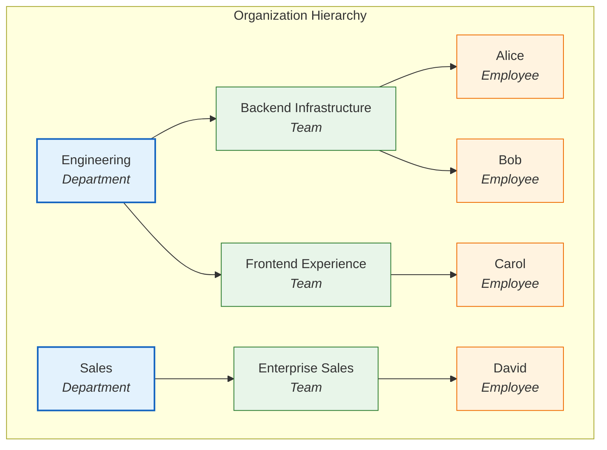

Indentation shows structure. One space per nesting level. Your data mirrors your mental model.

---

### How do I add comments?

Use the `#` character:

```hedl
%V:2.0
%NULL:~
%QUOTE:"
---
# Application configuration
# Last updated: 2024-01-15

app:
 name:MyService
 # Production server settings
 server:
  host:api.example.com  # Load balancer endpoint
  port:443
  timeout:30  # seconds

 # Feature flags
 features:
  new_dashboard:true  # Enabled for beta users
  legacy_api:false    # Deprecated, remove by Q2
```

Comments exist for humans. The parser ignores them. Future you will thank present you for explaining why that timeout is 30 seconds.

---

## Performance

### How fast is HEDL parsing?

Fast enough that you'll forget parsing is happening.

**Benchmarks on typical hardware:**

| Document Size | Parse Time |
|--------------|------------|
| Tiny (1 KB) | ~37 μs |
| Small (10 KB) | ~350 μs |
| Medium (100 KB) | ~3.5 ms |
| Large (1 MB) | ~35 ms |
| Huge (10 MB) | ~350 ms |

**Throughput**: 25-50 MB/s depending on document complexity.

**Why it's fast:**

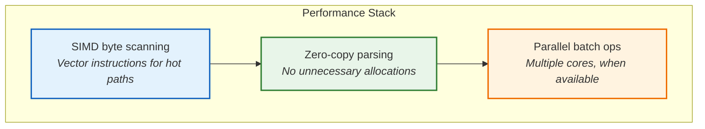

Unless you're doing something unusual with streaming petabytes, parsing won't be your bottleneck.

---

### What about memory usage?

HEDL is memory-efficient:

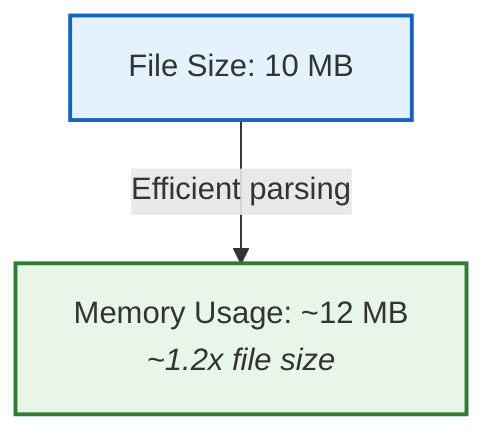

Compare to typical JSON parsers that use 2-3x file size. HEDL's efficiency comes from:

- **Zero-copy strings**: Slices into original buffer when possible
- **Arena allocation**: Reduced allocator pressure
- **Streaming mode**: For files larger than memory

For truly massive files (multi-GB), use streaming or convert to Parquet.

---

## Conversions

### Can I convert any JSON to HEDL?

Yes. Any valid JSON converts cleanly:

```bash
hedl from-json any.json -o output.hedl
```

The tool analyzes your JSON and produces optimized HEDL:

```mermaid
graph LR
    subgraph JSON["JSON Input"]
        J["{ \"users\": [<br/>  {\"id\": 1, \"name\": \"A\"},<br/>  {\"id\": 2, \"name\": \"B\"}<br/>]}"]
    end

    CONVERT["hedl from-json"]

    subgraph HEDL["HEDL Output"]
        H["%V:2.0<br/>%NULL:~<br/>%QUOTE:\"<br/>%S:User:[id,name]<br/>---<br/>users:@User<br/> |1,A<br/> |2,B"]
    end

    JSON --> CONVERT --> HEDL

    style J fill:#fff3e0,stroke:#ef6c00
    style H fill:#e8f5e9,stroke:#2e7d32
    style CONVERT fill:#e3f2fd,stroke:#1565c0,stroke-width:2px
```

Arrays of similar objects automatically become matrix lists. Nested structures become HEDL hierarchies.

---

### Is conversion lossless?

For most formats, yes. Here's the complete picture:

```
Format      Round-trip    Notes
--------------------------------------------------
JSON        Perfect       Use --metadata for types
YAML        Perfect       Use --metadata for types
Parquet     Perfect       Schemas preserved
CSV         Flat only     Nested data gets flattened
XML         Mostly        Attributes become fields
```

**The metadata flag preserves everything:**

```bash
# Export with full type information
hedl to-json data.hedl --metadata -o export.json

# Import back perfectly
hedl from-json export.json -o restored.hedl
```

Without `--metadata`, HEDL has to infer types on re-import. With it, everything round-trips exactly.

---

### How do I convert between other formats using HEDL?

HEDL as a universal bridge:

```
JSON --> HEDL --> YAML

hedl from-json input.json -o temp.hedl
hedl to-yaml temp.hedl -o output.yaml
```

Or with pipes:

```bash
# JSON to Parquet
cat input.json | hedl from-json - | hedl to-parquet - -o output.parquet

# CSV to YAML
hedl from-csv data.csv -t Record -o - | hedl to-yaml - -o data.yaml
```

**Conversion diagram:**

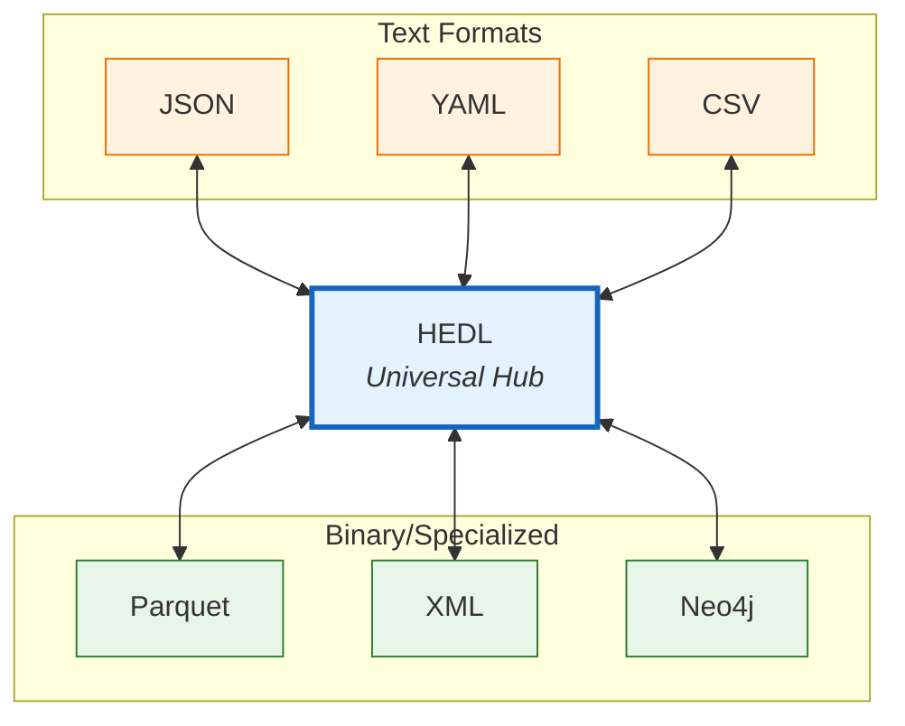

HEDL sits at the center. Convert anything to anything.

---

### Which format should I use when?

**Decision tree:**

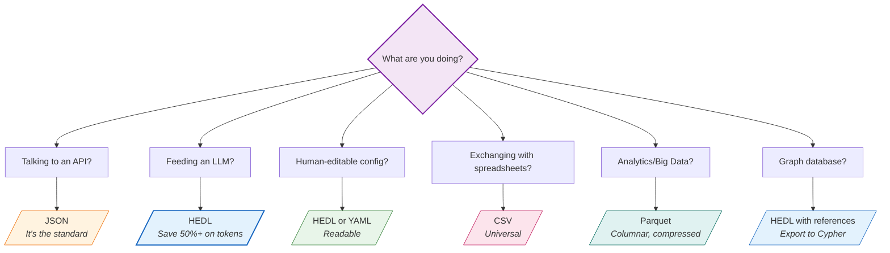

There's no single best format. There's the right format for the job.

---

## Cost Savings

### How do I actually reduce my LLM API costs?

Step by step:

**1. Measure your current baseline:**

```bash
# Check your JSON context
wc -c context.json
cat context.json | hedl stats --tokens
```

**2. Convert to HEDL:**

```bash
hedl from-json context.json -o context.hedl
```

**3. Measure the improvement:**

```bash
wc -c context.hedl
cat context.hedl | hedl stats --tokens
```

**4. Use HEDL in your pipeline:**

```python
# Before: sending JSON
response = llm.complete(json_context)  # ~1000 tokens

# After: sending HEDL
response = llm.complete(hedl_context)  # ~450 tokens
```

**The math:**

```
Daily requests:     10,000
Tokens saved/req:   550
Daily savings:      5,500,000 tokens
Monthly savings:    165,000,000 tokens
At $0.01/1K tokens: $1,650/month saved
```

Real money. From a simple format change.

---

## Use Cases

### Is HEDL good for configuration files?

Excellent for configs. Here's why:

```hedl
%V:2.0
%NULL:~
%QUOTE:"
---
# Application Configuration
app:
 name:MyService
 environment:production

# Server settings
server:
 host:0.0.0.0
 port:8080
 workers:4

 # TLS configuration
 tls:
  enabled:true
  cert:/etc/ssl/certs/server.crt
  key:/etc/ssl/private/server.key

# Database pool
database:
 url:postgresql://localhost:5432/myapp
 pool_size:20
 timeout:30

# Feature flags
features:
 new_dashboard:true
 experimental_api:false
 rate_limiting:true
```

**Why HEDL wins for configs:**

1. **Readable**: Comments explain intent
2. **Type-safe**: Numbers are numbers, booleans are booleans
3. **Diff-friendly**: One thing per line, minimal noise
4. **Validatable**: Catch errors before deployment

```bash
# Validate config before deploying
hedl validate config.hedl && deploy.sh
```

---

### How do I use HEDL in a data pipeline?

HEDL as your validation and transformation hub:

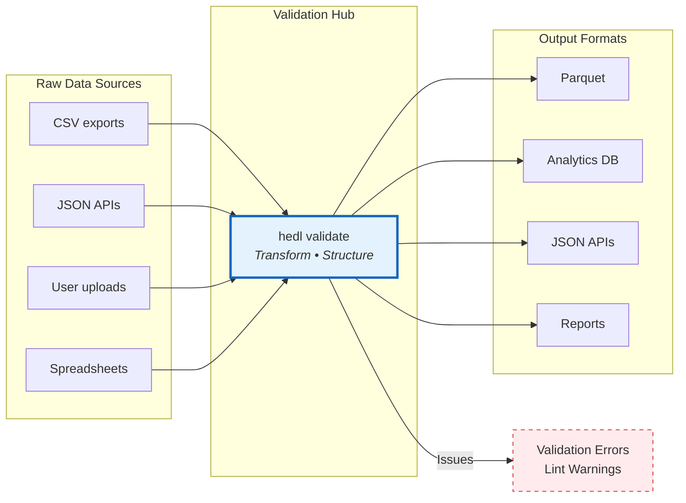

**Example pipeline script:**

```bash
#!/bin/bash
set -e

# Import from multiple sources
hedl from-csv sales.csv -t Sale -o sales.hedl
hedl from-json customers.json -o customers.hedl

# Validate everything
hedl validate sales.hedl customers.hedl

# Lint for best practices
hedl lint sales.hedl customers.hedl

# Export for analytics
hedl to-parquet sales.hedl -o warehouse/sales.parquet
hedl to-parquet customers.hedl -o warehouse/customers.parquet

echo "Pipeline complete"
```

---

### Can I use HEDL with databases?

Multiple approaches:

**SQL databases (PostgreSQL, MySQL):**

```bash
# Export HEDL to CSV, import to database
hedl to-csv users.hedl -o users.csv
psql -c "\COPY users FROM 'users.csv' CSV HEADER"
```

**Graph databases (Neo4j):**

HEDL's references map perfectly to graph relationships. The `hedl-neo4j` crate generates Cypher:

```bash
hedl to-cypher data.hedl > import.cypher
cat import.cypher | cypher-shell -u neo4j -p password
```

**Analytics (Spark, DuckDB, Pandas):**

```bash
# Convert to Parquet for analytics tools
hedl to-parquet data.hedl -o data.parquet

# Then use your favorite tool
duckdb -c "SELECT * FROM read_parquet('data.parquet')"
```

---

## Troubleshooting

### I'm getting parsing errors

The most common culprits:

**1. Wrong indentation:**

```hedl
# WRONG: 2 spaces
%V:2.0
%NULL:~
%QUOTE:"
%S:User:[id,name]
---
users:@User
  |u1,Alice   # <-- 2 spaces = wrong

# CORRECT: 1 space per level
users:@User
 |u1,Alice    # <-- 1 space = correct
```

**2. Spaces in the wrong places:**

```hedl
# WRONG: spaces after commas in rows
 |u1, Alice, alice@example.com

# CORRECT: no spaces after commas
 |u1,Alice,alice@example.com
```

**3. Unquoted special characters:**

```hedl
# WRONG: comma breaks parsing
 |m1,Hello, World,greeting

# CORRECT: quoted string protects comma
 |m1,"Hello, World",greeting
```

**Debug with inspect:**

```bash
hedl inspect problem.hedl
```

This shows exactly how HEDL interprets your document.

---

### My file is too large

HEDL defaults to a 1GB safety limit. For larger files:

**Option 1: Increase the limit:**

```bash
export HEDL_MAX_FILE_SIZE=5368709120  # 5GB
hedl validate large.hedl
```

**Option 2: Split the file:**

```bash
split -l 100000 large.hedl chunk_
for chunk in chunk_*; do
  hedl validate "$chunk"
done
```

**Option 3: Convert to a more compact format:**

```bash
hedl to-parquet huge.hedl -o compact.parquet
# 2GB HEDL -> ~200MB Parquet
```

---

### Batch operations seem slow

Enable parallelism:

```bash
# Parallel validation
hedl batch-validate *.hedl --parallel

# Control thread count
export RAYON_NUM_THREADS=8
hedl batch-format *.hedl --output-dir formatted/ --parallel
```

**When parallel helps vs. hurts:**

```
File Count    File Sizes    Use Parallel?
-------------------------------------------
Few           Large         Yes (splits work)
Many          Small         Maybe (overhead)
Many          Large         Definitely yes
```

For many tiny files, sequential might actually be faster due to reduced overhead.

---

## Integration

### Can I use HEDL as a library?

Yes. Native bindings for multiple languages.

**Rust:**

```toml
# Cargo.toml
[dependencies]
hedl = "2.0"
```

```rust
use hedl::{parse, to_json};

let doc = parse(b"%V:2.0\n%NULL:~\n%QUOTE:\"\n---\nname:Alice")?;
let json = to_json(&doc)?;
```

**Python:**

```python
import hedl

doc = hedl.parse("%V:2.0\n%NULL:~\n%QUOTE:\"\n---\nname:Alice")
json_str = hedl.to_json(doc)
print(json_str)  # {"name": "Alice"}
```

**JavaScript (WASM):**

```javascript
import init, { parse, toJson } from './hedl_wasm.js';

await init();
const doc = parse("%V:2.0\n%NULL:~\n%QUOTE:\"\n---\nname:Alice");
const json = toJson(doc);
console.log(json);  // {"name": "Alice"}
```

---

### Is there IDE support?

Yes! HEDL includes a full Language Server Protocol implementation.

**Features:**

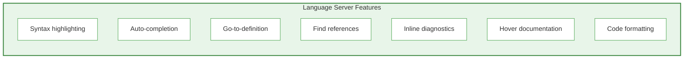

**Setup:** Check `crates/hedl-lsp` for editor-specific instructions. Works with VS Code, Neovim, Emacs, and any LSP-compatible editor.

---

## Community

### Where can I find more examples?

Multiple places to explore:

1. **Examples Guide**: [examples.md](examples.md) in this documentation
2. **Repository examples/**: Real-world usage patterns
3. **Crate examples/**: Each crate has its own examples
4. **Test files**: Often show edge cases and advanced usage

---

### How do I contribute?

We welcome contributions:

1. **Report bugs**: Open an issue on GitHub
2. **Request features**: Open an issue describing your use case
3. **Submit code**: Fork, branch, PR

Repository: [github.com/dweve-ai/hedl](https://github.com/dweve-ai/hedl)

---

### I'm still stuck

Resources in order:

1. **[User Guide](README.md)**: Overview and concepts
2. **[CLI Guide](cli-guide.md)**: Command reference
3. **[Troubleshooting Guide](troubleshooting.md)**: Detailed error solutions
4. **GitHub Issues**: Search or open new

Every question you ask might become documentation that helps the next person. Don't hesitate.

---

## Quick Reference Card

### CLI Commands

| Task | Command |
|------|---------|
| Validate | `hedl validate file.hedl` |
| Format | `hedl format file.hedl` |
| To JSON | `hedl to-json file.hedl -o f.json` |
| From JSON | `hedl from-json f.json -o f.hedl` |
| Token count | `hedl stats file.hedl --tokens` |
| Batch validate | `hedl batch-validate *.hedl` |
| Inspect parse | `hedl inspect file.hedl` |

### Syntax Elements

| Syntax | Example |
|--------|---------|
| Header | `%V:2.0` / `%NULL:~` / `%QUOTE:"` |
| Schema | `%S:User:[id,name,email]` |
| Nest | `%N:Parent>Child` |
| Separator | `---` |
| Entity list | `users:@User` |
| Matrix row | ` \|u1,Alice,alice@example.com` |
| Reference | `@u1` |
| Comment | `# This is a comment` |
| Null | `~` |
| Quoted string | `"Hello, World!"` |

---

You've reached the end. But this isn't really an end. It's a beginning. Every question answered here started as confusion. Your next question might become someone else's clarity.

Welcome to HEDL.
