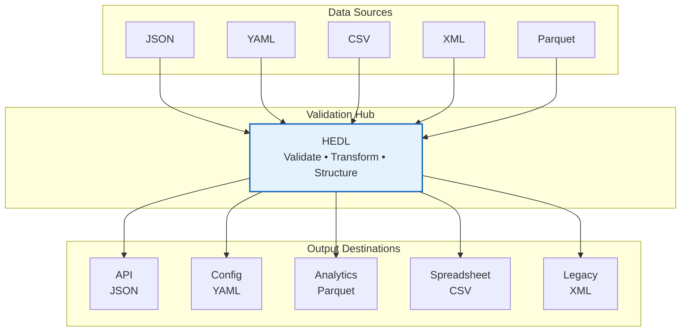
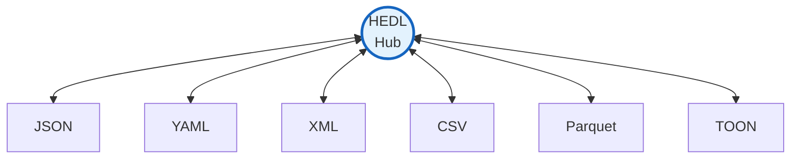
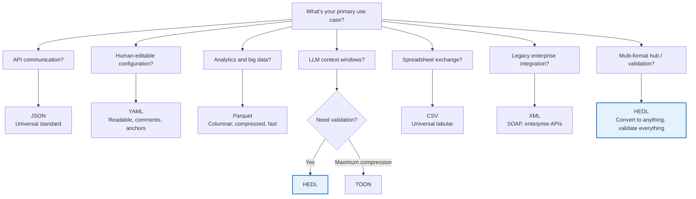
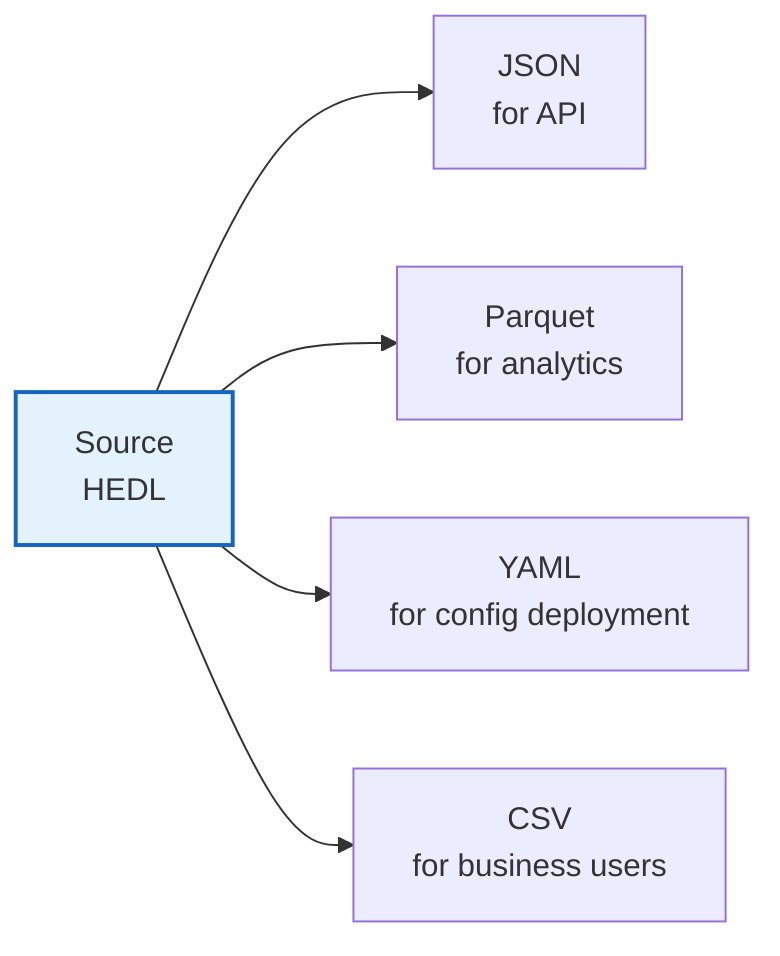

# Format Conversion Guide: Speaking Every Language

Every data format exists because someone, somewhere, had a problem to solve.

JSON conquered the web because JavaScript needed objects. CSV survived for fifty years because spreadsheets rule the business world. Parquet emerged when data scientists realized scanning every column for one field was insane. YAML appeared because developers wanted to read their configs without going cross-eyed from curly braces.

Each format has its territory. Its champions. Its legitimate use cases.

HEDL doesn't compete with these formats. It translates between them. Your data enters HEDL, gets validated, understood, and exits in whatever format the destination requires. One source of truth. Many outputs.



This guide shows you how to move between worlds.

---

## The Conversion Hub

Before diving into specifics, understand the pattern:

**Any format can become any other format through HEDL.**



This isn't just convenience. It's strategy.

**The developer who uses JSON for everything** pays the tax every time: repeated field names, verbose syntax, no type safety. Convert to HEDL, save 50%+ tokens when feeding LLMs.

**The analyst stuck with CSV exports** loses hierarchy information. Convert through HEDL, gain structure, then export to Parquet for lightning queries.

**The enterprise team with XML legacy systems** can't easily feed data to modern tools. HEDL bridges the gap.

---

## JSON: The Universal Connector

JSON is everywhere. APIs speak it. Browsers understand it. Every programming language has a JSON library. You cannot escape JSON, and you shouldn't try to.

But JSON is verbose. Every object repeats every field name. Every string needs quotes. Every nested structure adds braces. When you're paying per token or debugging at 3 AM, that verbosity hurts.

### HEDL to JSON

```bash
# Compact JSON (one line, machine-readable)
hedl to-json data.hedl

# Pretty-printed JSON (indented, human-readable)
hedl to-json data.hedl --pretty

# With HEDL metadata embedded (for perfect round-trip)
hedl to-json data.hedl --metadata --pretty

# Save to file
hedl to-json data.hedl -o output.json
```

**Let's see the transformation:**

```hedl
%V:2.0
%NULL:~
%QUOTE:"
%S:User:[id,name,email,active]
---
users:@User
 |u1,Alice Chen,alice@company.com,true
 |u2,Bob Martinez,bob@company.com,false
 |u3,Carol Williams,carol@company.com,true
```

**Becomes (with `--pretty`):**

```json
{
  "users": [
    {
      "id": "u1",
      "name": "Alice Chen",
      "email": "alice@company.com",
      "active": true
    },
    {
      "id": "u2",
      "name": "Bob Martinez",
      "email": "bob@company.com",
      "active": false
    },
    {
      "id": "u3",
      "name": "Carol Williams",
      "email": "carol@company.com",
      "active": true
    }
  ]
}
```

Notice what happened:
- The schema `%S:User:[id,name,email,active]` exploded into four repeated keys per object
- Boolean values stayed booleans (not strings)
- The structure is preserved but verbose

**With `--metadata`, you get round-trip information:**

```json
{
  "users": {
    "__hedl_type__": "User",
    "__hedl_schema__": ["id", "name", "email", "active"],
    "items": [
      {"id": "u1", "name": "Alice Chen", "email": "alice@company.com", "active": true},
      {"id": "u2", "name": "Bob Martinez", "email": "bob@company.com", "active": false},
      {"id": "u3", "name": "Carol Williams", "email": "carol@company.com", "active": true}
    ]
  }
}
```

The `__hedl_*` fields let HEDL reconstruct the original schema when you convert back.

### JSON to HEDL

```bash
# Basic conversion
hedl from-json data.json

# Save to file
hedl from-json data.json -o data.hedl
```

**HEDL automatically detects arrays of similar objects and creates schemas:**

```json
{
  "products": [
    {"sku": "P001", "name": "Widget", "price": 19.99},
    {"sku": "P002", "name": "Gadget", "price": 29.99},
    {"sku": "P003", "name": "Gizmo", "price": 39.99}
  ]
}
```

**Becomes:**

```hedl
%V:2.0
%NULL:~
%QUOTE:"
%S:Product:[sku,name,price]
---
products:@Product
 |P001,Widget,19.99
 |P002,Gadget,29.99
 |P003,Gizmo,39.99
```

The repetition vanishes. Field names appear once. Data speaks for itself.

### Token Efficiency: The Real Numbers

For the products example above:

```
Format    Characters    Tokens (approx)    Relative Size
----------------------------------------------------------
JSON         198            ~52               100%
HEDL          92            ~23                44%
```

**Savings: 56% fewer tokens.**

Scale this to 10,000 products in an LLM context window, and you're saving thousands of tokens per request.

---

## YAML: The Configuration Champion

YAML exists because developers got tired of JSON's rigidity for config files. No quotes needed for strings. Comments allowed. Indentation defines structure.

If your config file will be edited by humans, YAML often wins.

### HEDL to YAML

```bash
# Convert to YAML
hedl to-yaml data.hedl

# Save to file
hedl to-yaml data.hedl -o config.yaml
```

**Example:**

```hedl
%V:2.0
%NULL:~
%QUOTE:"
---
# Application configuration
app:
 name:MyService
 environment:production

server:
 host:0.0.0.0
 port:8080
 workers:4

database:
 url:postgresql://localhost:5432/myapp
 pool_size:20
 timeout_seconds:30
```

**Becomes:**

```yaml
app:
  name: MyService
  environment: production

server:
  host: 0.0.0.0
  port: 8080
  workers: 4

database:
  url: postgresql://localhost:5432/myapp
  pool_size: 20
  timeout_seconds: 30
```

The structures map naturally. HEDL comments don't transfer (YAML comments are independent), but the data is identical.

### YAML to HEDL

```bash
# Convert from YAML
hedl from-yaml config.yaml

# Save to file
hedl from-yaml config.yaml -o config.hedl
```

**Why convert YAML to HEDL?**

1. **Validation**: HEDL can validate structure that YAML accepts blindly
2. **Type safety**: YAML's type inference is notoriously quirky ("Norway problem")
3. **Multi-format export**: Once in HEDL, export to any format

### The Norway Problem

YAML has infamous type coercion issues. The string "NO" (abbreviation for Norway) becomes boolean `false`. The string "1.0" might become float or string depending on context.

HEDL is explicit. When you write `country:NO`, it's the string "NO". When you write `active:false`, it's boolean false. No surprises.

---

## XML: The Enterprise Gateway

XML was the JSON of its era. Enterprise systems, SOAP APIs, document formats (Office documents are XML inside). If you work with legacy systems, you will encounter XML.

XML is verbose. Unforgivingly, painfully verbose. Tags wrap everything. Attributes add complexity. Namespaces confuse everyone.

But sometimes you have no choice.

### HEDL to XML

```bash
# Compact XML
hedl to-xml data.hedl

# Pretty-printed XML
hedl to-xml data.hedl --pretty

# Save to file
hedl to-xml data.hedl -o output.xml
```

**Example:**

```hedl
%V:2.0
%NULL:~
%QUOTE:"
---
catalog:
 book:
  title:The Rust Programming Language
  author:Steve Klabnik and Carol Nichols
  year:2019
  pages:552
```

**Becomes (with `--pretty`):**

```xml
<?xml version="1.0" encoding="UTF-8"?>
<catalog>
  <book>
    <title>The Rust Programming Language</title>
    <author>Steve Klabnik and Carol Nichols</author>
    <year>2019</year>
    <pages>552</pages>
  </book>
</catalog>
```

Every value gets wrapped in tags. The verbosity explosion is dramatic.

### XML to HEDL

```bash
# Convert from XML
hedl from-xml data.xml

# Save to file
hedl from-xml data.xml -o data.hedl
```

**XML attributes become regular HEDL fields:**

```xml
<book id="b1" format="hardcover">
  <title>Example Book</title>
  <price currency="USD">29.99</price>
</book>
```

**Becomes:**

```hedl
%V:2.0
%NULL:~
%QUOTE:"
---
book:
 id:b1
 format:hardcover
 title:Example Book
 price:
  currency:USD
  value:29.99
```

Attributes don't have a direct HEDL equivalent (HEDL doesn't distinguish between "attributes" and "child elements"), so they become regular fields. This is intentional: the distinction rarely matters for data processing.

### When XML is Unavoidable

- SOAP web services
- Legacy enterprise APIs
- RSS and Atom feeds
- Office document internals (OOXML)
- Configuration formats (Maven, Ant)

HEDL lets you work with XML data in a saner format, then export back when the destination demands XML.

---

## CSV: The Spreadsheet Standard

CSV is the lowest common denominator. Every spreadsheet opens it. Every database exports it. It's been around for fifty years and will outlive us all.

But CSV is flat. No hierarchy. No types (everything is a string until you decide otherwise). No comments. No schema.

### HEDL to CSV

```bash
# Convert to CSV
hedl to-csv data.hedl

# Save to file
hedl to-csv data.hedl -o output.csv
```

**Matrix lists convert directly:**

```hedl
%V:2.0
%NULL:~
%QUOTE:"
%S:Product:[id,name,price,quantity]
---
products:@Product
 |P001,Widget,19.99,100
 |P002,Gadget,29.99,50
 |P003,Gizmo,9.99,200
```

**Becomes:**

```csv
id,name,price,quantity
P001,Widget,19.99,100
P002,Gadget,29.99,50
P003,Gizmo,9.99,200
```

Clean and direct. The schema becomes the header row. Values fill the cells.

**Warning: Nested structures flatten.**

```hedl
%V:2.0
%NULL:~
%QUOTE:"
---
user:
 name:Alice
 address:
  city:Portland
  state:OR
```

CSV cannot represent this hierarchy. The conversion either flattens (e.g., `address.city`, `address.state` columns) or warns you that data will be lost.

### CSV to HEDL

```bash
# Convert from CSV (specify type name)
hedl from-csv data.csv -t Product

# Save to file
hedl from-csv data.csv -t Product -o products.hedl
```

**Important: The first column becomes the entity ID.**

```csv
id,name,email,signup_date
u1,Alice,alice@example.com,2024-01-15
u2,Bob,bob@example.com,2024-01-16
```

**Becomes:**

```hedl
%V:2.0
%NULL:~
%QUOTE:"
%S:User:[name,email,signup_date]
---
users:@User
 |u1,Alice,alice@example.com,2024-01-15
 |u2,Bob,bob@example.com,2024-01-16
```

Notice: `id` is extracted as the row identifier, not included in the schema fields. The remaining columns (`name`, `email`, `signup_date`) become the schema.

### Type Inference

HEDL examines CSV values and infers types:

```csv
id,name,age,active,score
1,Alice,30,true,95.5
2,Bob,25,false,87.3
```

HEDL recognizes:
- `age`: Integer (30, 25)
- `active`: Boolean (true, false)
- `score`: Float (95.5, 87.3)
- `name`: String (Alice, Bob)

The inference is conservative. If a column has mixed types, it becomes String.

---

## Parquet: The Analytics Engine

Parquet changed how big data works. Instead of storing rows together (like CSV), it stores columns together. When your query only needs one column out of fifty, Parquet reads only that column.

Parquet is binary. You can't open it in a text editor. But for analytics, nothing beats it.

### HEDL to Parquet

```bash
# Convert to Parquet (must specify output file)
hedl to-parquet data.hedl -o output.parquet
```

**Example:**

```hedl
%V:2.0
%NULL:~
%QUOTE:"
%S:Sale:[id,product,amount,timestamp,region]
%C:Sale.total=10000
---
sales:@Sale
 |s0001,Widget,99.99,2024-01-15T10:30:00Z,US-West
 |s0002,Gadget,149.99,2024-01-15T11:45:00Z,US-East
 |s0003,Widget,99.99,2024-01-15T12:00:00Z,EU-West
```

The output is a binary Parquet file optimized for columnar queries.

**Size comparison (10,000 sales records):**

```
Format      Size        Query for "region = US-West"
----------------------------------------------------
JSON        2.1 MB      Scan entire file
CSV         1.2 MB      Scan entire file
HEDL        0.8 MB      Scan entire file
Parquet     0.2 MB      Read only region column
```

Parquet is 10x smaller AND faster to query for specific columns.

### Parquet to HEDL

```bash
# Convert from Parquet
hedl from-parquet data.parquet -o data.hedl
```

Parquet's schema maps directly to HEDL schemas. Types are preserved perfectly.

### Type Mapping

```
Parquet Type      HEDL Type        Notes
-------------------------------------------------
INT32             Integer
INT64             Integer
FLOAT             Float
DOUBLE            Float
BOOLEAN           Boolean
BYTE_ARRAY        String
TIMESTAMP         String           ISO 8601 format
LIST              List             (a,b,c) syntax
```

### When to Use Parquet

- Data analytics pipelines
- Data warehousing (Snowflake, BigQuery, Redshift)
- Apache Spark processing
- Long-term archival (compressed, efficient)
- Any columnar query pattern

**The typical flow:**

```
Raw Data --> HEDL (validate, clean) --> Parquet (store, query)
```

HEDL catches errors before they reach your data warehouse.

---

## TOON: Token Optimization Maximized

TOON (Token-Oriented Object Notation) is a specialized format designed for one purpose: minimizing tokens when feeding data to LLMs.

TOON is even more compact than HEDL, but less human-readable. Use it when every token counts and human editing isn't expected.

### HEDL to TOON

```bash
# Generate TOON format
hedl to-toon data.hedl

# Save to file
hedl to-toon data.hedl -o output.toon
```

**Example:**

```hedl
%V:2.0
%NULL:~
%QUOTE:"
%S:User:[id,name,role]
---
users:@User
 |u1,Alice Chen,admin
 |u2,Bob Martinez,developer
 |u3,Carol Williams,analyst
```

**Becomes:**

```
users[3]{id,name,role}:
  u1,Alice Chen,admin
  u2,Bob Martinez,developer
  u3,Carol Williams,analyst
```

TOON removes the header directives, embeds count (`[3]`) and schema (`{id,name,role}`) inline, and uses minimal syntax.

### TOON to HEDL

```bash
# Convert TOON back to HEDL
hedl from-toon data.toon

# Save to file
hedl from-toon data.toon -o data.hedl
```

### Token Comparison

For 1,000 user records:

```
Format      Tokens      Relative
---------------------------------
JSON        38,500      100%
YAML        29,200       76%
XML         52,300      136%
CSV         12,800       33%
HEDL        17,000       44%
TOON        18,200       47%
```

Wait, TOON has MORE tokens than HEDL? Yes, in some cases. TOON's inline syntax adds characters. The actual savings depend on data structure.

**When TOON wins:**
- Deeply nested data
- Many small objects
- Repeated structure patterns

**When HEDL wins:**
- Tabular data (matrix lists)
- Documents with comments
- Data requiring validation

---

## Format Comparison Matrix

### Size and Efficiency

For a typical dataset of 1,000 user records with 5 fields each:

| Format | File Size | Tokens | Compression | Human-Readable |
|--------|-----------|--------|-------------|----------------|
| JSON | 125 KB | 38,500 | baseline | Yes |
| YAML | 98 KB | 29,200 | 22% smaller | Yes |
| XML | 187 KB | 52,300 | 50% larger | Barely |
| CSV | 45 KB | 12,800 | 64% smaller | Yes (flat) |
| HEDL | 55 KB | 17,000 | 56% smaller | Yes |
| Parquet | 18 KB | N/A | 86% smaller | No (binary) |
| TOON | 73 KB | 18,200 | 42% smaller | Minimal |

### Feature Support

| Feature | JSON | YAML | XML | CSV | Parquet | HEDL | TOON |
|---------|------|------|-----|-----|---------|------|------|
| Human-readable | Yes | Yes | Yes | Yes | No | Yes | ~ |
| Hierarchical | Yes | Yes | Yes | No | Yes | Yes | Yes |
| Type-safe | ~ | ~ | No | No | Yes | Yes | Yes |
| Comments | No | Yes | Yes | No | No | Yes | No |
| References | No | Yes | No | No | No | Yes | No |
| Streaming | Yes | No | Yes | Yes | Yes | Yes | Yes |
| Schema validation | No | No | ~ | No | Yes | Yes | No |
| Columnar queries | No | No | No | No | Yes | No | No |

### Decision Tree



---

## Best Practices

### The Golden Rule: HEDL as Source of Truth

Keep your canonical data in HEDL. Export to other formats as needed.



Changes happen in HEDL. Validation happens in HEDL. Exports regenerate automatically.

### Validation Pipeline

Always validate after conversion:

```bash
# Convert and validate in one pipeline
hedl from-json data.json -o temp.hedl && hedl validate temp.hedl

# Or with error handling
if hedl from-csv data.csv -t Record -o data.hedl; then
    if hedl validate data.hedl; then
        echo "Conversion successful and valid"
    else
        echo "Conversion succeeded but validation failed"
        exit 1
    fi
else
    echo "Conversion failed"
    exit 1
fi
```

### Round-Trip Preservation

When you need perfect round-trips (HEDL to JSON and back), use `--metadata`:

```bash
# Export with metadata
hedl to-json data.hedl --metadata -o export.json

# Import back (metadata detected automatically)
hedl from-json export.json -o restored.hedl

# Verify they match
diff <(hedl format data.hedl) <(hedl format restored.hedl)
```

Without `--metadata`, type information may be lost. A HEDL integer might become a JSON number, then return as a float.

### Batch Conversion

For multiple files, use batch operations:

```bash
# Convert all JSON files to HEDL
for f in data/*.json; do
    hedl from-json "$f" -o "hedl/${f%.json}.hedl"
done

# Or use parallel processing
ls data/*.json | parallel hedl from-json {} -o hedl/{/.}.hedl
```

### Format Chain Conversion

Any format to any format through HEDL:

```bash
# JSON to YAML
hedl from-json input.json -o temp.hedl
hedl to-yaml temp.hedl -o output.yaml

# CSV to Parquet
hedl from-csv data.csv -t Record -o temp.hedl
hedl to-parquet temp.hedl -o data.parquet

# XML to JSON
hedl from-xml legacy.xml -o temp.hedl
hedl to-json temp.hedl --pretty -o modern.json
```

### Performance Considerations

**Large files (> 100 MB):**
- Consider streaming conversions
- Split into chunks if possible
- Increase memory limits: `export HEDL_MAX_FILE_SIZE=2147483648`

**Many small files:**
- Use parallel processing: `--parallel` flag
- Process in batches to reduce overhead

**Memory-constrained environments:**
- Prefer Parquet for storage (smallest)
- Use streaming when available
- Process sequentially rather than parallel

---

## Advanced: Neo4j Integration

Neo4j support is available through the `hedl-neo4j` library crate, not the CLI.

HEDL's reference system maps naturally to graph relationships. Entities become nodes. References become edges. Schemas define node labels.

### Library Usage

```rust
use hedl_core::parse;
use hedl_neo4j::{to_cypher, ToCypherConfig};

let doc = parse(br#"
%V:2.0
%NULL:~
%QUOTE:"
%S:Person:[id,name]
%S:Knows:[person,knows,since]
---
people:@Person
 |p1,Alice
 |p2,Bob
 |p3,Carol

relationships:@Knows
 |r1,@p1,@p2,2020
 |r2,@p2,@p3,2021
"#)?;

let config = ToCypherConfig::default();
let cypher = to_cypher(&doc, &config)?;
// Execute cypher against Neo4j
```

**Generated Cypher:**

```cypher
CREATE (p1:Person {id: 'p1', name: 'Alice'})
CREATE (p2:Person {id: 'p2', name: 'Bob'})
CREATE (p3:Person {id: 'p3', name: 'Carol'})
MATCH (a:Person {id: 'p1'}), (b:Person {id: 'p2'})
CREATE (a)-[:KNOWS {since: 2020}]->(b)
MATCH (a:Person {id: 'p2'}), (b:Person {id: 'p3'})
CREATE (a)-[:KNOWS {since: 2021}]->(b)
```

For complete Neo4j documentation, see the [Neo4j Integration Guide](guides/neo4j-integration.md).

---

## Summary

| Format  | Best For | Avoid When |
|---------|----------|------------|
| JSON    | APIs, web | LLM context, analytics |
| YAML    | Config, human editing | Binary data, large files |
| XML     | Legacy, enterprise | New projects, readability |
| CSV     | Tabular, spreadsheets | Hierarchical data |
| Parquet | Analytics, archival | Human editing, small files |
| TOON    | Maximum LLM compression | Validation needed, debugging |
| HEDL    | Hub, validation, LLM | API responses (use JSON) |

HEDL doesn't replace these formats. It translates between them. Your data enters HEDL for validation and transformation, then exits in whatever format the world demands.

---

**Need more?**

- **[CLI Guide](cli-guide.md)**: Every command, every flag
- **[Examples](examples.md)**: Real-world patterns
- **[Troubleshooting](troubleshooting.md)**: When conversions fail
