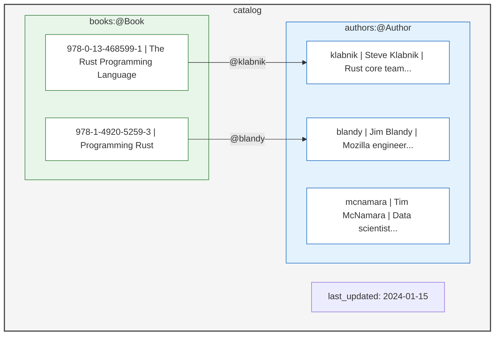

# Getting Started: Your First Hour with HEDL

Picture this moment.

You're sitting at your desk, staring at a JSON file. It's 47 megabytes of customer records that need to go to an LLM for analysis. You do the math: at roughly 4 characters per token, that's about 12 million tokens. At current pricing, sending this data once will cost you $36.

But you look at the file more closely. The same six field names are repeated for every single customer. Over and over. `"customer_id"`, `"first_name"`, `"last_name"`, `"email"`, `"created_at"`, `"status"`. 800,000 times those same words appear. You're not paying $36 for data. You're paying $15 for data and $21 for repetition.

What if there was a format that stored those field names once, at the top, and then just stored the values? What if that format also caught errors that JSON silently accepts? What if you could convert between JSON, CSV, Parquet, and this format effortlessly?

That's HEDL. And in the next hour, you're going to learn it by building something real.

---

## What We're Building

We're going to take a bookstore's inventory data through a complete workflow:

1. Start with messy JSON (the way data usually arrives)
2. Convert it to HEDL and see the token savings
3. Add proper schemas and catch a data error
4. Create relationships between entities
5. Export to JSON, CSV, and Parquet for different systems
6. Use canonical formatting for version control

By the end, you'll understand HEDL not as an abstract concept but as a practical tool you can use tomorrow.

Open your terminal. Let's begin.

---

## Installing HEDL

You need the HEDL command-line tool. If you have Rust installed (and you should, it's wonderful), run:

```bash
cargo install hedl-cli
```

This compiles HEDL from source and installs it to `~/.cargo/bin/`. The process takes about a minute on a modern machine.

When it finishes, verify the installation:

```bash
hedl --version
```

You should see something like:

```
hedl-cli 2.0.0
```

**Don't have Rust?** You can install it in two minutes from [rustup.rs](https://rustup.rs). Just copy the command they show you, paste it into your terminal, and follow the prompts. Or, if you prefer pre-built binaries, grab them from our [releases page](https://github.com/dweve-ai/hedl/releases).

**Getting "command not found"?** Your shell might not know where cargo installs binaries. Add this to your `~/.bashrc` or `~/.zshrc`:

```bash
export PATH="$HOME/.cargo/bin:$PATH"
```

Then restart your terminal or run `source ~/.bashrc`.

---

## The Scenario: A Bookstore's Catalog

You're building software for a local bookstore. They've given you a JSON export of their catalog. Let's create that file.

Make a new directory for this tutorial and create `books.json`:

```bash
mkdir hedl-tutorial
cd hedl-tutorial
```

Now create `books.json` with this content:

```json
{
  "catalog": {
    "last_updated": "2024-01-15",
    "books": [
      {"isbn": "978-0-13-468599-1", "title": "The Rust Programming Language", "author": "Steve Klabnik", "price": 59.99, "in_stock": true, "quantity": 23},
      {"isbn": "978-1-4920-5259-3", "title": "Programming Rust", "author": "Jim Blandy", "price": 69.99, "in_stock": true, "quantity": 15},
      {"isbn": "978-1-61729-721-4", "title": "Rust in Action", "author": "Tim McNamara", "price": 49.99, "in_stock": true, "quantity": 42},
      {"isbn": "978-0-59-651798-1", "title": "JavaScript: The Good Parts", "author": "Douglas Crockford", "price": 29.99, "in_stock": false, "quantity": 0},
      {"isbn": "978-1-49-195017-1", "title": "Python Crash Course", "author": "Eric Matthes", "price": 39.99, "in_stock": true, "quantity": 8}
    ]
  }
}
```

Five books. A simple catalog. But look at it carefully.

Every book object contains six field names: `isbn`, `title`, `author`, `price`, `in_stock`, `quantity`. With five books, that's 30 repetitions of field names that don't change.

Now imagine this catalog with 50,000 books. Those repeated field names would account for roughly 40% of the file. Every API call, every LLM request, every network transfer carries that redundant weight.

This is the problem HEDL solves. Let's see how.

---

## Converting to HEDL

Run this command:

```bash
hedl from-json books.json -o books.hedl
```

Now open `books.hedl` and see what happened:

```hedl
%V:2.0
%NULL:~
%QUOTE:"
---
catalog:
 last_updated:2024-01-15
 books:
  |978-0-13-468599-1,The Rust Programming Language,Steve Klabnik,59.99,true,23
  |978-1-4920-5259-3,Programming Rust,Jim Blandy,69.99,true,15
  |978-1-61729-721-4,Rust in Action,Tim McNamara,49.99,true,42
  |978-0-59-651798-1,"JavaScript: The Good Parts",Douglas Crockford,29.99,false,0
  |978-1-49-195017-1,Python Crash Course,Eric Matthes,39.99,true,8
```

Look at the books section. No field names in sight. Just the values, separated by commas, each row starting with a pipe (`|`).

But wait. How does anyone know what those values mean? How does the parser know which value is the title and which is the price?

The answer: we need to add a **schema**.

---

## Understanding HEDL Structure

Before we add the schema, let's understand what we're looking at:

```
%V:2.0          ← Version declaration (required)
%NULL:~         ← What symbol represents "no value" (required)
%QUOTE:"        ← What character quotes strings (required)
---             ← Separator between header and body
catalog:        ← An entity called "catalog"
 last_updated:  ← A field within catalog
 books:         ← Another field, containing rows
  |...          ← Each row is one book
```

The header (everything before `---`) contains configuration and schema definitions. The body (everything after `---`) contains your actual data.

One space of indentation means one level of nesting. The `books` rows are indented two spaces because they're inside `catalog` (one level) and inside `books` (another level).

This is HEDL's core philosophy: **structure through indentation, efficiency through schemas**.

---

## Adding a Schema

Edit `books.hedl` to add a schema declaration:

```hedl
%V:2.0
%NULL:~
%QUOTE:"
%S:Book:[isbn,title,author,price,in_stock,quantity]
---
catalog:
 last_updated:2024-01-15
 books:@Book
  |978-0-13-468599-1,The Rust Programming Language,Steve Klabnik,59.99,true,23
  |978-1-4920-5259-3,Programming Rust,Jim Blandy,69.99,true,15
  |978-1-61729-721-4,Rust in Action,Tim McNamara,49.99,true,42
  |978-0-59-651798-1,"JavaScript: The Good Parts",Douglas Crockford,29.99,false,0
  |978-1-49-195017-1,Python Crash Course,Eric Matthes,39.99,true,8
```

We added two things:

**Line 4:** `%S:Book:[isbn,title,author,price,in_stock,quantity]`

This declares a schema called "Book" with six columns. The columns are ordered: first value is isbn, second is title, and so on.

**Line 8:** `books:@Book`

The `@Book` annotation tells the parser: "The rows below follow the Book schema." Now the parser knows exactly what each value means.

---

## Validating Your Document

Let's make sure everything is correct:

```bash
hedl validate books.hedl
```

If you see nothing, that's perfect. Silence means success in Unix tradition. Your document is valid.

Let's see how the sizes compare:

```bash
hedl stats books.hedl --tokens
```

Output:

```
Format Comparison for 'books.hedl':

Sizes:
  HEDL:         512 bytes
  JSON:         798 bytes   (+55.9%)
  JSON pretty:  1,247 bytes (+143.6%)
  YAML:         891 bytes   (+74.0%)

Token Estimates (cl100k_base):
  HEDL:         128 tokens
  JSON:         200 tokens  (+56.3%, +72 tokens)
  YAML:         223 tokens  (+74.2%, +95 tokens)

Token Savings:
  vs JSON:      72 tokens saved (36% reduction)
  vs YAML:      95 tokens saved (43% reduction)
```

With just five books, we're saving 36% of tokens compared to JSON.

But here's where it gets interesting. That 36% comes from eliminating repetition. With five books, each field name appears 5 times in JSON but only 1 time in HEDL (in the schema). The ratio is 5:1.

With 50,000 books, each field name would appear 50,000 times in JSON but still only 1 time in HEDL. The ratio becomes 50,000:1. The savings grow with your data.

---

## Breaking Things (On Purpose)

The best way to understand validation is to trigger it. Let's add a book with a missing value.

Add this line to your `books.hedl`, at the end of the books list:

```hedl
  |978-1-59-327584-6,Clean Code,Robert Martin,44.99,true
```

Notice we only have five values, but our schema expects six (missing `quantity`). Save and validate:

```bash
hedl validate books.hedl
```

Output:

```
Error at line 14: Schema mismatch for 'Book'
  Expected 6 columns: isbn, title, author, price, in_stock, quantity
  Found 5 values: 978-1-59-327584-6, Clean Code, Robert Martin, 44.99, true
  Missing column: quantity
```

The parser caught our mistake immediately.

In JSON, this would have silently created an object with a missing field. You'd discover the problem at runtime, perhaps in production, when code tried to read `quantity` and got `undefined`. The bug would be far from its cause, wrapped in stack traces and confusion.

HEDL catches it at parse time, right where you made the mistake.

Fix the line by adding the quantity:

```hedl
  |978-1-59-327584-6,Clean Code,Robert Martin,44.99,true,31
```

Validate again to confirm the fix.

---

## Adding Relationships Between Entities

Your bookstore client calls with a new requirement. They want to track authors as separate entities, with bios and photos, so they can display author pages and list "all books by this author."

Currently, author names are just strings repeated in each book. If Steve Klabnik writes three books, his name appears three times, with no connection between them.

Let's fix that with **references**.

Edit `books.hedl`:

```hedl
%V:2.0
%NULL:~
%QUOTE:"
%S:Author:[id,name,bio]
%S:Book:[isbn,title,author,price,in_stock,quantity]
---
catalog:
 last_updated:2024-01-15

 authors:@Author
  |klabnik,Steve Klabnik,"Rust core team member and educator"
  |blandy,Jim Blandy,"Mozilla engineer and Rust contributor"
  |mcnamara,Tim McNamara,"Data scientist and Rust advocate"
  |crockford,Douglas Crockford,"Creator of JSON and JavaScript expert"
  |matthes,Eric Matthes,"High school teacher and Python author"
  |martin,Robert Martin,"Clean code advocate and software craftsman"

 books:@Book
  |978-0-13-468599-1,The Rust Programming Language,@klabnik,59.99,true,23
  |978-1-4920-5259-3,Programming Rust,@blandy,69.99,true,15
  |978-1-61729-721-4,Rust in Action,@mcnamara,49.99,true,42
  |978-0-59-651798-1,"JavaScript: The Good Parts",@crockford,29.99,false,0
  |978-1-49-195017-1,Python Crash Course,@matthes,39.99,true,8
  |978-1-59-327584-6,Clean Code,@martin,44.99,true,31
```

Look at the books now. Instead of `Steve Klabnik`, we have `@klabnik`. The `@` prefix creates a **reference** to the author entity with ID `klabnik`.

This is more than syntax sugar. References are **validated**. Let's prove it.

Change one book to reference a nonexistent author:

```hedl
  |978-0-13-468599-1,The Rust Programming Language,@nobody,59.99,true,23
```

Validate:

```bash
hedl validate books.hedl
```

Output:

```
Error at line 19: Unresolved reference
  @nobody does not exist
  Referenced from: catalog.books[0].author
  Available authors: blandy, crockford, klabnik, martin, matthes, mcnamara
```

The parser knows `@nobody` should point to an entity. It knows no such entity exists. It even helpfully lists the entities that do exist.

In a document with 50,000 books and 5,000 authors, the parser would catch every broken reference. No dangling pointers. No null reference exceptions at 3 AM.

Fix the reference back to `@klabnik` before continuing.

---

## The Relationship Graph

Here's what we've built:



The books reference the authors. The parser validates those references. When you convert to other formats, you can choose to keep the references as IDs or expand them to include the full author data.

---

## Exporting to Multiple Formats

The bookstore needs this data in three places:

1. **Website**: Expects JSON for the JavaScript frontend
2. **Warehouse**: Expects CSV for inventory management
3. **Analytics**: Expects Parquet for data science queries

Let's generate all three:

```bash
# JSON for the website
hedl to-json books.hedl --pretty -o books_website.json

# CSV for the warehouse
hedl to-csv books.hedl -o books_warehouse.csv

# Parquet for analytics
hedl to-parquet books.hedl -o books_analytics.parquet
```

Open `books_website.json` and you'll see properly structured JSON with all entities expanded. The website team can use it directly.

Open `books_warehouse.csv` and you'll see clean tabular data that imports directly into spreadsheets and warehouse systems.

The Parquet file is binary, but if you have tools like DuckDB or PyArrow, you can query it with SQL or load it into pandas DataFrames.

One source file. Three output formats. No manual conversion, no copy-paste errors, no format drift.

---

## Canonical Formatting

Your colleague sends you a HEDL file. It's messy: inconsistent spacing, schemas in random order, trailing whitespace. You want to clean it up.

More importantly, you want every version of every HEDL file in your project to look exactly the same. Consistent formatting means meaningful diffs in version control.

HEDL has a canonical format:

```bash
hedl format books.hedl -o books_canonical.hedl
```

The output is **deterministic**. Run format on the same data a million times, you get the exact same bytes every time.

Why does this matter?

**Version control:** When you commit HEDL files to git, the only changes in the diff are real data changes. No noise from whitespace reformatting.

**Caching:** You can hash the canonical form and use it as a cache key. Same data means same hash means cache hit.

**Comparison:** Two documents with identical data produce identical canonical output, even if they were originally written with different spacing.

Want to check if a file is already canonical without modifying it?

```bash
hedl format --check books.hedl
```

Exit code 0 means already canonical. Exit code 1 means formatting needed, with output showing what would change.

This is perfect for CI pipelines:

```yaml
# In your GitHub Actions workflow
- name: Check HEDL formatting
  run: hedl batch-format --check **/*.hedl
```

Fail the build if anyone commits unformatted HEDL.

---

## Batch Operations

Real projects have many files. Let's say you have a `data/` directory with dozens of HEDL files:

```bash
hedl batch-validate data/*.hedl
```

Output:

```
Validating 47 files...
Progress: [████████████████████████████████████████] 47/47 (100%)
Completed in 0.8s (59 files/sec)

Results:
  Valid: 45 files
  Failed: 2 files
    - data/legacy.hedl: Parse error at line 23: unexpected token
    - data/broken.hedl: Unresolved reference @unknown
```

Batch operations run in parallel across your CPU cores. On an 8-core machine processing 100 files, you'll see roughly 4x speedup compared to validating them one by one.

Format all files:

```bash
hedl batch-format data/*.hedl --output-dir formatted/
```

Every file gets formatted and written to `formatted/`. The originals are untouched.

Lint all files for best practices:

```bash
hedl batch-lint data/*.hedl
```

Get warnings about unused schemas, short IDs, deep nesting, and other code smells.

---

## Setting Up Your Editor

Writing HEDL is dramatically better with proper editor support. The HEDL language server provides:

**Syntax highlighting.** Schemas, references, values, comments, all in distinct colors.

**Real-time error detection.** Mistakes are underlined in red as you type, before you even save.

**Autocomplete.** Type `@k` and see `@klabnik`, `@crockford` as suggestions.

**Hover documentation.** Hover over `@Book` to see its column definitions.

**Go to definition.** Click on `@klabnik` and jump to where `klabnik` is defined.

**Format on save.** Your files stay canonical automatically.

Install the language server:

```bash
cargo install hedl-lsp
```

Then configure your editor:

**VS Code:** Install the "HEDL" extension from the marketplace.

**Neovim:** Add to your LSP config:

```lua
require('lspconfig').hedl_lsp.setup{}
```

**Other editors:** Any editor supporting LSP can use `hedl-lsp`. Point it at the binary and associate `.hedl` files.

See the [LSP API documentation](../api/lsp-api.md) for detailed setup instructions.

---

## What You've Accomplished

Let's take stock. In this session, you:

1. **Installed HEDL** and verified it works

2. **Converted JSON to HEDL** and saw 36% token savings on a tiny dataset (larger datasets save more)

3. **Added schemas** to give meaning to your data and enable validation

4. **Triggered validation errors** intentionally and saw how HEDL catches mistakes at parse time

5. **Created relationships** between entities using type-safe references that the parser validates

6. **Exported to JSON, CSV, and Parquet** from a single source file

7. **Used canonical formatting** to ensure consistent, diffable files

8. **Processed files in batches** for efficiency

These aren't just features. They're a workflow. A way of thinking about data that catches errors early, reduces costs, and keeps everything in sync.

---

## The Token Economics

Let's return to where we started: that 47 MB JSON file costing $36 to send to an LLM.

If you convert that file to HEDL with proper schemas, you'd likely see:

- **55-65% token reduction** depending on how repetitive your field names are
- **$36 becomes $13-16** for the same data
- **Multiply by daily API calls** and the savings compound

If you make 100 API calls per day with that data:
- JSON: $3,600/day
- HEDL: $1,300-1,600/day
- **Monthly savings: $60,000-70,000**

And that's just the direct cost. HEDL also gives you:

- **Faster responses** because fewer tokens means less processing time
- **Larger effective context** because you can fit more data in the same token budget
- **Fewer runtime errors** because validation happens at parse time

The economics make sense. The developer experience is better. The data is safer.

---

## Where to Go from Here

You have the foundation. Here's how to build on it:

**See more patterns:**
The [Examples](examples.md) page shows real-world patterns: configuration files, API responses, knowledge graphs, data pipelines, LLM context optimization.

**Learn every command:**
The [CLI Guide](cli-guide.md) documents every command, every flag, every environment variable.

**Understand the concepts:**
- [Data Model](concepts/data-model.md) explains how HEDL represents different kinds of data
- [Type System](concepts/type-system.md) covers scalars, collections, and type inference
- [References](concepts/references.md) goes deep on entity linking and graph structures
- [Canonicalization](concepts/canonicalization.md) explains deterministic formatting

**Integrate with your code:**
The [API Documentation](../api/README.md) covers Rust, Python, JavaScript, WASM, and FFI bindings.

**When things go wrong:**
Check the [FAQ](faq.md) for common questions or [Troubleshooting](troubleshooting.md) for error resolution.

---

## One More Thing

Remember the bookstore catalog we built? Let's do one final experiment.

Run the stats command on your final `books.hedl`:

```bash
hedl stats books.hedl --tokens
```

Now imagine scaling that catalog to 50,000 books. The schema stays the same size. The header stays the same size. Only the data rows grow.

In JSON, every single book would repeat those six field names. 300,000 repetitions.

In HEDL, those field names appear once. Just once. Forever.

That's the difference between paying for data and paying for repetition.

Go build something with it.
