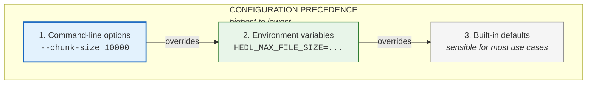

# Configuration Reference

HEDL is designed to work out of the box with sensible defaults. But sometimes "out of the box" isn't quite right for your environment.

Maybe you're processing files larger than the default limit. Maybe you're running in a container with constrained resources. Maybe you need to squeeze every last bit of performance from parallel operations.

This reference documents every configuration option, when to change it, and what happens when you do.

---

## Configuration Methods

HEDL configuration happens through environment variables and command-line options. There's a simple hierarchy:



Command-line options override environment variables, which override defaults.

---

## Environment Variables

### Resource Limits

#### `HEDL_MAX_FILE_SIZE`

Maximum file size HEDL will process.

| Property | Value |
|----------|-------|
| **Default** | 1073741824 (1 GB) |
| **Type** | Integer (bytes) |
| **Purpose** | Prevent out-of-memory crashes from unexpectedly large files |

**When to change it:**
- You regularly process files larger than 1 GB
- You're in a memory-constrained environment and want a smaller limit
- You're testing and want to force streaming behavior on smaller files

**Examples:**

```bash
# Allow 5 GB files
export HEDL_MAX_FILE_SIZE=5368709120
hedl validate large.hedl

# Restrict to 100 MB (for containers with limited memory)
export HEDL_MAX_FILE_SIZE=104857600
hedl validate medium.hedl

# Temporary override for one command
HEDL_MAX_FILE_SIZE=10737418240 hedl validate huge.hedl
```

**What happens when exceeded:**

```
Error: File exceeds maximum size
  File size: 2.3 GB
  Maximum allowed: 1.0 GB
  Hint: Set HEDL_MAX_FILE_SIZE to allow larger files
        or use --stream for memory-efficient processing
```

---

### Performance Tuning

#### `RAYON_NUM_THREADS`

Controls the thread count for parallel operations (batch commands with `--parallel`).

| Property | Value |
|----------|-------|
| **Default** | Number of CPU cores |
| **Type** | Integer |
| **Scope** | Rayon library (not HEDL-specific) |

**When to change it:**
- You want to limit CPU usage (leave cores for other processes)
- You're in a container with CPU limits
- You're benchmarking and want consistent results

**Examples:**

```bash
# Use 4 threads regardless of core count
export RAYON_NUM_THREADS=4
hedl batch-validate *.hedl --parallel

# Use only 2 threads (when running alongside other heavy processes)
RAYON_NUM_THREADS=2 hedl batch-format *.hedl --output-dir out/ --parallel

# Maximum parallelism (explicit)
RAYON_NUM_THREADS=16 hedl batch-validate *.hedl --parallel
```

**Performance characteristics (1000 files, 100 KB each):**

| Threads | Time | CPU Usage | Notes |
|---------|------|-----------|-------|
| 1 | 45.2s | 12% | Sequential baseline |
| 2 | 23.1s | 24% | 2x speedup |
| 4 | 12.8s | 48% | 3.5x speedup |
| 8 | 7.2s | 92% | 6.3x speedup |
| 16 | 6.9s | 95% | Diminishing returns |

Beyond your core count, adding threads rarely helps and can hurt due to context switching overhead.

---

## Security Settings

### DOS Protection

HEDL includes built-in protection against denial-of-service attacks through resource exhaustion.

#### Default Resource Limits

| Resource | Default Limit | Purpose |
|----------|--------------|---------|
| File size | 1 GB | Prevent memory exhaustion |
| Nesting depth | 100 levels | Prevent stack overflow |
| String length | 10 MB | Prevent excessive allocation |
| Total entities | 10 million | Prevent memory exhaustion |

These limits protect against:
- **Malformed input**: Files designed to consume excessive resources
- **Accidental explosions**: Legitimate files that are unexpectedly large
- **Memory exhaustion**: Running out of RAM and crashing

#### Safe Defaults Philosophy

The default configuration is designed for:

1. **Security first**: Limits are conservative by default
2. **Common use cases**: 99% of users never need to change anything
3. **Explicit override**: Raising limits requires intentional action
4. **Clear errors**: When limits are hit, error messages explain how to proceed

---

## Performance Tuning Guide

### By File Size

#### Small Files (<10 MB)

Use defaults. No tuning needed.

```bash
hedl validate small.hedl
hedl to-json small.hedl -o output.json
```

#### Medium Files (10-100 MB)

Still use defaults. HEDL handles these efficiently.

```bash
hedl validate medium.hedl
hedl to-json medium.hedl -o output.json
```

#### Large Files (100 MB - 1 GB)

Consider streaming if memory is constrained:

```bash
# Traditional (if you have the RAM)
hedl validate large.hedl

# Streaming (constant memory)
hedl validate large.hedl --stream
```

#### Very Large Files (>1 GB)

Streaming is required. Adjust limits as needed:

```bash
# Increase file size limit
export HEDL_MAX_FILE_SIZE=10737418240  # 10 GB

# Use streaming
hedl validate huge.hedl --stream --progress
hedl to-parquet huge.hedl --stream --compression snappy -o output.parquet
```

### By Operation Type

#### Batch Validation

```bash
# Many small files: parallelize
hedl batch-validate *.hedl --parallel

# Few large files: streaming might be better
for f in *.hedl; do hedl validate "$f" --stream; done
```

#### Format Conversion

```bash
# Small to medium files: direct conversion
hedl to-json input.hedl -o output.json

# Large files: streaming with progress
hedl to-json input.hedl --stream --progress -o output.json

# Very large files: streaming with compression
hedl to-json input.hedl --stream | gzip > output.json.gz
```

---

## Monitoring and Debugging

### Verbose Output

Get detailed information about what HEDL is doing:

```bash
hedl validate data.hedl --verbose
```

Verbose mode shows:
- Parsing progress
- Memory allocation
- Reference resolution steps
- Timing information

### Debug Logging

For deep debugging, enable Rust's debug logging:

```bash
RUST_LOG=debug hedl validate data.hedl
```

This produces a lot of output. Use for troubleshooting specific issues.

### Performance Measurement

```bash
# Wall-clock time
time hedl validate data.hedl

# Detailed resource usage (Linux)
/usr/bin/time -v hedl validate data.hedl

# Detailed resource usage (macOS)
/usr/bin/time -l hedl validate data.hedl
```

Key metrics to watch:
- **Wall time**: Overall execution time
- **Maximum resident set size**: Peak memory usage
- **CPU utilization**: Are you using all cores with `--parallel`?

---

## Common Configuration Profiles

### Development (Permissive)

When developing and testing, you might want relaxed limits:

```bash
export HEDL_MAX_FILE_SIZE=10737418240  # 10 GB
```

### Production (Secure)

In production, stick with defaults or be more restrictive:

```bash
# Defaults are secure
hedl validate input.hedl

# Or explicitly restrict
export HEDL_MAX_FILE_SIZE=524288000  # 500 MB limit
```

### CI/CD Pipeline

For automated testing, optimize for speed and consistency:

```bash
# Consistent thread count for reproducible timing
export RAYON_NUM_THREADS=4

# Strict limits to catch issues early
export HEDL_MAX_FILE_SIZE=104857600  # 100 MB

# Validation with canonical format check
hedl batch-validate *.hedl --parallel
hedl batch-format *.hedl --check
```

### Container/Kubernetes

In memory-constrained containers:

```bash
# Limit memory usage
export HEDL_MAX_FILE_SIZE=268435456  # 256 MB

# Limit parallelism based on container CPU limit
export RAYON_NUM_THREADS=2

# Prefer streaming for any non-trivial files
hedl validate data.hedl --stream
```

---

## Planned Features

### Configuration Files (Future)

Configuration file support is planned:

```yaml
# ~/.hedlrc (proposed)
max_file_size: 5GB
parallel_threads: 8
default_format: json
```

- YAML or TOML format
- Per-project configuration (`./.hedlrc`)
- User-wide configuration (`~/.hedlrc`)
- System-wide configuration (`/etc/hedl/config.yaml`)

This feature is not yet implemented.

---

## Quick Reference

### Environment Variables

| Variable | Default | Description |
|----------|---------|-------------|
| `HEDL_MAX_FILE_SIZE` | 1073741824 | Maximum file size in bytes |
| `RAYON_NUM_THREADS` | CPU cores | Thread count for parallel operations |

### Common Commands with Configuration

```bash
# Increase file size limit
HEDL_MAX_FILE_SIZE=5368709120 hedl validate large.hedl

# Limit parallelism
RAYON_NUM_THREADS=4 hedl batch-validate *.hedl --parallel

# Memory monitoring
/usr/bin/time -v hedl validate data.hedl

# Debug output
RUST_LOG=debug hedl validate data.hedl
```

---

**Related:**
- [CLI Guide](../cli-guide.md) for command-line options
- [Troubleshooting](../troubleshooting.md) for error resolution
- [Batch Processing Tutorial](../tutorials/03-batch-processing.md) for parallel processing patterns
