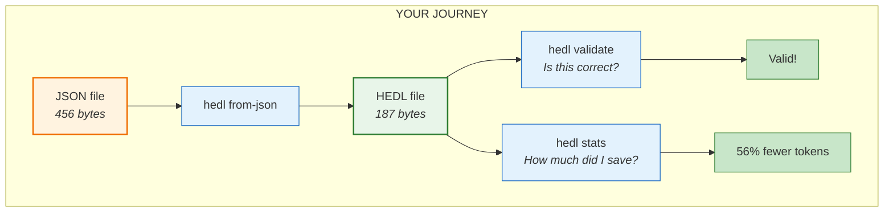
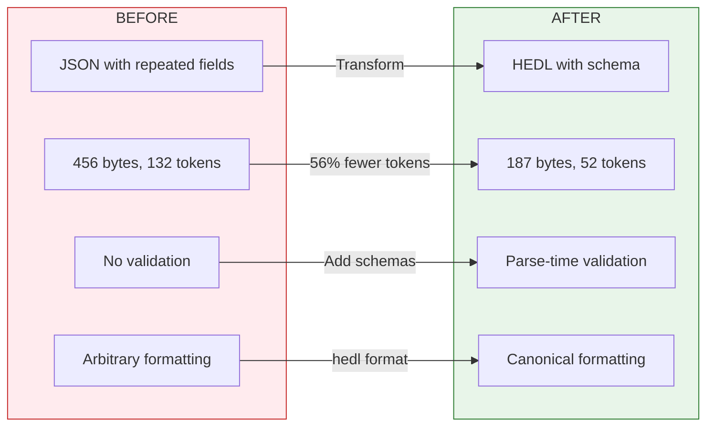

# Tutorial: Your First Conversion

**Time:** 10 minutes | **Difficulty:** You've got this

Let's start with something real.

You have a JSON file. Maybe it's a product catalog, maybe it's customer data, maybe it's an API response you're about to send to an LLM. Whatever it is, it's costing you more than it should.

Here's the thing: JSON was designed for humans to read and machines to parse. But you're not reading it. You're sending it over networks, storing it in databases, feeding it to language models. And every single time, you're paying for something you don't need: the field names, repeated over and over, consuming bandwidth, storage, and tokens.

In the next ten minutes, you're going to convert that JSON to HEDL. You're going to see the size drop. You're going to understand why. And you're never going to look at repetitive data the same way again.

---

## What We're Building



By the end, you'll have converted a file, validated it, measured the savings, and understood exactly why HEDL exists.

---

## Step 1: Create Your JSON File

Let's start with a product catalog. Create a file named `products.json`:

```json
{
  "products": [
    {
      "id": "p1",
      "name": "Wireless Mouse",
      "category": "Electronics",
      "price": 29.99,
      "in_stock": true
    },
    {
      "id": "p2",
      "name": "Mechanical Keyboard",
      "category": "Electronics",
      "price": 149.99,
      "in_stock": true
    },
    {
      "id": "p3",
      "name": "USB-C Hub",
      "category": "Electronics",
      "price": 79.99,
      "in_stock": false
    },
    {
      "id": "p4",
      "name": "Monitor Stand",
      "category": "Accessories",
      "price": 44.99,
      "in_stock": true
    }
  ]
}
```

Look at this file carefully. Count how many times you see the word `"id"`. Four times. Count `"name"`. Four times. Count `"category"`, `"price"`, `"in_stock"`. Four times each.

That's 20 repetitions of field names for just 4 products. With 4,000 products, that would be 20,000 repetitions. With 400,000 products, two million.

This is the problem.

---

## Step 2: Convert to HEDL

Run this command:

```bash
hedl from-json products.json -o products.hedl
```

Now open `products.hedl` and look at what happened:

```hedl
%V:2.0
%NULL:~
%QUOTE:"
%S:Product:[id,name,category,price,in_stock]
---
products:@Product
 |p1,Wireless Mouse,Electronics,29.99,true
 |p2,Mechanical Keyboard,Electronics,149.99,true
 |p3,USB-C Hub,Electronics,79.99,false
 |p4,Monitor Stand,Accessories,44.99,true
```

Count the field names now. `id`, `name`, `category`, `price`, `in_stock`. Each appears exactly **once**, in the schema declaration `%S:Product:[...]`. Never repeated. The data rows contain only values.

Let's break down what you're seeing:

```
%V:2.0                                    ← "I'm speaking HEDL version 2.0"
%NULL:~                                   ← "The tilde means null"
%QUOTE:"                                  ← "Double quotes for quoted strings"
%S:Product:[id,name,category,price,in_stock]  ← "Here's what a Product looks like"
---                                       ← "Header done. Data starts here."
products:@Product                         ← "This collection uses the Product schema"
 |p1,Wireless Mouse,Electronics,29.99,true    ← Values only. No field names.
 |p2,Mechanical Keyboard,Electronics,149.99,true
 |p3,USB-C Hub,Electronics,79.99,false
 |p4,Monitor Stand,Accessories,44.99,true
```

Each row is one product. Each value is in the same position as its column in the schema. The parser knows that the third value is always `category` because the schema says so.

---

## Step 3: Validate Your Work

Let's make sure the conversion worked correctly:

```bash
hedl validate products.hedl
```

You should see:

```
✓ products.hedl is valid
```

Validation checks:
- **Syntax**: Is this valid HEDL?
- **Structure**: Do all rows have the right number of columns?
- **Types**: Are numbers actually numbers? Are booleans actually booleans?
- **References**: Do all `@references` point to things that exist?

If something's wrong, you'll get a specific error with a line number. Try it: edit `products.hedl` and delete one of the values from a row. Run validate again. See what happens.

---

## Step 4: Measure the Savings

Here's the moment you've been waiting for:

```bash
hedl stats products.hedl
```

Output:

```
Format Comparison for products.hedl:
  HEDL:    187 bytes,  52 tokens (baseline)
  JSON:    456 bytes, 132 tokens (+143%, +80 tokens)
  YAML:    342 bytes,  98 tokens (+82%, +46 tokens)
  XML:     612 bytes, 168 tokens (+227%, +116 tokens)

Token Savings:
  vs JSON: 56% fewer tokens
  vs YAML: 52% fewer tokens
  vs XML:  65% fewer tokens
```

Stop and absorb this.

Your 4-product catalog uses 52 tokens in HEDL versus 132 in JSON. That's 80 fewer tokens. That's 56% savings.

But here's the important part: **the savings scale with your data, not linearly, but better than linearly.**

With 4 products, each field name appears 4 times in JSON, 1 time in HEDL. Ratio: 4:1.

With 4,000 products, each field name would appear 4,000 times in JSON, still just 1 time in HEDL. Ratio: 4,000:1.

The more data you have, the more HEDL saves. The field names become statistically insignificant. Your tokens go toward actual data, not repetition.

---

## Step 5: Convert Back to JSON

HEDL isn't a black hole. Data goes in, data comes out.

```bash
hedl to-json products.hedl --pretty
```

You'll see the original JSON structure printed to your terminal. The products, the fields, the values. Everything preserved.

Save it to a file:

```bash
hedl to-json products.hedl --pretty -o products_roundtrip.json
```

Compare:

```bash
diff products.json products_roundtrip.json
```

The data is identical. You can convert to HEDL, work with it, validate it, transform it, and convert back. No information lost.

---

## Step 6: Add More Products

Edit `products.hedl` and add some products:

```hedl
%V:2.0
%NULL:~
%QUOTE:"
%S:Product:[id,name,category,price,in_stock]
---
products:@Product
 |p1,Wireless Mouse,Electronics,29.99,true
 |p2,Mechanical Keyboard,Electronics,149.99,true
 |p3,USB-C Hub,Electronics,79.99,false
 |p4,Monitor Stand,Accessories,44.99,true
 |p5,Webcam HD,Electronics,89.99,true
 |p6,Desk Lamp,Accessories,34.99,true
 |p7,Cable Organizer,Accessories,12.99,true
```

Validate:

```bash
hedl validate products.hedl
```

Check the new stats:

```bash
hedl stats products.hedl
```

Notice how the HEDL size grew, but the savings percentage stayed roughly the same (or improved slightly). The schema overhead is fixed. Only the data rows grow.

---

## Step 7: Format for Consistency

HEDL has a canonical format. Every valid HEDL document has exactly one canonical form.

```bash
hedl format products.hedl
```

The formatted output will have:
- Consistent one-space indentation
- Standardized value alignment
- Deterministic ordering

Why does this matter? **Diffs.** When you commit HEDL files to version control, the only changes in the diff are real data changes. No noise from whitespace reformatting. No arguing about style.

Save the canonical form:

```bash
hedl format products.hedl -o products_canonical.hedl
```

---

## What You've Learned

Let's recap what just happened:



**SAVINGS: 56% fewer tokens, 59% fewer bytes**

You now understand:

1. **HEDL structure**: Header (`%V`, `%NULL`, `%QUOTE`, `%S`), separator (`---`), body (data)
2. **Schema declarations**: `%S:TypeName:[columns]` defines the structure once
3. **Matrix lists**: `entity:@Type` followed by `|`-prefixed rows
4. **Validation**: `hedl validate` catches errors at parse time
5. **Token efficiency**: Field names defined once, not repeated
6. **Round-trip safety**: Convert to HEDL and back without data loss

---

## Common Mistakes (And How to Avoid Them)

### Missing required headers

```hedl
# WRONG: Missing headers
products:@Product
 |p1,Test
```

```hedl
# CORRECT: All three required headers present
%V:2.0
%NULL:~
%QUOTE:"
%S:Product:[id,name]
---
products:@Product
 |p1,Test
```

### Wrong indentation

```hedl
# WRONG: Two spaces (not v2.0 compliant)
products:@Product
  |p1,Test
```

```hedl
# CORRECT: One space per level
products:@Product
 |p1,Test
```

### Mismatched column counts

```hedl
# WRONG: Schema has 3 columns, row has 2 values
%S:Product:[id,name,price]
---
products:@Product
 |p1,Test
```

```hedl
# CORRECT: Row matches schema
%S:Product:[id,name,price]
---
products:@Product
 |p1,Test,99.99
```

### Spaces after commas

```hedl
# WRONG: Spaces after commas in schema and rows
%S:Product:[id,name,price]
---
products:@Product
 |p1,Test, 99.99
```

```hedl
# CORRECT: No spaces after commas
%S:Product:[id,name,price]
---
products:@Product
 |p1,Test,99.99
```

---

## Practice Exercises

### Exercise 1: Personal Book Library

Create a HEDL file for a book collection with: id, title, author, year, genre.

Add at least 5 books. Validate it. Check the stats.

<details>
<summary>Solution</summary>

```hedl
%V:2.0
%NULL:~
%QUOTE:"
%S:Book:[id,title,author,year,genre]
---
books:@Book
 |b1,The Rust Programming Language,Steve Klabnik,2018,Programming
 |b2,Programming Rust,Jim Blandy,2021,Programming
 |b3,Rust in Action,Tim McNamara,2021,Programming
 |b4,Zero to Production in Rust,Luca Palmieri,2022,Programming
 |b5,Clean Code,Robert Martin,2008,Software Engineering
```
</details>

### Exercise 2: Full Roundtrip

1. Create a JSON file with user data (id, name, email, active)
2. Convert to HEDL
3. Validate the HEDL
4. Format to canonical form
5. Convert back to JSON
6. Verify the data matches

### Exercise 3: Calculate Your Savings

Take a real JSON file from your work. Something with repeated structure (an array of objects with the same fields). Convert it to HEDL. Run `hedl stats`. Calculate the exact token savings. Now multiply by the number of times you send that data per day. Per month.

---

## Quick Reference

```bash
# Convert JSON to HEDL
hedl from-json input.json -o output.hedl

# Convert HEDL to JSON
hedl to-json input.hedl --pretty -o output.json

# Validate
hedl validate file.hedl

# Format (canonical)
hedl format file.hedl -o formatted.hedl

# Compare sizes
hedl stats file.hedl
```

---

## What's Next

You've converted your first file. You understand the structure. You've seen the savings.

Now let's make you efficient with the command line.

**→ [Tutorial 2: CLI Basics](02-cli-basics.md)**

In the next tutorial, you'll learn to chain commands, build pipelines, and automate validation. The skills that turn you from "someone who uses HEDL" into "someone who thinks in HEDL."

---

**Questions?** Check the [FAQ](../faq.md) or [Troubleshooting](../troubleshooting.md) guides.
