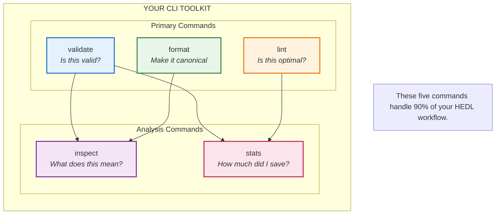
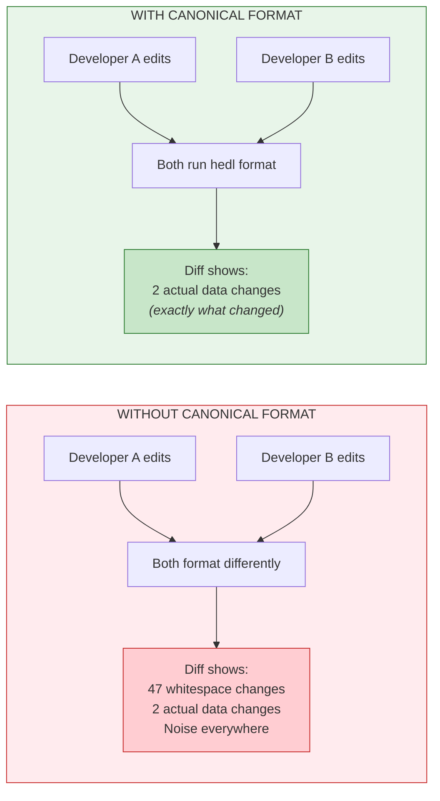

# Tutorial: CLI Basics

**Time:** 15 minutes | **Difficulty:** Building on Tutorial 1

Your editor is where you write HEDL. The command line is where HEDL comes alive.

Every conversion you did in Tutorial 1 happened in the terminal. But you only scratched the surface. The HEDL CLI follows Unix philosophy: small tools that do one thing well, designed to be chained together into something greater than the sum of their parts.

In the next fifteen minutes, you're going to master the five essential commands. You're going to chain them into pipelines. You're going to build a pre-commit hook that catches bad HEDL before it ever reaches your repository. By the end, the terminal will feel like home.

---

## The Five Commands You'll Use Every Day



Let's master each one.

---

## Step 1: Create Sample Data

First, create a sample file to work with. Save this as `employees.hedl`:

```hedl
%V:2.0
%NULL:~
%QUOTE:"
%S:Employee:[id,name,department,salary,hired_date]
---
employees:@Employee
 |e1,Alice Johnson,Engineering,95000,2022-01-15
 |e2,Bob Smith,Engineering,87000,2022-03-20
 |e3,Carol White,Marketing,72000,2021-11-10
 |e4,David Brown,Sales,68000,2023-02-01
 |e5,Eve Davis,Engineering,102000,2020-06-15
 |e6,Frank Miller,Marketing,71000,2023-05-22
```

---

## Step 2: The `validate` Command

Validation is your first line of defense. Run it on every file before you trust it.

```bash
hedl validate employees.hedl
```

Output:
```
✓ employees.hedl is valid
```

That's the good case. Let's see the bad case.

### Triggering Validation Errors

Create a file with a problem. Save this as `broken.hedl`:

```hedl
%V:2.0
%NULL:~
%QUOTE:"
%S:User:[id,name,email]
---
users:@User
 |u1,Alice,alice@example.com
 |u2,Bob
```

Bob is missing his email. Run validate:

```bash
hedl validate broken.hedl
```

Output:
```
✗ broken.hedl is invalid
Error on line 8: Expected 3 values but found 2
  Row: u2 "Bob"
  Expected columns: id, name, email
  Missing: email
```

This is what good error messages look like:
- **Line number**: Exactly where the problem is
- **What's wrong**: Expected 3 values, found 2
- **Context**: Shows the problematic row
- **Suggestion**: Tells you what's missing

### Validating from Stdin

Sometimes you want to validate without creating a file:

```bash
echo '%V:2.0
%NULL:~
%QUOTE:"
---
name:Test' | hedl validate -
```

The `-` means "read from stdin instead of a file." This is Unix convention, and HEDL follows it.

---

## Step 3: The `format` Command

HEDL has a canonical format. Every valid document has exactly one canonical representation.

```bash
hedl format employees.hedl
```

This prints the formatted version to stdout. To save it:

```bash
hedl format employees.hedl -o employees_formatted.hedl
```

### Why Canonical Formatting Matters

Imagine two developers edit the same HEDL file. One uses tabs, one uses spaces. One puts extra whitespace, one doesn't. When they merge, the diff is full of noise.

Canonical formatting eliminates this:



### Check Without Modifying

Want to know if a file is already canonical?

```bash
hedl format --check employees.hedl
```

Exit code 0 means already canonical. Exit code 1 means formatting needed. Perfect for CI.

---

## Step 4: The `lint` Command

Validation checks syntax. Linting checks style and best practices.

```bash
hedl lint employees.hedl
```

Linting might catch:
- Inconsistent naming conventions
- Suspicious patterns (duplicate values, empty fields)
- Optimization opportunities
- Data quality issues

Create a file with some issues. Save as `needs_lint.hedl`:

```hedl
%V:2.0
%NULL:~
%QUOTE:"
%S:Task:[id,status,priority,assignee]
---
tasks:@Task
 |t1,pending,high,Alice
 |t2,pending,high,Alice
 |t3,pending,medium,Bob
 |t4,done,low,Alice
```

```bash
hedl lint needs_lint.hedl
```

The linter might notice that multiple tasks have identical status and priority values, suggesting you could group related records or use references.

---

## Step 5: The `inspect` Command

Sometimes you need to see how HEDL interprets your document.

```bash
hedl inspect employees.hedl
```

Output:
```
Document Structure:
  Version: 1.3
  Null Symbol: ~
  Quote Character: "
  Schemas: 1

Schema: Employee
  Columns: [id, name, department, salary, hired_date]

Entity: employees
  Type: Employee
  Row count: 6
  Rows:
    [0] e1: ["Alice Johnson", "Engineering", 95000, "2022-01-15"]
    [1] e2: ["Bob Smith", "Engineering", 87000, "2022-03-20"]
    [2] e3: ["Carol White", "Marketing", 72000, "2021-11-10"]
    [3] e4: ["David Brown", "Sales", 68000, "2023-02-01"]
    [4] e5: ["Eve Davis", "Engineering", 102000, "2020-06-15"]
    [5] e6: ["Frank Miller", "Marketing", 71000, "2023-05-22"]
```

Use `inspect` when:
- You're debugging a parsing issue
- You want to verify the structure matches your expectations
- You're learning how HEDL syntax maps to internal structure

---

## Step 6: The `stats` Command

You know this one from Tutorial 1, but let's go deeper:

```bash
hedl stats employees.hedl
```

Output:
```
Format Comparison for employees.hedl:
  HEDL:    312 bytes,  87 tokens (baseline)
  JSON:    758 bytes, 212 tokens (+143%, +125 tokens)
  YAML:    562 bytes, 157 tokens (+80%, +70 tokens)
  XML:    1024 bytes, 287 tokens (+228%, +200 tokens)

Token Savings:
  vs JSON: 59% fewer tokens
  vs YAML: 45% fewer tokens
  vs XML:  70% fewer tokens
```

### Token Estimation

For LLM cost optimization, use the `--tokens` flag:

```bash
hedl stats employees.hedl --tokens
```

This estimates tokens using common tokenizers (like cl100k_base used by GPT-4). The savings you see translate directly to cost savings.

---

## Step 7: Chaining Commands with Pipes

This is where Unix philosophy shines. Commands read from stdin and write to stdout. Chain them together.

### Validate then Convert

```bash
hedl validate employees.hedl && hedl to-json employees.hedl --pretty
```

The `&&` means "if the first command succeeds, run the second." Validation failures stop the pipeline.

### Format then Validate

```bash
hedl format messy.hedl | hedl validate -
```

Format the file, pipe the output to validate. The `-` tells validate to read from stdin.

### Complete Quality Pipeline

```bash
cat employees.hedl | hedl format - | hedl validate - && echo "✓ Ready for production"
```

Read file, format it, validate the formatted version, print success message if all passes.

### Convert and Compress

```bash
hedl to-json employees.hedl | gzip > employees.json.gz
```

Convert to JSON, pipe to gzip, save compressed. One line.

---

## Step 8: Building a Pre-Commit Hook

Let's put it all together. Create a git pre-commit hook that validates and formats HEDL files.

Create `.git/hooks/pre-commit`:

```bash
#!/bin/bash

# Find all staged HEDL files
hedl_files=$(git diff --cached --name-only --diff-filter=ACM | grep '\.hedl$')

if [ -z "$hedl_files" ]; then
    exit 0  # No HEDL files staged
fi

echo "Checking HEDL files..."

for file in $hedl_files; do
    # Validate
    if ! hedl validate "$file"; then
        echo "✗ Validation failed: $file"
        echo "  Fix the errors above before committing."
        exit 1
    fi

    # Format and re-stage if changed
    formatted=$(hedl format "$file")
    current=$(cat "$file")

    if [ "$formatted" != "$current" ]; then
        echo "$formatted" > "$file"
        git add "$file"
        echo "  Auto-formatted: $file"
    fi
done

echo "✓ All HEDL files valid and formatted"
```

Make it executable:

```bash
chmod +x .git/hooks/pre-commit
```

Now every commit automatically:
1. Validates all staged HEDL files
2. Blocks commits with invalid HEDL
3. Auto-formats files to canonical form
4. Re-stages the formatted versions

---

## Step 9: Common Patterns

### Pattern 1: Validate Before Processing

```bash
if hedl validate input.hedl; then
    hedl to-json input.hedl -o output.json
    echo "✓ Conversion complete"
else
    echo "✗ Fix validation errors first"
    exit 1
fi
```

### Pattern 2: Quality Check Script

```bash
#!/bin/bash
# quality_check.sh

file="$1"

echo "Checking $file..."
hedl validate "$file" || exit 1
hedl lint "$file"
hedl stats "$file"
echo "✓ Quality check passed"
```

### Pattern 3: Bulk Validation

```bash
#!/bin/bash
# validate_all.sh

for file in *.hedl; do
    if hedl validate "$file" 2>/dev/null; then
        echo "✓ $file"
    else
        echo "✗ $file"
    fi
done
```

---

## Exit Codes

HEDL commands use standard exit codes:

| Code | Meaning |
|------|---------|
| `0` | Success |
| `1` | Error (validation failed, parse error, invalid arguments) |

Use exit codes in scripts:

```bash
hedl validate data.hedl
if [ $? -eq 0 ]; then
    echo "Valid!"
else
    echo "Invalid! Check the errors above."
fi
```

Or more concisely:

```bash
hedl validate data.hedl && echo "Valid!" || echo "Invalid!"
```

---

## Common Options

Most commands share these options:

| Option | Short | Description |
|--------|-------|-------------|
| `--output` | `-o` | Write to file instead of stdout |
| `--help` | `-h` | Show command help |
| `--version` | `-V` | Show HEDL version |

Get help for any command:

```bash
hedl --help
hedl validate --help
hedl format --help
```

---

## Quick Reference

```bash
# Validation
hedl validate file.hedl
hedl validate file.hedl && echo "Valid"
cat file.hedl | hedl validate -

# Formatting
hedl format file.hedl
hedl format file.hedl -o formatted.hedl
hedl format --check file.hedl

# Linting
hedl lint file.hedl

# Inspection
hedl inspect file.hedl

# Statistics
hedl stats file.hedl
hedl stats file.hedl --tokens

# Pipelines
hedl format messy.hedl | hedl validate -
hedl validate file.hedl && hedl to-json file.hedl --pretty
```

---

## Practice Exercises

### Exercise 1: Build a Quality Pipeline

Create a script that:
1. Formats a file
2. Validates the formatted version
3. Runs lint
4. Shows stats
5. Converts to JSON only if all checks pass

### Exercise 2: Batch Validator

Write a script that validates all `.hedl` files in a directory and produces a summary:
- Total files checked
- Valid count
- Invalid count
- List of invalid files with error messages

### Exercise 3: CI Integration

Create a GitHub Actions workflow or CI script that:
1. Runs on all HEDL files in the repository
2. Fails the build if any file is invalid
3. Fails if any file is not canonically formatted

---

## What's Next

You've mastered the individual commands. You've chained them into pipelines. You've built a pre-commit hook.

But what happens when you have 500 files? What happens when validation would take an hour?

That's when you need parallel batch processing.

**→ [Tutorial 3: Batch Processing](03-batch-processing.md)**

---

**Questions?** Check the [FAQ](../faq.md) or [Troubleshooting](../troubleshooting.md) guides.
