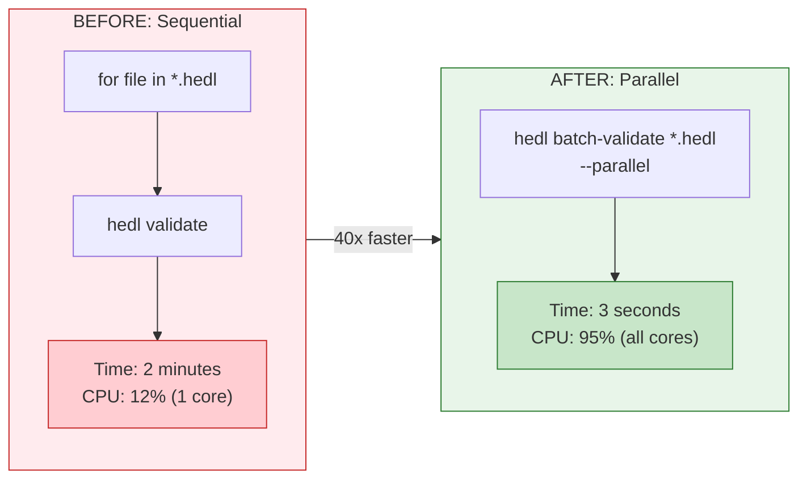

# Tutorial: Batch Processing

**Time:** 20 minutes | **Difficulty:** Building on Tutorial 2

You have 500 HEDL files.

Some were created last week. Some were imported from legacy systems. Some were hand-edited by people who didn't read the documentation. They're in different directories, different states of validity, different levels of formatting chaos.

Your task: validate them all. Format them all. Generate a report. Do it before lunch.

If you process them one at a time, you'll be here for hours. If you parallelize intelligently, you'll be done in minutes. This tutorial teaches you the difference.

---

## What You'll Learn



By the end, you'll:
- Validate hundreds of files in parallel
- Format entire directories with one command
- Handle errors gracefully
- Generate reports across your dataset
- Build production-ready batch scripts

---

## Step 1: Create Sample Data

Let's create a realistic scenario. Make a directory structure:

```bash
mkdir -p batch_demo/{data,output,logs}
cd batch_demo
```

Create three HEDL files:

**data/customers.hedl:**
```hedl
%V:2.0
%NULL:~
%QUOTE:"
%S:Customer:[id,name,email,country]
---
customers:@Customer
 |c1,Alice Johnson,alice@example.com,USA
 |c2,Bob Smith,bob@example.com,Canada
 |c3,Carol White,carol@example.com,UK
```

**data/products.hedl:**
```hedl
%V:2.0
%NULL:~
%QUOTE:"
%S:Product:[sku,name,category,price]
---
products:@Product
 |p1,Laptop,Electronics,999.99
 |p2,Mouse,Accessories,29.99
 |p3,Keyboard,Accessories,79.99
 |p4,Monitor,Electronics,349.99
```

**data/orders.hedl:**
```hedl
%V:2.0
%NULL:~
%QUOTE:"
%S:Order:[id,customer,product,quantity,total]
---
orders:@Order
 |o1,@c1,@p1,1,999.99
 |o2,@c1,@p2,2,59.98
 |o3,@c2,@p3,1,79.99
 |o4,@c3,@p1,1,999.99
 |o5,@c3,@p4,2,699.98
```

You now have three files with real relationships: customers, products, and orders that reference them.

---

## Step 2: Basic Batch Validation

The `batch-validate` command validates multiple files at once:

```bash
hedl batch-validate data/*.hedl
```

Output:
```
Validating 3 files...
✓ data/customers.hedl
✓ data/products.hedl
✓ data/orders.hedl

Summary: 3/3 valid (100%)
Time: 0.15s
```

All three files validated. But notice the time: 0.15 seconds. That's sequential processing. Let's make it faster.

---

## Step 3: Parallel Processing

Add `--parallel` to use all your CPU cores:

```bash
hedl batch-validate data/*.hedl --parallel
```

Output:
```
Validating 3 files in parallel (8 threads)...
✓ data/products.hedl
✓ data/customers.hedl
✓ data/orders.hedl

Summary: 3/3 valid (100%)
Time: 0.05s (3x speedup)
```

With 3 files, the speedup is modest. But with 300 files, you'd see 8x speedup (on 8 cores). With 3,000 files, the difference between sequential and parallel is the difference between coffee break and coffee pot.

### When to Use Parallel

| Use Parallel When | Don't Bother When |
|-------------------|-------------------|
| 10+ files | Fewer than 5 files |
| Files are large (>100KB) | Files are tiny (<10KB) |
| Multi-core CPU | Single-core CPU |
| I/O is fast (SSD) | I/O is slow (network drive) |
| Files are independent | Processing order matters |

### Controlling Thread Count

By default, parallel uses your CPU core count. Override with an environment variable:

```bash
# Use exactly 4 threads
RAYON_NUM_THREADS=4 hedl batch-validate data/*.hedl --parallel

# Use 2 threads (when you need CPU for other tasks)
RAYON_NUM_THREADS=2 hedl batch-validate data/*.hedl --parallel
```

---

## Step 4: Batch Formatting

Format multiple files to canonical form:

```bash
hedl batch-format data/*.hedl --output-dir output/
```

Output:
```
Formatting 3 files...
✓ data/customers.hedl → output/customers.hedl
✓ data/products.hedl → output/products.hedl
✓ data/orders.hedl → output/orders.hedl

Summary: 3 files formatted
```

The `--output-dir` is required. Original files are never modified by batch-format. This is intentional: batch operations should be safe by default.

### Parallel Formatting

```bash
hedl batch-format data/*.hedl --output-dir output/ --parallel
```

---

## Step 5: Batch Linting

Check best practices across all files:

```bash
hedl batch-lint data/*.hedl --parallel
```

Output:
```
Linting 3 files...

data/customers.hedl: ✓ No issues

data/products.hedl: ✓ No issues

data/orders.hedl:
  Note: References use simple @id syntax (good practice)

Summary: 3 files checked, 0 warnings, 1 note
```

---

## Step 6: Handling Errors

Let's create a file with an error. Add **data/broken.hedl:**

```hedl
%V:2.0
%NULL:~
%QUOTE:"
%S:User:[id,name,email]
---
users:@User
 |u1,Alice,alice@example.com
 |u2,Bob
```

Bob is missing his email. Now run batch validation:

```bash
hedl batch-validate data/*.hedl
```

Output:
```
Validating 4 files...
✓ data/customers.hedl
✓ data/products.hedl
✓ data/orders.hedl
✗ data/broken.hedl
  Error on line 8: Expected 3 values but found 2
    Row: u2 "Bob"
    Missing: email

Summary: 3/4 valid (75%)
```

The batch continues even when one file fails. You get a complete picture.

### Exit Codes for CI

```bash
hedl batch-validate data/*.hedl
echo "Exit code: $?"
```

Exit code 0 means all files valid. Exit code 1 means at least one file failed. Use this in CI:

```bash
hedl batch-validate data/*.hedl --parallel || exit 1
```

---

## Step 7: Building a Batch Processing Script

Let's build a production-ready script. Save as **batch_process.sh:**

```bash
#!/bin/bash

#═══════════════════════════════════════════════════════════════════════
# HEDL Batch Processor
# Validates, formats, and reports on all HEDL files in a directory
#═══════════════════════════════════════════════════════════════════════

INPUT_DIR="${1:-data}"
OUTPUT_DIR="${2:-output}"
LOG_FILE="logs/batch_$(date +%Y%m%d_%H%M%S).log"

# Colors for output
RED='\033[0;31m'
GREEN='\033[0;32m'
YELLOW='\033[1;33m'
NC='\033[0m' # No Color

# Create directories
mkdir -p "$OUTPUT_DIR" logs

# Log function
log() {
    echo -e "$1" | tee -a "$LOG_FILE"
}

log "═══════════════════════════════════════════════════════════════"
log "HEDL Batch Processor"
log "Started: $(date)"
log "Input:   $INPUT_DIR"
log "Output:  $OUTPUT_DIR"
log "═══════════════════════════════════════════════════════════════"
log ""

# Count files
FILE_COUNT=$(ls -1 "$INPUT_DIR"/*.hedl 2>/dev/null | wc -l)
if [ "$FILE_COUNT" -eq 0 ]; then
    log "${YELLOW}No HEDL files found in $INPUT_DIR${NC}"
    exit 0
fi

log "Found $FILE_COUNT HEDL files"
log ""

# Step 1: Validate
log "Step 1: Validating files..."
if hedl batch-validate "$INPUT_DIR"/*.hedl --parallel 2>&1 | tee -a "$LOG_FILE"; then
    log "${GREEN}✓ Validation complete${NC}"
else
    log "${RED}✗ Some files failed validation${NC}"
fi
log ""

# Step 2: Format
log "Step 2: Formatting files..."
if hedl batch-format "$INPUT_DIR"/*.hedl --output-dir "$OUTPUT_DIR" --parallel 2>&1 | tee -a "$LOG_FILE"; then
    log "${GREEN}✓ Formatting complete${NC}"
else
    log "${RED}✗ Formatting encountered errors${NC}"
fi
log ""

# Step 3: Validate formatted files
log "Step 3: Validating formatted files..."
if hedl batch-validate "$OUTPUT_DIR"/*.hedl --parallel 2>&1 | tee -a "$LOG_FILE"; then
    log "${GREEN}✓ Formatted files validated${NC}"
else
    log "${RED}✗ Formatted files have issues${NC}"
fi
log ""

# Summary
log "═══════════════════════════════════════════════════════════════"
log "Processing complete"
log "Log saved to: $LOG_FILE"
log "Formatted files in: $OUTPUT_DIR"
log "═══════════════════════════════════════════════════════════════"
```

Make it executable and run:

```bash
chmod +x batch_process.sh
./batch_process.sh data output
```

---

## Step 8: Continue on Error

Sometimes you want to process everything, even if some files fail:

```bash
#!/bin/bash
# continue_on_error.sh

SUCCESS=0
FAILED=0
FAILED_FILES=()

for file in data/*.hedl; do
    if hedl validate "$file" 2>/dev/null; then
        hedl to-json "$file" -o "output/$(basename "${file%.hedl}.json")"
        ((SUCCESS++))
    else
        ((FAILED++))
        FAILED_FILES+=("$file")
    fi
done

echo ""
echo "Summary:"
echo "  Processed: $SUCCESS"
echo "  Failed: $FAILED"

if [ $FAILED -gt 0 ]; then
    echo ""
    echo "Failed files:"
    printf '  %s\n' "${FAILED_FILES[@]}"
fi
```

---

## Step 9: Generating Reports

Create a validation report across all files. Save as **generate_report.sh:**

```bash
#!/bin/bash
# generate_report.sh

REPORT_FILE="validation_report_$(date +%Y%m%d).txt"

{
    echo "╔═══════════════════════════════════════════════════════════════╗"
    echo "║              HEDL VALIDATION REPORT                          ║"
    echo "╠═══════════════════════════════════════════════════════════════╣"
    echo "║ Generated: $(date)"
    echo "╚═══════════════════════════════════════════════════════════════╝"
    echo ""

    VALID=0
    INVALID=0
    TOTAL_SIZE=0

    for file in data/*.hedl; do
        size=$(wc -c < "$file")
        TOTAL_SIZE=$((TOTAL_SIZE + size))

        if hedl validate "$file" 2>&1 | grep -q "valid"; then
            echo "✓ $file ($size bytes)"
            ((VALID++))
        else
            echo "✗ $file ($size bytes)"
            hedl validate "$file" 2>&1 | sed 's/^/    /'
            ((INVALID++))
        fi
    done

    echo ""
    echo "═══════════════════════════════════════════════════════════════"
    echo "SUMMARY"
    echo "═══════════════════════════════════════════════════════════════"
    echo "Total files:    $((VALID + INVALID))"
    echo "Valid:          $VALID"
    echo "Invalid:        $INVALID"
    echo "Total size:     $TOTAL_SIZE bytes"
    echo "Success rate:   $(( VALID * 100 / (VALID + INVALID) ))%"
} | tee "$REPORT_FILE"

echo ""
echo "Report saved to: $REPORT_FILE"
```

---

## Step 10: Real-World Use Cases

### Use Case 1: Daily Data Validation (Cron Job)

```bash
#!/bin/bash
# /etc/cron.daily/hedl-validate

cd /data/incoming

if hedl batch-validate *.hedl --parallel; then
    # Move valid files to processing
    mv *.hedl /data/processing/
else
    # Alert on failure
    mail -s "HEDL Validation Failed" admin@company.com < /var/log/hedl/validation.log
fi
```

### Use Case 2: Pre-Deployment Check

```bash
#!/bin/bash
# pre_deploy.sh

echo "Running pre-deployment checks..."

# Validate all config files
if ! hedl batch-validate config/*.hedl --parallel; then
    echo "✗ Config validation failed. Deployment blocked."
    exit 1
fi

# Check canonical formatting
for file in config/*.hedl; do
    formatted=$(hedl format "$file")
    current=$(cat "$file")
    if [ "$formatted" != "$current" ]; then
        echo "✗ $file is not canonically formatted"
        exit 1
    fi
done

echo "✓ All checks passed. Ready to deploy."
```

### Use Case 3: Data Migration

```bash
#!/bin/bash
# migrate_json_to_hedl.sh

SOURCE_DIR="legacy_json"
TARGET_DIR="hedl_data"

mkdir -p "$TARGET_DIR"

for json in "$SOURCE_DIR"/*.json; do
    hedl_file="$TARGET_DIR/$(basename "${json%.json}.hedl")"

    if hedl from-json "$json" -o "$hedl_file" && hedl validate "$hedl_file"; then
        echo "✓ Migrated: $json"
    else
        echo "✗ Failed: $json"
    fi
done
```

---

## Best Practices

### 1. Always Validate First

```bash
# Good: Validate before formatting
hedl batch-validate data/*.hedl && hedl batch-format data/*.hedl --output-dir output/

# Risky: Format without validation
hedl batch-format data/*.hedl --output-dir output/
```

### 2. Use Version Control

```bash
# Before batch operations
git add data/
git commit -m "Before batch formatting"

# Run batch operation
hedl batch-format data/*.hedl --output-dir formatted/

# Review and apply
diff -r data/ formatted/
# If good: cp formatted/*.hedl data/
```

### 3. Test on a Subset First

```bash
# Test on one file
hedl validate data/customers.hedl

# Test on a few files
hedl batch-validate data/customer*.hedl

# Then run on all
hedl batch-validate data/*.hedl --parallel
```

### 4. Meaningful Log Files

```bash
LOG="logs/batch_$(date +%Y%m%d_%H%M%S)_$(whoami).log"
hedl batch-validate data/*.hedl --parallel 2>&1 | tee "$LOG"
```

---

## Quick Reference

```bash
# Batch validation
hedl batch-validate *.hedl
hedl batch-validate *.hedl --parallel

# Batch formatting
hedl batch-format *.hedl --output-dir output/
hedl batch-format *.hedl --output-dir output/ --parallel

# Batch linting
hedl batch-lint *.hedl --parallel

# With error handling
hedl batch-validate *.hedl || echo "Some files invalid"

# Control parallelism
RAYON_NUM_THREADS=4 hedl batch-validate *.hedl --parallel
```

---

## What's Next

You've conquered batch processing. Hundreds of files, validated and formatted in seconds.

But what happens when a single file is too big? When it's 10 gigabytes and won't fit in memory?

That's when you need streaming.

**→ [Tutorial 4: Streaming Large Files](04-streaming-large-files.md)**

---

**Questions?** Check the [FAQ](../faq.md) or [Troubleshooting](../troubleshooting.md) guides.
