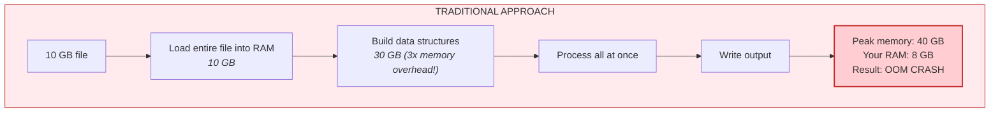
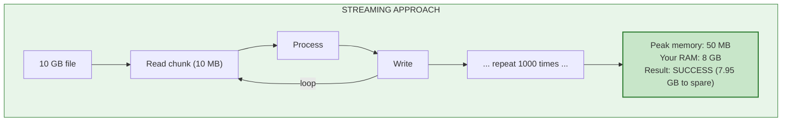

# Tutorial: Streaming Large Files

**Time:** 25 minutes | **Difficulty:** Building on Tutorial 3

> **Note:** The CLI flags (`--stream`, `--chunk-size`, `--progress`) described here are planned. The underlying streaming API in `hedl-stream` is fully implemented. For current CLI large file handling, see [Tutorial 3](03-batch-processing.md).

Your data doesn't fit in memory.

You're staring at a 10 GB HEDL file. Your machine has 8 GB of RAM. Traditional parsers would load the entire file, allocate data structures, and then crash with an out-of-memory error. Or worse: start swapping to disk, grinding your system to a halt, making you wait an hour for a task that should take minutes.

This is where streaming changes everything.

---

## The Problem with Traditional Parsing





The key insight: you don't need to see all the data at once. You process it piece by piece, writing output as you go. Memory usage stays constant regardless of file size.

---

## When You Need Streaming

Use streaming when:
- Files are larger than 500 MB
- You're running in memory-constrained environments (containers, edge devices)
- You need to start producing output before reading the entire input
- You're building ETL pipelines that handle variable-size data

Don't use streaming when:
- Files are small (<50 MB)
- You need random access to the data
- Operations require seeing the entire document (some validation, some transformations)
- Speed is more important than memory (streaming has overhead)

---

## Step 1: Creating a Large Test File

Let's generate a large HEDL file to work with. Save this as **generate_large.sh:**

```bash
#!/bin/bash

OUTPUT="large_data.hedl"
ROWS=1000000  # 1 million rows

echo "Generating $OUTPUT with $ROWS rows..."

{
    echo "%V:2.0"
    echo "%NULL:~"
    echo "%QUOTE:\""
    echo "%S:Event:[id,timestamp,user_id,event_type,value]"
    echo "---"
    echo "events:@Event"

    for i in $(seq 1 $ROWS); do
        timestamp="2024-01-01T$(printf "%02d" $((i % 24))):$(printf "%02d" $((i % 60))):$(printf "%02d" $((i % 60)))Z"
        user_id="user_$((i % 10000))"
        event_type=$(echo "click view purchase" | cut -d' ' -f$((i % 3 + 1)))
        value=$((RANDOM % 1000))
        echo " |e$i,$timestamp,$user_id,$event_type,$value"

        # Progress indicator
        if [ $((i % 100000)) -eq 0 ]; then
            echo "Generated $i rows..." >&2
        fi
    done
} > "$OUTPUT"

echo "Done! Generated $OUTPUT" >&2
ls -lh "$OUTPUT"
```

Run it:

```bash
chmod +x generate_large.sh
./generate_large.sh
```

This creates a file with 1 million rows (approximately 80-100 MB). Enough to demonstrate streaming without waiting all day.

---

## Step 2: Measuring Memory Usage

Before streaming, let's see what traditional processing looks like:

```bash
# Linux: Measure peak memory
/usr/bin/time -v hedl validate large_data.hedl 2>&1 | grep "Maximum resident set size"

# macOS: Measure peak memory
/usr/bin/time -l hedl validate large_data.hedl 2>&1 | grep "maximum resident set size"
```

You'll see something like:
```
Maximum resident set size (kbytes): 412000
```

That's 412 MB for a 100 MB file. The 4x overhead comes from:
- Reading the file into memory
- Parsing into data structures
- Allocating strings and arrays
- Building indexes for reference validation

Now imagine a 10 GB file. That's 40 GB of memory. Streaming eliminates this.

---

## Step 3: Streaming Validation

With streaming enabled, validation processes the file in chunks:

```bash
hedl validate large_data.hedl --stream
```

What happens internally:
1. Open file for reading
2. Parse header (schemas, version)
3. Read first chunk of rows
4. Validate chunk
5. Discard chunk, read next
6. Repeat until end of file
7. Report results

Memory usage stays constant: roughly the chunk size plus overhead for the schema and validation state.

### Chunk Size Configuration

Control the memory-speed tradeoff:

```bash
# Small chunks: Lower memory, slower
hedl validate large_data.hedl --stream --chunk-size 1000

# Large chunks: More memory, faster
hedl validate large_data.hedl --stream --chunk-size 100000

# Default: Balanced (auto-tuned)
hedl validate large_data.hedl --stream
```

### Progress Reporting

For long operations, enable progress:

```bash
hedl validate large_data.hedl --stream --progress
```

Output:
```
Validating large_data.hedl (streaming mode)...
[████████░░░░░░░░░░░░░░░░░░░░░░░░░░░░░░░░]   20%  200,000 rows
[████████████████░░░░░░░░░░░░░░░░░░░░░░░░]   40%  400,000 rows
[████████████████████████░░░░░░░░░░░░░░░░]   60%  600,000 rows
[████████████████████████████████░░░░░░░░]   80%  800,000 rows
[████████████████████████████████████████]  100%  1,000,000 rows

✓ File is valid
Time: 12.5s
Peak memory: 45 MB
```

---

## Step 4: Streaming Conversion

Convert large files while keeping memory bounded:

```bash
hedl to-json large_data.hedl --stream -o large_data.json
```

With streaming, HEDL:
1. Reads chunks of HEDL
2. Converts each chunk to JSON
3. Writes JSON output immediately
4. Frees memory before reading next chunk

You see output appearing in the file while conversion is still running.

### Multiple Formats

```bash
# HEDL to CSV (streaming)
hedl to-csv large_data.hedl --stream -o large_data.csv

# HEDL to Parquet (streaming)
hedl to-parquet large_data.hedl --stream -o large_data.parquet
```

Parquet is especially interesting: it's a columnar format with built-in compression. A 100 MB HEDL file might become a 15 MB Parquet file, and you can create it without ever holding the full dataset in memory.

---

## Step 5: Pipeline Streaming

Chain streaming operations:

```bash
cat large_data.hedl | hedl format --stream - | hedl to-json --stream - | gzip > large_data.json.gz
```

This reads the file, formats it, converts to JSON, and compresses: all in constant memory. Data flows through the pipeline like water through pipes.

---

## Step 6: Memory Monitoring

Track memory usage during long operations. Save as **monitor_memory.sh:**

```bash
#!/bin/bash

LOG_FILE="memory_usage.log"

# Start HEDL in background
hedl to-json large_data.hedl --stream -o output.json &
HEDL_PID=$!

echo "Monitoring PID $HEDL_PID..."
echo "Time,RSS_MB,VSZ_MB" > "$LOG_FILE"

# Monitor until process exits
while kill -0 $HEDL_PID 2>/dev/null; do
    if [ -f /proc/$HEDL_PID/status ]; then
        # Linux
        rss=$(grep VmRSS /proc/$HEDL_PID/status | awk '{print $2/1024}')
        vsz=$(grep VmSize /proc/$HEDL_PID/status | awk '{print $2/1024}')
    else
        # macOS fallback
        mem=$(ps -o rss=,vsz= -p $HEDL_PID 2>/dev/null)
        rss=$(echo $mem | awk '{print $1/1024}')
        vsz=$(echo $mem | awk '{print $2/1024}')
    fi

    echo "$(date +%s),$rss,$vsz" >> "$LOG_FILE"
    sleep 1
done

echo "Process complete. Memory log: $LOG_FILE"
```

Run it alongside a streaming operation to verify memory stays bounded.

---

## Step 7: Error Handling in Streaming

Streaming introduces new considerations for error handling.

### Validate Before Converting

```bash
#!/bin/bash

FILE="$1"
OUTPUT="${FILE%.hedl}.json"

echo "Pre-validating $FILE..."

if hedl validate "$FILE" --stream --progress; then
    echo "Validation passed. Converting..."
    hedl to-json "$FILE" --stream --progress -o "$OUTPUT"
    echo "✓ Conversion complete: $OUTPUT"
else
    echo "✗ Validation failed. Fix errors before converting."
    exit 1
fi
```

### Skip Errors (Partial Processing)

When you need to process what you can, even if some rows fail:

```bash
hedl to-json large_data.hedl --stream --skip-errors -o output.json 2> errors.log
```

Valid rows are converted. Invalid rows are logged to stderr. You get partial output instead of total failure.

---

## Step 8: Real-World ETL Pipeline

Here's a production ETL script. Save as **etl_pipeline.sh:**

```bash
#!/bin/bash
#═══════════════════════════════════════════════════════════════════════
# ETL Pipeline: Extract, Transform, Load with HEDL Streaming
#═══════════════════════════════════════════════════════════════════════

set -e  # Exit on error

EXTRACT_DIR="/data/raw"
TRANSFORM_DIR="/data/hedl"
LOAD_DIR="/data/warehouse"
LOG_DIR="/var/log/etl"

mkdir -p "$TRANSFORM_DIR" "$LOAD_DIR" "$LOG_DIR"

DATE=$(date +%Y%m%d)
LOG="$LOG_DIR/etl_$DATE.log"

log() {
    echo "[$(date +%H:%M:%S)] $1" | tee -a "$LOG"
}

log "═══════════════════════════════════════════════════════════════"
log "ETL Pipeline Started"
log "═══════════════════════════════════════════════════════════════"

# Step 1: Extract (CSV to HEDL)
log "Step 1: Extracting CSV files..."
for csv in "$EXTRACT_DIR"/*.csv; do
    [ -f "$csv" ] || continue
    base=$(basename "${csv%.csv}")
    hedl from-csv "$csv" --stream --headers -o "$TRANSFORM_DIR/${base}.hedl"
    log "  Extracted: $csv"
done

# Step 2: Transform (Validate and Format)
log "Step 2: Validating and formatting..."
for hedl_file in "$TRANSFORM_DIR"/*.hedl; do
    [ -f "$hedl_file" ] || continue

    if hedl validate "$hedl_file" --stream; then
        hedl format "$hedl_file" --stream -o "${hedl_file}.tmp"
        mv "${hedl_file}.tmp" "$hedl_file"
        log "  ✓ Valid: $hedl_file"
    else
        log "  ✗ Invalid: $hedl_file"
        mv "$hedl_file" "$hedl_file.invalid"
    fi
done

# Step 3: Load (HEDL to Parquet for analytics)
log "Step 3: Loading to warehouse..."
for hedl_file in "$TRANSFORM_DIR"/*.hedl; do
    [ -f "$hedl_file" ] || continue
    base=$(basename "${hedl_file%.hedl}")
    hedl to-parquet "$hedl_file" --stream --compression snappy \
        -o "$LOAD_DIR/${base}.parquet"
    log "  Loaded: $base.parquet"
done

log "═══════════════════════════════════════════════════════════════"
log "ETL Pipeline Complete"
log "═══════════════════════════════════════════════════════════════"
```

This script:
1. Converts incoming CSV files to HEDL (streaming)
2. Validates and formats each file (streaming)
3. Loads valid files to Parquet for analytics (streaming with compression)

All in constant memory, regardless of file size.

---

## Performance Comparison

| File Size | Traditional Memory | Streaming Memory | Traditional Time | Streaming Time |
|-----------|-------------------|------------------|------------------|----------------|
| 10 MB | 45 MB | 8 MB | 0.8s | 1.2s |
| 100 MB | 420 MB | 12 MB | 8.5s | 11.2s |
| 1 GB | 4.2 GB | 25 MB | 85s | 110s |
| 10 GB | OOM crash | 35 MB | N/A | ~18 min |

The tradeoff: streaming is slightly slower (more I/O, less cache efficiency) but uses dramatically less memory. For files that fit in memory, traditional is faster. For files that don't, streaming is the only option.

---

## Tuning Chunk Size

Find the optimal chunk size for your workload. Save as **benchmark_chunks.sh:**

```bash
#!/bin/bash

FILE="large_data.hedl"

echo "Benchmarking chunk sizes..."
echo "Chunk Size,Time (s),Peak Memory (MB)"

for chunk_size in 100 1000 10000 100000; do
    # Time the operation
    start=$(date +%s.%N)
    /usr/bin/time -v hedl validate "$FILE" --stream --chunk-size $chunk_size 2>&1 | \
        grep "Maximum resident" | awk '{print $6}'
    end=$(date +%s.%N)

    runtime=$(echo "$end - $start" | bc)
    echo "$chunk_size,$runtime"
done
```

Typical results:
- 100 rows/chunk: Slow but minimal memory
- 10,000 rows/chunk: Balanced (often optimal)
- 100,000 rows/chunk: Fast but more memory

---

## Best Practices

### 1. Validate Before Converting

```bash
hedl validate big.hedl --stream && hedl to-json big.hedl --stream -o big.json
```

### 2. Use Progress for Long Operations

```bash
hedl to-json huge.hedl --stream --progress -o output.json
```

### 3. Compress Output

```bash
hedl to-json huge.hedl --stream | gzip > output.json.gz
```

### 4. Monitor Memory in Production

Set up alerts if memory exceeds expected bounds. Streaming should stay under 100 MB regardless of input size.

### 5. Choose Appropriate Chunk Size

- Memory-constrained: `--chunk-size 1000`
- Balanced: Default (auto)
- Speed-focused: `--chunk-size 100000`

---

## Quick Reference

```bash
# Streaming validation
hedl validate large.hedl --stream
hedl validate large.hedl --stream --progress
hedl validate large.hedl --stream --chunk-size 10000

# Streaming conversion
hedl to-json large.hedl --stream -o output.json
hedl to-csv large.hedl --stream -o output.csv
hedl to-parquet large.hedl --stream -o output.parquet

# Pipeline streaming
cat large.hedl | hedl format --stream - | hedl to-json --stream -

# With compression
hedl to-json large.hedl --stream | gzip > output.json.gz
hedl to-parquet large.hedl --stream --compression snappy -o output.parquet

# Error handling
hedl to-json large.hedl --stream --skip-errors -o output.json 2> errors.log
```

---

## What You've Learned

You now understand:

1. **Why streaming exists**: Traditional parsing multiplies memory usage; streaming keeps it constant
2. **When to use it**: Large files, constrained environments, ETL pipelines
3. **How to configure it**: Chunk size, progress reporting, error handling
4. **Real-world application**: ETL pipelines that process arbitrarily large data

---

## You've Completed the Tutorials

Congratulations. You've gone from your first conversion to streaming gigabytes of data.

You understand:
- HEDL syntax and structure
- CLI commands and pipelines
- Batch processing at scale
- Memory-efficient streaming

**Where to go next:**

- **[Concepts](../concepts/)**: Deep understanding of the data model, type system, references, and canonicalization
- **[Examples](../examples.md)**: Real-world patterns for configuration, APIs, knowledge graphs, and LLM optimization
- **[Formats Guide](../formats.md)**: Detailed conversion recipes for JSON, YAML, CSV, Parquet, Neo4j, and more
- **[CLI Guide](../cli-guide.md)**: Complete reference for every command and option

You're not just someone who uses HEDL anymore. You're someone who thinks in HEDL.

Go build something.

---

**Questions?** Check the [FAQ](../faq.md) or [Troubleshooting](../troubleshooting.md) guides.
