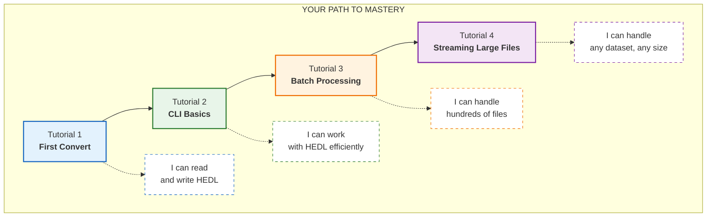

# HEDL Tutorials: From First Convert to Production Master

You know that moment when you first learn a tool and everything clicks?

Not the "I read the manual" kind of learning. The "I built something real and now I get it" kind. The kind where you stop reading documentation and start thinking "oh, I could use this for that project" and "wait, this solves that annoying problem I've had for months."

That's what these tutorials are designed to create.

We're not going to teach you HEDL by throwing syntax at you. We're going to teach you HEDL by having you build things, break things, and fix things. You'll make mistakes (we've designed for that). You'll have realizations. By the end, you won't just know HEDL. You'll think in HEDL.

---

## Your Learning Journey



Each tutorial builds on the previous one. Skip ahead if you're confident, but the journey makes more sense when taken in order.

---

## The Tutorials

### [Tutorial 1: Your First Conversion](01-first-conversion.md)

**Time: 10 minutes** | **You're ready for this**

You're holding a JSON file that's costing you money every time you send it to an LLM. Let's change that.

In ten minutes, you'll:
- Convert JSON to HEDL and see the size difference
- Add a schema and watch validation catch errors
- Create your first reference between entities
- Understand why HEDL exists and when to use it

**The "aha" moment:** When you see the token count drop and realize you've been paying for repetition this whole time.

---

### [Tutorial 2: CLI Basics](02-cli-basics.md)

**Time: 15 minutes** | **Building on Tutorial 1**

Your editor is great. But the command line is where real work happens. Batch processing, CI pipelines, automation. Let's make you dangerous with the CLI.

In fifteen minutes, you'll:
- Master validate, format, lint, inspect, and stats
- Learn to pipe commands together Unix-style
- Build your first quality check script
- Set up a pre-commit hook that catches bad HEDL

**The "aha" moment:** When you realize you can chain three commands together and suddenly have a complete validation pipeline.

---

### [Tutorial 3: Batch Processing](03-batch-processing.md)

**Time: 20 minutes** | **Building on Tutorial 2**

You have 500 HEDL files. Some are valid. Some are not. Some are formatted. Some are a mess. How do you wrangle this chaos?

In twenty minutes, you'll:
- Validate hundreds of files in parallel
- Format entire directories with one command
- Build scripts that handle errors gracefully
- Generate reports across your entire dataset

**The "aha" moment:** When parallel processing finishes in 3 seconds what would have taken 2 minutes sequentially.

---

### [Tutorial 4: Streaming Large Files](04-streaming-large-files.md)

**Time: 25 minutes** | **Building on Tutorial 3**

Your data doesn't fit in memory. Traditional parsers choke. What now?

In twenty-five minutes, you'll:
- Understand why streaming exists and when you need it
- Process multi-gigabyte files with minimal memory
- Build ETL pipelines that don't crash
- Optimize for both speed and memory

**The "aha" moment:** When you process a 10GB file with only 50MB of RAM.

> **Note:** This tutorial covers planned CLI streaming flags. The streaming library API is implemented. For current CLI large file handling, see [Batch Processing](03-batch-processing.md).

---

## What You'll Be Able to Do

After completing all four tutorials:

| Before | After |
|--------|-------|
| "What is HEDL?" | "HEDL is my default data format" |
| "This JSON is huge" | "HEDL cut my token costs 40%" |
| "Did this file change?" | "Canonical formatting makes diffs clean" |
| "Is this data valid?" | "Schema validation catches errors at parse time" |
| "500 files to check..." | "Parallel batch validation in 3 seconds" |
| "File too big for RAM" | "Streaming handles any size" |

---

## Before You Start

Make sure you have:

1. **HEDL CLI installed**
   ```bash
   cargo install hedl-cli
   hedl --version
   ```
   If you need help, see [Getting Started](../getting-started.md).

2. **Basic terminal skills**
   You should be comfortable with `cd`, `ls`, `cat`, pipes (`|`), and redirects (`>`).

3. **A text editor**
   VS Code, Vim, Emacs, nano, Notepad++. Anything that can edit plain text.

4. **Curiosity**
   The most important prerequisite. You're going to learn something useful.

---

## When You Get Stuck

It happens to everyone. Here's your troubleshooting path:

1. **Read the error message carefully.** HEDL errors include line numbers and suggestions.

2. **Check your indentation.** One space per level. Not two. Not tabs. One space.

3. **Check the [FAQ](../faq.md).** Your question has probably been asked before.

4. **Check [Troubleshooting](../troubleshooting.md).** Step-by-step solutions for common issues.

5. **Ask.** Open an issue. We're here to help.

---

## After the Tutorials

Once you've completed all four tutorials, you're not done learning. You're ready for deeper exploration:

**Want to understand the theory?**
→ [Concepts](../concepts/) explains the data model, type system, references, and canonicalization.

**Want real-world patterns?**
→ [Examples](../examples.md) shows configuration files, API responses, knowledge graphs, and more.

**Want the full command reference?**
→ [CLI Guide](../cli-guide.md) documents every flag, every option, every environment variable.

**Want to convert between formats?**
→ [Formats Guide](../formats.md) covers JSON, YAML, XML, CSV, Parquet, Neo4j, and TOON.

---

## Ready?

Open your terminal. Take a breath.

Let's convert something.

**→ [Start Tutorial 1: Your First Conversion](01-first-conversion.md)**
